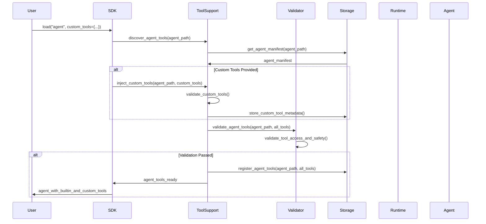

# 🛠️ Tool Support System Implementation

## 📋 **Overview**

This PR implements the **Agent Tool Support System** that enables agents to access their built-in tools while allowing users to safely inject custom tools. This follows the architecture design where Agent Hub provides tool support infrastructure rather than implementing tools itself.

## 🎯 **Key Features**

### **1. Agent Tool Support Container**
- **Tool Discovery**: Automatically discovers agent's built-in tools from manifest
- **Tool Injection**: Safely injects user-provided custom tools
- **Tool Metadata**: Tracks tool information for discovery and usage
- **Tool Validation**: Validates tool safety and compatibility

### **2. Dual Tool Source System**
- **Built-in Tools**: Agents can use their own tools defined in manifest
- **Custom Tools**: Users can inject custom tools via `custom_tools` parameter
- **Tool Priority**: Built-in tools take precedence over custom tools
- **Tool Override**: Custom tools can override built-in tools when needed

### **3. Tool Validation System**
- **Security Validation**: Validates tool safety and access permissions
- **Compatibility Validation**: Ensures tools are compatible with agent
- **Type Validation**: Validates tool parameters and return types
- **Access Control**: Controls which tools agents can access

## 🏗️ **Architecture Changes**

### **Container Architecture**
- Added **Agent Tool Support Container** for tool infrastructure
- Added **Tool Validator Container** for security and access validation
- Updated component relationships and data flow

### **Data Architecture**
- Added **TOOL_METADATA** entity for tracking agent tools
- Added **CUSTOM_TOOLS** entity for user-injected tools
- Updated entity relationships and data formats

### **SDK Module Design**
- Updated `load()` function to accept `custom_tools` parameter
- Added tool support system components
- Integrated tool discovery and injection into loading process

## 🔧 **Implementation Details**

### **Tool Support Flow**


### **API Changes**
```python
# Updated load function with custom tools support
import agenthub as amg

# Basic usage
agent = amg.load("meta/coding-agent")

# With custom tools
def custom_analysis(data):
    return f"Custom analysis: {len(data)} items"

agent = amg.load("meta/coding-agent",
                 custom_tools={"custom_analysis": custom_analysis})
```

## 📊 **Data Structures**

### **Tool Metadata**
```json
{
  "agent_path": "meta/coding-agent",
  "tools": {
    "code_generator": {
      "name": "code_generator",
      "type": "builtin",
      "parameters": {
        "prompt": {"type": "string", "required": true}
      },
      "return_type": "string",
      "description": "Generate code from natural language",
      "is_custom": false,
      "registered_at": "2025-06-28T10:30:00Z"
    }
  }
}
```

### **Custom Tools**
```json
{
  "agent_path": "meta/coding-agent",
  "custom_tools": {
    "domain_analysis": {
      "name": "domain_analysis",
      "function": "custom_domain_analysis",
      "metadata": {
        "parameters": {
          "data": {"type": "array", "required": true}
        },
        "return_type": "string",
        "description": "Domain-specific analysis tool"
      },
      "injected_at": "2025-06-28T11:00:00Z",
      "security_level": "medium"
    }
  }
}
```

## 🧪 **Testing Strategy**

### **Unit Tests**
- Tool discovery functionality
- Tool injection and validation
- Tool metadata management
- Security and compatibility validation

### **Integration Tests**
- End-to-end tool support flow
- Custom tool injection and execution
- Tool validation error handling
- Agent execution with mixed tools

### **Security Tests**
- Tool access control validation
- Malicious tool injection prevention
- Parameter validation and sanitization
- Resource usage limits

## 🚀 **Implementation Plan**

### **Phase 1: Core Tool Support (Week 1)**
- [ ] Implement ToolSupport container
- [ ] Add tool discovery functionality
- [ ] Create tool metadata management
- [ ] Add basic tool validation

### **Phase 2: Custom Tool Injection (Week 2)**
- [ ] Implement custom tool injection
- [ ] Add tool validation system
- [ ] Create tool security controls
- [ ] Add tool metadata storage

### **Phase 3: Integration & Testing (Week 3)**
- [ ] Integrate with SDK loading process
- [ ] Add comprehensive testing
- [ ] Update documentation
- [ ] Performance optimization

## 🔒 **Security Considerations**

- **Tool Isolation**: Custom tools run in isolated environment
- **Access Control**: Agents can only access declared tools
- **Validation**: All tools validated for safety and compatibility
- **Resource Limits**: Tool execution limited by resource constraints

## 📈 **Success Metrics**

- **Tool Discovery**: 100% of agent tools discovered automatically
- **Custom Tool Injection**: Successful injection of user tools
- **Tool Validation**: 100% of tools validated before execution
- **Performance**: < 100ms overhead for tool support operations

## 🔄 **Migration Strategy**

- **Backward Compatibility**: Existing agents continue to work
- **Gradual Adoption**: Tools can be added incrementally
- **Fallback Support**: Graceful degradation when tools unavailable
- **Documentation**: Clear migration guide for developers

## 📚 **Documentation Updates**

- [ ] Updated architecture design documents
- [ ] Added tool support API documentation
- [ ] Created tool development guide
- [ ] Added security best practices

## 🎯 **Acceptance Criteria**

- [ ] Agents can access their built-in tools
- [ ] Users can inject custom tools safely
- [ ] Tool validation prevents security issues
- [ ] Performance impact is minimal
- [ ] All tests pass
- [ ] Documentation is complete

## 🔍 **Review Checklist**

- [ ] Architecture design is sound
- [ ] Security measures are adequate
- [ ] Performance impact is acceptable
- [ ] Code quality meets standards
- [ ] Tests provide good coverage
- [ ] Documentation is clear and complete

---

**Related Issues**: #tool-support-system
**Breaking Changes**: None (backward compatible)
**Dependencies**: None (uses existing infrastructure)
