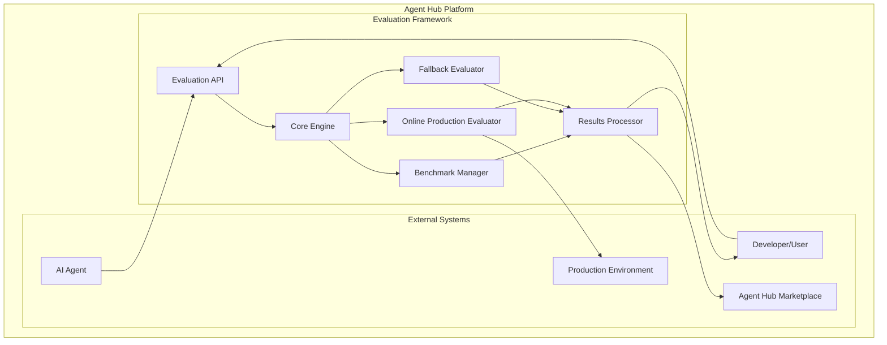
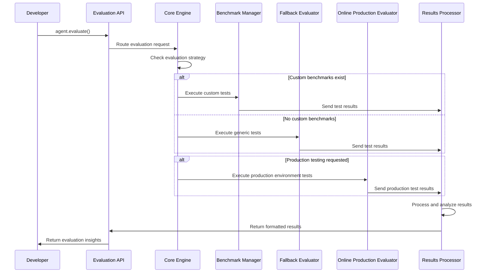
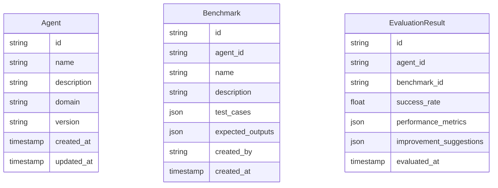
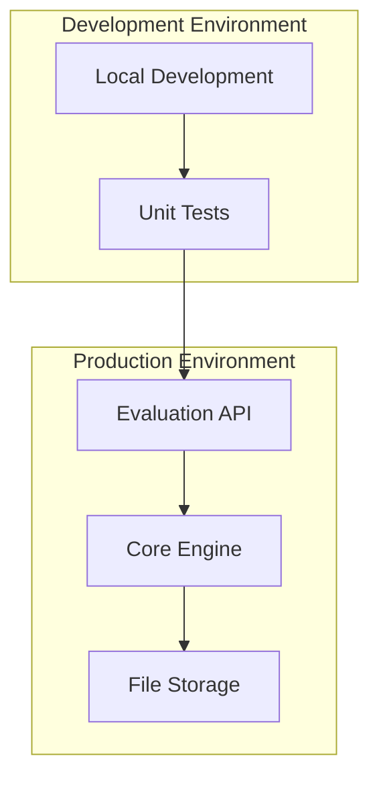

# Agent Evaluation Framework - Architecture Design

**Document Type**: System Architecture Design  
**Author**: William  
**Date Created**: 2025-06-28  
**Last Updated**: 2025-06-28  
**Status**: Draft  
**Stakeholders**: Agent Developers, Agent Hub Platform Team, End Users  
**Customer Segments Affected**: AI Agent Developers, Agent Users  
**Iteration Count**: 1  

## 🎯 Architecture Overview

### Design Principles
- **KISS (Keep It Simple, Stupid)**: Simple, straightforward design without unnecessary complexity
- **DRY (Don't Repeat Yourself)**: Reusable components and shared services
- **YAGNI (You Aren't Gonna Need It)**: Only build what's needed now, avoid over-engineering

### Core Architecture Philosophy
**"Simple evaluation that works, with room to grow"**

The framework provides a clean, simple interface (`agent.evaluate()`) while maintaining the flexibility to handle both custom benchmarks and intelligent fallback evaluation.

## 🏗️ System Architecture

### High-Level System Context



### Core Components

#### 1. **Evaluation API** (Entry Point)
**Purpose**: Simple, consistent interface for all evaluation requests
**Responsibility**: Route requests, handle authentication, return results
**Interface**: `agent.evaluate()` with optional parameters

#### 2. **Core Engine** (Orchestrator)
**Purpose**: Coordinate evaluation flow and decision making
**Responsibility**: Determine evaluation strategy, manage execution flow
**Logic**: 
- If custom benchmarks exist → use Benchmark Manager
- If no custom benchmarks → use Fallback Evaluator
- If production testing needed → use Online Production Evaluator
- Always return actionable results

#### 3. **Benchmark Manager** (Custom Testing)
**Purpose**: Handle developer-defined test cases and benchmarks
**Responsibility**: Execute custom benchmarks, validate results, track performance
**Features**: Template library, community sharing, version control

#### 4. **Fallback Evaluator** (Generic Testing)
**Purpose**: Provide evaluation when no custom benchmarks exist
**Responsibility**: Domain detection, generic test execution, baseline comparison
**Approach**: Intelligent domain classification + standardized test suites

#### 5. **Online Production Evaluator** (Production Environment Testing)
**Purpose**: Test agent performance in production-like environments
**Responsibility**: Real-world integration testing, load testing, production readiness validation
**Approach**: Deployed agent testing with external services, network conditions, and production workloads

#### 6. **Results Processor** (Output Generator)
**Purpose**: Generate actionable insights and formatted results
**Responsibility**: Analyze performance, create recommendations, format output
**Output**: Success rates, improvement suggestions, competitive insights

## 🔄 Data Flow Architecture

### Evaluation Flow Sequence



## 🗄️ Data Architecture

### Core Data Models

#### Agent Profile


### Data Storage Strategy
- **Simple File-Based Storage**: JSON files for benchmarks and results (start simple)
- **No Complex Database**: Avoid over-engineering, use file system initially
- **Easy Backup/Restore**: Simple file operations for data management
- **Future Scalability**: Can migrate to database later if needed

## 🔌 Integration Architecture

### API Design

#### Simple Evaluation Endpoint
```python
# Core evaluation interface
def evaluate(agent, benchmarks=None, options=None, production_testing=False):
    """
    Evaluate an AI agent's utility and usefulness
    
    Args:
        agent: The AI agent to evaluate
        benchmarks: Optional custom benchmarks
        options: Evaluation configuration options
        production_testing: Whether to test in production environment
    
    Returns:
        EvaluationResult with insights and recommendations
    """
```

#### Production Environment Testing
```python
# Production evaluation options
def evaluate_production(agent, environment_config, test_scenarios):
    """
    Test agent performance in production-like environments
    
    Args:
        agent: The AI agent to evaluate
        environment_config: Production environment configuration
        test_scenarios: Real-world test scenarios to execute
    
    Returns:
        ProductionEvaluationResult with production readiness metrics
    """
```

#### Benchmark Management
```python
# Benchmark operations
def create_benchmark(name, test_cases, expected_outputs)
def load_benchmark(benchmark_id)
def share_benchmark(benchmark_id, community=True)
def import_benchmark(file_path)
```

### External Integrations
- **Agent Interface**: Standardized way to interact with different agent types
- **Marketplace Integration**: Share evaluation results with Agent Hub marketplace
- **Community Features**: Benchmark sharing and collaboration
- **Production Environment**: Integration with deployed agent instances and external services

## 🚀 Deployment Architecture

### Simple Deployment Model



### Deployment Principles
- **Single Service**: One evaluation service to deploy and maintain
- **File-Based**: No complex infrastructure requirements
- **Easy Scaling**: Can run multiple instances if needed
- **Simple Monitoring**: Basic logging and health checks

## 🔒 Security & Performance

### Security Considerations
- **Input Validation**: Sanitize all agent inputs and benchmark data
- **Access Control**: Basic authentication for benchmark management
- **Data Isolation**: Separate agent data and evaluation results
- **No Sensitive Data**: Don't store agent secrets or user credentials
- **Production Access**: Secure access to production environments and external services

### Performance Characteristics
- **Fast Response**: Evaluation results in under 30 seconds
- **Efficient Testing**: Parallel test execution where possible
- **Caching**: Cache evaluation results to avoid re-computation
- **Resource Limits**: Prevent runaway agent execution

## 📈 Scalability Strategy

### Horizontal Scaling
- **Stateless Design**: Core engine can run multiple instances
- **Shared Storage**: File storage accessible to all instances
- **Load Balancing**: Simple round-robin for multiple API instances

### Vertical Scaling
- **Resource Monitoring**: Track memory and CPU usage
- **Performance Profiling**: Identify bottlenecks in evaluation process
- **Optimization**: Improve algorithms before adding complexity

## 🧪 Testing Strategy

### Testing Approach
- **Unit Tests**: Test each component independently
- **Integration Tests**: Test component interactions
- **End-to-End Tests**: Test complete evaluation flow
- **Performance Tests**: Ensure evaluation speed requirements
- **Production Environment Tests**: Test agent behavior in real-world conditions

### Production Environment Testing
- **Deployed Agent Testing**: Test agents running in production environments
- **External Service Integration**: Test with real APIs, databases, and services
- **Load Testing**: Simulate production workloads and concurrent users
- **Network Condition Testing**: Test under various network latencies and failures
- **Environment Variability**: Test across different deployment configurations

### Test Data Management
- **Mock Agents**: Simple test agents for development
- **Sample Benchmarks**: Pre-built test cases for common scenarios
- **Performance Baselines**: Known good/bad performance examples

## 🏭 Production Environment Testing

### Why Production Testing Matters
**Production environment testing** goes beyond offline evaluation to test how agents perform in real-world conditions. This is crucial because:

- **Real Network Conditions**: Test actual latency, timeouts, and network failures
- **External Service Integration**: Test with real APIs, databases, and third-party services
- **Load and Scale**: Test under production workloads and concurrent user scenarios
- **Environment Variables**: Test across different deployment configurations and environments
- **Production Readiness**: Validate that agents work reliably in actual deployment scenarios

### Production Testing Approaches

#### 1. **Deployed Agent Testing**
```python
# Test agent running in production environment
def test_deployed_agent(agent_url, test_scenarios):
    """
    Test agent that's already deployed and running
    
    Args:
        agent_url: URL of deployed agent instance
        test_scenarios: Real-world test scenarios
    """
    # Send requests to deployed agent
    # Measure response times, error rates
    # Test with production data and workloads
```

#### 2. **External Service Integration Testing**
```python
# Test agent with real external services
def test_external_integration(agent, service_configs):
    """
    Test agent integration with real external services
    
    Args:
        agent: Agent to test
        service_configs: Configuration for external services
    """
    # Test with real APIs (OpenAI, GitHub, etc.)
    # Test with real databases and file systems
    # Test with production service endpoints
```

#### 3. **Load and Performance Testing**
```python
# Test agent under production load
def test_production_load(agent, load_config):
    """
    Test agent performance under production workloads
    
    Args:
        agent: Agent to test
        load_config: Load testing configuration
    """
    # Simulate concurrent users
    # Test with production data volumes
    # Measure performance degradation under load
```

#### 4. **Network Condition Testing**
```python
# Test agent under various network conditions
def test_network_conditions(agent, network_configs):
    """
    Test agent behavior under different network conditions
    
    Args:
        agent: Agent to test
        network_configs: Network latency, bandwidth, failure scenarios
    """
    # Test with high latency
    # Test with network failures
    # Test with bandwidth limitations
```

### Production Testing Infrastructure

#### **Environment Configuration**
```json
{
  "production_testing": {
    "agent_endpoint": "https://my-agent.example.com/api",
    "external_services": {
      "openai_api": "https://api.openai.com/v1",
      "github_api": "https://api.github.com",
      "database": "postgresql://prod-db.example.com"
    },
    "load_testing": {
      "concurrent_users": 100,
      "test_duration": "10m",
      "ramp_up_time": "2m"
    },
    "network_conditions": {
      "latency": "100ms",
      "bandwidth": "10Mbps",
      "failure_rate": "0.1%"
    }
  }
}
```

#### **Test Scenarios for Production**
- **Real User Workflows**: Test complete user journeys with production data
- **API Rate Limiting**: Test behavior when hitting external service limits
- **Service Failures**: Test graceful degradation when external services fail
- **Data Volume**: Test with production-sized datasets
- **Concurrent Usage**: Test multiple users interacting simultaneously

### Production Testing Benefits

#### **Quality Improvements**
- **Real-World Validation**: Ensure agents work in actual deployment scenarios
- **Performance Insights**: Understand real-world performance characteristics
- **Integration Confidence**: Validate external service integrations
- **User Experience**: Test actual response times and error handling

#### **Risk Mitigation**
- **Production Readiness**: Catch issues before full deployment
- **Performance Bottlenecks**: Identify scaling issues early
- **Integration Problems**: Find external service compatibility issues
- **User Impact**: Understand how failures affect end users

## 🔄 Evolution & Maintenance

### Versioning Strategy
- **Semantic Versioning**: Clear version numbers for releases
- **Backward Compatibility**: Maintain API compatibility
- **Migration Paths**: Clear upgrade procedures

### Maintenance Approach
- **Regular Updates**: Monthly feature and security updates
- **Community Feedback**: Incorporate developer suggestions
- **Performance Monitoring**: Track and improve evaluation speed
- **Bug Fixes**: Quick response to critical issues

## ❓ Open Architecture Questions

1. **Agent Interface Standardization**: How do we standardize interaction with different agent types?
2. **Benchmark Validation**: How do we ensure custom benchmarks are valid and useful?
3. **Result Persistence**: How long should we keep evaluation results?
4. **Community Moderation**: How do we handle inappropriate or malicious benchmarks?
5. **Production Environment Access**: How do we securely access and test deployed agent instances?
6. **External Service Integration**: How do we handle testing with real external APIs and services?

## 🎯 Next Steps

### Phase 1: Core Framework
- Implement basic evaluation API
- Build simple benchmark manager
- Create fallback evaluator
- Basic results processing

### Phase 2: Enhanced Features
- Community benchmark sharing
- Advanced analytics and insights
- Marketplace integration
- Performance optimization

### Phase 3: Advanced Capabilities
- AI-powered evaluation adaptation
- Predictive analytics
- Advanced benchmarking tools
- Enterprise features

---

*This architecture follows KISS, DRY, and YAGNI principles, providing a simple foundation that can evolve based on real usage patterns and requirements.*
