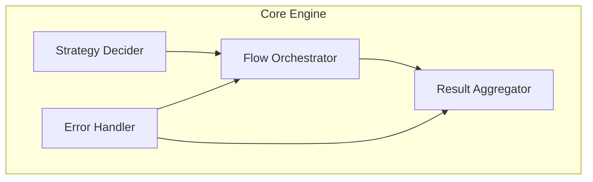
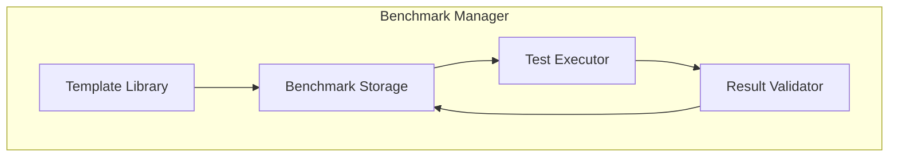
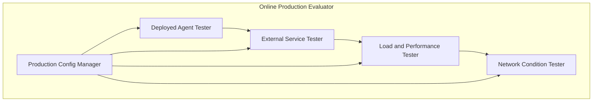
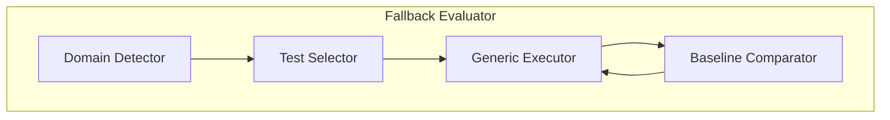
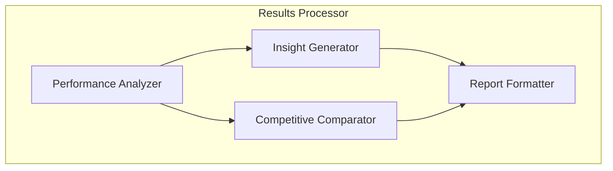
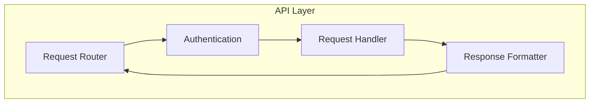

# Component Architecture - Agent Evaluation Framework

**Document Type**: Component Design  
**Author**: William  
**Date Created**: 2025-06-28  
**Last Updated**: 2025-06-28  
**Status**: Draft  
**Iteration Count**: 1  

## 🎯 Component Overview

This document provides detailed architecture for each major component of the evaluation framework, following KISS principles and focusing on essential functionality.

## 🏗️ Core Engine Architecture

### Component Responsibilities
- **Evaluation Strategy Decision**: Choose between custom benchmarks and fallback evaluation
- **Flow Orchestration**: Coordinate execution of evaluation components
- **Result Aggregation**: Combine results from different evaluation sources
- **Error Handling**: Manage failures and provide graceful degradation

### Internal Structure



### Key Design Decisions
- **Simple Decision Logic**: If custom benchmarks exist, use them; otherwise, use fallback
- **No Complex Rules**: Avoid over-engineering the decision-making process
- **Fail-Safe Default**: Always fall back to generic evaluation if custom fails

## 🔧 Benchmark Manager Architecture

### Component Responsibilities
- **Benchmark Storage**: Manage custom benchmark files and metadata
- **Test Execution**: Run custom test cases against agents
- **Result Validation**: Compare agent outputs with expected results
- **Template Management**: Provide pre-built benchmark templates

### Internal Structure



### Data Flow
1. **Load Benchmark**: Read benchmark file from storage
2. **Execute Tests**: Run test cases against the agent
3. **Validate Results**: Compare outputs with expectations
4. **Calculate Metrics**: Compute success rates and performance scores

### Benchmark File Format
```json
{
  "id": "unique_benchmark_id",
  "name": "Benchmark Name",
  "description": "What this benchmark tests",
  "agent_domain": "coding|analysis|conversation",
  "test_cases": [
    {
      "input": "Test input for agent",
      "expected_output": "Expected response",
      "success_criteria": "How to judge success"
    }
  ],
  "metadata": {
    "created_by": "developer_id",
    "created_at": "timestamp",
    "version": "1.0"
  }
}
```

## 🎲 Fallback Evaluator Architecture

### Component Responsibilities
- **Domain Detection**: Identify what type of agent is being evaluated
- **Generic Test Selection**: Choose appropriate test suite for the domain
- **Baseline Comparison**: Compare results against known performance baselines
- **Adaptive Testing**: Adjust test difficulty based on agent performance

## 🌐 Online Production Evaluator Architecture

### Component Responsibilities
- **Production Environment Testing**: Test agents in deployed, production-like environments
- **External Service Integration**: Test with real APIs, databases, and third-party services
- **Load and Performance Testing**: Simulate production workloads and concurrent users
- **Network Condition Testing**: Test under various network latencies and failure scenarios

### Internal Structure



### Production Testing Capabilities

#### **Deployed Agent Testing**
- **Endpoint Testing**: Test agents running on production URLs
- **Authentication Testing**: Test with production authentication mechanisms
- **Response Validation**: Validate responses from deployed instances
- **Performance Monitoring**: Track real-world response times and throughput

#### **External Service Integration**
- **API Testing**: Test with real external APIs (OpenAI, GitHub, etc.)
- **Database Testing**: Test with production databases and data volumes
- **Service Failures**: Test graceful degradation when services fail
- **Rate Limiting**: Test behavior under API rate limits

#### **Load and Performance Testing**
- **Concurrent User Simulation**: Simulate multiple users simultaneously
- **Data Volume Testing**: Test with production-sized datasets
- **Performance Degradation**: Measure performance under increasing load
- **Resource Utilization**: Monitor CPU, memory, and network usage

#### **Network Condition Testing**
- **Latency Simulation**: Test under various network latencies
- **Bandwidth Testing**: Test with limited bandwidth scenarios
- **Failure Simulation**: Test network failure and recovery scenarios
- **Geographic Testing**: Test from different geographic locations

### Internal Structure



### Domain Detection Strategy
- **Input Analysis**: Examine agent description and capabilities
- **Response Pattern**: Analyze sample responses for domain indicators
- **Metadata Matching**: Use agent metadata to identify domain
- **Fallback Default**: Default to "general" domain if unclear

### Generic Test Suites
- **Coding Agents**: Basic code generation, debugging, refactoring tests
- **Analysis Agents**: Data processing, pattern recognition, insight generation
- **Conversation Agents**: Context understanding, response relevance, task completion
- **General Agents**: Basic problem-solving and communication tests

## 📊 Results Processor Architecture

### Component Responsibilities
- **Performance Analysis**: Calculate success rates and performance metrics
- **Insight Generation**: Create actionable improvement suggestions
- **Report Formatting**: Generate user-friendly evaluation reports
- **Competitive Analysis**: Compare against marketplace standards
- **Production Readiness Assessment**: Evaluate production environment performance

### Internal Structure



### Output Structure
```json
{
  "evaluation_summary": {
    "overall_score": 8.5,
    "success_rate": 85.0,
    "confidence_level": "high"
  },
  "performance_metrics": {
    "accuracy": 0.85,
    "response_time": "2.3s",
    "consistency": 0.92
  },
  "improvement_suggestions": [
    "Improve error handling for edge cases",
    "Optimize response time for complex queries",
    "Enhance context understanding in conversations"
  ],
  "competitive_position": {
    "market_percentile": 75,
    "strengths": ["Fast response time", "High accuracy"],
    "areas_for_improvement": ["Edge case handling", "Documentation"]
  },
  "production_readiness": {
    "deployment_score": 8.2,
    "external_integration": 7.8,
    "load_handling": 8.5,
    "network_resilience": 7.9,
    "production_risks": [
      "API rate limiting may cause delays under high load",
      "External service failures need better error handling"
    ]
  }
}
```

## 🔌 API Layer Architecture

### Component Responsibilities
- **Request Handling**: Process incoming evaluation requests
- **Authentication**: Basic user verification and access control
- **Response Formatting**: Ensure consistent API response structure
- **Error Handling**: Provide clear error messages and status codes

### Internal Structure



### API Endpoints
```
POST /evaluate
  - Evaluate an agent with optional custom benchmarks
  
GET /benchmarks
  - List available benchmark templates
  
POST /benchmarks
  - Create a new custom benchmark
  
GET /benchmarks/{id}
  - Get benchmark details
  
GET /results/{agent_id}
  - Get evaluation results for an agent
```

## 💾 Storage Architecture

### File Structure
```
evaluation_framework/
├── benchmarks/
│   ├── templates/
│   │   ├── coding.json
│   │   ├── analysis.json
│   │   └── conversation.json
│   ├── custom/
│   │   └── {developer_id}/
│   └── shared/
├── results/
│   └── {agent_id}/
├── agents/
│   └── {agent_id}/
└── config/
    └── settings.json
```

### Storage Principles
- **Simple File System**: Use JSON files for all data storage
- **Hierarchical Organization**: Logical folder structure for easy navigation
- **No Database Dependencies**: Keep deployment simple
- **Easy Backup**: Simple file operations for data management

## 🔄 Component Interactions

### Evaluation Flow
1. **API receives request** → Routes to Core Engine
2. **Core Engine decides strategy** → Custom benchmarks or fallback
3. **Selected evaluator runs tests** → Benchmark Manager or Fallback Evaluator
4. **Results sent to processor** → Performance analysis and insights
5. **Formatted results returned** → User receives actionable feedback

### Error Handling Flow
1. **Component encounters error** → Logs error details
2. **Error handler processes** → Determines severity and response
3. **Graceful degradation** → Provide partial results or helpful error message
4. **User notification** → Clear explanation of what went wrong

## 🎯 Design Principles Applied

### KISS (Keep It Simple, Stupid)
- **Single Responsibility**: Each component has one clear purpose
- **Simple Interfaces**: Clean, straightforward component APIs
- **Minimal Dependencies**: Few inter-component dependencies

### DRY (Don't Repeat Yourself)
- **Shared Utilities**: Common functions in shared modules
- **Template System**: Reusable benchmark templates
- **Common Patterns**: Standardized error handling and logging

### YAGNI (You Aren't Gonna Need It)
- **Basic Functionality**: Only essential features implemented
- **Simple Storage**: File-based storage, not complex database
- **Basic Security**: Simple authentication, not enterprise-grade security
- **Future Extensibility**: Design allows for future enhancements

## 🔮 Future Extension Points

### Scalability Improvements
- **Database Migration**: Replace file storage with database when needed
- **Caching Layer**: Add Redis or similar for performance
- **Message Queue**: Async processing for long-running evaluations

### Advanced Features
- **AI-Powered Analysis**: Machine learning for better insights
- **Real-Time Monitoring**: Live evaluation progress tracking
- **Advanced Security**: Role-based access control and audit trails

---

*This component architecture provides a solid foundation that can be implemented incrementally, starting with core functionality and adding features based on actual usage patterns and requirements.*
