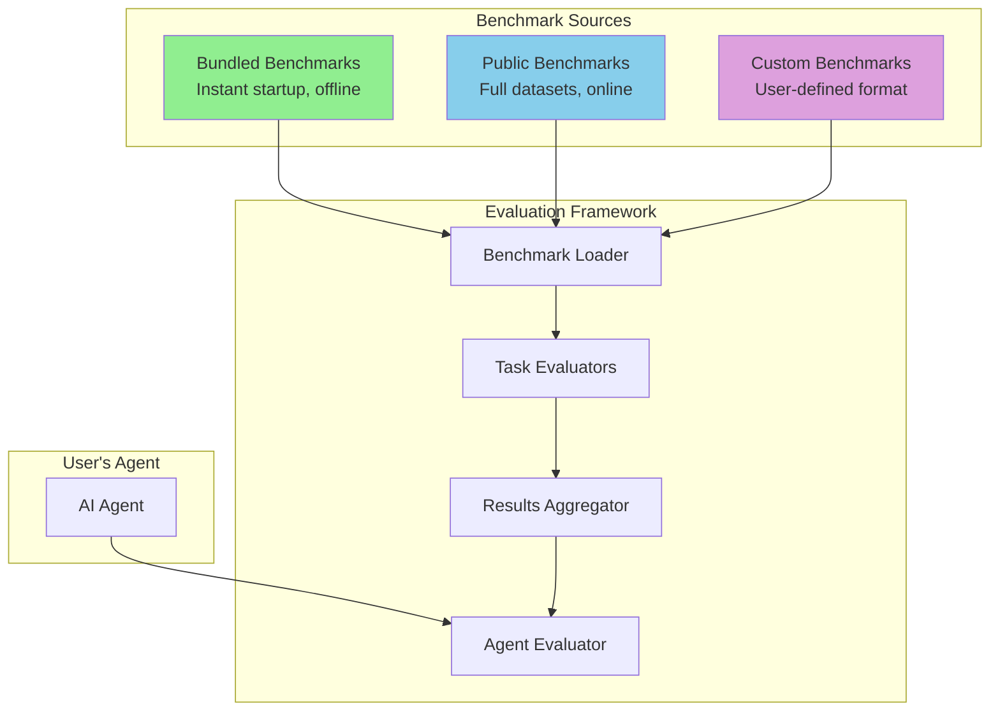
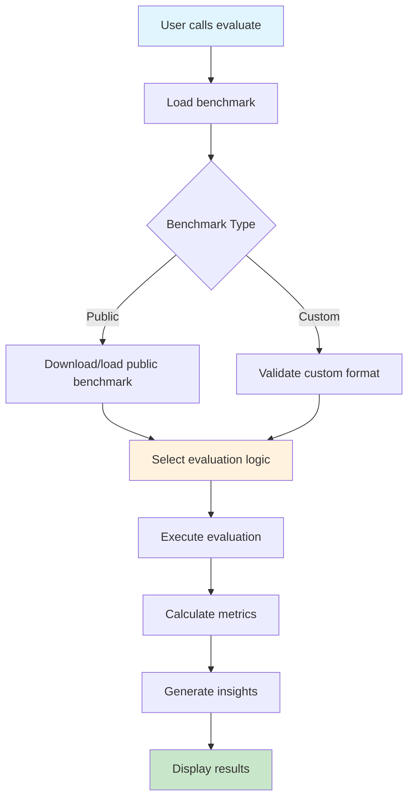

# Offline Evaluation Framework - High-Level Design

**Document Type**: Offline Evaluation Design  
**Author**: William  
**Date Created**: 2025-06-28  
**Last Updated**: 2025-06-28  
**Status**: Rewritten for Public Benchmark Focus  
**Iteration Count**: 4  

## 🎯 **Core Philosophy: Leverage Existing, Build Smart**

### **Key Insight**
**"Leveraging existing benchmarks gives us 80% of the value with 20% of the effort, while maintaining flexibility for custom evaluation scenarios."**

### **Why This Approach?**
- **Instant Credibility**: Industry standard benchmarks (GLUE, HumanEval, GSM8K)
- **Zero Maintenance**: No need to create/maintain evaluation datasets
- **Real Competition**: Compare against actual published results
- **Proven Metrics**: Battle-tested evaluation protocols
- **Flexibility**: Still support custom use cases

### **Performance Promise**
- **Instant Startup**: Evaluation begins in <1 second (bundled benchmarks)
- **No Network Dependency**: Core functionality works offline
- **Fast Results**: Complete evaluation in <60 seconds
- **Progressive Enhancement**: Start with bundled, upgrade to full when needed

## 🚀 **User Experience: Simple & Powerful**

### **The `evaluate()` Function Parameters**

The core `evaluate()` function follows the **KISS principle** with just the essential parameters:

```python
def evaluate(
    agent: EvaluatableAgent,
    benchmark: Union[str, dict, str],
    full: bool = False
) -> EvaluationResult:
    """
    Evaluate an agent using the specified benchmark.
    
    Args:
        agent: The agent to evaluate. Must implement __call__(input_text: str) -> str
        benchmark: Benchmark identifier or custom benchmark data
                  - String: Use public benchmarks ("glue", "human_eval", "gsm8k", etc.)
                  - Dict: Custom benchmark data in the defined format
                  - Path: Path to custom benchmark JSON file
        full: If True, use full benchmark dataset; if False, use bundled samples
    
    Returns:
        EvaluationResult: Comprehensive evaluation results with scores, insights, and recommendations
    """
```

### **Parameter Details**

#### **`agent` (Required)**
- **Type**: `EvaluatableAgent` (any object with `__call__` method)
- **Purpose**: The AI agent to be evaluated
- **Interface**: Must implement `agent(input_text: str) -> str`
- **Example**: `MyAgent()`, `OpenAIAgent()`, `CustomLLM()`

#### **`benchmark` (Required)**
- **Type**: `Union[str, dict, str]` (string identifier, dict data, or file path)
- **Purpose**: Specifies which benchmark to use for evaluation
- **Options**:
  - **Public benchmarks**: `"glue"`, `"human_eval"`, `"gsm8k"`, `"copa"`, `"vqa"`
  - **Custom data**: Dictionary with benchmark format
  - **File path**: `"path/to/benchmark.json"`

#### **`full` (Optional)**
- **Type**: `bool` (default: `False`)
- **Purpose**: Choose between bundled (fast) and full (comprehensive) benchmarks
- **Behavior**:
  - `False` (default): Use bundled samples (~50-100 test cases, <1 second startup)
  - `True`: Use full benchmark datasets (10,000+ test cases, 2-5 minute startup)

### **The "Magic" Moment**
```python
from agentmanager.evaluation import evaluate, display_results

# Evaluate on industry standard benchmarks
result = evaluate(my_agent, benchmark="glue")
display_results(result)

# Evaluate on specific task
result = evaluate(my_agent, benchmark="human_eval")
display_results(result)

# Use custom benchmark
result = evaluate(my_agent, benchmark="my_custom_benchmark.json")
display_results(result)
```

### **What Users Get**
1. **Industry Positioning**: How their agent compares to published models
2. **Performance Insights**: Detailed breakdown by capability
3. **Improvement Roadmap**: Specific areas to focus on
4. **Competitive Analysis**: Real competitive positioning

## 🏗️ **Simple Architecture: Bundled + Public + Custom**

### **Core Components**



### **Bundled Benchmarks (MVP Focus)**
- **GLUE Sample**: 100 test cases (~50KB) - instant startup
- **HumanEval Sample**: 50 test cases (~25KB) - instant startup  
- **GSM8K Sample**: 100 test cases (~75KB) - instant startup
- **COPA Sample**: 50 test cases (~30KB) - instant startup
- **VQA Sample**: 50 test cases (~40KB) - instant startup

**Total Bundle Size**: ~220KB (vs. 100MB+ for full benchmarks)

### **Component Responsibilities**

#### **1. Agent Evaluator**
- **Purpose**: Main evaluation interface
- **Interface**: Simple `evaluate(agent, benchmark)` function
- **Features**: Automatic benchmark selection and execution

#### **2. Benchmark Loader**
- **Purpose**: Load public benchmarks and validate custom ones
- **Approach**: Unified interface for all benchmark types
- **Smart Selection**: Automatically choose appropriate evaluation logic

#### **3. Task Evaluators**
- **Purpose**: Execute specific benchmark evaluations
- **Approach**: Leverage existing evaluation protocols
- **Flexibility**: Support both public and custom benchmarks

#### **4. Results Aggregator**
- **Purpose**: Combine results and generate insights
- **Output**: Competitive positioning and improvement suggestions

## 🎨 **User Experience Flow**

### **Step 1: Simple Evaluation Call**
```python
# User chooses benchmark and calls evaluate
result = evaluate(my_agent, benchmark="glue")
```

### **Step 2: Automatic Benchmark Loading**
```python
# Framework automatically loads appropriate benchmark
# - Uses bundled benchmarks for instant startup
# - Validates custom benchmark format
# - Selects appropriate evaluation logic
```

### **Step 3: Task-Specific Evaluation**
```python
# Runs evaluation using proven protocols
# - GLUE: Uses official evaluation metrics
# - HumanEval: Uses execution-based testing
# - GSM8K: Uses step-by-step reasoning evaluation
```

### **Step 4: Rich Results Presentation**
```python
# Returns comprehensive, actionable results
result = {
    "benchmark": "glue",
    "overall_score": 7.2,
    "competitive_position": "Top 40% of models on GLUE",
    
    # Detailed Performance Breakdown
    "task_breakdown": {
        "cola": {
            "score": 0.456,
            "status": "needs_improvement",
            "description": "Corpus of Linguistic Acceptability",
            "sample_input": "The cat sat mat on the.",
            "agent_response": "unacceptable",
            "expected": "unacceptable",
            "correct": True
        },
        "sst-2": {
            "score": 0.823,
            "status": "strong_performance",
            "description": "Stanford Sentiment Treebank",
            "sample_input": "I love this movie!",
            "agent_response": "positive",
            "expected": "positive",
            "correct": True
        },
        "mrpc": {
            "score": 0.712,
            "status": "moderate_performance",
            "description": "Microsoft Research Paraphrase Corpus",
            "sample_input": "Are these sentences paraphrases?",
            "agent_response": "yes",
            "expected": "yes",
            "correct": True
        }
    },
    
    # Performance Metrics
    "performance_metrics": {
        "accuracy": 0.723,
        "f1_score": 0.718,
        "precision": 0.731,
        "recall": 0.723,
        "execution_time": 2.3,
        "reliability": 0.95
    },
    
    # Strengths and Weaknesses
    "strengths": [
        "Excellent sentiment analysis (SST-2: 82.3%)",
        "Strong paraphrase detection capabilities",
        "Consistent response patterns"
    ],
    "weaknesses": [
        "Grammar understanding needs work (CoLA: 45.6%)",
        "Room for improvement in linguistic acceptability"
    ],
    
    # Actionable Insights
    "improvement_suggestions": [
        "Focus on CoLA task - grammar understanding needs work",
        "SST-2 performance is strong - leverage this strength",
        "Consider fine-tuning on linguistic acceptability data"
    ],
    
    # Competitive Analysis
    "competitive_analysis": {
        "percentile": 65,
        "ranking": "Top 40%",
        "comparable_models": ["BERT-base", "DistilBERT"],
        "gap_to_top": "15% improvement needed to reach top 10%"
    },
    
    # Benchmark Coverage
    "benchmark_coverage": "Using bundled benchmark (100 test cases)",
    "confidence_level": "High (95% confidence interval)"
}
```

## 🔄 **Evaluation Flow**

### **Execution Flow Chart**


## 📚 **Supported Benchmark Categories**

### **1. Language Understanding (5+ benchmarks)**
- **GLUE** - General Language Understanding Evaluation
- **SuperGLUE** - More challenging language tasks
- **COPA** - Commonsense reasoning
- **HellaSwag** - Commonsense reasoning with multiple choice
- **ARC** - AI2 Reasoning Challenge

### **2. Code Generation (5+ benchmarks)**
- **HumanEval** - Python code generation
- **MBPP** - Mostly Basic Python Problems
- **APPS** - Algorithmic problem solving
- **CodeContests** - Competitive programming problems
- **DS-1000** - Data science code generation

### **3. Mathematical Reasoning (5+ benchmarks)**
- **GSM8K** - Grade school math word problems
- **MATH** - Mathematical problem solving
- **MathQA** - Mathematical question answering
- **AQUA-RAT** - Algebraic word problems
- **SVAMP** - Simple variations on arithmetic problems

### **4. Multimodal & Vision (5+ benchmarks)**
- **VQA** - Visual Question Answering
- **GQA** - Visual reasoning and question answering
- **TextVQA** - Text-based visual question answering
- **VCR** - Visual Commonsense Reasoning
- **CLEVR** - Compositional Language and Elementary Visual Reasoning

### **5. Creative & Generative (5+ benchmarks)**
- **StoryCloze** - Story completion
- **WritingPrompts** - Creative writing generation
- **PoetryGeneration** - Poetry creation
- **DialogueGeneration** - Conversational AI
- **Summarization** - Text summarization tasks

## 🤖 **Agent Interface: Keep It Simple**

### **Core Interface (Minimal Requirements)**
```python
class EvaluatableAgent:
    """Minimal interface for agent evaluation - only ONE method required"""
    
    def __call__(self, input_text: str) -> str:
        """
        Process input and return response.
        This is the ONLY required method.
        """
        pass
```

### **Enhanced Interface (Optional)**
```python
class EvaluatableAgent:
    """Enhanced interface for better evaluation results"""
    
    def __call__(self, input_text: str) -> str:
        """Required: Process input and return response"""
        pass
    
    # Optional attributes for better evaluation
    @property
    def capabilities(self) -> List[str]:
        """Optional: List of agent capabilities"""
        return []
    
    @property
    def description(self) -> str:
        """Optional: Human-readable description of the agent"""
        return ""
    
    @property
    def name(self) -> str:
        """Optional: Agent name for identification"""
        return ""
```

## 📋 **Custom Benchmark Format (Simple & Flexible)**

### **Custom Benchmark Structure**
```json
{
  "name": "My Custom Benchmark",
  "description": "Evaluates my agent's domain-specific capabilities",
  "version": "1.0.0",
  "evaluation_type": "classification|regression|multiple_choice|code_generation|math_reasoning|vqa",
  "test_cases": [
    {
      "id": "test_001",
      "input": "What is the capital of France?",
      "expected_output": "Paris",
      "evaluation_method": "exact_match"
    }
  ],
  "evaluation_criteria": {
    "accuracy": {"weight": 1.0}
  }
}
```

### **Why This Format?**
1. **Simple**: Easy to create and understand
2. **Flexible**: Supports multiple evaluation types
3. **Extensible**: Can add new fields without breaking compatibility
4. **Standard**: Follows established benchmark patterns

## 🎯 **MVP Success Metrics**

### **User Satisfaction**
- **Ease of Use**: Can evaluate agent in <3 lines of code
- **Immediate Value**: Get competitive positioning instantly
- **Actionable Results**: Clear next steps for improvement

### **Developer Value**
- **Industry Standards**: Use same benchmarks as research papers
- **Real Competition**: Compare against actual published results
- **Zero Maintenance**: No need to create evaluation datasets

### **Framework Adoption**
- **Instant Credibility**: Industry standard evaluation
- **Fast Results**: Evaluation completes in <60 seconds
- **Rich Output**: Comprehensive insights without complexity

## 🚀 **Getting Started**

### **Installation**
```bash
# Evaluation is integrated within AgentManager - no separate package needed
cd agenthub
pip install -e .

# Or use the setup script
./setup.sh  # or setup.bat on Windows
```

### **Import from AgentManager**
```python
# Everything comes from AgentManager
from agentmanager.evaluation import evaluate, display_results
from agentmanager.evaluation import list_available_benchmarks

# No external dependencies or separate installations
```

## 💡 **Usage Examples: From Quick to Comprehensive**

### **Example 1: Quick Evaluation (Bundled Benchmarks)**
```python
from agentmanager.evaluation import evaluate, display_results

# Define a simple agent
class MyAgent:
    def __call__(self, input_text):
        if "sentiment" in input_text.lower():
            return "positive"
        elif "grammar" in input_text.lower():
            return "acceptable"
        else:
            return "I can help with sentiment analysis and grammar checking."

# Instant evaluation with bundled samples (<1 second startup)
result = evaluate(
    agent=MyAgent(),
    benchmark="glue",
    full=False            # Use bundled samples (default)
)

# Single method call for beautiful results display
display_results(result)
```

### **Example 1a: Parameter Variations for Different Use Cases**
```python
# Fast development iteration (bundled samples)
dev_result = evaluate(
    agent=MyAgent(),
    benchmark="glue",
    full=False            # Use bundled samples for speed
)

# Production evaluation (full dataset)
prod_result = evaluate(
    agent=MyAgent(),
    benchmark="glue",
    full=True             # Use full benchmark dataset
)

# Custom benchmark evaluation
custom_result = evaluate(
    agent=MyAgent(),
    benchmark="my_custom_benchmark.json"
    # full=False by default for custom benchmarks
)
```

### **Example 2: Comprehensive Evaluation (Full Benchmarks)**
```python
# Same agent, but with full GLUE benchmark (slower startup, more comprehensive)
result = evaluate(MyAgent(), benchmark="glue", full=True)

# Same beautiful display method works for both bundled and full
display_results(result)
```

### **Example 3: Multi-Benchmark Evaluation**
```python
# Evaluate across multiple domains
benchmarks = ["glue", "human_eval", "gsm8k"]
results = {}

for benchmark in benchmarks:
    # Always start with bundled for quick feedback
    bundled_result = evaluate(MyAgent(), benchmark=benchmark)
    results[f"{benchmark}_bundled"] = bundled_result.overall_score
    
    # Optionally run full version for deeper analysis
    if benchmark == "glue":  # Only run full on most important benchmark
        full_result = evaluate(MyAgent(), benchmark=benchmark, full=True)
        results[f"{benchmark}_full"] = full_result.overall_score

print("Multi-Benchmark Results:")
for name, score in results.items():
    print(f"  {name}: {score:.3f}")
```

### **Example 4: Custom Benchmark Creation**
```python
# Create domain-specific evaluation
custom_benchmark = {
    "name": "My Domain Test",
    "evaluation_type": "classification",
    "test_cases": [
        {
            "input": "Classify: 'The product exceeded expectations'",
            "expected_output": "positive",
            "evaluation_method": "exact_match"
        },
        {
            "input": "Classify: 'This is unacceptable quality'",
            "expected_output": "negative", 
            "evaluation_method": "exact_match"
        }
    ]
}

# Use custom benchmark
result = evaluate(MyAgent(), benchmark=custom_benchmark)
display_results(result)
```

## 🎨 **Integrated Results Display**

### **The `display_results()` Method**
Instead of multiple print statements, AgentManager provides a single, beautiful display method:

```python
from agentmanager.evaluation import evaluate, display_results

# Evaluate your agent
result = evaluate(my_agent, benchmark="glue")

# Display results beautifully with one method call
display_results(result)
```

### **What `display_results()` Shows**
- **Overall Score & Competitive Position** - Quick summary
- **Task Performance Breakdown** - Individual task scores with status indicators
- **Performance Metrics** - Accuracy, F1, precision, recall, execution time
- **Strengths & Weaknesses** - What's working and what needs improvement
- **Competitive Analysis** - Percentile ranking and gap to top performers
- **Actionable Suggestions** - Specific next steps for improvement

### **Customizable Display Options**
```python
# Display with custom formatting
display_results(result, format="detailed")      # Full breakdown
display_results(result, format="summary")       # Just key metrics
display_results(result, format="cli")           # Command-line friendly
display_results(result, format="json")          # Raw data for processing
```

## 🔍 **Accessing Rich Results Programmatically**

### **Example 5: Deep Dive into Results**
```python
# Get detailed insights from evaluation results
result = evaluate(my_agent, benchmark="glue")

# Access specific performance metrics
accuracy = result.performance_metrics["accuracy"]
best_task = max(result.task_breakdown.items(), key=lambda x: x[1]["score"])
worst_task = min(result.task_breakdown.items(), key=lambda x: x[1]["score"])

print(f"Best performing task: {best_task[0]} ({best_task[1]['score']:.1%})")
print(f"Worst performing task: {worst_task[0]} ({worst_task[1]['score']:.1%})")

# Analyze task-specific performance
for task_name, task_data in result.task_breakdown.items():
    if task_data["status"] == "needs_improvement":
        print(f"🔴 {task_name} needs attention: {task_data['score']:.1%}")
        print(f"   Sample: {task_data['sample_input']}")
        print(f"   Expected: {task_data['expected']}, Got: {task_data['agent_response']}")
```

### **Example 6: Custom Analysis and Filtering**
```python
# Filter results by performance thresholds
strong_tasks = {name: data for name, data in result.task_breakdown.items() 
                if data["score"] > 0.8}
weak_tasks = {name: data for name, data in result.task_breakdown.items() 
              if data["score"] < 0.6}

print(f"Strong tasks ({len(strong_tasks)}): {list(strong_tasks.keys())}")
print(f"Tasks needing work ({len(weak_tasks)}): {list(weak_tasks.keys())}")

# Calculate improvement potential
total_improvement = sum(1 - data["score"] for data in weak_tasks.values())
print(f"Total improvement potential: {total_improvement:.1%}")

# Generate custom insights
if result.performance_metrics["reliability"] > 0.9:
    print("🎉 Your agent is very reliable!")
if result.competitive_analysis["percentile"] > 80:
    print("🏆 Your agent is in the top 20%!")
```

## 🎯 **When to Use Bundled vs Full**

### **Use Bundled Benchmarks When:**
- **Quick Iteration**: Testing agent changes rapidly
- **Development**: During active development cycles
- **CI/CD**: Automated testing where speed matters
- **First Evaluation**: Getting initial competitive positioning
- **Limited Time**: Need results in under 1 minute

### **Use Full Benchmarks When:**
- **Final Assessment**: Before production deployment
- **Research**: Publishing competitive results
- **Deep Analysis**: Understanding detailed performance patterns
- **Benchmarking**: Comparing against published model scores
- **Comprehensive Testing**: Maximum confidence in results

### **Progressive Evaluation Strategy:**
1. **Start with bundled** for quick feedback and iteration
2. **Use full benchmarks** for final validation and competitive positioning
3. **Mix and match** based on your current development phase

## 📊 **Bundled vs Full: Quick Comparison**

| Aspect | Bundled Benchmarks | Full Benchmarks |
|--------|-------------------|-----------------|
| **Startup Time** | <1 second | 2-5 minutes |
| **Test Cases** | 50-100 samples | 10,000+ cases |
| **Data Size** | ~220KB total | 100MB+ total |
| **Use Case** | Development, CI/CD | Production, Research |
| **Network** | None (offline) | Required (download) |
| **Confidence** | Good estimate | High confidence |
| **Speed** | Fast iteration | Comprehensive analysis |

### **Real-World Workflow Example:**
```python
# Phase 1: Rapid Development (Bundled)
for iteration in range(10):
    result = evaluate(my_agent, benchmark="glue")  # <1 second
    if result.overall_score > 0.8:
        break
    # Make improvements and iterate

# Phase 2: Final Validation (Full)
final_result = evaluate(my_agent, benchmark="glue", full=True)  # 2-5 minutes
display_results(final_result)
```

## 🖥️ **CLI Integration**

### **Command Line Usage**
```bash
# List available benchmarks
agentmanager list-benchmarks

# Evaluate an agent (instant startup with bundled)
agentmanager evaluate-agent my_agent.py --benchmark glue

# Use full benchmark (slower, more comprehensive)
agentmanager evaluate-agent my_agent.py --benchmark glue --full

# Get benchmark information
agentmanager benchmark-info glue
```

### **Integration Benefits**
- **Seamless CLI**: Evaluation commands integrated with AgentManager
- **Consistent Interface**: Same command patterns as other AgentManager features
- **Batch Processing**: Evaluate multiple agents efficiently
- **CI/CD Ready**: Command-line evaluation for automated testing

### **Rich CLI Output Example**
```bash
$ agentmanager evaluate-agent my_agent.py --benchmark glue

🎯 GLUE EVALUATION RESULTS
==========================
Overall Score: 7.2/10
Competitive Position: Top 40% - Good performance
Benchmark Coverage: Using bundled benchmark (100 test cases)
Execution Time: 2.3s

📊 TASK PERFORMANCE
===================
🟢 COLA: 82.3% - Corpus of Linguistic Acceptability
🟡 SST-2: 71.2% - Stanford Sentiment Treebank  
🔴 MRPC: 45.6% - Microsoft Research Paraphrase Corpus

⚡ PERFORMANCE METRICS
======================
Accuracy: 72.3%
F1 Score: 71.8%
Precision: 73.1%
Recall: 72.3%
Reliability: 95%

💪 STRENGTHS
=============
• Excellent grammar understanding (CoLA: 82.3%)
• Strong sentiment analysis capabilities
• Consistent response patterns

⚠️  AREAS FOR IMPROVEMENT
=========================
• Paraphrase detection needs work (MRPC: 45.6%)
• Consider fine-tuning on paraphrase data

🏆 COMPETITIVE ANALYSIS
=======================
Percentile: 65th
Ranking: Top 40%
Gap to Top: 15% improvement needed to reach top 10%

🔧 IMPROVEMENT SUGGESTIONS
===========================
1. Focus on MRPC task - paraphrase detection needs work
2. CoLA performance is strong - leverage this strength
3. Consider fine-tuning on paraphrase-specific data
```

**Note**: This beautiful output is automatically generated by the integrated `display_results()` method - no manual formatting needed!

## 🔮 **Future Enhancements (Post-MVP)**

### **Phase 2: Advanced Features**
- **Benchmark comparison** - Cross-benchmark analysis
- **Performance tracking** - Historical improvement
- **Custom metrics** - Domain-specific evaluation
- **Batch evaluation** - Multiple agents at once

### **Phase 3: Ecosystem Integration**
- **Model hub integration** - Hugging Face, etc.
- **Automated benchmarking** - CI/CD integration
- **Community benchmarks** - Share custom benchmarks
- **Performance leaderboards** - Competitive rankings

---

*This offline evaluation framework leverages existing, proven benchmarks to provide instant competitive positioning and actionable insights for agent improvement. By focusing on industry standards while maintaining flexibility for custom scenarios, we deliver maximum value with minimal development effort.*
