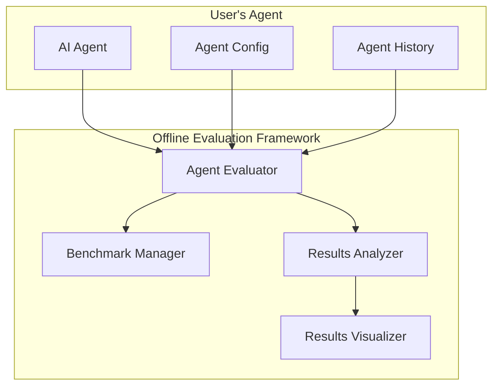

# Offline Evaluation Framework - Design & Approach

**Document Type**: Offline Evaluation Design  
**Author**: William  
**Date Created**: 2025-06-28  
**Last Updated**: 2025-06-28  
**Status**: Draft  
**Iteration Count**: 1  

## 🎯 Offline Evaluation Philosophy

### Core Principle
**"Simple, direct evaluation that gives developers immediate insights into their agent's capabilities"**

### Why Offline Evaluation?
- **Direct Access**: Full access to agent internals, memory, and state
- **Consistent Results**: Reproducible testing without network variability
- **Fast Feedback**: Immediate results without API overhead
- **Deep Insights**: Can examine agent's reasoning process and decision-making
- **Development Friendly**: Works seamlessly in development workflows

## 🚀 User Experience Design

### The "Magic" Moment
```python
from agent_evaluation import evaluate

# Simple one-line evaluation
result = evaluate(my_agent)

# Rich, actionable results
print(f"Overall Score: {result.overall_score}/10")
print(f"Strengths: {result.strengths}")
print(f"Improvements: {result.improvement_suggestions}")
```

### What Users Will See
1. **Immediate Visual Feedback**: Beautiful, easy-to-understand results
2. **Actionable Insights**: Specific steps to improve their agent
3. **Performance Breakdown**: Clear metrics for different capabilities
4. **Competitive Analysis**: How their agent compares to others
5. **Improvement Roadmap**: Clear path to better performance

## 🏗️ Simple Architecture

### Core Components



### Component Responsibilities

#### **1. Agent Evaluator**
- **Purpose**: Core evaluation engine that tests agent capabilities
- **Interface**: Simple `evaluate(agent)` function
- **Features**: Automatic capability detection, intelligent test selection

#### **2. Benchmark Manager**
- **Purpose**: Provide relevant test cases for the agent
- **Approach**: Template-based + custom benchmarks
- **Smart Selection**: Automatically choose appropriate tests

#### **3. Results Analyzer**
- **Purpose**: Analyze test results and generate insights
- **Output**: Performance metrics, improvement suggestions, competitive analysis

#### **4. Results Visualizer**
- **Purpose**: Present results in compelling, actionable format
- **Features**: Beautiful charts, clear recommendations, progress tracking

## 🎨 User Experience Flow

### **Step 1: Simple Evaluation Call**
```python
# User just calls evaluate() on their agent
result = evaluate(my_coding_agent)
```

### **Step 2: Automatic Capability Detection**
```python
# Framework automatically detects what the agent can do
# - Analyzes agent description and capabilities
# - Identifies relevant test categories
# - Selects appropriate benchmarks
```

### **Step 3: Intelligent Test Execution**
```python
# Runs relevant tests based on agent type
# - Coding agents: Code generation, debugging, refactoring
# - Analysis agents: Data processing, pattern recognition
# - Conversation agents: Context understanding, task completion
```

### **Step 4: Rich Results Presentation**
```python
# Returns comprehensive, actionable results
result = {
    "overall_score": 8.5,
    "capability_scores": {
        "code_generation": 9.2,
        "debugging": 7.8,
        "refactoring": 8.1
    },
    "strengths": ["Excellent code quality", "Fast response time"],
    "improvements": ["Better error handling", "More consistent output"],
    "competitive_position": "Top 20% of coding agents"
}
```

## 🔧 Implementation Approach

### **Simple Python Library**
```python
# agent_evaluation/__init__.py
from .evaluator import evaluate
from .benchmarks import load_benchmarks
from .analyzer import analyze_results

__all__ = ['evaluate', 'load_benchmarks', 'analyze_results']
```

### **Core Evaluation Function**
```python
def evaluate(agent, benchmarks=None, options=None):
    """
    Evaluate an AI agent's capabilities offline
    
    Args:
        agent: The AI agent to evaluate
        benchmarks: Optional custom benchmarks
        options: Evaluation configuration
    
    Returns:
        EvaluationResult with comprehensive insights
    """
    # 1. Detect agent capabilities
    capabilities = detect_capabilities(agent)
    
    # 2. Select relevant benchmarks
    if benchmarks is None:
        benchmarks = select_benchmarks(capabilities)
    
    # 3. Execute tests
    test_results = run_tests(agent, benchmarks)
    
    # 4. Analyze results
    analysis = analyze_results(test_results, capabilities)
    
    # 5. Generate insights
    insights = generate_insights(analysis)
    
    return EvaluationResult(analysis, insights)
```

### **Benchmark Selection**
```python
def select_benchmarks(capabilities):
    """Automatically select relevant benchmarks based on agent capabilities"""
    
    benchmarks = []
    
    if "coding" in capabilities:
        benchmarks.extend(load_coding_benchmarks())
    
    if "analysis" in capabilities:
        benchmarks.extend(load_analysis_benchmarks())
    
    if "conversation" in capabilities:
        benchmarks.extend(load_conversation_benchmarks())
    
    return benchmarks
```

## 📊 Benchmark Categories

### **Coding Agents**
```python
CODING_BENCHMARKS = {
    "code_generation": [
        "Generate Python class for data processing",
        "Create REST API endpoint",
        "Write unit tests for existing code"
    ],
    "debugging": [
        "Find bug in Python function",
        "Optimize slow algorithm",
        "Fix syntax errors"
    ],
    "refactoring": [
        "Improve code readability",
        "Extract common functionality",
        "Apply design patterns"
    ]
}
```

### **Analysis Agents**
```python
ANALYSIS_BENCHMARKS = {
    "data_processing": [
        "Clean messy dataset",
        "Identify data patterns",
        "Generate data insights"
    ],
    "pattern_recognition": [
        "Find anomalies in data",
        "Identify trends over time",
        "Classify data samples"
    ],
    "insight_generation": [
        "Explain data relationships",
        "Suggest business actions",
        "Predict future trends"
    ]
}
```

### **Conversation Agents**
```python
CONVERSATION_BENCHMARKS = {
    "context_understanding": [
        "Maintain conversation context",
        "Remember previous interactions",
        "Build on previous responses"
    ],
    "task_completion": [
        "Complete multi-step tasks",
        "Follow user instructions",
        "Provide helpful responses"
    ],
    "knowledge_application": [
        "Apply domain knowledge",
        "Provide accurate information",
        "Suggest relevant resources"
    ]
}
```

## 🎯 Results & Insights

### **Performance Metrics**
```python
class PerformanceMetrics:
    def __init__(self):
        self.accuracy = 0.0          # How often correct
        self.response_time = 0.0     # Average response time
        self.consistency = 0.0       # Output consistency
        self.completeness = 0.0      # Answer completeness
        self.helpfulness = 0.0       # How helpful the response is
```

### **Capability Scores**
```python
class CapabilityScores:
    def __init__(self):
        self.primary_capabilities = {}    # Main agent strengths
        self.secondary_capabilities = {}  # Supporting capabilities
        self.weak_areas = []             # Areas needing improvement
        self.unique_strengths = []       # What makes this agent special
```

### **Improvement Roadmap**
```python
class ImprovementRoadmap:
    def __init__(self):
        self.immediate_fixes = []         # Quick wins
        self.short_term_goals = []        # Next 2-4 weeks
        self.long_term_improvements = []  # Strategic improvements
        self.resource_requirements = {}   # What's needed to improve
```

## 🌟 Compelling User Experience

### **Beautiful Results Display**
```python
def display_results(result):
    """Display evaluation results in a compelling, actionable format"""
    
    print("🎯 AGENT EVALUATION RESULTS")
    print("=" * 50)
    
    # Overall Score with Visual Indicator
    score = result.overall_score
    if score >= 9:
        print(f"🏆 EXCELLENT: {score}/10")
    elif score >= 7:
        print(f"⭐ GREAT: {score}/10")
    elif score >= 5:
        print(f"✅ GOOD: {score}/10")
    else:
        print(f"🔧 NEEDS WORK: {score}/10")
    
    print()
    
    # Capability Breakdown
    print("📊 CAPABILITY BREAKDOWN")
    for capability, score in result.capability_scores.items():
        bar = "█" * int(score) + "░" * (10 - int(score))
        print(f"{capability:20} {bar} {score}/10")
    
    print()
    
    # Strengths
    print("💪 STRENGTHS")
    for strength in result.strengths:
        print(f"  • {strength}")
    
    print()
    
    # Improvement Areas
    print("🔧 IMPROVEMENT AREAS")
    for improvement in result.improvements:
        print(f"  • {improvement}")
    
    print()
    
    # Competitive Position
    print(f"🏁 COMPETITIVE POSITION: {result.competitive_position}")
```

### **Interactive Improvement Suggestions**
```python
def suggest_improvements(result):
    """Provide specific, actionable improvement suggestions"""
    
    suggestions = []
    
    if result.accuracy < 0.8:
        suggestions.append({
            "area": "Accuracy",
            "suggestion": "Add more validation and error checking",
            "effort": "Medium",
            "impact": "High"
        })
    
    if result.response_time > 5.0:
        suggestions.append({
            "area": "Performance",
            "suggestion": "Optimize algorithm complexity and caching",
            "effort": "High",
            "impact": "High"
        })
    
    return suggestions
```

## 🚀 Getting Started

### **Installation**
```bash
pip install agent-evaluation
```

### **Basic Usage**
```python
from agent_evaluation import evaluate

# Evaluate your agent
result = evaluate(my_agent)

# Get insights
print(f"Your agent scored {result.overall_score}/10")
print(f"Top strength: {result.strengths[0]}")
print(f"Priority improvement: {result.improvements[0]}")
```

### **Custom Benchmarks**
```python
from agent_evaluation import create_benchmark

# Create custom benchmark for your use case
my_benchmark = create_benchmark(
    name="My Custom Test",
    test_cases=[
        "Generate a Python function that sorts a list",
        "Debug this code: [code here]",
        "Refactor this function for better readability"
    ],
    expected_outputs=[
        "def sort_list(lst): ...",
        "Fixed code with explanation",
        "Refactored function with comments"
    ]
)

# Use custom benchmark
result = evaluate(my_agent, benchmarks=[my_benchmark])
```

## 🎯 Success Metrics

### **User Satisfaction**
- **Ease of Use**: Can evaluate agent in <5 lines of code
- **Actionable Results**: Clear next steps for improvement
- **Visual Appeal**: Results are compelling and easy to understand

### **Developer Value**
- **Immediate Insights**: Understand agent capabilities in minutes
- **Improvement Guidance**: Clear roadmap for enhancement
- **Competitive Awareness**: Know how agent compares to others

### **Framework Adoption**
- **Simple Integration**: Works with any Python-based agent
- **Fast Results**: Evaluation completes in <30 seconds
- **Rich Output**: Comprehensive insights without complexity

---

*This offline evaluation framework provides a simple, compelling way for developers to understand and improve their AI agents, with beautiful results and actionable insights that drive continuous improvement.*
