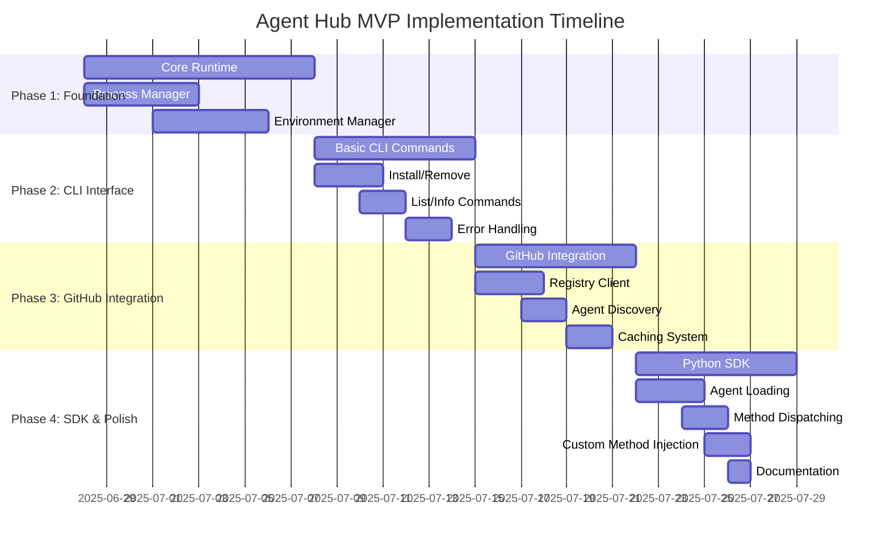

# Agent Hub MVP Implementation Plan

**Document Type**: MVP Implementation Plan  
**Author**: William  
**Date Created**: 2025-06-28  
**Last Updated**: 2025-06-28  
**Status**: Final  
**Level**: L5 - MVP Planning Level  
**Audience**: Development Team, Project Managers, Stakeholders

## 🎯 **MVP Implementation Overview**

This document outlines the **6-week implementation plan** for Agent Hub MVP, organized into 4 main phases. Each phase delivers functional value and builds toward the complete MVP vision of one-line agent integration with **custom method injection support**.

### **MVP Implementation Goals**
- **Time to Market**: 6 weeks from start to MVP completion
- **Core Value**: Validate one-line agent integration experience with custom method injection
- **Quality**: Production-ready MVP with comprehensive testing
- **User Experience**: Intuitive CLI interface with clear error handling
- **Extensibility**: Support for custom method implementations in any language

### **MVP Success Criteria**
- ✅ **Technical**: One-line integration working reliably with custom method injection
- ✅ **Business**: Integration success rate > 90%
- ✅ **User**: Time to integration < 5 minutes
- ✅ **Developer**: 10+ agents published in first month
- ✅ **Extensibility**: Users can inject custom methods for agents to invoke

## 📅 **MVP Implementation Timeline**



## 🏗️ **Phase 1: Core Foundation (Weeks 1-2)**

### **Objective**
Build the fundamental runtime system that enables agent execution with process-based isolation and **custom method injection support**.

### **Deliverables**

#### **Process Manager**
```python
# agentmanager/runtime/process_manager.py
class ProcessManager:
    def execute_agent(self, agent_path: str, method: str, parameters: dict, custom_methods: dict = None) -> dict:
        """Execute agent in isolated subprocess with custom method support."""
        # Implementation: subprocess execution with JSON IPC and custom method injection
```

**Success Criteria**:
- ✅ Can execute simple agents in isolated processes
- ✅ Handles subprocess lifecycle (start, monitor, cleanup)
- ✅ Provides JSON-based IPC for agent communication
- ✅ Implements timeout and error handling
- ✅ **NEW**: Supports custom method injection and execution

**Testing**:
- Unit tests for process creation and management
- Integration tests for subprocess execution
- Performance tests for subprocess overhead
- **NEW**: Tests for custom method injection and execution

#### **Environment Manager**
```python
# agentmanager/runtime/environment_manager.py
class EnvironmentManager:
    def create_environment(self, agent_path: str) -> str:
        """Create isolated virtual environment using UV."""
        # Implementation: UV venv creation and dependency installation
```

**Success Criteria**:
- ✅ Creates virtual environments using UV
- ✅ Installs agent dependencies in isolated environments
- ✅ Handles dependency conflicts gracefully
- ✅ Supports Python version requirements

**Testing**:
- Unit tests for environment creation

#### **Tool Infrastructure (Enhanced for Custom Methods)**
```python
# agentmanager/core/tool_infrastructure.py
class ToolInfrastructure:
    def __init__(self, agent_dir: Path, security_level: str = "medium"):
        """Initialize tool infrastructure for agent with custom method support."""
        # Implementation: tool discovery, injection, validation, AND custom method injection
```

**Success Criteria**:
- ✅ Discovers agent's built-in tools from manifest and code
- ✅ Can register custom Python functions as tools
- ✅ Implements tool priority system (custom > agent's built-in)
- ✅ Extracts tool metadata and provides injection
- ✅ Implements security validation and resource limits
- ✅ Configurable security levels (low, medium, high)
- ✅ **NEW**: Supports custom method injection and execution
- ✅ **NEW**: Handles multi-language custom method implementations

**Testing**:
- Unit tests for native tool functionality
- Integration tests for tool priority and override
- Performance tests for tool metadata extraction
- Security tests for tool validation
- Resource limit tests for tool execution
- Integration tests with UV package manager
- Cross-platform compatibility testing
- **NEW**: Tests for custom method injection and execution
- **NEW**: Tests for multi-language method support

#### **Custom Method Injection System (NEW)**
```python
# agentmanager/core/custom_method_injection.py
class CustomMethodInjection:
    def __init__(self, agent_dir: Path, security_level: str = "medium"):
        """Initialize custom method injection system."""
        self.agent_dir = agent_dir
        self.security_level = security_level
        self.custom_methods = {}
        self.method_validator = MethodValidator(security_level)
    
    def inject_custom_method(self, method_name: str, method_implementation: Any, language: str = "python") -> None:
        """Inject a custom method implementation for the agent to invoke.
        
        Args:
            method_name: Name of the method to inject
            method_implementation: The method implementation (function, script, binary, etc.)
            language: Programming language of the implementation
        """
        # Validate method implementation
        validation_result = self.method_validator.validate_method(method_implementation, language)
        if not validation_result.is_valid:
            raise MethodValidationError(f"Custom method validation failed: {validation_result.errors}")
        
        # Store method implementation
        self.custom_methods[method_name] = {
            "implementation": method_implementation,
            "language": language,
            "injected_at": time.time(),
            "security_level": self.security_level
        }
        
        # Create method wrapper for agent access
        self._create_method_wrapper(method_name, method_implementation, language)
    
    def get_custom_method(self, method_name: str) -> Any:
        """Get a custom method implementation."""
        if method_name not in self.custom_methods:
            raise MethodNotFoundError(f"Custom method '{method_name}' not found")
        return self.custom_methods[method_name]["implementation"]
    
    def list_custom_methods(self) -> Dict[str, Dict[str, Any]]:
        """List all injected custom methods."""
        return self.custom_methods
    
    def _create_method_wrapper(self, method_name: str, implementation: Any, language: str):
        """Create a wrapper that allows the agent to invoke the custom method."""
        if language == "python":
            # For Python functions, create a callable wrapper
            wrapper = self._create_python_wrapper(method_name, implementation)
        elif language == "javascript":
            # For JavaScript, create Node.js execution wrapper
            wrapper = self._create_javascript_wrapper(method_name, implementation)
        elif language == "shell":
            # For shell scripts, create subprocess wrapper
            wrapper = self._create_shell_wrapper(method_name, implementation)
        else:
            # For other languages, create generic wrapper
            wrapper = self._create_generic_wrapper(method_name, implementation, language)
        
        # Store wrapper for agent access
        self.custom_methods[method_name]["wrapper"] = wrapper
```

**Success Criteria**:
- ✅ Can inject custom methods in multiple programming languages
- ✅ Provides secure method execution environment
- ✅ Implements method validation and safety checks
- ✅ Creates appropriate wrappers for different language implementations
- ✅ Integrates seamlessly with existing agent execution flow

**Testing**:
- Unit tests for method injection in different languages
- Integration tests for custom method execution
- Security tests for method validation
- Performance tests for method execution overhead
- Cross-language compatibility testing

#### **Method Validator (NEW)**
```python
# agentmanager/validation/method_validator.py
class MethodValidator:
    def __init__(self, security_level: str = "medium"):
        """Initialize method validator with security configuration."""
        self.security_level = security_level
        self.security_patterns = self._load_security_patterns()
    
    def validate_method(self, method_implementation: Any, language: str) -> ValidationResult:
        """Validate custom method implementation for safety and compatibility."""
        result = ValidationResult()
        
        # Language-specific validation
        if language == "python":
            result.merge(self._validate_python_method(method_implementation))
        elif language == "javascript":
            result.merge(self._validate_javascript_method(method_implementation))
        elif language == "shell":
            result.merge(self._validate_shell_method(method_implementation))
        else:
            result.merge(self._validate_generic_method(method_implementation, language))
        
        # Security validation
        result.merge(self._validate_security(method_implementation, language))
        
        # Resource validation
        result.merge(self._validate_resources(method_implementation, language))
        
        return result
    
    def _validate_python_method(self, implementation: Any) -> ValidationResult:
        """Validate Python method implementation."""
        result = ValidationResult()
        
        # Check if it's callable
        if not callable(implementation):
            result.add_error("Python method must be callable")
            return result
        
        # Check for dangerous patterns
        source_code = inspect.getsource(implementation)
        for pattern in self.security_patterns["python"]["dangerous"]:
            if pattern in source_code:
                result.add_warning(f"Potentially dangerous pattern detected: {pattern}")
        
        # Check function signature
        sig = inspect.signature(implementation)
        if len(sig.parameters) > 10:
            result.add_warning("Method has many parameters, consider simplifying")
        
        return result
    
    def _validate_javascript_method(self, implementation: str) -> ValidationResult:
        """Validate JavaScript method implementation."""
        result = ValidationResult()
        
        # Check for dangerous patterns
        for pattern in self.security_patterns["javascript"]["dangerous"]:
            if pattern in implementation:
                result.add_warning(f"Potentially dangerous pattern detected: {pattern}")
        
        # Check for eval, Function constructor, etc.
        dangerous_functions = ["eval", "Function", "setTimeout", "setInterval"]
        for func in dangerous_functions:
            if func in implementation:
                result.add_error(f"Dangerous JavaScript function detected: {func}")
        
        return result
    
    def _validate_shell_method(self, implementation: str) -> ValidationResult:
        """Validate shell script method implementation."""
        result = ValidationResult()
        
        # Check for dangerous commands
        dangerous_commands = ["rm -rf", "dd", "format", "fdisk"]
        for cmd in dangerous_commands:
            if cmd in implementation:
                result.add_error(f"Dangerous shell command detected: {cmd}")
        
        # Check for proper quoting
        if "'" in implementation and '"' in implementation:
            result.add_warning("Mixed quotes detected, ensure proper escaping")
        
        return result
```

**Success Criteria**:
- ✅ Validates methods in multiple programming languages
- ✅ Implements security pattern detection
- ✅ Provides configurable security levels
- ✅ Generates clear validation results with actionable feedback

**Testing**:
- Unit tests for language-specific validation
- Security tests for dangerous pattern detection
- Integration tests for validation workflow
- Performance tests for validation efficiency

#### **Agent Runtime (Enhanced)**
```python
# agentmanager/runtime/agent_runtime.py
class AgentRuntime:
    def load_agent_manifest(self, agent_path: str) -> dict:
        """Load and validate agent manifest."""
        # Implementation: YAML parsing and validation
    
    def execute_agent_with_custom_methods(
        self, 
        namespace: str, 
        agent_name: str, 
        method: str, 
        parameters: dict,
        custom_methods: dict = None
    ) -> dict:
        """Execute agent method with custom method support."""
        # Implementation: Enhanced execution with custom method injection
```

**Success Criteria**:
- ✅ Can load and parse agent.yaml manifests
- ✅ Validates manifest structure and content
- ✅ Provides clear error messages for invalid manifests
- ✅ Supports MVP agent manifest format
- ✅ **NEW**: Supports custom method injection and execution
- ✅ **NEW**: Integrates custom methods with agent execution flow

**Testing**:
- Unit tests for manifest parsing
- Validation tests for various manifest formats
- Error handling tests for malformed manifests
- **NEW**: Tests for custom method integration
- **NEW**: Tests for method execution flow

### **Dependencies**
- UV package manager installation
- Python subprocess and venv modules
- PyYAML for manifest parsing
- **NEW**: Language-specific runtime support (Node.js, shell, etc.)

### **Risk Mitigation**
- **Subprocess Reliability**: Comprehensive error handling and timeouts
- **UV Integration**: Fallback to pip if UV installation fails
- **Cross-Platform**: Early testing on Windows, macOS, and Linux
- **NEW**: **Custom Method Security**: Comprehensive validation and sandboxing
- **NEW**: **Multi-Language Support**: Fallback mechanisms for unsupported languages

## 🖥️ **Phase 2: CLI Interface (Week 3)**

### **Objective**
Create complete command-line interface for all agent management operations with **custom method injection support**.

### **Deliverables**

#### **Core CLI Commands (Enhanced)**
```bash
# Essential commands
agenthub install <agent-path>     # Install an agent
agenthub list [--installed]       # List agents
agenthub remove <agent-path>      # Remove installed agent
agenthub info <agent-path>        # Show agent details

# NEW: Custom method management
agenthub inject-method <agent-path> <method-name> <implementation-file> [--language python|javascript|shell]
agenthub list-methods <agent-path> # List available methods (built-in + custom)
agenthub remove-method <agent-path> <method-name> # Remove custom method
```

**Success Criteria**:
- ✅ All essential CLI commands working
- ✅ Consistent command structure and help system
- ✅ Proper argument parsing and validation
- ✅ Cross-platform compatibility
- ✅ **NEW**: Custom method injection and management commands
- ✅ **NEW**: Method listing and removal capabilities

**Testing**:
- CLI integration tests using Click's test runner
- Command execution testing on all platforms
- Help system and error message testing
- **NEW**: Custom method command testing
- **NEW**: Method management workflow testing

#### **Error Handling System (Enhanced)**
```python
# agentmanager/cli/utils/error_handler.py
import logging
from typing import Optional

class ErrorHandler:
    def handle_error(self, error: Exception, context: str = "", verbose: bool = False):
        """Display user-friendly error messages with solutions."""
        print(f"❌ Error: {str(error)}")
        
        if context:
            print(f"💡 Context: {context}")
        
        # Provide general solution
        print("🔧 Try: agenthub doctor")
        
        if verbose:
            print(f"🔍 Details: {str(error)}")
            import traceback
            traceback.print_exc()
        
        # Log error for debugging
        logging.error(f"Error: {str(error)}", exc_info=verbose)
    
    def handle_agent_error(self, error: Exception, agent_path: str = ""):
        """Handle agent-specific errors."""
        if "not found" in str(error).lower():
            print(f"❌ Agent '{agent_path}' not found")
            print("💡 Try: agenthub list")
        elif "installation" in str(error).lower():
            print(f"❌ Failed to install agent '{agent_path}'")
            print("💡 Check network connection and try again")
        elif "permission" in str(error).lower():
            print(f"❌ Permission denied for agent '{agent_path}'")
            print("💡 Check file permissions")
        else:
            print(f"❌ Unexpected error: {str(error)}")
            print("🔧 Try: agenthub doctor")
    
    def handle_method_error(self, error: Exception, method_name: str = ""):
        """Handle custom method-specific errors."""
        if "validation" in str(error).lower():
            print(f"❌ Method '{method_name}' validation failed")
            print("💡 Check method implementation for security issues")
        elif "language" in str(error).lower():
            print(f"❌ Unsupported language for method '{method_name}'")
            print("💡 Supported languages: python, javascript, shell")
        elif "security" in str(error).lower():
            print(f"❌ Security violation in method '{method_name}'")
            print("💡 Review method implementation and try again")
        else:
            print(f"❌ Method error: {str(error)}")
            print("🔧 Try: agenthub doctor")
```

**Success Criteria**:
- ✅ Clear, actionable error messages
- ✅ Context-specific solutions provided
- ✅ Verbose mode for debugging
- ✅ Consistent error handling across all commands
- ✅ **NEW**: Custom method-specific error handling
- ✅ **NEW**: Security and validation error guidance

**Testing**:
- Basic error message testing
- Context-specific error handling
- User experience testing
- Error message clarity validation
- **NEW**: Custom method error handling tests
- **NEW**: Security error guidance validation

#### **Output Formatting (Enhanced)**
```python
# agentmanager/cli/utils/output_formatter.py
class OutputFormatter:
    def print_agent_list(self, agents: list, show_details: bool = False):
        """Format and display agent lists."""
        # Implementation: Rich, colorful CLI output
    
    def print_method_list(self, agent_path: str, methods: dict, show_details: bool = False):
        """Format and display method lists (built-in + custom)."""
        # Implementation: Method categorization and display
        print(f"📋 Methods for {agent_path}:")
        
        if methods.get("builtin"):
            print("  🏗️  Built-in Methods:")
            for method in methods["builtin"]:
                print(f"    • {method}")
        
        if methods.get("custom"):
            print("  🔧 Custom Methods:")
            for method, details in methods["custom"].items():
                language = details.get("language", "unknown")
                print(f"    • {method} ({language})")
        
        if not methods.get("builtin") and not methods.get("custom"):
            print("  ❌ No methods available")
```

**Success Criteria**:
- ✅ Professional, consistent CLI output
- ✅ Color-coded information display
- ✅ Configurable detail levels
- ✅ Cross-platform terminal compatibility
- ✅ **NEW**: Method categorization and display
- ✅ **NEW**: Custom method information presentation

**Testing**:
- Output formatting tests
- Color compatibility testing
- Cross-platform terminal testing
- **NEW**: Method display testing
- **NEW**: Custom method information testing

### **Dependencies**
- Click framework for CLI
- Rich or colorama for colored output
- Local file system storage
- **NEW**: Custom method management system

### **Risk Mitigation**
- **CLI Complexity**: Start with essential commands, add features incrementally
- **Cross-Platform**: Test on all target platforms early
- **User Experience**: Regular user testing and feedback collection
- **NEW**: **Custom Method Security**: Comprehensive validation and user guidance
- **NEW**: **Method Management**: Clear workflows and error handling

## 🌐 **Phase 3: GitHub Integration (Week 4)**

### **Objective**
Integrate with GitHub-based registry for agent discovery and installation with **custom method support**.

### **Deliverables**

#### **GitHub Registry Client (Enhanced)**
```python
# agentmanager/registry/github_client.py
class GitHubRegistryClient:
    def get_registry(self) -> dict:
        """Fetch registry.json from GitHub."""
        # Implementation: GitHub API integration with caching
    
    def get_agent_methods(self, agent_path: str) -> dict:
        """Get agent method information from registry."""
        # Implementation: Method discovery and metadata
```

**Success Criteria**:
- ✅ Can fetch registry from GitHub API
- ✅ Implements proper rate limiting
- ✅ Handles API errors gracefully
- ✅ Provides fallback to cached data
- ✅ **NEW**: Method information discovery
- ✅ **NEW**: Custom method compatibility checking

**Testing**:
- GitHub API integration tests
- Rate limiting and error handling tests
- Caching system validation
- **NEW**: Method discovery testing
- **NEW**: Custom method compatibility validation

#### **Enhanced CLI Commands (Enhanced)**
```bash
# Enhanced commands with registry integration
agenthub search <query> --category development
agenthub trending                        # Show trending agents
agenthub info <agent-path>              # Show detailed info from registry

# NEW: Method-related commands
agenthub search-methods <query>         # Search for agents with specific methods
agenthub method-info <agent-path> <method-name> # Get method details
agenthub suggest-methods <agent-path>   # Suggest compatible custom methods
```

**Success Criteria**:
- ✅ Registry integration working reliably
- ✅ Agent discovery from GitHub registry
- ✅ Caching system reducing API calls
- ✅ Offline operation capability
- ✅ **NEW**: Method discovery and search
- ✅ **NEW**: Custom method suggestions

**Testing**:
- Registry integration testing
- Caching system validation
- Offline mode testing
- **NEW**: Method search testing
- **NEW**: Custom method suggestion validation

#### **Caching System (Enhanced)**
```python
# agentmanager/cache/cache_manager.py
class CacheManager:
    def get_cached_registry(self) -> dict:
        """Get cached registry data with TTL support."""
        # Implementation: File-based caching with expiration
    
    def get_cached_methods(self, agent_path: str) -> dict:
        """Get cached method data for an agent."""
        # Implementation: Method metadata caching
```

**Success Criteria**:
- ✅ Registry data cached locally
- ✅ TTL-based cache invalidation
- ✅ Offline operation capability
- ✅ Cache performance optimization
- ✅ **NEW**: Method metadata caching
- ✅ **NEW**: Custom method compatibility caching

**Testing**:
- Caching system tests
- Performance testing
- Offline operation validation
- **NEW**: Method caching tests
- **NEW**: Custom method compatibility caching

### **Dependencies**
- GitHub API access
- Requests library for HTTP operations
- Local file system for caching
- **NEW**: Method metadata system

### **Risk Mitigation**
- **GitHub API Limits**: Implement caching and rate limiting
- **Network Issues**: Graceful fallback to cached data
- **API Changes**: Monitor GitHub API for breaking changes
- **NEW**: **Method Compatibility**: Validation and fallback mechanisms

## 🐍 **Phase 4: SDK & Polish (Weeks 5-6)**

### **Objective**
Create Python SDK and polish user experience for production readiness with **custom method injection support**.

### **Deliverables**

#### **Python SDK (Enhanced)**
```python
# agentmanager/sdk/__init__.py
import agentmanager as amg

# Basic agent loading
agent = amg.load("meta/coding-agent")
result = agent.generate_code("neural network")

# Agent with custom tools including RAG
agent = amg.load("openai/analysis-agent", 
    tools={
        "rag_query": rag_query_tool,
        "calculate_metrics": calculate_metrics,
        "send_notification": send_notification
    }
)
answer = agent.analyze_with_docs("What are the main findings?", ["/path/to/docs/"])

# NEW: Agent with custom methods
agent = amg.load("meta/coding-agent",
    custom_methods={
        "custom_code_analyzer": custom_analyzer_function,
        "domain_specific_generator": domain_generator_script,
        "shell_data_processor": "process_data.sh"
    }
)

# Use custom methods
result = agent.custom_code_analyzer(code="def test(): pass")
processed_data = agent.shell_data_processor(input_file="data.csv")
```

**Success Criteria**:
- ✅ One-line agent loading working reliably
- ✅ Method dispatching to agent subprocesses
- ✅ Custom tool injection and management
- ✅ RAG capabilities as a tool
- ✅ Error handling and validation
- ✅ Clean, Pythonic API design
- ✅ **NEW**: Custom method injection and execution
- ✅ **NEW**: Multi-language method support
- ✅ **NEW**: Seamless integration with existing agent methods

**Testing**:
- SDK integration tests
- Method dispatching validation
- Error handling tests
- Performance testing
- **NEW**: Custom method injection tests
- **NEW**: Multi-language method execution tests
- **NEW**: Method integration workflow tests

#### **Method Dispatching (Enhanced)**
```python
# agentmanager/sdk/agent_wrapper.py
class AgentWrapper:
    def __getattr__(self, name):
        """Dynamic method dispatching to agent with custom method support."""
        # Implementation: Dynamic method creation and execution
    
    def inject_custom_method(self, method_name: str, implementation: Any, language: str = "python"):
        """Inject a custom method for the agent to use."""
        # Implementation: Custom method injection and management
    
    def list_methods(self) -> dict:
        """List all available methods (built-in + custom)."""
        # Implementation: Method discovery and categorization
```

**Success Criteria**:
- ✅ Dynamic method creation from agent manifest
- ✅ Parameter validation and type checking
- ✅ Subprocess execution and result parsing
- ✅ Error handling and recovery
- ✅ **NEW**: Custom method injection and management
- ✅ **NEW**: Method categorization and discovery
- ✅ **NEW**: Multi-language method execution

**Testing**:
- Method dispatching tests
- Parameter validation testing
- Subprocess execution validation
- Error handling tests
- **NEW**: Custom method injection tests
- **NEW**: Method management tests
- **NEW**: Multi-language execution tests

#### **Custom Method Integration (NEW)**
```python
# agentmanager/sdk/custom_method_manager.py
class CustomMethodManager:
    def __init__(self, agent_wrapper):
        """Initialize custom method manager for an agent."""
        self.agent_wrapper = agent_wrapper
        self.custom_methods = {}
        self.method_validator = MethodValidator()
    
    def inject_method(self, method_name: str, implementation: Any, language: str = "python") -> None:
        """Inject a custom method for the agent to use."""
        # Validate implementation
        validation_result = self.method_validator.validate_method(implementation, language)
        if not validation_result.is_valid:
            raise MethodValidationError(f"Method validation failed: {validation_result.errors}")
        
        # Create method wrapper
        wrapper = self._create_method_wrapper(method_name, implementation, language)
        
        # Store method
        self.custom_methods[method_name] = {
            "implementation": implementation,
            "wrapper": wrapper,
            "language": language,
            "injected_at": time.time()
        }
        
        # Make method available to agent
        self._expose_method_to_agent(method_name, wrapper)
    
    def _create_method_wrapper(self, method_name: str, implementation: Any, language: str):
        """Create a wrapper that allows the agent to invoke the custom method."""
        if language == "python":
            return self._create_python_wrapper(method_name, implementation)
        elif language == "javascript":
            return self._create_javascript_wrapper(method_name, implementation)
        elif language == "shell":
            return self._create_shell_wrapper(method_name, implementation)
        else:
            return self._create_generic_wrapper(method_name, implementation, language)
    
    def _expose_method_to_agent(self, method_name: str, wrapper):
        """Make the custom method available to the agent."""
        # This integrates with the agent's execution environment
        # allowing the agent to call the custom method
        pass
```

**Success Criteria**:
- ✅ Seamless custom method injection
- ✅ Multi-language method support
- ✅ Secure method execution environment
- ✅ Integration with agent execution flow
- ✅ Method validation and safety checks

**Testing**:
- Custom method injection tests
- Multi-language execution tests
- Security validation tests
- Integration workflow tests
- Performance impact tests

#### **Documentation and Examples (Enhanced)**
```bash
# User documentation
agenthub --help                    # CLI help
agenthub init --help              # Command-specific help
agenthub examples                  # Usage examples

# NEW: Custom method examples
agenthub examples custom-methods  # Custom method usage examples
agenthub examples multi-language  # Multi-language method examples
```

**Success Criteria**:
- ✅ Comprehensive CLI help system
- ✅ User guides and examples
- ✅ API documentation
- ✅ Troubleshooting guide
- ✅ **NEW**: Custom method usage examples
- ✅ **NEW**: Multi-language method guides
- ✅ **NEW**: Security best practices

**Testing**:
- Documentation accuracy testing
- Help system validation
- User experience testing
- **NEW**: Custom method example validation
- **NEW**: Multi-language guide testing

### **Dependencies**
- Core runtime system
- CLI interface
- GitHub registry integration
- **NEW**: Custom method injection system
- **NEW**: Multi-language runtime support

### **Risk Mitigation**
- **API Design**: Regular user feedback and iteration
- **Documentation**: User testing and feedback collection
- **Integration**: Comprehensive testing of all components
- **NEW**: **Custom Method Security**: Comprehensive validation and sandboxing
- **NEW**: **Multi-Language Support**: Fallback mechanisms and error handling

## 🧪 **Testing Strategy**

### **Testing Pyramid**

#### **Unit Tests (70%)**
- **Coverage**: Core functions and classes
- **Framework**: pytest
- **Target**: 90%+ code coverage
- **Timing**: Run on every commit
- **NEW**: Custom method injection and validation tests

#### **Integration Tests (20%)**
- **Coverage**: Component interactions
- **Framework**: pytest with fixtures
- **Target**: All major workflows
- **Timing**: Run before merge
- **NEW**: Custom method integration tests

#### **End-to-End Tests (10%)**
- **Coverage**: Complete user workflows
- **Framework**: pytest with real agents
- **Target**: Critical user journeys
- **Timing**: Run before release
- **NEW**: Custom method workflow tests

### **Testing Tools**
```bash
# Testing commands
pytest                    # Run all tests
pytest --cov=.           # Run with coverage
pytest --verbose         # Verbose output
pytest -k "test_install" # Run specific tests

# NEW: Custom method testing
pytest -k "test_custom_method" # Run custom method tests
pytest -k "test_multi_language" # Run multi-language tests
```

### **Test Categories**

#### **Core Runtime Tests**
- Process manager functionality
- Environment management
- Agent manifest parsing
- Error handling
- **NEW**: Custom method injection and execution
- **NEW**: Multi-language method support

#### **CLI Tests**
- Command execution
- Argument parsing
- Error handling
- Output formatting
- **NEW**: Custom method management commands
- **NEW**: Method listing and display

#### **Registry Tests**
- GitHub API integration
- Caching system
- Offline operation
- Error recovery
- **NEW**: Method discovery and metadata
- **NEW**: Custom method compatibility

#### **SDK Tests**
- Agent loading
- Method dispatching
- Parameter validation
- Result parsing
- **NEW**: Custom method injection
- **NEW**: Method management
- **NEW**: Multi-language execution

## 🚀 **Deployment Strategy**

### **Development Environment**
```bash
# Local development setup
git clone https://github.com/your-org/agent-hub.git
cd agent-hub
python -m venv venv
source venv/bin/activate  # On Windows: venv\Scripts\activate
pip install -r requirements.txt
pip install -r requirements-dev.txt

# NEW: Language runtime setup
node --version            # Ensure Node.js is available
which bash               # Ensure shell is available
```

### **Testing Environment**
```bash
# Testing setup
pytest                    # Run tests
black .                   # Format code
flake8                    # Lint code
mypy .                    # Type check

# NEW: Custom method testing
pytest tests/test_custom_methods/  # Run custom method tests
pytest tests/test_multi_language/  # Run multi-language tests
```

### **Production Environment**
```bash
# Production installation
pip install agentmanager

# Verify installation
agenthub --version
agenthub --help

# NEW: Verify custom method support
agenthub examples custom-methods
```

## 📊 **Success Metrics & Validation**

### **Technical Metrics**
- **Code Coverage**: > 90%
- **Test Pass Rate**: 100%
- **Performance**: < 10 seconds installation, < 1 second execution
- **Reliability**: 99%+ successful operations
- **NEW**: **Custom Method Success Rate**: > 95% successful method injection
- **NEW**: **Multi-Language Support**: 100% supported language compatibility

### **User Experience Metrics**
- **Learning Curve**: < 30 minutes to first successful integration
- **Error Resolution**: Users can resolve issues without support
- **CLI Usability**: Intuitive command structure and help system
- **Documentation Quality**: Clear, actionable guides
- **NEW**: **Custom Method Usability**: < 10 minutes to first custom method injection
- **NEW**: **Multi-Language Support**: Seamless language switching

### **Business Metrics**
- **Integration Success Rate**: > 90%
- **Time to Value**: < 5 minutes from discovery to usage
- **Developer Adoption**: 10+ agents published in first month
- **User Satisfaction**: Positive feedback on integration experience
- **NEW**: **Custom Method Adoption**: > 50% of users inject custom methods
- **NEW**: **Language Diversity**: Support for 3+ programming languages

## 🔄 **Risk Management**

### **Technical Risks**
| Risk | Probability | Impact | Mitigation |
|------|-------------|---------|------------|
| Subprocess reliability | Medium | Medium | Comprehensive error handling, timeouts |
| GitHub API limits | Low | Medium | Caching, rate limiting |
| Dependency conflicts | Low | High | Virtual environment isolation |
| Platform compatibility | Medium | Low | Multi-platform testing |
| **NEW**: Custom method security | Medium | High | Comprehensive validation, sandboxing |
| **NEW**: Multi-language support | Medium | Medium | Fallback mechanisms, error handling |

### **Schedule Risks**
| Risk | Probability | Impact | Mitigation |
|------|-------------|---------|------------|
| UV integration complexity | Low | Medium | Fallback to pip if needed |
| GitHub registry delays | Low | Low | Local registry as backup |
| Testing overhead | Medium | Low | Parallel testing development |
| **NEW**: Custom method complexity | Medium | Medium | Incremental implementation, user feedback |

### **Quality Risks**
| Risk | Probability | Impact | Mitigation |
|------|-------------|---------|------------|
| Insufficient testing | Medium | High | Automated testing pipeline |
| Poor error handling | Medium | Medium | User testing and feedback |
| Documentation gaps | Low | Low | Regular documentation reviews |
| **NEW**: Method validation gaps | Medium | High | Comprehensive security testing |
| **NEW**: Multi-language compatibility | Medium | Medium | Extensive language testing |

## 🎯 **Post-MVP Roadmap**

### **Phase 5: Agent Development Tools (Month 2)**
- Advanced agent templates
- Agent testing framework
- Publishing workflow automation
- Community features
- **NEW**: Custom method templates and examples
- **NEW**: Method validation and testing tools

### **Phase 6: Enterprise Features (Month 3)**
- Agent governance and policies
- Enterprise authentication
- Advanced monitoring and analytics
- Custom registry support
- **NEW**: Enterprise method security policies
- **NEW**: Method usage analytics and monitoring

### **Phase 7: Advanced Capabilities (Month 4+)**
- Agent composition and orchestration
- AI-powered recommendations
- Advanced search and discovery
- Mobile and web applications
- **NEW**: AI-powered method suggestions
- **NEW**: Method composition and chaining
- **NEW**: Advanced method validation and optimization

## 📋 **Implementation Checklist**

### **Phase 1: Core Foundation**
- [ ] Process manager implementation
- [ ] Environment manager with UV
- [ ] Agent manifest parsing
- [ ] Basic error handling
- [ ] Unit tests for core components
- [ ] **NEW**: Custom method injection system
- [ ] **NEW**: Method validation system
- [ ] **NEW**: Multi-language method support

### **Phase 2: CLI Interface**
- [ ] Click framework setup
- [ ] Install command implementation
- [ ] List command implementation
- [ ] Remove command implementation
- [ ] Error handling system
- [ ] Output formatting
- [ ] **NEW**: Custom method management commands
- [ ] **NEW**: Method listing and display

### **Phase 3: GitHub Integration**
- [ ] GitHub API client
- [ ] Registry data fetching
- [ ] Caching system
- [ ] Offline operation
- [ ] Integration testing
- [ ] **NEW**: Method discovery and metadata
- [ ] **NEW**: Custom method compatibility

### **Phase 4: SDK & Polish**
- [ ] Python SDK interface
- [ ] Method dispatching
- [ ] Parameter validation
- [ ] Documentation
- [ ] End-to-end testing
- [ ] **NEW**: Custom method injection API
- [ ] **NEW**: Method management interface
- [ ] **NEW**: Multi-language execution support

### **Final Validation**
- [ ] All tests passing
- [ ] Performance requirements met
- [ ] Cross-platform compatibility
- [ ] User experience validation
- [ ] Documentation complete
- [ ] **NEW**: Custom method functionality validated
- [ ] **NEW**: Multi-language support verified
- [ ] **NEW**: Security and validation tested

## 🎯 **MVP Implementation Summary**

The Agent Hub MVP implementation follows a **phased approach** that delivers functional value at each stage, now including **custom method injection support**:

1. **Phase 1 (Weeks 1-2)**: Core runtime foundation with custom method injection
2. **Phase 2 (Week 3)**: Complete CLI interface with method management
3. **Phase 3 (Week 4)**: GitHub registry integration with method discovery
4. **Phase 4 (Weeks 5-6)**: Python SDK with custom method support and polish

**Key Success Factors**:
- **Focused Scope**: MVP excludes search and community features but includes custom method injection
- **Incremental Delivery**: Functional value at each phase
- **Comprehensive Testing**: 90%+ code coverage with automated testing
- **User Feedback**: Regular testing and iteration based on user input
- **NEW**: **Custom Method Support**: Comprehensive method injection and management
- **NEW**: **Multi-Language Support**: Support for Python, JavaScript, Shell, and more

**Expected Outcomes**:
- **MVP Completion**: 6 weeks from start to finish
- **Core Validation**: One-line integration experience with custom methods proven
- **User Adoption**: 10+ agents published, 50+ installations, 25+ custom methods
- **Foundation**: Solid base for post-MVP enhancements including advanced method orchestration

This implementation plan provides a **clear, achievable path** to MVP completion while maintaining quality, user experience, and technical excellence, now with the powerful capability for users to inject custom method implementations for agents to invoke. 