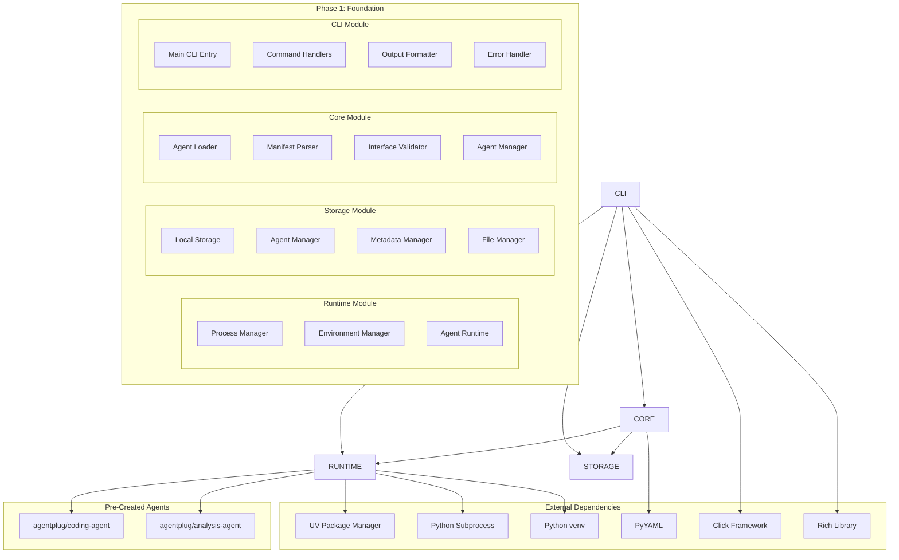

# Phase 1: Foundation

**Document Type**: Phase 1 Implementation Overview  
**Phase**: 1 - Foundation  
**Author**: William  
**Date Created**: 2025-06-28  
**Last Updated**: 2025-06-28  
**Status**: Active  
**Purpose**: Build core runtime system that can execute pre-created agentplug agents  

## 🎯 **Phase 1 Overview**

Phase 1 is the **foundation phase** that builds the core runtime system capable of executing pre-created `agentplug` agents. This phase establishes the fundamental architecture that all subsequent phases build upon.

### **Phase Goal**
Build a working system where developers can:
1. **Execute** pre-created `agentplug` agents
2. **Test** agent functionality through CLI
3. **Validate** agent interfaces and behavior
4. **Build** foundation for Phase 2 auto-installation

### **Success Criteria**
- ✅ Can execute `agentplug/coding-agent` successfully
- ✅ Can execute `agentplug/analysis-agent` successfully
- ✅ Basic agent runtime working
- ✅ Local storage system working
- ✅ Foundation ready for Phase 2

## 🏗️ **Phase 1 Architecture**



## 📋 **Module Responsibilities**

### **Runtime Module** 🚀
- **Process Isolation**: Execute agents in isolated subprocesses
- **Environment Management**: Create and manage virtual environments
- **Agent Execution**: Coordinate agent method calls and results
- **Error Management**: Handle execution errors and timeouts

### **Storage Module** 💾
- **Agent Storage**: Store and organize agentplug agents locally
- **Metadata Management**: Track agent information and installation details
- **File Organization**: Maintain organized directory structure
- **Data Persistence**: Ensure agent data survives system restarts

### **Core Module** 🧠
- **Agent Loading**: Load and validate agentplug agents from storage
- **Manifest Parsing**: Parse and validate agent manifests (agent.yaml)
- **Interface Management**: Provide consistent agent interface access
- **Validation**: Ensure agents meet Phase 1 requirements

### **CLI Module** 💻
- **Testing Interface**: Provide commands to test agent functionality
- **Agent Management**: List, inspect, and manage installed agents
- **Development Tools**: Help developers test and validate agents
- **User Feedback**: Provide clear output and error messages

## 🔗 **Module Dependencies**

### **Dependency Flow**
```
CLI Module → Core Module → Storage Module
     ↓           ↓           ↓
Runtime Module ← Core Module → Storage Module
```

### **External Dependencies**
- **UV Package Manager**: For fast virtual environment creation
- **Python 3.12+**: For subprocess and venv support
- **PyYAML**: For agent manifest parsing
- **Click**: For CLI framework
- **Rich**: For beautiful terminal output

## 📁 **Documentation Structure**

### **Module Documentation**
- **[Runtime Module](runtime/)** - Core execution engine
- **[Storage Module](storage/)** - Data persistence layer
- **[Core Module](core/)** - Central coordination layer
- **[CLI Module](cli/)** - User interaction layer

### **Each Module Contains**
- `README.md` - Module overview and navigation
- `01_interface_design.md` - Public interfaces and APIs
- `02_implementation_details.md` - Internal implementation
- `03_testing_strategy.md` - Testing approach and examples
- `04_success_criteria.md` - Success metrics and validation

## 🚀 **Implementation Approach**

### **0. Create Seed Agents (Prerequisite)**
- Create `agentplug/coding-agent` with working functionality
- Create `agentplug/analysis-agent` with working functionality
- Ensure agents have proper `agent.yaml` manifests
- Test agents work independently before integration

### **1. Start with Storage Module**
- Create `~/.agenthub/` directory structure
- Implement basic file operations
- Set up agent directory organization
- Test with seed agents

### **2. Build Runtime Module**
- Implement process management
- Create environment management
- Build agent execution coordination
- Test with seed agentplug agents

### **3. Develop Core Module**
- Implement agent loading
- Create manifest parsing
- Build interface validation
- Coordinate between modules

### **4. Create CLI Module**
- Build command structure
- Implement agent testing commands
- Create output formatting
- Test complete user workflow

## 🌱 **Seed Agent Creation**

### **Why Seed Agents Are Critical**
Phase 1 cannot succeed without working seed agents to test with. These agents serve as:
- **Test Data**: Real agents to validate the system
- **Reference Implementation**: Examples of proper agent structure
- **Validation Tools**: Working functionality to test against
- **Success Metrics**: Concrete examples of what "working" means

### **Required Seed Agents**

#### **1. agentplug/coding-agent**
- **Purpose**: Generate Python code based on prompts
- **Methods**: `generate_code(prompt)`, `explain_code(code)`
- **Dependencies**: Minimal (just standard library)
- **Functionality**: Actually generates working Python code

#### **2. agentplug/analysis-agent**
- **Purpose**: Analyze text and provide insights
- **Methods**: `analyze_text(text)`, `summarize_content(content)`
- **Dependencies**: Minimal (just standard library)
- **Functionality**: Actually provides meaningful analysis

### **Seed Agent Requirements**
- ✅ **Working Code**: Agents must function independently
- ✅ **Proper Manifests**: Valid `agent.yaml` files
- ✅ **Simple Dependencies**: Minimal external packages
- ✅ **Testable Methods**: Clear input/output contracts
- ✅ **Error Handling**: Graceful failure modes

## 🧪 **Testing Strategy**

### **Phase 1 Testing Goals**
1. **Seed Agent Validation**: Test agents work independently
2. **Unit Testing**: Test each module individually
3. **Integration Testing**: Test modules working together
4. **End-to-End Testing**: Test complete agent execution flow
5. **User Experience Testing**: Test CLI usability

### **Testing with Seed Agents**
- **coding-agent**: Test code generation functionality
- **analysis-agent**: Test analysis functionality
- **Error Scenarios**: Test error handling and recovery
- **Performance**: Test execution time and resource usage

## 📊 **Progress Tracking**

### **Current Status**: 🚧 In Progress
- [ ] Seed agents created and tested
- [ ] Storage Module complete
- [ ] Runtime Module complete
- [ ] Core Module complete
- [ ] CLI Module complete
- [ ] Module integration complete
- [ ] Phase 1 testing complete
- [ ] Phase 1 validation complete

### **Next Milestones**
1. **Week 0**: Create and test seed agents (agentplug/coding-agent, agentplug/analysis-agent)
2. **Week 1**: Complete Storage and Runtime modules
3. **Week 2**: Complete Core and CLI modules
4. **Week 2**: Integration testing and validation
5. **Week 2**: Phase 1 completion and Phase 2 preparation

## 🎯 **Phase 1 Deliverables**

### **Working System**
- ✅ Runtime system that can execute agentplug agents
- ✅ Storage system that organizes agent files
- ✅ Core system that loads and validates agents
- ✅ CLI system that provides testing interface

### **Testable Functionality**
- ✅ Can execute `agentplug/coding-agent` methods
- ✅ Can execute `agentplug/analysis-agent` methods
- ✅ Can list and inspect installed agents
- ✅ Can test agent functionality through CLI

### **Foundation for Phase 2**
- ✅ Runtime system ready for installation support
- ✅ Storage system ready for registry integration
- ✅ Core system ready for enhanced validation
- ✅ CLI system ready for installation commands

## 🔄 **Phase Evolution**

### **Phase 1 (Current)**
- Basic runtime execution
- Local storage management
- Simple agent loading
- Basic CLI interface

### **Phase 2 (Next)**
- Enhanced with auto-installation
- Registry integration
- Better dependency management
- Installation tracking

### **Phase 3 (Future)**
- Enhanced with SDK integration
- Method dispatching
- Performance optimization
- Advanced features

### **Phase 4 (Future)**
- Production-ready MVP
- Performance optimization
- Enhanced user experience
- Comprehensive testing

## 🚨 **Key Risks and Mitigation**

### **Risk 1: Runtime Complexity**
- **Risk**: Runtime module becomes too complex
- **Mitigation**: Start simple, add features incrementally
- **Fallback**: Use basic subprocess execution if needed

### **Risk 2: Storage Performance**
- **Risk**: Storage operations become slow
- **Mitigation**: Optimize file operations, use caching
- **Fallback**: Basic file system operations

### **Risk 3: Integration Issues**
- **Risk**: Modules don't work together properly
- **Mitigation**: Test integration early and often
- **Fallback**: Simplify interfaces if needed

### **Risk 4: agentplug Agent Issues**
- **Risk**: Pre-created agents don't work properly
- **Mitigation**: Create simple, working test agents
- **Fallback**: Use mock agents for testing

## 🎉 **Phase 1 Success Celebration**

### **What Success Looks Like**
- Developers can execute agentplug agents successfully
- CLI provides intuitive testing interface
- All modules work together seamlessly
- Foundation is solid for Phase 2

### **Success Metrics**
- ✅ 100% of agentplug agents execute successfully
- ✅ CLI commands work without errors
- ✅ Module integration is seamless
- ✅ Performance meets Phase 1 requirements

### **Next Steps After Success**
- Document Phase 1 learnings
- Plan Phase 2 implementation
- Prepare for auto-installation features
- Begin registry integration planning

Phase 1 establishes the **solid foundation** that enables the MVP vision. Success here means we have a working system that can execute agentplug agents reliably, setting the stage for the auto-installation capabilities in Phase 2.
