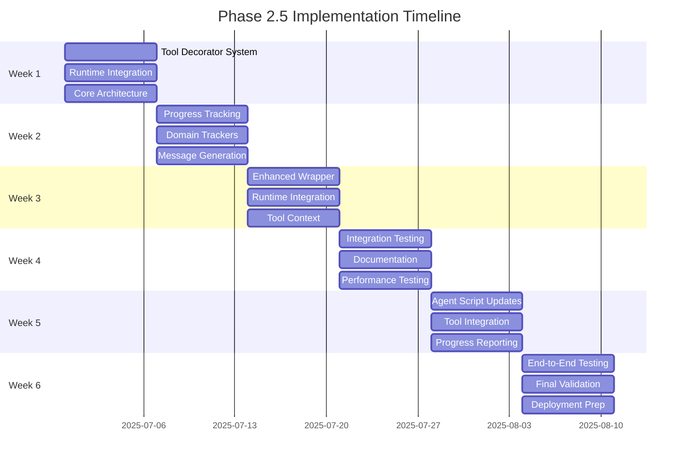

# Implementation Roadmap

**Document Type**: Phase 2.5 Implementation Plan
**Component**: Implementation Roadmap and Timeline
**Phase**: 2.5 - Semantic Progress and Tool Integration
**Author**: William
**Date Created**: 2025-06-28
**Last Updated**: 2025-06-28
**Status**: Active
**Purpose**: Comprehensive implementation plan for Phase 2.5 with detailed timeline and milestones

## 🎯 **Overview**

This document provides a detailed 6-week implementation roadmap for Phase 2.5: Semantic Progress and Tool Integration. The implementation follows an incremental approach, building upon the existing Phase 1 and Phase 2 foundations while maintaining backward compatibility and ensuring high quality.

## 🏗️ **Implementation Strategy**



## 📅 **Detailed Timeline**

### **Week 1: Tool Decorator System and Runtime Integration**
**Dates**: June 30 - July 6, 2025
**Focus**: Foundation and core architecture

#### **Day 1-2: Tool Decorator System**
- [ ] Design `@tool` decorator interface
- [ ] Implement `@register_tool` decorator
- [ ] Add tool metadata extraction
- [ ] Create tool validation system

**Deliverables**:
- `@tool` decorator implementation
- `@register_tool` decorator implementation
- Tool metadata extraction system
- Basic tool validation

**Success Criteria**:
- Decorators can register tools correctly
- Tool metadata is extracted accurately
- Tool validation prevents unsafe tools
- Basic categorization works

#### **Day 3-4: Tool Registration System**
- [ ] Design explicit tool registration system
- [ ] Implement tool registration interface
- [ ] Add tool registration coordination
- [ ] Create tool assignment management

**Deliverables**:
- Tool registration system
- Tool registration interface
- Tool assignment management
- Tool registration coordination

**Success Criteria**:
- Tools are explicitly registered by users
- Tool registration interface works correctly
- Tool assignment management is reliable
- Registration coordination is seamless

#### **Day 5-7: Core Architecture**
- [ ] Design overall system architecture
- [ ] Implement core interfaces
- [ ] Create integration points
- [ ] Basic testing framework

**Deliverables**:
- System architecture design
- Core interfaces implementation
- Basic testing framework

**Success Criteria**:
- Architecture is well-defined
- Interfaces are consistent
- Basic tests pass

### **Week 2: Semantic Progress Tracking System**
**Dates**: July 7 - July 13, 2025
**Focus**: Progress tracking and user experience

#### **Day 1-2: Task Phase Management**
- [ ] Implement `TaskPhase` enum
- [ ] Create `TaskPhaseManager` class
- [ ] Add phase transition logic
- [ ] Implement progress tracking

**Deliverables**:
- `TaskPhase` enum with all phases
- `TaskPhaseManager` implementation
- Phase transition logic
- Basic progress tracking

**Success Criteria**:
- All task phases are defined
- Phase transitions work correctly
- Progress tracking is accurate

#### **Day 3-4: Domain-Specific Trackers**
- [ ] Implement `DomainTracker` base class
- [ ] Create `ScientificTracker` for research analysis
- [ ] Create `CodingTracker` for code generation
- [ ] Create `GeneralTracker` for general tasks

**Deliverables**:
- `DomainTracker` base class
- Scientific analysis tracker
- Coding task tracker
- General purpose tracker

**Success Criteria**:
- Domain trackers provide meaningful progress
- Progress messages are domain-appropriate
- Trackers can be extended easily

#### **Day 5-7: Progress Message Generation**
- [ ] Implement `ProgressMessageGenerator`
- [ ] Add emoji and formatting support
- [ ] Create message templates
- [ ] Add progress bar generation

**Deliverables**:
- Progress message generator
- Emoji and formatting support
- Message templates
- Progress bar generation

**Success Criteria**:
- Progress messages are human-readable
- Emojis enhance readability
- Templates provide consistency

### **Week 3: Enhanced Agent Wrapper and Runtime**
**Dates**: July 14 - July 20, 2025
**Focus**: Integration and coordination

#### **Day 1-2: Enhanced Agent Wrapper**
- [ ] Extend existing `AgentWrapper` class
- [ ] Add tool access capabilities
- [ ] Implement progress tracking integration
- [ ] Maintain backward compatibility

**Deliverables**:
- Enhanced `AgentWrapper` class
- Tool access capabilities
- Progress tracking integration
- Backward compatibility validation

**Success Criteria**:
- Existing agents work without changes
- New features are opt-in
- Tool access works seamlessly

#### **Day 3-4: Runtime Integration**
- [ ] Enhance existing `AgentRuntime` class
- [ ] Add tool assignment and access
- [ ] Implement progress coordination
- [ ] Add enhanced process management

**Deliverables**:
- Enhanced `AgentRuntime` class
- Tool assignment and access system
- Progress coordination
- Enhanced process management

**Success Criteria**:
- Runtime supports tool assignment and access
- Tool assignment works reliably
- Progress coordination is seamless

#### **Day 5-7: Tool Assignment Management**
- [ ] Implement `ToolAssignmentManager`
- [ ] Add tool assignment validation
- [ ] Create tool access mechanisms
- [ ] Add assignment cleanup

**Deliverables**:
- Tool assignment manager
- Tool assignment validation
- Tool access mechanisms
- Assignment cleanup

**Success Criteria**:
- Tool assignments are properly managed
- Tool access is validated
- Assignment cleanup is reliable

### **Week 4: Integration Testing and Documentation**
**Dates**: July 21 - July 27, 2025
**Focus**: Testing, validation, and documentation

#### **Day 1-2: Integration Testing**
- [ ] Test tool registry integration
- [ ] Validate progress tracking coordination
- [ ] Test enhanced wrapper functionality
- [ ] Validate runtime integration

**Deliverables**:
- Integration test suite
- Test results and validation
- Bug fixes and improvements
- Performance benchmarks

**Success Criteria**:
- All integration tests pass
- Components work together seamlessly
- Performance meets requirements

#### **Day 3-4: Documentation Updates**
- [ ] Update API documentation
- [ ] Create usage examples
- [ ] Write integration guides
- [ ] Update user documentation

**Deliverables**:
- Updated API documentation
- Comprehensive usage examples
- Integration guides
- Updated user documentation

**Success Criteria**:
- Documentation is comprehensive
- Examples are clear and working
- Guides are easy to follow

#### **Day 5-7: Performance Testing**
- [ ] Benchmark tool integration performance
- [ ] Test progress tracking overhead
- [ ] Validate memory usage
- [ ] Optimize critical paths

**Deliverables**:
- Performance benchmarks
- Optimization recommendations
- Memory usage analysis
- Performance improvements

**Success Criteria**:
- Performance impact is minimal
- Memory usage is reasonable
- Critical paths are optimized

### **Week 5: Agent Script Updates and Tool Integration**
**Dates**: July 28 - August 3, 2025
**Focus**: Real-world usage and validation

#### **Day 1-2: Agent Script Updates**
- [ ] Update existing agent scripts
- [ ] Add tool usage examples
- [ ] Implement progress reporting
- [ ] Add error handling

**Deliverables**:
- Updated agent scripts
- Tool usage examples
- Progress reporting implementation
- Enhanced error handling

**Success Criteria**:
- Agent scripts use new capabilities
- Tool usage examples work
- Progress reporting is meaningful

#### **Day 3-4: Tool Integration Patterns**
- [ ] Implement common tool usage patterns
- [ ] Create tool selection strategies
- [ ] Add tool composition examples
- [ ] Implement tool fallbacks

**Deliverables**:
- Common tool usage patterns
- Tool selection strategies
- Tool composition examples
- Tool fallback mechanisms

**Success Criteria**:
- Tool usage patterns are clear
- Selection strategies work well
- Composition examples are useful

#### **Day 5-7: Progress Reporting Integration**
- [ ] Integrate progress tracking with tools
- [ ] Add real-time progress updates
- [ ] Implement progress logging
- [ ] Add progress analytics

**Deliverables**:
- Progress tracking integration
- Real-time progress updates
- Progress logging system
- Progress analytics

**Success Criteria**:
- Progress tracking works with tools
- Updates are real-time
- Logging is comprehensive

### **Week 6: Comprehensive Testing and Validation**
**Dates**: August 4 - August 10, 2025
**Focus**: Final validation and deployment preparation

#### **Day 1-2: End-to-End Testing**
- [ ] Complete end-to-end workflow testing
- [ ] Test all integration points
- [ ] Validate user experience
- [ ] Test error scenarios

**Deliverables**:
- End-to-end test results
- Integration validation
- User experience validation
- Error scenario testing

**Success Criteria**:
- All workflows work correctly
- Integration is robust
- User experience is excellent

#### **Day 3-4: Final Validation**
- [ ] Validate all success criteria
- [ ] Performance final validation
- [ ] Security review
- [ ] Backward compatibility validation

**Deliverables**:
- Success criteria validation
- Final performance metrics
- Security review report
- Backward compatibility report

**Success Criteria**:
- All success criteria are met
- Performance meets requirements
- Security is validated
- Backward compatibility is confirmed

#### **Day 5-7: Deployment Preparation**
- [ ] Prepare deployment packages
- [ ] Create migration guides
- [ ] Final documentation review
- [ ] Deployment testing

**Deliverables**:
- Deployment packages
- Migration guides
- Final documentation
- Deployment validation

**Success Criteria**:
- Deployment packages are ready
- Migration guides are clear
- Documentation is complete
- Deployment process works

## 🎯 **Success Criteria by Week**

### **Week 1 Success Criteria**
- [ ] Tool registry system is functional
- [ ] Tool-enabled base classes are implemented
- [ ] Core architecture is well-defined
- [ ] Basic testing framework is in place

### **Week 2 Success Criteria**
- [ ] Task phase management works correctly
- [ ] Domain-specific trackers provide meaningful progress
- [ ] Progress message generation is human-readable
- [ ] Progress tracking is accurate and reliable

### **Week 3 Success Criteria**
- [ ] Enhanced agent wrapper extends existing functionality
- [ ] Runtime integration supports tool context
- [ ] Tool context injection works reliably
- [ ] Backward compatibility is maintained

### **Week 4 Success Criteria**
- [ ] All integration tests pass
- [ ] Documentation is comprehensive and clear
- [ ] Performance meets requirements
- [ ] System is stable and reliable

### **Week 5 Success Criteria**
- [ ] Agent scripts use new capabilities effectively
- [ ] Tool integration patterns are clear and useful
- [ ] Progress reporting provides meaningful updates
- [ ] Real-world usage scenarios work correctly

### **Week 6 Success Criteria**
- [ ] All end-to-end tests pass
- [ ] All success criteria are met
- [ ] System is ready for deployment
- [ ] User experience is excellent

## 🔧 **Technical Implementation Details**

### **File Structure**
```
agenthub/agentmanager/
├── core/
│   ├── __init__.py
│   ├── agent_wrapper.py          # Enhanced wrapper
│   ├── tool_registry.py          # NEW: Tool registry
│   ├── tool_enabled_agent.py     # NEW: Base classes
│   └── semantic_progress.py      # NEW: Progress tracking
├── runtime/
│   ├── __init__.py
│   ├── agent_runtime.py          # Enhanced runtime
│   ├── process_manager.py        # Enhanced process manager
│   ├── environment_manager.py    # Enhanced environment manager
│   └── tool_context.py           # NEW: Tool context management
└── utils/
    ├── __init__.py
    ├── progress_trackers/        # NEW: Domain-specific trackers
    │   ├── __init__.py
    │   ├── base_tracker.py
    │   ├── scientific_tracker.py
    │   ├── coding_tracker.py
    │   └── general_tracker.py
    └── tool_utils.py             # NEW: Tool utility functions
```

### **Key Classes and Interfaces**
```python
# Core Components
class ToolDecorator:          # Base decorator class (@tool, @register_tool)
class RuntimeToolDiscovery:   # Discovers tools during code execution
class ToolServiceHost:        # Automatically hosts tools as services
class SemanticProgressTracker: # Progress tracking
class TaskPhaseManager:       # Task phase management

# Enhanced Components
class EnhancedAgentWrapper:   # Enhanced agent wrapper
class EnhancedAgentRuntime:   # Enhanced runtime
class EnhancedProcessManager: # Enhanced process manager
class ToolContextInjector:    # Tool context injection

# Progress Tracking
class DomainTracker:          # Base domain tracker
class ScientificTracker:      # Scientific analysis tracker
class CodingTracker:          # Coding task tracker
class ProgressMessageGenerator: # Progress message generation
```

### **Configuration and Environment**
```python
# Environment Variables
AGENT_TOOL_CONTEXT          # Tool context JSON
AGENT_TOOL_COUNT           # Number of available tools
AGENT_TYPE                 # Agent type for domain-specific tracking
AGENT_EXECUTION_MODE       # Execution mode (enhanced/standard)
AGENT_TOOL_INTEGRATION     # Tool integration status

# Configuration Files
tool_registry.yaml         # Tool registry configuration
progress_tracking.yaml     # Progress tracking configuration
domain_trackers.yaml       # Domain tracker configuration
```

## 🧪 **Testing Strategy**

### **Testing Levels**
1. **Unit Tests**: Individual component testing
2. **Integration Tests**: Component interaction testing
3. **End-to-End Tests**: Complete workflow testing
4. **Performance Tests**: Performance and scalability testing
5. **User Experience Tests**: Usability and accessibility testing

### **Testing Tools**
- **pytest**: Unit and integration testing
- **pytest-cov**: Code coverage analysis
- **pytest-benchmark**: Performance benchmarking
- **pytest-mock**: Mocking and stubbing
- **tox**: Multi-environment testing

### **Test Coverage Goals**
- **Unit Tests**: 90%+ coverage
- **Integration Tests**: 85%+ coverage
- **End-to-End Tests**: 100% of critical workflows
- **Performance Tests**: All performance requirements met

## 📊 **Performance Requirements**

### **Performance Targets**
- **Tool Integration Overhead**: <5% increase in execution time
- **Progress Tracking Overhead**: <2% increase in execution time
- **Memory Usage**: <10% increase in memory consumption
- **Startup Time**: <10% increase in startup time

### **Scalability Requirements**
- **Tool Registry**: Support 1000+ tools without performance degradation
- **Progress Tracking**: Handle 100+ concurrent agent executions
- **Context Injection**: Support complex tool contexts (1MB+ JSON)
- **Memory Management**: Efficient cleanup and garbage collection

## 🔒 **Security Considerations**

### **Security Requirements**
- **Tool Validation**: Prevent execution of unsafe tools
- **Context Isolation**: Isolate tool contexts between agents
- **Input Validation**: Validate all tool inputs and parameters
- **Access Control**: Control tool access based on agent permissions

### **Security Measures**
- **Sandboxing**: Execute tools in isolated environments
- **Input Sanitization**: Sanitize all inputs and parameters
- **Permission Checking**: Verify tool access permissions
- **Audit Logging**: Log all tool usage and access attempts

## 🚀 **Deployment Strategy**

### **Deployment Phases**
1. **Phase 1**: Deploy to development environment
2. **Phase 2**: Deploy to staging environment
3. **Phase 3**: Deploy to production environment
4. **Phase 4**: Monitor and validate production deployment

### **Rollback Plan**
- **Immediate Rollback**: Revert to previous version if critical issues
- **Gradual Rollback**: Disable new features while maintaining stability
- **Data Migration**: Ensure data consistency during rollback

### **Monitoring and Alerting**
- **Performance Monitoring**: Track system performance metrics
- **Error Monitoring**: Monitor error rates and types
- **User Experience Monitoring**: Track user satisfaction metrics
- **Resource Monitoring**: Monitor system resource usage

## 📈 **Success Metrics**

### **Technical Metrics**
- [ ] All tests pass (100% success rate)
- [ ] Performance requirements met (<5% overhead)
- [ ] Code coverage targets achieved (90%+ unit, 85%+ integration)
- [ ] Security requirements satisfied (no vulnerabilities)

### **User Experience Metrics**
- [ ] Tool integration works seamlessly (95%+ success rate)
- [ ] Progress tracking provides meaningful updates (90%+ satisfaction)
- [ ] Backward compatibility maintained (100% compatibility)
- [ ] User adoption of new features (80%+ adoption rate)

### **Business Metrics**
- [ ] Development time reduction (20%+ improvement)
- [ ] User productivity increase (15%+ improvement)
- [ ] System reliability improvement (99.9%+ uptime)
- [ ] User satisfaction improvement (90%+ satisfaction rate)

## 🔮 **Future Enhancements**

### **Phase 3 Integration**
- **SDK Integration**: Integrate with Phase 3 SDK capabilities
- **Advanced Tool Orchestration**: Automatic tool workflow creation
- **Tool Performance Optimization**: AI-driven tool selection optimization

### **Long-term Roadmap**
- **Tool Marketplace**: Discover and install tools from repositories
- **Tool Composition**: Combine multiple tools into workflows
- **Tool Versioning**: Support for multiple tool versions
- **Advanced Analytics**: Comprehensive tool usage analytics

## 📝 **Conclusion**

This implementation roadmap provides a comprehensive 6-week plan for Phase 2.5: Semantic Progress and Tool Integration. The incremental approach ensures high quality while maintaining backward compatibility and meeting all success criteria.

**Key Success Factors**:
1. **Incremental Development**: Build and test components incrementally
2. **Comprehensive Testing**: Ensure quality at every stage
3. **Backward Compatibility**: Maintain existing functionality
4. **User Experience Focus**: Prioritize user satisfaction
5. **Performance Optimization**: Meet performance requirements
6. **Security First**: Implement robust security measures

**Expected Outcomes**:
- Agents can autonomously use external tools
- Progress tracking provides meaningful, human-readable updates
- System maintains full backward compatibility
- User experience is significantly improved
- Foundation is ready for Phase 3 development

The implementation will transform Agent Hub from a basic agent execution system into a sophisticated platform with intelligent tool integration and transparent progress tracking, significantly enhancing user experience and agent capabilities.
