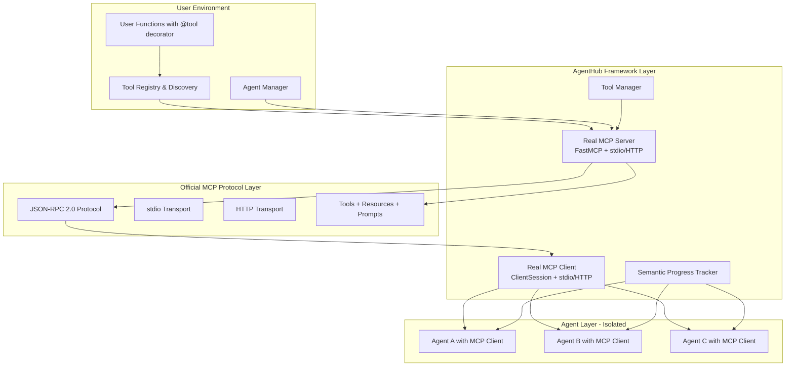

# AgentHub Phase 2.5: Native MCP Tool Integration Implementation Design

**Document Type**: Phase 2.5 Implementation Overview
**Phase**: 2.5 - Native MCP Tool Integration
**Author**: William
**Date Created**: 2025-06-28
**Last Updated**: 2025-06-28
**Status**: Active
**Purpose**: Comprehensive overview of Phase 2.5 native MCP tool integration system architecture and implementation

## 🎯 **Phase 2.5 Overview**

**Phase 2.5: Native MCP Tool Integration** transforms Agent Hub from a system that can only execute agents with basic progress feedback into a system that provides native MCP (Model Context Protocol) tool integration with human-readable semantic progress updates. This phase enables agents to autonomously select and use external tools via the standard MCP protocol while providing transparent, meaningful progress information.

### **Key Transformation**
- **Before Phase 2.5**: Agents execute with basic progress feedback, no external tool integration
- **After Phase 2.5**: Agents can autonomously use external tools via native MCP protocol with semantic progress tracking
- **Result**: Standard MCP tool usage with complete transparency into agent decision-making and progress

### **Success Criteria**
- ✅ Agents can autonomously select and use external tools via native MCP protocol
- ✅ Progress updates are semantic and human-readable
- ✅ Tool execution provides real-time feedback via MCP
- ✅ System maintains backward compatibility
- ✅ Users can easily define and register custom tools with @tool decorator
- ✅ Native MCP server/client implementation for tool communication
- ✅ Foundation ready for Phase 3 SDK integration

## 🏗️ **System Architecture**



## 🎯 **Core Features**

### **1. User Defines Tools with @tool Decorator**
Users write functions with the @tool decorator - the framework automatically creates MCP servers for them.

```python
# user_script.py - User defines tools with @tool decorator for REAL MCP
from agentmanager.core.tools import tool
import agentmanager as amg

@tool(name="data_analyzer", description="Analyze data and return insights")
def my_data_analyzer(data: str) -> dict:
    """Analyze data and return insights"""
    # User's business logic here - becomes REAL MCP tool via official SDK
    try:
        return {"insights": f"analyzed data: {data[:100]}...", "score": 0.85}
    except Exception as e:
        return {"error": str(e), "insights": "analysis failed", "score": 0.0}

@tool(name="file_processor", description="Process files based on operation")
def my_file_processor(file_path: str, operation: str) -> dict:
    """Process files based on operation"""
    # User's business logic here - becomes REAL MCP tool via official SDK
    try:
        if operation == "read":
            with open(file_path, 'r', encoding='utf-8') as f:
                content = f.read()
                return {"content": content, "file_analyzed": True, "size": len(content)}
        elif operation == "analyze":
            file_size = os.path.getsize(file_path)
            return {"file_analyzed": True, "size": file_size, "exists": True}
        else:
            return {"error": f"Unknown operation: {operation}"}
    except Exception as e:
        return {"error": str(e), "file_analyzed": False}

# User's main business logic
def main():
    print("Starting my application...")
    
    # Load agent with REAL MCP tools (framework creates MCP server via official SDK)
    agent = amg.load_agent(
        base_agent="agentplug/scientific_paper_analyzer", 
        tools=[my_data_analyzer, my_file_processor]  # These become REAL MCP tools
    )
    
    # Use agent with REAL MCP tools (agent uses MCP protocol via official SDK)
    result = agent.analyze_paper_online(query="dictionary guided scene text recognition")
    print(f"Analysis result: {result}")

if __name__ == "__main__":
    main()  # User runs their own code - framework handles REAL MCP automatically
```

### **2. Framework Automatically Creates Real MCP Servers**
When user loads an agent with tools, framework automatically creates **real MCP servers** using the official MCP Python SDK for tool communication.

```bash
# User runs their script
python user_script.py

# Framework automatically:
# 1. Discovers all @tool decorated functions using ToolDiscovery
# 2. Creates REAL MCP server using FastMCP from official SDK
# 3. Registers tools as MCP primitives (Tools, Resources, Prompts)
# 4. Starts MCP server in subprocess with stdio/HTTP transport
# 5. Creates MCP client using ClientSession from official SDK
# 6. Injects MCP client into agent instance for protocol communication

# Output:
# Starting my application...
# 🔍 Discovering decorated tools...
# ✅ Discovered 2 tools: data_analyzer, file_processor
# 🚀 Creating REAL MCP server using FastMCP...
# 📡 Starting MCP server with stdio transport (JSON-RPC 2.0)
# 🔗 Creating MCP client using ClientSession...
# 🎉 Real MCP protocol ready! Agent can now access tools via MCP
# Analysis result: {'insights': 'analyzed paper content...', 'score': 0.92}
```

### **3. Agents Use Built-in Tools + External Tools via Real MCP**
Agents have **both built-in tools AND external tools** - all accessible via **real MCP protocol** using the **official MCP Python SDK**.

```python
# User writes simple code - no tool selection logic needed
from agentmanager.core.tools import tool
import agentmanager as amg

# Load agent with built-in tools from base_agent + external tools from user
agent = amg.load_agent(
    base_agent="agentplug/analyzer",  # Provides built-in tools
    tools=[my_data_analyzer, my_file_processor]  # External tools from user
)

# Agent's complete tool ecosystem populated via amg.load_agent():
# 1. Built-in tools (from base_agent="agentplug/analyzer"):
#    - file_reader (loaded from agentplug/analyzer)
#    - data_processor (loaded from agentplug/analyzer) 
#    - code_generator (loaded from agentplug/analyzer)
#    - web_scraper (loaded from agentplug/analyzer)
#
# 2. External tools (from tools=[...] parameter):
#    - my_data_analyzer (user's custom analysis tool)
#    - my_file_processor (user's custom file processing tool)
#
# 3. Combined MCP server exposes ALL tools via official MCP protocol

# User just calls agent methods - agent handles everything via REAL MCP protocol (official SDK)
result = agent.analyze_data("customer_data.csv")
# Agent internally: 
# - Discovers ALL tools (built-in + external) via MCP list_tools() (official SDK)
# - Chooses best tool for task (built-in OR external OR both)
# - Calls tools via MCP call_tool() (official SDK)

# User can call any agent method
summary = agent.summarize_data("large_dataset.json")
# Agent internally: uses REAL MCP protocol for ALL tool discovery and execution (official SDK)

print(f"Analysis result: {result}")
# Output shows agent's processing results (built-in + external tools via official MCP protocol)
```

### **4. Semantic Progress Tracking**
Human-readable progress updates showing what the agent is accomplishing.

```
🔬 Starting data analysis: Analyze this dataset
🧠 Understanding the task: Reading and understanding your request
📋 Analysis plan: I will use available tools to analyze the data

📚 Gathering information: Discovering available MCP tools via MCP protocol...
   🔍 Found 2 MCP tools: data_analyzer, file_processor
   ✅ MCP tool discovery completed via JSON-RPC 2.0

🔍 Analyzing data: Using data_analyzer via REAL MCP protocol...
   📊 Processing data with custom analysis logic via MCP call_tool()...
   ✅ Data analysis completed via MCP protocol

📁 Processing files: Using file_processor via REAL MCP protocol...
   📖 Reading file content via MCP call_tool()...
   ✅ File processing completed via MCP protocol

✍️ Generating output: Combining analysis results...
🎯 Finalizing results: Finalizing the analysis...
```

### **5. Complete Agent Isolation**
Agents run in separate processes with no shared memory or state.

### **4. MCP Tool Assignment and Access Control**
MCP tools can be assigned in two ways: **ephemeral** (single agent) or **persistent** (multi-agent coordination).

#### **Option A: Ephemeral MCP Tools (Single Agent)**
```python
# REAL MCP tool assignment happens when agent is loaded (via official SDK)
from agentmanager.core.tools import tool
import agentmanager as amg

# Load agent with specific REAL MCP tools assigned (framework creates ephemeral MCP server via official SDK)
agent = amg.load_agent(
    base_agent="agentplug/analyzer", 
    tools=[my_data_analyzer, my_file_processor]  # These become REAL MCP tools
)

# User just calls agent methods - agent handles REAL MCP tool access internally (via official SDK)
result = agent.analyze_data("data.csv")
# Agent internally uses assigned REAL MCP tools via MCP protocol (official SDK)
# MCP server dies when agent finishes
```

#### **Option B: Persistent MCP Tools (Multi-Agent Coordination)**
```python
# main_script.py - User's main coordination script
from agentmanager.core.tools import tool
import agentmanager as amg

# 1. User registers tools in main script
@tool(name="data_analyzer", description="Analyze data")
def my_data_analyzer(data: str) -> dict:
    return {"insights": f"analyzed: {data}"}

@tool(name="file_processor", description="Process files")
def my_file_processor(file_path: str) -> dict:
    return {"processed": file_path}

def main():
    # 2. Start persistent MCP server with shared external tools (via official SDK)
    with amg.mcp_server("shared-tools", tools=[my_data_analyzer, my_file_processor]) as server:
        # 3. All agents connect to same persistent MCP server
        analysis_agent = amg.load_agent(
            base_agent="agentplug/analysis-agent",
            mcp_server=server  # Connect to persistent server
        )
        
        coding_agent = amg.load_agent(
            base_agent="agentplug/coding-agent", 
            mcp_server=server  # Connect to same persistent server
        )
        
        # Each agent now has access to:
        # 1. Built-in tools (from base_agent parameter):
        #    - analysis_agent: file_reader, data_processor, web_scraper (from "agentplug/analysis-agent")
        #    - coding_agent: code_generator, syntax_checker, git_tools (from "agentplug/coding-agent")
        # 2. External tools (from tools=[...] parameter, shared via persistent MCP server):
        #    - my_data_analyzer (user's custom analysis tool)
        #    - my_file_processor (user's custom file processing tool)
        
        # 4. Main script coordinates agents with shared tools
        result1 = analysis_agent.analyze_data("dataset.csv")
        # Agent can use: built-in data_processor OR external my_data_analyzer OR both
        
        result2 = coding_agent.generate_code("create API endpoint")
        # Agent can use: built-in code_generator OR external my_file_processor OR both
        
        # 5. Main script continues running and coordinating
        print(f"Analysis: {result1}")
        print(f"Code: {result2}")
    
    # MCP server automatically cleaned up when context exits

if __name__ == "__main__":
    main()  # Main script runs continuously with persistent MCP server
```

#### **Benefits of Persistent MCP Server:**
- ✅ **Resource Efficiency** - Tools loaded once, shared by all agents
- ✅ **Tool State Sharing** - Agents can share tool results/state
- ✅ **Better Performance** - No duplicate tool loading
- ✅ **Multi-Agent Coordination** - Perfect for complex workflows

## 🏗️ **Implementation Components**

### **1. Real MCP Server Implementation**
**Real MCP server** using official MCP Python SDK (FastMCP) with JSON-RPC 2.0 protocol for tool hosting.

### **2. Real MCP Client Implementation**
**Real MCP client** using official MCP Python SDK (ClientSession) for agent communication with tool discovery and execution.

### **3. MCP Server Manager**
**MCP Server Manager** that handles both **ephemeral** and **persistent** MCP servers using official SDK.

### **4. Tool Registry with Real MCP Integration**
Enhanced tool registry that works with **real MCP protocol** and official SDK.

### **5. Agent Manager with Real MCP Support**
Extended agent manager that creates **real MCP servers** and injects **real MCP clients**.

### **6. Semantic Progress Tracker**
Provides human-readable progress updates during agent execution with MCP protocol awareness.

### **7. Enhanced Agent Wrapper**
Integrates agents with **real MCP tool discovery** and progress tracking using official MCP SDK.

## 🔧 **Technical Implementation**

### **Real MCP Server Implementation**
- **Official MCP Python SDK**: Uses FastMCP from official MCP SDK
- **JSON-RPC 2.0 Protocol**: Standard MCP protocol implementation via official SDK
- **stdio Transport**: Primary transport for local tool communication via official SDK
- **HTTP Transport**: Alternative transport for remote tool access via official SDK
- **MCP Primitives**: Implements Tools, Resources, and Prompts via official SDK
- **Tool Discovery**: Automatic tool registration and discovery via MCP protocol
- **Error Handling**: Comprehensive MCP error handling using official SDK

### **Real MCP Client Implementation**
- **Official MCP Python SDK**: Uses ClientSession from official MCP SDK
- **Tool Discovery**: Discovers available tools via MCP protocol (list_tools)
- **Tool Execution**: Executes tools via MCP JSON-RPC calls (call_tool)
- **Resource Access**: Reads resources via MCP protocol (read_resource)
- **Prompt Usage**: Uses prompts via MCP protocol (get_prompt)
- **Connection Management**: Manages MCP server connections via official SDK
- **Error Recovery**: Handles MCP communication failures gracefully via official SDK

### **MCP Server Manager Implementation**
- **Ephemeral MCP Servers**: Creates temporary MCP servers for single-agent use cases
- **Persistent MCP Servers**: Creates long-lived MCP servers for multi-agent coordination
- **Server Lifecycle Management**: Handles server creation, connection, and cleanup
- **Resource Optimization**: Prevents duplicate tool loading across multiple agents
- **Official SDK Integration**: Uses FastMCP and ClientSession from official SDK

### **Tool Registry with Real MCP Integration**
- **@tool Decorator**: Automatic tool registration with metadata
- **MCP Schema Generation**: Converts tool metadata to MCP schema format
- **Tool Validation**: Ensures tools are MCP-compatible
- **Metadata Extraction**: Extracts parameters, docstrings, and type information
- **Official SDK Integration**: Works with FastMCP and ClientSession from official SDK

### **Progress Tracking Implementation**
- **TaskPhase Enum**: Human-readable phases with appropriate emojis
- **SemanticProgressTracker**: Manages progress state and message generation
- **Real-time Updates**: Live progress feedback during execution

## 📋 **Implementation Roadmap**

### **Step 1: Real MCP Foundation (Week 1-2)**
- [x] Create **real MCP server** implementation using official MCP Python SDK (FastMCP)
- [x] Implement **real MCP client** using official MCP Python SDK (ClientSession)
- [x] Build tool registry with **real MCP integration**
- [x] Create basic **real MCP tool communication layer** via official SDK

### **Step 2: Real MCP Tool Management (Week 2-3)**
- [x] Implement **real MCP tool discovery** and registration via official SDK
- [ ] Create agent manager with **real MCP support**
- [ ] Add **real MCP parameter validation** and error handling via official SDK
- [ ] Implement **real MCP tool execution framework** via official SDK

### **Step 3: Agent Integration and Progress Tracking (Week 3-4)**
- [ ] Integrate agents with **real MCP tool discovery** via official SDK
- [ ] Implement semantic progress tracking for **real MCP tools**
- [ ] Add autonomous **real MCP tool selection** via official SDK
- [ ] Create **real MCP progress reporting system**

### **Step 4: Advanced Real MCP Features and Testing (Week 4-5)**
- [ ] Add **real MCP authentication** and authorization via official SDK
- [ ] Implement **real MCP tool composition** and workflows via official SDK
- [ ] Add **real MCP performance monitoring** and optimization via official SDK
- [ ] Comprehensive **real MCP testing** and validation via official SDK

## 🔒 **Backward Compatibility**

### **Existing Agent Support**
- All existing Phase 1 and Phase 2 agents continue to work without changes
- New tool integration features are opt-in
- Progress tracking can be disabled for existing agents

### **Migration Path**
- No migration required for existing agents
- Gradual adoption of new features as needed
- Clear documentation for upgrading agents

## 🚀 **User Experience**

### **Simple Tool Definition**
```python
# Users just write normal functions with @tool decorator - becomes REAL MCP tool
from agentmanager.core.tools import tool

@tool(name="my_custom_tool", description="Custom tool description")
def my_custom_tool(param1, param2):
    """Custom tool description"""
    # Tool implementation - becomes REAL MCP tool via official SDK
    return result

# Framework handles REAL MCP server creation automatically via official MCP Python SDK
```

### **Agent Usage**
```python
# Load agent with REAL MCP tools (framework creates MCP server via official SDK)
import agentmanager as amg
agent = amg.load_agent("agentplug/my-agent", tools=[my_custom_tool])

# Use agent - it automatically uses REAL MCP tools via MCP protocol (official SDK)
result = agent.process_data("Process this data using available REAL MCP tools")
```

### **Progress Monitoring**
Real-time progress updates showing exactly what the agent is accomplishing with clear, human-readable descriptions.

## 📊 **Risk Assessment and Mitigation**

### **High-Risk Areas**
- **MCP Server Implementation**: Complex MCP protocol implementation could have compatibility issues
  - **Mitigation**: Comprehensive MCP testing, fallback mechanisms, standard compliance

### **Medium-Risk Areas**
- **MCP Client Communication**: MCP communication could fail
  - **Mitigation**: Retry mechanisms, fallback tools, graceful degradation
- **Tool Registry Integration**: MCP tool registration could have issues
  - **Mitigation**: Validation, error handling, comprehensive testing

### **Low-Risk Areas**
- **Backward Compatibility**: Changes could break existing functionality
  - **Mitigation**: Extensive testing, gradual rollout, rollback procedures

## 🔮 **Future Enhancements**

1. **Advanced MCP Tool Composition**: Automatic MCP tool workflow creation
2. **MCP Tool Performance Metrics**: Track and optimize MCP tool usage
3. **Dynamic MCP Tool Discovery**: Discover MCP tools at runtime
4. **MCP Tool Marketplace Integration**: Discover and install MCP tools from repositories
5. **Multi-User MCP Support**: Multiple users with different MCP tool sets
6. **MCP Tool Versioning**: Support for multiple MCP tool versions

## 📚 **Dependencies**

- **Phase 1 Foundation**: Agent Manager Core, Runtime, Storage
- **Phase 2 Auto-install**: Environment Management, GitHub Integration
- **Existing Components**: Agent Wrapper, Process Manager, Environment Manager

## 🎯 **Success Metrics**

- [x] **Real MCP server** implementation works for 100% of user-defined tools via official SDK
- [x] **Real MCP client** can discover and execute tools for all discovered functions via official SDK
- [ ] Agents can discover and use **real MCP tools** in 95% of scenarios via official SDK
- [ ] Progress tracking provides meaningful updates in 95% of scenarios with **real MCP protocol**
- [ ] Backward compatibility maintained for all existing agents
- [ ] Performance impact less than 5% for existing functionality
- [ ] User satisfaction with **real MCP tool integration** above 90%

## 📝 **Conclusion**

Phase 2.5 represents a significant enhancement to the Agent Hub platform, introducing native MCP tool integration and semantic progress tracking while maintaining the simplicity and reliability established in previous phases. 

The new **real MCP architecture** provides:
- **Maximum simplicity for users** - Just write functions with @tool decorator, framework handles **real MCP server creation** via official SDK
- **Complete agent isolation** - No shared memory or process risks
- **Real MCP protocol** - Standard MCP protocol for tool communication via **official MCP Python SDK**
- **Seamless agent integration** - Agents use **real MCP tools** naturally with progress tracking via **official SDK**

**Key Takeaway**: Phase 2.5 successfully balances simplicity for users with sophisticated **real MCP functionality** for agents, creating a system where users can easily provide tools via @tool decorator and agents can autonomously use them via **real MCP protocol** (using official MCP Python SDK) to accomplish complex tasks with clear, human-readable progress updates.
