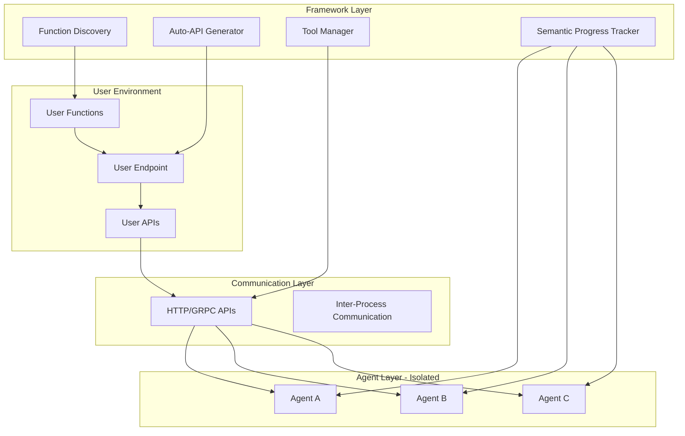

# AgentHub Phase 2.5: Semantic Progress and Tool Integration Implementation Design

**Document Type**: Phase 2.5 Implementation Overview
**Phase**: 2.5 - Semantic Progress and Tool Integration
**Author**: William
**Date Created**: 2025-06-28
**Last Updated**: 2025-06-28
**Status**: Active
**Purpose**: Comprehensive overview of Phase 2.5 semantic progress tracking and tool integration system architecture and implementation

## 🎯 **Phase 2.5 Overview**

**Phase 2.5: Semantic Progress and Tool Integration** transforms Agent Hub from a system that can only execute agents with basic progress feedback into a system that provides intelligent tool integration and human-readable semantic progress updates. This phase enables agents to autonomously select and use external tools while providing transparent, meaningful progress information.

### **Key Transformation**
- **Before Phase 2.5**: Agents execute with basic progress feedback, no external tool integration
- **After Phase 2.5**: Agents can autonomously use external tools with semantic progress tracking
- **Result**: Intelligent tool usage with complete transparency into agent decision-making and progress

### **Success Criteria**
- ✅ Agents can autonomously select and use external tools
- ✅ Progress updates are semantic and human-readable
- ✅ Tool execution provides real-time feedback
- ✅ System maintains backward compatibility
- ✅ Users can easily define and register custom tools
- ✅ Foundation ready for Phase 3 SDK integration

## 🏗️ **System Architecture**



## 🎯 **Core Features**

### **1. User Runs Their Own Code with Decorated Tools**
Users write and run their own code with decorated tools - the framework automatically hosts them as services.

```python
# user_script.py - User runs this script
import os
from typing import Dict, Any, Union
from agenthub.tools import tool, register_tool

@tool(name="data_analyzer", description="Analyze data and return insights")
def my_data_analyzer(data: Union[str, Dict[str, Any]]) -> Dict[str, Any]:
    """Analyze data and return insights"""
    # User's business logic here
    try:
        if isinstance(data, str):
            return {"insights": f"analyzed string data: {data[:100]}...", "score": 0.85}
        elif isinstance(data, dict):
            return {"insights": "analyzed dictionary data", "score": 0.85, "keys": list(data.keys())}
        else:
            return {"insights": "analyzed unknown data type", "score": 0.85}
    except Exception as e:
        return {"error": str(e), "insights": "analysis failed", "score": 0.0}

@tool(name="file_processor", description="Process files based on operation")
def my_file_processor(file_path: str, operation: str) -> Dict[str, Any]:
    """Process files based on operation"""
    try:
        if operation == "read":
            if not os.path.exists(file_path):
                return {"error": "File not found", "file_path": file_path}
            with open(file_path, 'r', encoding='utf-8') as f:
                content = f.read()
                return {"content": content, "file_analyzed": True, "size": len(content)}
        elif operation == "analyze":
            if not os.path.exists(file_path):
                return {"error": "File not found", "file_path": file_path}
            file_size = os.path.getsize(file_path)
            return {"file_analyzed": True, "size": file_size, "exists": True}
        else:
            return {"error": f"Unknown operation: {operation}", "supported_operations": ["read", "analyze"]}
    except Exception as e:
        return {"error": str(e), "file_analyzed": False}

# User's main business logic
def main():
    print("Starting my application...")
    # Framework automatically hosts decorated tools as services
    # User continues with their business logic
    print("Tools are now available as services!")
    
    # User can still call their functions directly
    result = my_data_analyzer("sample data")
    print(f"Direct call result: {result}")

if __name__ == "__main__":
    main()  # User runs their own code
```

### **2. Framework Automatically Hosts Tools as Services**
When user runs their code, framework automatically creates and hosts tool services.

```bash
# User runs their script
python user_script.py

# Framework automatically:
# 1. Discovers all @tool decorated functions
# 2. Creates HTTP/GRPC services for each tool
# 3. Hosts tools on localhost:8000/tools/
# 4. Registers tools with the agent system

# Output:
# Starting my application...
# 🔍 Discovering decorated tools...
# ✅ Discovered 2 tools: data_analyzer, file_processor
# 🚀 Creating tool services...
# 🌐 Hosting tools on http://localhost:8000/tools/
# 🎉 Tools ready! Agents can now access them via API
# Tools are now available as services!
# Direct call result: {'insights': 'analyzed string data: sample data...', 'score': 0.85}
```

### **3. Agents Use Both Built-in Capabilities AND Assigned Tools**
Agents can execute their own logic AND use assigned tools - all handled internally by the agent.

```python
# User writes simple code - no tool selection logic needed
import agentmanager as amg

# Load agent with assigned tools (framework handles tool assignment)
agent = amg.load_agent(base_agent="agentplug/analyzer", tools=["data_analyzer", "file_processor"])

# User just calls agent methods - agent handles everything internally
result = agent.analyze_data("customer_data.csv")
# Agent internally decides: use assigned tools OR built-in capabilities OR both

# User can call any agent method
summary = agent.summarize_data("large_dataset.json")
# Agent internally chooses the best approach

print(f"Analysis result: {result}")
# Output shows agent's processing results (built-in + assigned tools as needed)
```

### **4. Semantic Progress Tracking**
Human-readable progress updates showing what the agent is accomplishing.

```
🔬 Starting data analysis: Analyze this dataset
🧠 Understanding the task: Reading and understanding your request
📋 Analysis plan: I will use available tools to analyze the data

📚 Gathering information: Discovering available tools...
   🔍 Found 2 tools: my_data_analyzer, my_file_processor
   ✅ Tool discovery completed

🔍 Analyzing data: Using my_data_analyzer tool...
   📊 Processing data with custom analysis logic...
   ✅ Data analysis completed

📁 Processing files: Using my_file_processor tool...
   📖 Reading file content...
   ✅ File processing completed

✍️ Generating output: Combining analysis results...
🎯 Finalizing results: Finalizing the analysis...
```

### **5. Complete Agent Isolation**
Agents run in separate processes with no shared memory or state.

### **4. Tool Assignment and Access Control**
Tools are assigned directly when loading the agent - clean and intuitive.

```python
# Tool assignment happens when agent is loaded
import agentmanager as amg

# Load agent with specific tools assigned
agent = amg.load_agent(base_agent="agentplug/analyzer", tools=["data_analyzer", "file_processor"])

# User just calls agent methods - agent handles tool access internally
result = agent.analyze_data("data.csv")
# Agent internally uses assigned tools as needed

# Alternative: Load agent without tools (built-in capabilities only)
agent_basic = amg.load_agent(base_agent="agentplug/analyzer")
# This agent has no external tools, only built-in capabilities
result = agent_basic.analyze_data("data.csv")
# Agent uses only built-in logic

# Alternative: Load agent with different tool sets
coding_agent = amg.load_agent(base_agent="agentplug/coding-agent", tools=["code_analyzer", "git_tools"])
analysis_agent = amg.load_agent(base_agent="agentplug/analysis-agent", tools=["data_analyzer", "file_processor"])

# Each agent uses its assigned tools internally
code_result = coding_agent.analyze_code("project.py")
analysis_result = analysis_agent.process_data("dataset.csv")
```

## 🏗️ **Implementation Components**

### **1. Function Discovery System**
Automatically discovers user functions and extracts metadata.

### **2. Auto-API Generator**
Generates RESTful API endpoints for discovered functions.

### **3. Tool Manager**
Coordinates tool discovery and execution between agents and user endpoints.

### **4. Semantic Progress Tracker**
Provides human-readable progress updates during agent execution.

### **5. Enhanced Agent Wrapper**
Integrates agents with tool discovery and progress tracking.

## 🔧 **Technical Implementation**

### **Function Discovery**
- **Directory Scanning**: Automatically scans `user_tools/` directory
- **Function Analysis**: Extracts parameters, docstrings, and metadata
- **Dependency Detection**: Identifies required libraries and modules
- **Validation**: Ensures functions are callable and safe

### **Auto-API Generation**
- **Endpoint Creation**: Generates REST endpoints for each function
- **Parameter Validation**: Automatic parameter type checking and validation
- **Error Handling**: Comprehensive error handling and reporting
- **Documentation**: Auto-generates API documentation

### **Tool Communication**
- **HTTP/GRPC APIs**: Standard web protocols for tool communication
- **JSON Serialization**: Simple data exchange format
- **Authentication**: Optional authentication and authorization
- **Rate Limiting**: Configurable rate limiting for tool usage

### **Progress Tracking Implementation**
- **TaskPhase Enum**: Human-readable phases with appropriate emojis
- **SemanticProgressTracker**: Manages progress state and message generation
- **Real-time Updates**: Live progress feedback during execution

## 📋 **Implementation Roadmap**

### **Step 1: Function Discovery Foundation (Week 1-2)**
- [ ] Create function discovery system
- [ ] Implement function analysis and metadata extraction
- [ ] Build auto-API generation framework
- [ ] Create basic tool communication layer

### **Step 2: Auto-API and Tool Management (Week 2-3)**
- [ ] Implement auto-API generation
- [ ] Create tool manager for agent coordination
- [ ] Add parameter validation and error handling
- [ ] Implement tool discovery and registration

### **Step 3: Agent Integration and Progress Tracking (Week 3-4)**
- [ ] Integrate agents with tool discovery
- [ ] Implement semantic progress tracking
- [ ] Add autonomous tool selection
- [ ] Create progress reporting system

### **Step 4: Advanced Features and Testing (Week 4-5)**
- [ ] Add authentication and authorization
- [ ] Implement tool composition and workflows
- [ ] Add performance monitoring and optimization
- [ ] Comprehensive testing and validation

## 🔒 **Backward Compatibility**

### **Existing Agent Support**
- All existing Phase 1 and Phase 2 agents continue to work without changes
- New tool integration features are opt-in
- Progress tracking can be disabled for existing agents

### **Migration Path**
- No migration required for existing agents
- Gradual adoption of new features as needed
- Clear documentation for upgrading agents

## 🚀 **User Experience**

### **Simple Tool Definition**
```python
# Users just write normal functions
def my_custom_tool(param1, param2):
    """Custom tool description"""
    # Tool implementation
    return result

# Framework handles everything else automatically
```

### **Agent Usage**
```python
# Load agent with automatic tool discovery
agent = agentmanager.load_agent("agentplug/my-agent")

# Use agent - it automatically discovers and uses available tools
result = agent.process_data("Process this data using available tools")
```

### **Progress Monitoring**
Real-time progress updates showing exactly what the agent is accomplishing with clear, human-readable descriptions.

## 📊 **Risk Assessment and Mitigation**

### **High-Risk Areas**
- **Function Discovery**: Complex function analysis could miss dependencies
  - **Mitigation**: Comprehensive dependency analysis, fallback mechanisms

### **Medium-Risk Areas**
- **API Generation**: Auto-generated APIs could have security issues
  - **Mitigation**: Security validation, input sanitization, rate limiting
- **Tool Communication**: Network communication could fail
  - **Mitigation**: Retry mechanisms, fallback tools, graceful degradation

### **Low-Risk Areas**
- **Backward Compatibility**: Changes could break existing functionality
  - **Mitigation**: Extensive testing, gradual rollout, rollback procedures

## 🔮 **Future Enhancements**

1. **Advanced Tool Composition**: Automatic tool workflow creation
2. **Tool Performance Metrics**: Track and optimize tool usage
3. **Dynamic Tool Discovery**: Discover tools at runtime
4. **Tool Marketplace Integration**: Discover and install tools from repositories
5. **Multi-User Support**: Multiple users with different tool sets
6. **Tool Versioning**: Support for multiple tool versions

## 📚 **Dependencies**

- **Phase 1 Foundation**: Agent Manager Core, Runtime, Storage
- **Phase 2 Auto-install**: Environment Management, GitHub Integration
- **Existing Components**: Agent Wrapper, Process Manager, Environment Manager

## 🎯 **Success Metrics**

- [ ] Function discovery works for 100% of user-defined functions
- [ ] Auto-API generation creates working endpoints for all discovered functions
- [ ] Agents can discover and use tools in 95% of scenarios
- [ ] Progress tracking provides meaningful updates in 95% of scenarios
- [ ] Backward compatibility maintained for all existing agents
- [ ] Performance impact less than 5% for existing functionality
- [ ] User satisfaction with tool integration above 90%

## 📝 **Conclusion**

Phase 2.5 represents a significant enhancement to the Agent Hub platform, introducing intelligent tool integration and semantic progress tracking while maintaining the simplicity and reliability established in previous phases. 

The new user endpoint architecture provides:
- **Maximum simplicity for users** - Just write functions, framework handles everything
- **Complete agent isolation** - No shared memory or process risks
- **Automatic tool discovery** - Framework finds and exposes tools automatically
- **Seamless agent integration** - Agents use tools naturally with progress tracking

**Key Takeaway**: Phase 2.5 successfully balances simplicity for users with sophisticated functionality for agents, creating a system where users can easily provide tools and agents can autonomously use them to accomplish complex tasks with clear, human-readable progress updates.
