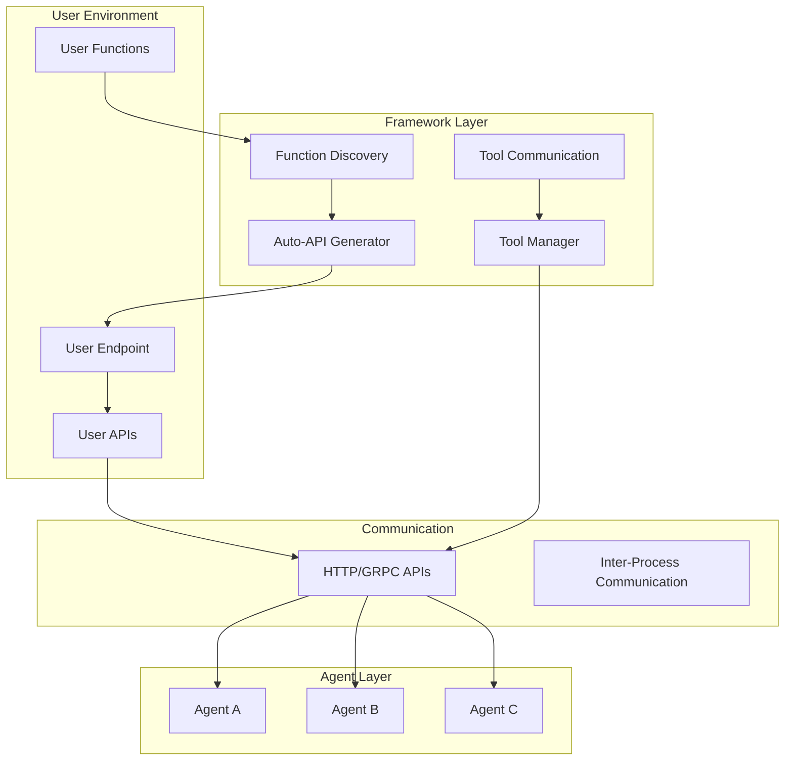

# User Endpoint Tool System Design

**Document Type**: Phase 2.5 Component Design
**Component**: User Endpoint Tool System
**Phase**: 2.5 - Semantic Progress and Tool Integration
**Author**: William
**Date Created**: 2025-06-28
**Last Updated**: 2025-06-28
**Status**: Active
**Purpose**: Design the user endpoint tool system for automatic function discovery and API generation

## 🎯 **Overview**

The User Endpoint Tool System provides automatic discovery of user-defined functions and generates API endpoints that agents can use to access these tools. This system eliminates the need for users to manually register tools or create APIs - they just write functions and the framework handles everything else.

## 🏗️ **Architecture**



## 🔧 **Core Components**

### **1. Function Discovery System**
Automatically scans user directories and discovers available functions.

```python
class FunctionDiscovery:
    """Automatically discovers user functions and extracts metadata."""
    
    def __init__(self, user_modules_path: str = "./user_tools"):
        self.user_modules_path = user_modules_path
        self.discovered_functions = {}
    
    def discover_functions(self):
        """Scan user_tools directory and discover all functions."""
        for file_path in Path(self.user_modules_path).glob("*.py"):
            if file_path.name.startswith("_"):
                continue  # Skip private files
            
            module_name = file_path.stem
            module = self._load_module(file_path)
            
            # Find all functions in module
            for name, obj in inspect.getmembers(module):
                if inspect.isfunction(obj) and not name.startswith("_"):
                    function_info = self._analyze_function(obj)
                    self.discovered_functions[name] = function_info
    
    def _analyze_function(self, func: callable) -> dict:
        """Analyze function and extract metadata."""
        signature = inspect.signature(func)
        
        # Extract parameter information
        parameters = {}
        for param_name, param in signature.parameters.items():
            if param_name == "self":
                continue
                
            param_info = {
                "type": str(param.annotation) if param.annotation != inspect.Parameter.empty else "any",
                "required": param.default == inspect.Parameter.empty,
                "default": param.default if param.default != inspect.Parameter.empty else None
            }
            parameters[param_name] = param_info
        
        return {
            "function": func,
            "name": func.__name__,
            "docstring": func.__doc__ or "",
            "parameters": parameters,
            "module": func.__module__,
            "file": inspect.getfile(func)
        }
```

### **2. Auto-API Generator**
Automatically generates RESTful API endpoints for discovered functions.

```python
class AutoAPIGenerator:
    """Automatically generates API endpoints for discovered functions."""
    
    def __init__(self, discovered_functions: dict):
        self.functions = discovered_functions
        self.app = Flask(__name__)
        self._generate_endpoints()
    
    def _generate_endpoints(self):
        """Generate API endpoints for all discovered functions."""
        
        @self.app.route('/tools', methods=['GET'])
        def list_tools():
            """List all available tools."""
            tools_info = []
            for name, func_info in self.functions.items():
                tools_info.append({
                    "name": name,
                    "description": func_info["docstring"],
                    "parameters": func_info["parameters"],
                    "module": func_info["module"]
                })
            return jsonify({"tools": tools_info})
        
        @self.app.route('/tools/<tool_name>/execute', methods=['POST'])
        def execute_tool(tool_name):
            """Execute a specific tool."""
            if tool_name not in self.functions:
                return jsonify({"success": False, "error": f"Tool {tool_name} not found"}), 404
            
            func_info = self.functions[tool_name]
            data = request.json
            
            try:
                # Validate parameters
                validated_params = self._validate_parameters(func_info, data)
                
                # Execute function
                result = func_info["function"](**validated_params)
                
                return jsonify({
                    "success": True,
                    "result": result,
                    "tool_name": tool_name
                })
                
            except Exception as e:
                return jsonify({
                    "success": False,
                    "error": str(e),
                    "tool_name": tool_name
                }), 500
    
    def _validate_parameters(self, func_info: dict, data: dict) -> dict:
        """Validate and prepare parameters for function execution."""
        validated = {}
        
        for param_name, param_info in func_info["parameters"].items():
            if param_name in data:
                validated[param_name] = data[param_name]
            elif param_info["required"]:
                raise ValueError(f"Required parameter '{param_name}' not provided")
            elif param_info["default"] is not None:
                validated[param_name] = param_info["default"]
        
        return validated
    
    def start_server(self, host: str = "0.0.0.0", port: int = 8000):
        """Start the auto-generated API server."""
        self.app.run(host=host, port=port)
```

### **3. Tool Manager**
Coordinates tool discovery and execution between agents and user endpoints.

```python
class ToolManager:
    """Manages tool discovery and execution coordination."""
    
    def __init__(self):
        self.user_endpoints = {}
        self.tool_cache = {}
    
    def register_user_endpoint(self, name: str, endpoint_url: str, auth_token: str = None):
        """Register a user endpoint."""
        self.user_endpoints[name] = {
            "url": endpoint_url,
            "auth_token": auth_token,
            "tools": {}
        }
        
        # Discover available tools
        self._discover_tools(name)
    
    def _discover_tools(self, endpoint_name: str):
        """Discover tools available at user endpoint."""
        endpoint = self.user_endpoints[endpoint_name]
        
        try:
            response = requests.get(f"{endpoint['url']}/tools")
            if response.status_code == 200:
                tools = response.json()["tools"]
                endpoint["tools"] = {tool["name"]: tool for tool in tools}
                
                # Cache tool information
                for tool_name, tool_info in endpoint["tools"].items():
                    cache_key = f"{endpoint_name}:{tool_name}"
                    self.tool_cache[cache_key] = {
                        "endpoint": endpoint_name,
                        "info": tool_info
                    }
                    
        except Exception as e:
            logger.warning(f"Failed to discover tools from {endpoint_name}: {e}")
    
    def execute_tool(self, tool_name: str, args: dict):
        """Execute tool through appropriate user endpoint."""
        # Find which endpoint has this tool
        for cache_key, tool_data in self.tool_cache.items():
            if tool_data["info"]["name"] == tool_name:
                endpoint_name = tool_data["endpoint"]
                endpoint = self.user_endpoints[endpoint_name]
                
                # Execute tool via user endpoint
                return self._execute_via_endpoint(endpoint, tool_name, args)
        
        raise ToolNotFoundError(f"Tool {tool_name} not found in any endpoint")
    
    def _execute_via_endpoint(self, endpoint: dict, tool_name: str, args: dict):
        """Execute tool via specific user endpoint."""
        url = f"{endpoint['url']}/tools/{tool_name}/execute"
        
        headers = {}
        if endpoint["auth_token"]:
            headers["Authorization"] = f"Bearer {endpoint['auth_token']}"
        
        response = requests.post(url, json=args, headers=headers)
        
        if response.status_code == 200:
            result = response.json()
            if result["success"]:
                return result["result"]
            else:
                raise ToolExecutionError(result["error"])
        else:
            raise ToolExecutionError(f"HTTP {response.status_code}: {response.text}")
```

## 🚀 **User Experience**

### **Simple Function Definition**
```python
# user_tools/my_tools.py
def analyze_customer_data(customer_data):
    """Analyze customer data and return insights"""
    # User just writes normal business logic
    return {
        "customer_count": len(customer_data),
        "total_value": sum(customer["value"] for customer in customer_data),
        "insights": "custom analysis logic here"
    }

def process_sales_data(sales_data, analysis_type="basic"):
    """Process sales data with different analysis types"""
    if analysis_type == "basic":
        return {"total_sales": sum(sales_data), "count": len(sales_data)}
    elif analysis_type == "detailed":
        return {"detailed_analysis": "complex logic here"}
    else:
        raise ValueError(f"Unknown analysis type: {analysis_type}")

# That's it! User doesn't need to do anything else
```

### **Automatic API Generation**
```bash
# Framework automatically:
# 1. Scans user_tools/ directory
# 2. Finds all functions
# 3. Analyzes parameters and docstrings
# 4. Generates API endpoints
# 5. Starts server

python -m agenthub start
# Output:
# 🔍 Discovering user functions...
# ✅ Discovered 2 user functions
# 🚀 Generating API endpoints...
# 🌐 Starting API server...
# 🎉 Framework ready! Agents can now use discovered tools
```

### **Agent Usage**
```python
# Agent can discover and use tools
agent = load_agent("agentplug/analyzer")
agent.tool_manager = framework.get_tool_manager()

# Agent calls tools by name - framework handles everything
result = agent.analyze_customers(
    customer_data="customers.csv",
    use_tools=["analyze_customer_data", "process_sales_data"]
)
```

## 🔒 **Security and Validation**

### **Parameter Validation**
- **Type Checking**: Automatic parameter type validation
- **Required Parameters**: Ensures all required parameters are provided
- **Default Values**: Handles optional parameters with defaults
- **Input Sanitization**: Prevents malicious input

### **Error Handling**
- **Comprehensive Error Reporting**: Detailed error messages for debugging
- **Graceful Degradation**: System continues working even if some tools fail
- **Logging and Monitoring**: All tool executions are logged

### **Access Control**
- **Authentication**: Optional token-based authentication
- **Authorization**: Control which agents can access which tools
- **Rate Limiting**: Prevent abuse of tool endpoints

## 📊 **Performance and Scalability**

### **Tool Discovery**
- **Efficient Scanning**: Only scans when needed
- **Caching**: Tool metadata is cached for performance
- **Incremental Updates**: Only updates changed functions

### **API Generation**
- **Optimized Endpoints**: Generated APIs are optimized for performance
- **Connection Pooling**: Efficient HTTP connection management
- **Response Caching**: Cache frequently requested results

### **Scalability**
- **Multiple Endpoints**: Support for multiple user endpoints
- **Load Balancing**: Distribute load across endpoints
- **Horizontal Scaling**: Add more endpoints as needed

## 🎯 **Benefits**

### **1. User Simplicity**
- **Just write functions** - No API setup, no server code
- **Normal Python code** - Use any libraries, any logic
- **Automatic discovery** - Framework finds everything

### **2. Framework Intelligence**
- **Auto-API generation** - No manual endpoint creation
- **Parameter validation** - Automatic type checking
- **Error handling** - Framework manages failures
- **Tool discovery** - Agents know what's available

### **3. Agent Integration**
- **Seamless tool access** - Agents use tools by name
- **Automatic routing** - Framework handles communication
- **Error recovery** - Framework manages tool failures

## 🔮 **Future Enhancements**

### **1. Advanced Function Analysis**
- **Dependency Detection**: Automatically detect required libraries
- **Type Inference**: Better type information extraction
- **Security Analysis**: Identify potentially unsafe operations

### **2. Enhanced API Generation**
- **GraphQL Support**: Generate GraphQL schemas
- **OpenAPI Documentation**: Automatic API documentation
- **Custom Endpoints**: User-defined endpoint customization

### **3. Tool Composition**
- **Workflow Creation**: Combine multiple tools into workflows
- **Tool Chaining**: Automatic tool execution chains
- **Result Aggregation**: Combine results from multiple tools

## 📝 **Conclusion**

The User Endpoint Tool System provides a clean, simple, and powerful way for users to make their functions available to agents. By eliminating the need for manual tool registration and API creation, users can focus on writing business logic while the framework handles all the complexity of tool discovery, API generation, and agent coordination.

**Key Takeaway**: Users just write functions, framework handles everything else, agents get seamless access to powerful tools.
