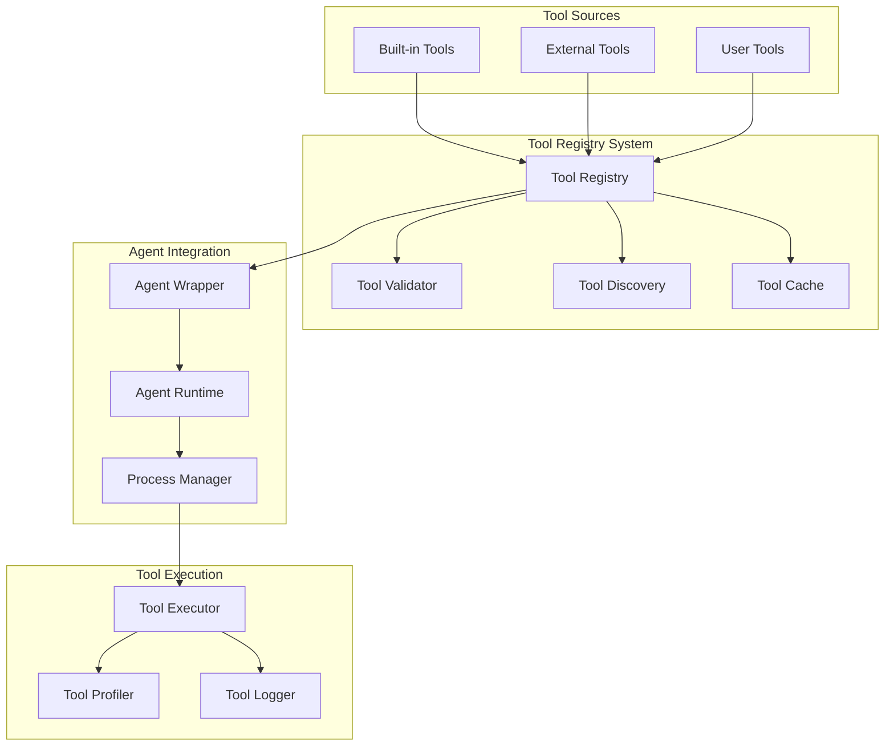

# Tool Registry System Design

**Document Type**: Phase 2.5 Component Design
**Component**: Tool Registry System
**Phase**: 2.5 - Semantic Progress and Tool Integration
**Author**: William
**Date Created**: 2025-06-28
**Last Updated**: 2025-06-28
**Status**: Active
**Purpose**: Design the tool registry system for centralized tool management

## 🎯 **Overview**

The Tool Registry System provides centralized management for both built-in and external tools, enabling agents to discover, validate, and use tools autonomously. This system extends the existing agent architecture without breaking changes.

## 🏗️ **Architecture**



## 🔧 **Core Components**

### **1. Tool Registry**
Central repository for all available tools with metadata and validation information.

```python
class ToolRegistry:
    """Centralized tool management system."""
    
    def __init__(self):
        self.tools = {}
        self.categories = {}
        self.validators = {}
    
    def register_tool(self, tool_info: dict) -> bool:
        """Register a new tool in the registry."""
        pass
    
    def get_tool(self, tool_name: str) -> Optional[dict]:
        """Retrieve tool information by name."""
        pass
    
    def list_tools(self, category: str = None) -> List[dict]:
        """List available tools, optionally filtered by category."""
        pass
```

### **2. Tool Validator**
Ensures tools meet quality and safety standards before registration.

```python
class ToolValidator:
    """Validates tools before registration."""
    
    def validate_tool(self, tool_info: dict) -> ValidationResult:
        """Validate tool information and implementation."""
        pass
    
    def check_security(self, tool_func: callable) -> SecurityResult:
        """Check tool for security concerns."""
        pass
    
    def validate_interface(self, tool_info: dict) -> bool:
        """Validate tool interface definition."""
        pass
```

### **3. Tool Discovery**
Automatically discovers available tools from various sources.

```python
class ToolDiscovery:
    """Discovers tools from various sources."""
    
    def discover_builtin_tools(self) -> List[dict]:
        """Discover built-in system tools."""
        pass
    
    def discover_external_tools(self, tool_list: List[dict]) -> List[dict]:
        """Discover external tools from user input."""
        pass
    
    def scan_agent_tools(self, agent_path: str) -> List[dict]:
        """Scan agent directory for available tools."""
        pass
```

## 📋 **Tool Information Structure**

### **Tool Metadata**
```python
tool_info = {
    "name": "file_reader",
    "description": "Read content from a file path",
    "category": "file_operations",
    "function": file_reader_func,
    "parameters": {
        "file_path": {
            "type": "string",
            "description": "Path to the file to read",
            "required": True
        }
    },
    "returns": {
        "type": "string",
        "description": "File content as string"
    },
    "tags": ["file", "io", "reading"],
    "version": "1.0.0",
    "author": "user",
    "security_level": "safe"
}
```

### **Tool Categories**
- **File Operations**: File reading, writing, manipulation
- **Data Processing**: Text analysis, data transformation
- **Network Operations**: HTTP requests, API calls
- **System Operations**: Process management, environment info
- **Custom**: User-defined tools

## 🔄 **Registration Process**

### **1. Tool Definition**
```python
def my_custom_tool(param1: str, param2: int) -> str:
    """Custom tool description"""
    # Tool implementation
    return f"Processed {param1} with {param2}"

# Define tool information
tool_info = {
    "tool": my_custom_tool,
    "description": "Process parameters and return result",
    "category": "custom"
}
```

### **2. Tool Registration**
```python
# Register tool with agent manager
agent_manager.register_tool(tool_info)

# Or pass directly to agent
agent = agent_manager.load_agent(
    base_agent="agentplug/my-agent",
    external_tools=[tool_info]
)
```

### **3. Validation and Storage**
- Tool function validation
- Interface compatibility check
- Security assessment
- Metadata storage
- Cache initialization

## 🎯 **Tool Selection Logic**

### **Autonomous Selection**
Agents automatically select tools based on:
- **Task Requirements**: What needs to be accomplished
- **Tool Capabilities**: Available functionality
- **Context Relevance**: Current execution context
- **Performance History**: Previous success rates

### **Selection Algorithm**
```python
def select_tool(self, task_description: str, context: dict) -> Optional[dict]:
    """Select appropriate tool for given task."""
    
    # 1. Analyze task requirements
    requirements = self.analyze_task(task_description)
    
    # 2. Find matching tools
    candidates = self.find_candidate_tools(requirements)
    
    # 3. Score and rank tools
    scored_tools = self.score_tools(candidates, context)
    
    # 4. Select best match
    return self.select_best_tool(scored_tools)
```

### **Tool Scoring Factors**
- **Relevance**: How well tool matches task requirements
- **Performance**: Historical success rate and speed
- **Security**: Safety level and risk assessment
- **Complexity**: Tool complexity vs. task complexity
- **Availability**: Tool accessibility and dependencies

## 🔒 **Security and Validation**

### **Security Levels**
- **Safe**: No system access, pure computation
- **Limited**: Limited file/network access
- **Restricted**: Full system access with restrictions
- **Unsafe**: Unrestricted access (not recommended)

### **Validation Rules**
- Function signature validation
- Parameter type checking
- Return value validation
- Security level assessment
- Dependency verification

### **Sandboxing**
- Isolated execution environment
- Resource limits
- Timeout controls
- Error isolation

## 📊 **Performance and Caching**

### **Tool Caching**
- Function object caching
- Metadata caching
- Performance metrics storage
- Lazy loading for large tool sets

### **Performance Metrics**
- Execution time tracking
- Success rate monitoring
- Resource usage statistics
- Error frequency analysis

## 🔄 **Integration Points**

### **Agent Wrapper Integration**
```python
class EnhancedAgentWrapper(AgentWrapper):
    """Enhanced wrapper with tool integration."""
    
    def __init__(self, agent_info: dict, runtime=None, tools=None):
        super().__init__(agent_info, runtime)
        self.tool_registry = ToolRegistry()
        if tools:
            self.register_tools(tools)
    
    def register_tools(self, tools: List[dict]):
        """Register external tools with this agent."""
        for tool_info in tools:
            self.tool_registry.register_tool(tool_info)
```

### **Runtime Integration**
```python
class EnhancedAgentRuntime(AgentRuntime):
    """Enhanced runtime with tool support."""
    
    def execute_agent(self, namespace: str, agent_name: str, 
                      method: str, parameters: dict, tools: List[dict] = None) -> dict:
        """Execute agent with optional tool context."""
        
        # Register tools if provided
        if tools:
            self.register_tools(tools)
        
        # Execute with tool context
        return super().execute_agent(namespace, agent_name, method, parameters)
```

## 🧪 **Testing Strategy**

### **Unit Tests**
- Tool registration and validation
- Tool discovery and caching
- Security validation
- Performance metrics

### **Integration Tests**
- Agent wrapper integration
- Runtime coordination
- Tool execution flow
- Error handling

### **End-to-End Tests**
- Complete tool usage workflow
- Performance under load
- Security validation
- User experience validation

## 📈 **Monitoring and Metrics**

### **Key Metrics**
- Tool registration success rate
- Tool selection accuracy
- Execution performance
- Error rates and types
- User satisfaction scores

### **Logging**
- Tool registration events
- Selection decisions
- Execution results
- Performance data
- Security events

## 🚀 **Implementation Plan**

### **Phase 1: Core Registry (Week 1)**
- [ ] Tool registry class implementation
- [ ] Basic tool validation
- [ ] Tool discovery mechanisms
- [ ] Simple caching system

### **Phase 2: Enhanced Features (Week 2)**
- [ ] Advanced validation rules
- [ ] Security assessment
- [ ] Performance metrics
- [ ] Tool categorization

### **Phase 3: Integration (Week 3)**
- [ ] Agent wrapper integration
- [ ] Runtime coordination
- [ ] Error handling
- [ ] Testing and validation

## 🎯 **Success Criteria**

- [ ] Tools can be registered and discovered
- [ ] Tool validation prevents unsafe tools
- [ ] Agents can autonomously select tools
- [ ] Performance impact is minimal
- [ ] Security requirements are met
- [ ] Integration with existing system is seamless

## 🔮 **Future Enhancements**

1. **Tool Marketplace**: Discover and install tools from repositories
2. **Tool Composition**: Combine multiple tools into workflows
3. **Dynamic Loading**: Load tools at runtime from various sources
4. **Version Management**: Support multiple tool versions
5. **Performance Optimization**: AI-driven tool selection optimization
6. **Collaborative Tools**: Tools that can work together automatically
