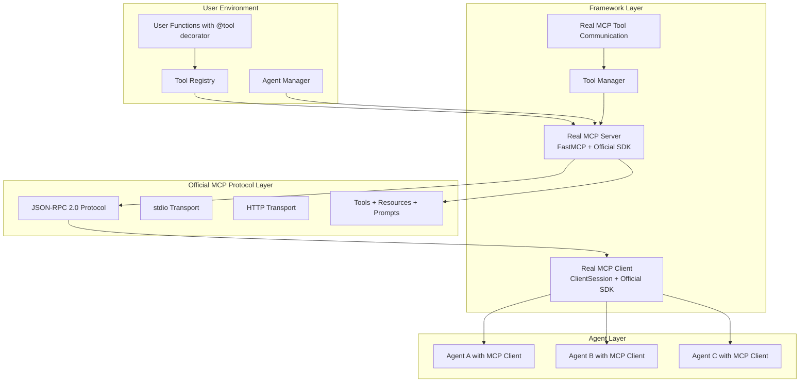

# Real MCP Tool System Design

**Document Type**: Phase 2.5 Component Design
**Component**: Real MCP Tool System
**Phase**: 2.5 - Real MCP Tool Integration
**Author**: William
**Date Created**: 2025-06-28
**Last Updated**: 2025-06-28
**Status**: Active
**Purpose**: Design the real MCP tool system for automatic function discovery and real MCP server generation using official MCP Python SDK

## 🎯 **Overview**

The Real MCP Tool System provides automatic discovery of user-defined functions with @tool decorator and generates **real MCP servers** using the **official MCP Python SDK** that agents can use to access these tools via the **standard MCP protocol**. This system eliminates the need for users to manually register tools or create APIs - they just write functions with @tool decorator and the framework handles **real MCP server creation** automatically using the **official MCP Python SDK**.

## 🏗️ **Architecture**



## 🔧 **Core Components**

### **1. MCP Tool Discovery System**
Automatically discovers user functions with @tool decorator and extracts MCP metadata.

```python
class MCPToolDiscovery:
    """Automatically discovers user functions with @tool decorator and extracts MCP metadata."""
    
    def __init__(self):
        self.discovered_tools = {}
        self.tool_registry = get_global_registry()
    
    def discover_tools(self, tool_functions: List[callable]) -> List[MCPTool]:
        """Discover tools from decorated functions and create MCP tools."""
        mcp_tools = []
        
        for tool_func in tool_functions:
            if hasattr(tool_func, '__tool_metadata__'):
                metadata = tool_func.__tool_metadata__
                mcp_tool = self._create_mcp_tool(metadata)
                mcp_tools.append(mcp_tool)
            else:
                # Auto-register undecorated functions
                decorated_func = self._auto_register_function(tool_func)
                metadata = decorated_func.__tool_metadata__
                mcp_tool = self._create_mcp_tool(metadata)
                mcp_tools.append(mcp_tool)
        
        return mcp_tools
    
    def _create_mcp_tool(self, metadata: ToolMetadata) -> MCPTool:
        """Create MCP tool from tool metadata."""
        return MCPTool(
            name=metadata.name,
            description=metadata.description,
            function=metadata.function,
            parameters=metadata.parameters
        )
    
    def _auto_register_function(self, func: callable) -> callable:
        """Auto-register function with @tool decorator."""
        from agentmanager.core.tools import tool
        return tool()(func)
    
    def _analyze_function(self, func: callable) -> dict:
        """Analyze function and extract MCP-compatible metadata."""
        signature = inspect.signature(func)
        
        # Extract parameter information for MCP schema
        parameters = {}
        for param_name, param in signature.parameters.items():
            if param_name == "self":
                continue
                
            param_info = {
                "type": self._map_python_type_to_mcp(param.annotation),
                "required": param.default == inspect.Parameter.empty,
                "default": param.default if param.default != inspect.Parameter.empty else None,
                "description": f"Parameter {param_name}"
            }
            parameters[param_name] = param_info
        
        return {
            "function": func,
            "name": func.__name__,
            "description": func.__doc__ or "",
            "parameters": parameters,
            "module": func.__module__,
            "file": inspect.getfile(func)
        }
    
    def _map_python_type_to_mcp(self, python_type) -> str:
        """Map Python types to MCP schema types."""
        type_mapping = {
            str: "string",
            int: "integer",
            float: "number",
            bool: "boolean",
            list: "array",
            dict: "object"
        }
        return type_mapping.get(python_type, "string")
```

### **2. Real MCP Server Generator**
Automatically generates **real MCP servers** for **both built-in tools AND external tools** using the **official MCP Python SDK**.

```python
from mcp.server.fastmcp import FastMCP
from mcp.server.stdio import stdio_server
from mcp.types import Tool, TextContent

class RealMCPServerGenerator:
    """Automatically generates REAL MCP servers for built-in + external tools using official SDK."""
    
    def __init__(self, builtin_tools: List[MCPTool], external_tools: List[MCPTool]):
        self.builtin_tools = {tool.name: tool for tool in builtin_tools}
        self.external_tools = {tool.name: tool for tool in external_tools}
        self.all_tools = {**self.builtin_tools, **self.external_tools}  # Combined tool set
        self.app = FastMCP("AgentHub Combined Tool Server")
        self._register_all_tools()
    
    def _register_all_tools(self):
        """Register ALL tools (built-in + external) with REAL MCP server using official SDK."""
        # Register built-in tools
        for tool_name, tool in self.builtin_tools.items():
            @self.app.tool()
            async def builtin_tool_handler(name: str = tool_name, **kwargs) -> list[TextContent]:
                """Built-in tool handler using REAL MCP protocol via official SDK."""
                try:
                    result = tool.function(**kwargs)
                    return [TextContent(type="text", text=str(result))]
                except Exception as e:
                    return [TextContent(type="text", text=f"Built-in tool error: {str(e)}")]
        
        # Register external tools
        for tool_name, tool in self.external_tools.items():
            @self.app.tool()
            async def external_tool_handler(name: str = tool_name, **kwargs) -> list[TextContent]:
                """External tool handler using REAL MCP protocol via official SDK."""
                try:
                    result = tool.function(**kwargs)
                    return [TextContent(type="text", text=str(result))]
                except Exception as e:
                    return [TextContent(type="text", text=f"External tool error: {str(e)}")]
    
    async def start_server(self, transport: str = "stdio"):
        """Start REAL MCP server with ALL tools using official SDK."""
        if transport == "stdio":
            # Use official MCP SDK stdio server
            async with stdio_server() as (read_stream, write_stream):
                await self.app.run(read_stream, write_stream)
        elif transport == "http":
            # Use official MCP SDK HTTP server
            self.app.run(transport="streamable-http", mount_path="/mcp")
        else:
            raise ValueError(f"Unsupported transport: {transport}")
    
    def get_available_tools(self) -> dict:
        """Get all available tools (built-in + external)."""
        return {
            "builtin_tools": list(self.builtin_tools.keys()),
            "external_tools": list(self.external_tools.keys()),
            "all_tools": list(self.all_tools.keys())
        }
    
    async def _handle_request(self, request: dict) -> dict:
        """Handle MCP requests."""
        method = request.get("method")
        params = request.get("params", {})
        request_id = request.get("id")
        
        if method == "tools/list":
            return await self._handle_tools_list(request_id)
        elif method == "tools/call":
            return await self._handle_tools_call(request_id, params)
        else:
            raise ValueError(f"Unknown method: {method}")
    
    async def _handle_tools_list(self, request_id: any) -> dict:
        """Handle tools/list request."""
        tools = []
        for tool_name, tool in self.mcp_tools.items():
            tools.append({
                "name": tool.name,
                "description": tool.description,
                "inputSchema": self._generate_mcp_schema(tool.parameters)
            })
        
        return {
            "jsonrpc": "2.0",
            "id": request_id,
            "result": {"tools": tools}
        }
    
    async def _handle_tools_call(self, request_id: any, params: dict) -> dict:
        """Handle tools/call request."""
        tool_name = params.get("name")
        arguments = params.get("arguments", {})
        
        if tool_name not in self.mcp_tools:
            raise ValueError(f"Tool '{tool_name}' not found")
        
        tool = self.mcp_tools[tool_name]
        
        # Execute tool function
        if asyncio.iscoroutinefunction(tool.function):
            result = await tool.function(**arguments)
        else:
            result = tool.function(**arguments)
        
        return {
            "jsonrpc": "2.0",
            "id": request_id,
            "result": {
                "content": [{"type": "text", "text": str(result)}]
            }
        }
    
    def _generate_mcp_schema(self, parameters: dict) -> dict:
        """Generate MCP schema for tool parameters."""
        properties = {}
        required = []
        
        for param_name, param_info in parameters.items():
            properties[param_name] = {
                "type": param_info.get("type", "string"),
                "description": param_info.get("description", "")
            }
            
            if param_info.get("required", True):
                required.append(param_name)
        
        return {
            "type": "object",
            "properties": properties,
            "required": required
        }
```

### **3. MCP Server Manager**
Manages both **ephemeral** and **persistent** MCP servers using the **official MCP Python SDK**.

```python
from mcp import ClientSession
from mcp.client.stdio import stdio_client
from mcp.types import StdioServerParameters
from contextlib import contextmanager

class MCPServerManager:
    """Manages both ephemeral and persistent MCP servers using official SDK."""
    
    def __init__(self):
        self.ephemeral_servers = {}
        self.persistent_servers = {}
        self.mcp_clients = {}
    
    def create_ephemeral_server(self, builtin_tools: List[Tool], external_tools: List[Tool]) -> RealMCPServerGenerator:
        """Create ephemeral MCP server for single agent with built-in + external tools."""
        server = RealMCPServerGenerator(builtin_tools, external_tools)
        server_id = f"ephemeral_{id(server)}"
        self.ephemeral_servers[server_id] = server
        return server
    
    def create_persistent_server(self, name: str, builtin_tools: List[Tool], external_tools: List[Tool]) -> RealMCPServerGenerator:
        """Create persistent MCP server for multiple agents with built-in + external tools."""
        server = RealMCPServerGenerator(builtin_tools, external_tools)
        self.persistent_servers[name] = server
        return server
    
    @contextmanager
    def mcp_server(self, name: str, external_tools: List[Tool]):
        """Context manager for persistent MCP server with external tools (built-in tools added per agent)."""
        # External tools are provided here, built-in tools added when agents connect
        server = self.create_persistent_server(name, [], external_tools)
        try:
            yield server
        finally:
            self.cleanup_persistent_server(name)
    
    def cleanup_persistent_server(self, name: str):
        """Clean up persistent MCP server."""
        if name in self.persistent_servers:
            del self.persistent_servers[name]
    
    def get_persistent_server(self, name: str) -> Optional[RealMCPServerGenerator]:
        """Get existing persistent server by name."""
        return self.persistent_servers.get(name)
```

### **4. Real MCP Tool Manager**
Coordinates **real MCP tool discovery** and execution between agents and **real MCP servers** using the **official MCP Python SDK**.

```python
class RealMCPToolManager:
    """Manages REAL MCP tool discovery and execution coordination using official SDK."""
    
    def __init__(self, server_manager: MCPServerManager):
        self.server_manager = server_manager
        self.mcp_clients = {}
        self.tool_cache = {}
    
    def register_mcp_server(self, name: str, mcp_server: RealMCPServerGenerator, mcp_client: ClientSession):
        """Register a REAL MCP server and client using official SDK."""
        self.mcp_clients[name] = mcp_client
        
        # Discover available tools via REAL MCP protocol
        self._discover_mcp_tools(name)
    
    def _discover_mcp_tools(self, server_name: str):
        """Discover tools available via MCP server."""
        mcp_client = self.mcp_clients[server_name]
        
        try:
            # Use MCP client to discover tools
            tools = asyncio.run(mcp_client.discover_tools())
            
            # Cache tool information
            for tool_info in tools:
                tool_name = tool_info["name"]
                cache_key = f"{server_name}:{tool_name}"
                self.tool_cache[cache_key] = {
                    "server": server_name,
                    "info": tool_info,
                    "client": mcp_client
                }
                    
        except Exception as e:
            logger.warning(f"Failed to discover MCP tools from {server_name}: {e}")
    
    async def execute_tool(self, tool_name: str, args: dict):
        """Execute tool through appropriate MCP server."""
        # Find which MCP server has this tool
        for cache_key, tool_data in self.tool_cache.items():
            if tool_data["info"]["name"] == tool_name:
                mcp_client = tool_data["client"]
                
                # Execute tool via MCP client
                return await mcp_client.call_tool(tool_name, args)
        
        raise ToolNotFoundError(f"Tool {tool_name} not found in any MCP server")
    
    def get_available_tools(self) -> List[dict]:
        """Get list of all available MCP tools."""
        tools = []
        for cache_key, tool_data in self.tool_cache.items():
            tools.append({
                "name": tool_data["info"]["name"],
                "description": tool_data["info"]["description"],
                "server": tool_data["server"]
            })
        return tools
    
    def get_tool_schema(self, tool_name: str) -> dict:
        """Get MCP schema for a specific tool."""
        for cache_key, tool_data in self.tool_cache.items():
            if tool_data["info"]["name"] == tool_name:
                return tool_data["info"].get("inputSchema", {})
        
        raise ToolNotFoundError(f"Tool {tool_name} not found")
```

## 🚀 **User Experience**

### **External Tools Population via amg.load_agent(tools=[])**
```python
# user_script.py
from agentmanager.core.tools import tool
import agentmanager as amg

# 1. User defines external tools with @tool decorator
@tool(name="analyze_customer_data", description="Analyze customer data and return insights")
def analyze_customer_data(customer_data):
    """Analyze customer data and return insights"""
    # User just writes normal business logic
    return {
        "customer_count": len(customer_data),
        "total_value": sum(customer["value"] for customer in customer_data),
        "insights": "custom analysis logic here"
    }

@tool(name="process_sales_data", description="Process sales data with different analysis types")
def process_sales_data(sales_data, analysis_type="basic"):
    """Process sales data with different analysis types"""
    if analysis_type == "basic":
        return {"total_sales": sum(sales_data), "count": len(sales_data)}
    elif analysis_type == "detailed":
        return {"detailed_analysis": "complex logic here"}
    else:
        raise ValueError(f"Unknown analysis type: {analysis_type}")

# 2. External tools populated through amg.load_agent(tools=[])
agent = amg.load_agent(
    base_agent="agentplug/analyzer",  # Built-in tools from base_agent
    tools=[analyze_customer_data, process_sales_data]  # External tools populated here
)

# 3. Framework creates combined MCP server with:
#    - Built-in tools (from base_agent)
#    - External tools (from tools=[] parameter)
```

### **Automatic MCP Server Generation**
```bash
# Framework automatically:
# 1. Discovers @tool decorated functions
# 2. Extracts MCP metadata
# 3. Creates MCP server with JSON-RPC 2.0
# 4. Starts MCP server in subprocess
# 5. Creates MCP client for agent communication

python user_script.py
# Output:
# 🔍 Discovering MCP tools...
# ✅ Discovered 2 MCP tools
# 🚀 Creating MCP server...
# 📡 Starting MCP server with stdio transport
# 🔗 Creating MCP client for agent communication
# 🎉 Framework ready! Agents can now use MCP tools
```

### **Agent Usage with MCP**
```python
# Agent can discover and use MCP tools
agent = amg.load_agent(
    base_agent="agentplug/analyzer", 
    tools=[analyze_customer_data, process_sales_data]
)

# Agent calls tools by name via MCP - framework handles everything
result = agent.analyze_customers(
    customer_data="customers.csv",
    use_tools=["analyze_customer_data", "process_sales_data"]
)
```

## 🔒 **Security and Validation**

### **MCP Parameter Validation**
- **Type Checking**: Automatic MCP parameter type validation
- **Required Parameters**: Ensures all required parameters are provided
- **Default Values**: Handles optional parameters with defaults
- **Input Sanitization**: Prevents malicious input via MCP protocol

### **MCP Error Handling**
- **Comprehensive MCP Error Reporting**: Detailed MCP error messages for debugging
- **Graceful Degradation**: System continues working even if some MCP tools fail
- **MCP Logging and Monitoring**: All MCP tool executions are logged

### **MCP Access Control**
- **MCP Authentication**: Optional MCP-based authentication
- **MCP Authorization**: Control which agents can access which MCP tools
- **MCP Rate Limiting**: Prevent abuse of MCP tool endpoints

## 📊 **Performance and Scalability**

### **MCP Tool Discovery**
- **Efficient MCP Scanning**: Only scans when needed
- **MCP Caching**: MCP tool metadata is cached for performance
- **Incremental MCP Updates**: Only updates changed MCP functions

### **MCP Server Generation**
- **Optimized MCP Servers**: Generated MCP servers are optimized for performance
- **MCP Connection Pooling**: Efficient MCP connection management
- **MCP Response Caching**: Cache frequently requested MCP results

### **MCP Scalability**
- **Multiple MCP Servers**: Support for multiple MCP servers
- **MCP Load Balancing**: Distribute load across MCP servers
- **Horizontal MCP Scaling**: Add more MCP servers as needed

## 🎯 **Benefits**

### **1. User Simplicity**
- **Just write functions with @tool decorator** - No MCP setup, no server code
- **Normal Python code** - Use any libraries, any logic
- **Automatic MCP discovery** - Framework finds everything

### **2. Framework Intelligence**
- **Auto-MCP server generation** - No manual MCP server creation
- **MCP parameter validation** - Automatic MCP type checking
- **MCP error handling** - Framework manages MCP failures
- **MCP tool discovery** - Agents know what's available via MCP

### **3. Agent Integration**
- **Seamless MCP tool access** - Agents use MCP tools by name
- **Automatic MCP routing** - Framework handles MCP communication
- **MCP error recovery** - Framework manages MCP tool failures

## 🔮 **Future Enhancements**

### **1. Advanced MCP Function Analysis**
- **MCP Dependency Detection**: Automatically detect required libraries for MCP tools
- **MCP Type Inference**: Better MCP type information extraction
- **MCP Security Analysis**: Identify potentially unsafe MCP operations

### **2. Enhanced MCP Server Generation**
- **MCP GraphQL Support**: Generate MCP GraphQL schemas
- **MCP OpenAPI Documentation**: Automatic MCP API documentation
- **Custom MCP Endpoints**: User-defined MCP endpoint customization

### **3. MCP Tool Composition**
- **MCP Workflow Creation**: Combine multiple MCP tools into workflows
- **MCP Tool Chaining**: Automatic MCP tool execution chains
- **MCP Result Aggregation**: Combine results from multiple MCP tools

## 📝 **Conclusion**

The **Real MCP Tool System** provides a clean, simple, and powerful way for users to make their functions available to agents via the **standard MCP protocol** using the **official MCP Python SDK**. By eliminating the need for manual tool registration and MCP server creation, users can focus on writing business logic while the framework handles all the complexity of **real MCP tool discovery**, **real MCP server generation**, and agent coordination via the **official MCP Python SDK**.

**Key Takeaway**: Users just write functions with @tool decorator, framework handles **real MCP server creation** automatically via **official MCP Python SDK**, agents get seamless access to powerful **real MCP tools** via **native MCP protocol** using the **official MCP Python SDK**.
