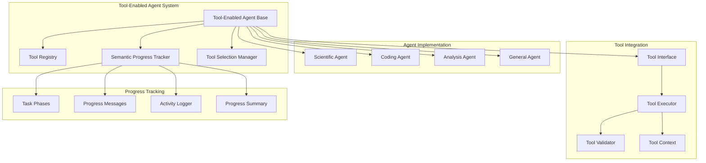

# Tool-Enabled Agent Base Classes Design

**Document Type**: Phase 2.5 Component Design
**Component**: Tool-Enabled Agent Base Classes
**Phase**: 2.5 - Semantic Progress and Tool Integration
**Author**: William
**Date Created**: 2025-06-28
**Last Updated**: 2025-06-28
**Status**: Active
**Purpose**: Design base classes for agents that can intelligently use tools with semantic progress reporting

## 🎯 **Overview**

The Tool-Enabled Agent Base Classes provide the foundation for agents that can autonomously select and use external tools while providing human-readable progress updates. These base classes extend the existing agent architecture to support intelligent tool integration and semantic progress tracking.

## 🏗️ **Architecture**



## 🔧 **Core Components**

### **1. Tool-Enabled Agent Base Class**
Main base class that provides tool integration and progress tracking capabilities.

```python
from abc import ABC, abstractmethod
from typing import List, Dict, Any, Optional
from agentmanager.utils.semantic_progress import SemanticProgressTracker
from agentmanager.core.tool_registry import ToolRegistry

class ToolEnabledAgent(ABC):
    """Base class for agents with tool integration and progress tracking."""
    
    def __init__(self, agent_type: str = "general", tools: List[dict] = None):
        """
        Initialize tool-enabled agent.
        
        Args:
            agent_type: Type of agent for domain-specific tracking
            tools: Optional list of external tools
        """
        self.agent_type = agent_type
        self.progress_tracker = SemanticProgressTracker(agent_type)
        self.tool_registry = ToolRegistry()
        
        # Register external tools if provided
        if tools:
            self.register_tools(tools)
        
        # Load built-in tools
        self._load_builtin_tools()
    
    def register_tools(self, tools: List[dict]):
        """Register external tools with this agent."""
        for tool_info in tools:
            self.tool_registry.register_tool(tool_info)
    
    def get_available_tools(self) -> List[dict]:
        """Get list of available tools."""
        return self.tool_registry.list_tools()
    
    def select_tool(self, purpose: str, context: dict = None) -> Optional[dict]:
        """Select appropriate tool for given purpose."""
        return self.tool_registry.select_tool(purpose, context)
    
    def execute_tool(self, tool_name: str, **kwargs) -> Any:
        """Execute a tool with given parameters."""
        tool_info = self.tool_registry.get_tool(tool_name)
        if not tool_info:
            raise ValueError(f"Tool '{tool_name}' not found")
        
        try:
            # Log tool execution
            self.progress_tracker.log_activity(f"Using {tool_name} for {purpose}")
            
            # Execute tool
            result = tool_info["tool"](**kwargs)
            
            # Log successful execution
            self.progress_tracker.log_activity(f"Tool {tool_name} executed successfully")
            
            return result
        except Exception as e:
            # Log tool execution error
            self.progress_tracker.log_activity(f"Tool {tool_name} failed: {str(e)}", "error")
            raise
    
    @abstractmethod
    def process_task(self, task_description: str, **kwargs) -> Any:
        """Process a task using available tools and progress tracking."""
        pass
    
    def _load_builtin_tools(self):
        """Load built-in tools for this agent type."""
        # This can be overridden by subclasses to load specific tools
        pass
```

### **2. Scientific Analysis Agent Base**
Base class for scientific analysis and research tasks.

```python
class ScientificAnalysisAgent(ToolEnabledAgent):
    """Base class for scientific analysis agents."""
    
    def __init__(self, tools: List[dict] = None):
        """Initialize scientific analysis agent."""
        super().__init__("scientific_analysis", tools)
        self._load_scientific_tools()
    
    def _load_scientific_tools(self):
        """Load scientific analysis specific tools."""
        scientific_tools = [
            {
                "tool": self._read_document,
                "description": "Read and parse document content",
                "category": "document_processing"
            },
            {
                "tool": self._analyze_text,
                "description": "Analyze text content for patterns and insights",
                "category": "text_analysis"
            },
            {
                "tool": self._extract_data,
                "description": "Extract structured data from documents",
                "category": "data_extraction"
            }
        ]
        
        for tool in scientific_tools:
            self.tool_registry.register_tool(tool)
    
    def process_task(self, task_description: str, **kwargs) -> Any:
        """Process scientific analysis task."""
        try:
            # Start progress tracking
            self.progress_tracker.start_task(task_description)
            
            # Phase 1: Understanding
            self.progress_tracker.update_phase("understanding", 0.1)
            analysis_plan = self._create_analysis_plan(task_description)
            
            # Phase 2: Gathering
            self.progress_tracker.update_phase("gathering", 0.3)
            data = self._gather_data(analysis_plan, **kwargs)
            
            # Phase 3: Analyzing
            self.progress_tracker.update_phase("analyzing", 0.6)
            analysis_results = self._analyze_data(data, analysis_plan)
            
            # Phase 4: Processing
            self.progress_tracker.update_phase("processing", 0.8)
            processed_results = self._process_results(analysis_results)
            
            # Phase 5: Generating
            self.progress_tracker.update_phase("generating", 0.9)
            final_output = self._generate_output(processed_results, task_description)
            
            # Phase 6: Completing
            self.progress_tracker.update_phase("completing", 1.0)
            self.progress_tracker.complete_task("Scientific analysis completed")
            
            return final_output
            
        except Exception as e:
            self.progress_tracker.log_activity(f"Task failed: {str(e)}", "error")
            raise
    
    def _create_analysis_plan(self, task_description: str) -> dict:
        """Create analysis plan for the task."""
        self.progress_tracker.log_activity("Creating analysis plan")
        
        # Analyze task requirements
        plan = {
            "task": task_description,
            "steps": [],
            "required_tools": [],
            "estimated_time": "unknown"
        }
        
        # Add analysis steps based on task
        if "research" in task_description.lower():
            plan["steps"].extend([
                "literature_review",
                "methodology_analysis",
                "results_evaluation",
                "conclusion_synthesis"
            ])
        
        return plan
    
    def _gather_data(self, analysis_plan: dict, **kwargs) -> dict:
        """Gather data for analysis."""
        self.progress_tracker.log_activity("Gathering data for analysis")
        
        data = {}
        
        # Gather data based on analysis plan
        for step in analysis_plan["steps"]:
            if step == "literature_review":
                data["literature"] = self._gather_literature(**kwargs)
            elif step == "methodology_analysis":
                data["methodology"] = self._gather_methodology(**kwargs)
        
        return data
    
    def _analyze_data(self, data: dict, analysis_plan: dict) -> dict:
        """Analyze gathered data."""
        self.progress_tracker.log_activity("Analyzing gathered data")
        
        analysis_results = {}
        
        # Analyze data based on analysis plan
        for step in analysis_plan["steps"]:
            if step == "literature_review":
                analysis_results["literature_insights"] = self._analyze_literature(data.get("literature", {}))
            elif step == "methodology_analysis":
                analysis_results["methodology_insights"] = self._analyze_methodology(data.get("methodology", {}))
        
        return analysis_results
    
    def _process_results(self, analysis_results: dict) -> dict:
        """Process analysis results."""
        self.progress_tracker.log_activity("Processing analysis results")
        
        # Process and organize results
        processed_results = {
            "summary": self._create_summary(analysis_results),
            "insights": self._extract_insights(analysis_results),
            "recommendations": self._generate_recommendations(analysis_results)
        }
        
        return processed_results
    
    def _generate_output(self, processed_results: dict, task_description: str) -> str:
        """Generate final output."""
        self.progress_tracker.log_activity("Generating final output")
        
        # Generate comprehensive output
        output = f"""
# Scientific Analysis Report

## Task
{task_description}

## Summary
{processed_results['summary']}

## Key Insights
{processed_results['insights']}

## Recommendations
{processed_results['recommendations']}

## Analysis Details
{self._format_analysis_details(processed_results)}
        """.strip()
        
        return output
    
    # Helper methods for scientific analysis
    def _read_document(self, document_path: str) -> str:
        """Read document content."""
        # Implementation would depend on document type
        pass
    
    def _analyze_text(self, text: str, analysis_type: str) -> dict:
        """Analyze text content."""
        # Implementation would depend on analysis type
        pass
    
    def _extract_data(self, document_path: str, data_type: str) -> dict:
        """Extract structured data from document."""
        # Implementation would depend on data type
        pass
```

### **3. Coding Agent Base**
Base class for code generation and software development tasks.

```python
class CodingAgent(ToolEnabledAgent):
    """Base class for coding and software development agents."""
    
    def __init__(self, tools: List[dict] = None):
        """Initialize coding agent."""
        super().__init__("coding", tools)
        self._load_coding_tools()
    
    def _load_coding_tools(self):
        """Load coding specific tools."""
        coding_tools = [
            {
                "tool": self._generate_code,
                "description": "Generate code based on requirements",
                "category": "code_generation"
            },
            {
                "tool": self._analyze_code,
                "description": "Analyze code structure and quality",
                "category": "code_analysis"
            },
            {
                "tool": self._test_code,
                "description": "Test generated code for functionality",
                "category": "code_testing"
            }
        ]
        
        for tool in coding_tools:
            self.tool_registry.register_tool(tool)
    
    def process_task(self, task_description: str, **kwargs) -> Any:
        """Process coding task."""
        try:
            # Start progress tracking
            self.progress_tracker.start_task(task_description)
            
            # Phase 1: Understanding
            self.progress_tracker.update_phase("understanding", 0.1)
            requirements = self._analyze_requirements(task_description)
            
            # Phase 2: Gathering
            self.progress_tracker.update_phase("gathering", 0.3)
            context = self._gather_context(requirements, **kwargs)
            
            # Phase 3: Analyzing
            self.progress_tracker.update_phase("analyzing", 0.5)
            design = self._create_design(requirements, context)
            
            # Phase 4: Processing
            self.progress_tracker.update_phase("processing", 0.7)
            implementation_plan = self._plan_implementation(design)
            
            # Phase 5: Generating
            self.progress_tracker.update_phase("generating", 0.9)
            code = self._generate_code(implementation_plan)
            
            # Phase 6: Completing
            self.progress_tracker.update_phase("completing", 1.0)
            final_code = self._finalize_code(code, requirements)
            self.progress_tracker.complete_task("Code generation completed")
            
            return final_code
            
        except Exception as e:
            self.progress_tracker.log_activity(f"Task failed: {str(e)}", "error")
            raise
    
    def _analyze_requirements(self, task_description: str) -> dict:
        """Analyze coding requirements."""
        self.progress_tracker.log_activity("Analyzing coding requirements")
        
        # Parse requirements from task description
        requirements = {
            "functionality": [],
            "constraints": [],
            "output_format": "code",
            "language": "python"  # default
        }
        
        # Extract functionality requirements
        if "function" in task_description.lower():
            requirements["functionality"].append("function_definition")
        if "class" in task_description.lower():
            requirements["functionality"].append("class_definition")
        if "api" in task_description.lower():
            requirements["functionality"].append("api_endpoint")
        
        return requirements
    
    def _gather_context(self, requirements: dict, **kwargs) -> dict:
        """Gather context for code generation."""
        self.progress_tracker.log_activity("Gathering coding context")
        
        context = {
            "libraries": kwargs.get("libraries", []),
            "dependencies": kwargs.get("dependencies", []),
            "style_guide": kwargs.get("style_guide", "pep8"),
            "target_environment": kwargs.get("target_environment", "python")
        }
        
        return context
    
    def _create_design(self, requirements: dict, context: dict) -> dict:
        """Create code design and architecture."""
        self.progress_tracker.log_activity("Creating code design")
        
        design = {
            "architecture": self._determine_architecture(requirements),
            "components": self._identify_components(requirements),
            "interfaces": self._design_interfaces(requirements),
            "data_structures": self._design_data_structures(requirements)
        }
        
        return design
    
    def _plan_implementation(self, design: dict) -> dict:
        """Plan code implementation."""
        self.progress_tracker.log_activity("Planning implementation")
        
        implementation_plan = {
            "steps": [],
            "order": [],
            "dependencies": {},
            "estimated_complexity": "medium"
        }
        
        # Create implementation steps
        for component in design["components"]:
            implementation_plan["steps"].append(f"implement_{component}")
        
        return implementation_plan
    
    def _generate_code(self, implementation_plan: dict) -> str:
        """Generate code based on implementation plan."""
        self.progress_tracker.log_activity("Generating code")
        
        code_parts = []
        
        # Generate code for each component
        for step in implementation_plan["steps"]:
            component_code = self._generate_component_code(step)
            code_parts.append(component_code)
        
        # Combine code parts
        full_code = "\n\n".join(code_parts)
        
        return full_code
    
    def _finalize_code(self, code: str, requirements: dict) -> str:
        """Finalize and validate generated code."""
        self.progress_tracker.log_activity("Finalizing code")
        
        # Add imports
        imports = self._generate_imports(requirements)
        
        # Add documentation
        documentation = self._generate_documentation(requirements)
        
        # Format code
        formatted_code = self._format_code(code)
        
        # Combine all parts
        final_code = f"{imports}\n\n{documentation}\n\n{formatted_code}"
        
        return final_code
    
    # Helper methods for coding tasks
    def _generate_code(self, requirements: dict, context: dict) -> str:
        """Generate code based on requirements."""
        # Implementation would generate actual code
        pass
    
    def _analyze_code(self, code: str) -> dict:
        """Analyze code structure and quality."""
        # Implementation would analyze code
        pass
    
    def _test_code(self, code: str, test_cases: List[dict]) -> dict:
        """Test generated code."""
        # Implementation would test code
        pass
```

## 🔄 **Integration with Existing System**

### **Backward Compatibility**
- All existing agents continue to work without changes
- New base classes are opt-in
- Existing agent patterns are preserved
- Gradual migration path available

### **Extension Points**
- Extends existing agent architecture
- Adds tool integration capabilities
- Provides progress tracking patterns
- Maintains existing interfaces

## 📋 **Usage Examples**

### **Creating a Scientific Analysis Agent**
```python
class ResearchPaperAnalyzer(ScientificAnalysisAgent):
    """Specialized agent for research paper analysis."""
    
    def __init__(self):
        super().__init__()
        # Add specialized tools
        self.register_tools([
            {
                "tool": self._extract_citations,
                "description": "Extract citations and references",
                "category": "citation_analysis"
            }
        ])
    
    def analyze_paper(self, paper_path: str, analysis_type: str = "comprehensive"):
        """Analyze a research paper."""
        return self.process_task(
            f"Analyze research paper at {paper_path} with {analysis_type} analysis",
            paper_path=paper_path,
            analysis_type=analysis_type
        )

# Usage
analyzer = ResearchPaperAnalyzer()
result = analyzer.analyze_paper("/path/to/paper.pdf")
```

### **Creating a Coding Agent**
```python
class PythonCodeGenerator(CodingAgent):
    """Specialized agent for Python code generation."""
    
    def __init__(self):
        super().__init__()
        # Add specialized tools
        self.register_tools([
            {
                "tool": self._validate_python_syntax,
                "description": "Validate Python syntax",
                "category": "code_validation"
            }
        ])
    
    def generate_function(self, function_name: str, description: str, parameters: List[str]):
        """Generate a Python function."""
        return self.process_task(
            f"Generate Python function {function_name} that {description}",
            function_name=function_name,
            description=description,
            parameters=parameters
        )

# Usage
generator = PythonCodeGenerator()
function_code = generator.generate_function(
    "calculate_total",
    "calculates the total of a list of numbers",
    ["numbers"]
)
```

## 🎯 **Success Criteria**

- [ ] Base classes provide clear tool integration patterns
- [ ] Progress tracking is meaningful and human-readable
- [ ] Tool selection is intelligent and accurate
- [ ] Backward compatibility is maintained
- [ ] Agent implementations are straightforward
- [ ] Performance impact is minimal

## 🔮 **Future Enhancements**

1. **Advanced Tool Orchestration**: Automatic tool workflow creation
2. **Tool Performance Metrics**: Track and optimize tool usage
3. **Dynamic Tool Discovery**: Discover tools at runtime
4. **Tool Composition**: Combine multiple tools into workflows
5. **Tool Versioning**: Support for multiple tool versions
6. **Tool Marketplace Integration**: Discover and install tools from repositories
