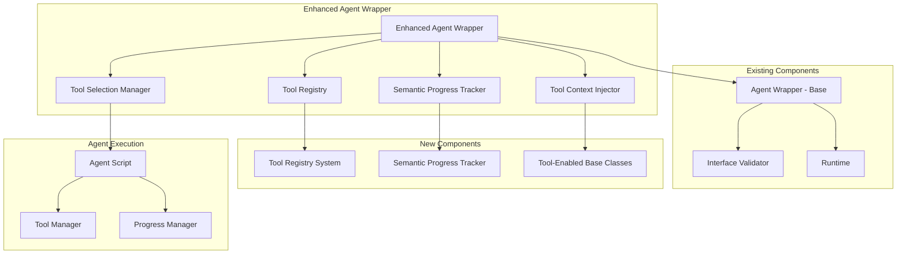

# Enhanced Agent Wrapper Design

**Document Type**: Phase 2.5 Component Design
**Component**: Enhanced Agent Wrapper
**Phase**: 2.5 - Semantic Progress and Tool Integration
**Author**: William
**Date Created**: 2025-06-28
**Last Updated**: 2025-06-28
**Status**: Active
**Purpose**: Design the enhanced agent wrapper with tool integration and progress tracking

## 🎯 **Overview**

The Enhanced Agent Wrapper extends the existing `AgentWrapper` class to provide tool integration capabilities and semantic progress tracking while maintaining full backward compatibility. This component serves as the bridge between the agent runtime and the new tool registry and progress tracking systems.

## 🏗️ **Architecture**



## 🔧 **Core Components**

### **1. Enhanced Agent Wrapper**
Main wrapper class that extends the existing `AgentWrapper` with new capabilities.

```python
class EnhancedAgentWrapper(AgentWrapper):
    """Enhanced wrapper with tool integration and progress tracking."""
    
    def __init__(self, agent_info: dict, runtime=None, tools: List[dict] = None):
        """
        Initialize enhanced agent wrapper.
        
        Args:
            agent_info: Agent information from AgentLoader
            runtime: Optional runtime for executing methods
            tools: Optional list of external tools
        """
        # Initialize base wrapper
        super().__init__(agent_info, runtime)
        
        # Initialize tool integration
        self.tool_registry = ToolRegistry()
        self.tool_context_injector = ToolContextInjector()
        self.tool_selection_manager = ToolSelectionManager()
        
        # Initialize progress tracking
        agent_type = agent_info.get("type", "general")
        self.progress_tracker = SemanticProgressTracker(agent_type)
        
        # Register external tools if provided
        if tools:
            self.register_external_tools(tools)
        
        # Load built-in tools
        self._load_builtin_tools()
    
    def register_external_tools(self, tools: List[dict]):
        """Register external tools with this agent."""
        for tool_info in tools:
            self.tool_registry.register_tool(tool_info)
    
    def execute(self, method_name: str, parameters: dict) -> dict:
        """Execute agent method with enhanced capabilities."""
        try:
            # Start progress tracking
            self.progress_tracker.start_task(f"Execute {method_name}")
            
            # Prepare tool context
            tool_context = self._prepare_tool_context(method_name, parameters)
            
            # Execute with tool context
            result = self._execute_with_tools(method_name, parameters, tool_context)
            
            # Complete progress tracking
            self.progress_tracker.complete_task("Method execution completed")
            
            return result
        except Exception as e:
            self.progress_tracker.log_activity(f"Error: {str(e)}", "error")
            raise
    
    def _prepare_tool_context(self, method_name: str, parameters: dict) -> dict:
        """Prepare tool context for method execution."""
        # Analyze method requirements
        method_info = self.get_method_info(method_name)
        
        # Select appropriate tools
        selected_tools = self.tool_selection_manager.select_tools(
            method_info, parameters, self.tool_registry
        )
        
        # Create tool context
        tool_context = {
            "available_tools": selected_tools,
            "method_name": method_name,
            "parameters": parameters,
            "agent_type": self.agent_info.get("type", "general")
        }
        
        return tool_context
    
    def _execute_with_tools(self, method_name: str, parameters: dict, 
                           tool_context: dict) -> dict:
        """Execute method with tool context injection."""
        # Inject tool context into environment
        self.tool_context_injector.inject_context(tool_context)
        
        # Execute method using base wrapper
        result = super().execute(method_name, parameters)
        
        # Clean up tool context
        self.tool_context_injector.cleanup_context()
        
        return result
```

### **2. Tool Registry Integration**
Manages tool registration and discovery for the agent.

```python
class ToolRegistry:
    """Tool registry for agent-specific tools."""
    
    def __init__(self):
        self.tools = {}
        self.categories = {}
        self.builtin_tools = {}
    
    def register_tool(self, tool_info: dict) -> bool:
        """Register a tool with the registry."""
        try:
            # Validate tool information
            if not self._validate_tool_info(tool_info):
                return False
            
            # Extract tool name
            tool_name = tool_info["tool"].__name__
            
            # Store tool information
            self.tools[tool_name] = tool_info
            
            # Categorize tool
            category = tool_info.get("category", "general")
            if category not in self.categories:
                self.categories[category] = []
            self.categories[category].append(tool_name)
            
            return True
        except Exception as e:
            logger.error(f"Failed to register tool: {e}")
            return False
    
    def get_tool(self, tool_name: str) -> Optional[dict]:
        """Get tool information by name."""
        return self.tools.get(tool_name)
    
    def list_tools(self, category: str = None) -> List[dict]:
        """List available tools, optionally filtered by category."""
        if category:
            tool_names = self.categories.get(category, [])
            return [self.tools[name] for name in tool_names if name in self.tools]
        else:
            return list(self.tools.values())
    
    def _validate_tool_info(self, tool_info: dict) -> bool:
        """Validate tool information structure."""
        required_fields = ["tool", "description"]
        return all(field in tool_info for field in required_fields)
```

### **3. Tool Context Injector**
Injects tool context into the agent execution environment.

```python
class ToolContextInjector:
    """Injects tool context into agent execution environment."""
    
    def __init__(self):
        self.original_env = {}
        self.tool_context_var = "AGENT_TOOL_CONTEXT"
    
    def inject_context(self, tool_context: dict):
        """Inject tool context into environment."""
        # Store original environment
        self.original_env = os.environ.copy()
        
        # Create tool context string
        context_str = self._serialize_context(tool_context)
        
        # Inject into environment
        os.environ[self.tool_context_var] = context_str
        
        # Also inject as individual variables for easy access
        self._inject_individual_vars(tool_context)
    
    def cleanup_context(self):
        """Clean up injected tool context."""
        # Restore original environment
        for key in os.environ:
            if key not in self.original_env:
                del os.environ[key]
        
        # Restore original values
        for key, value in self.original_env.items():
            os.environ[key] = value
    
    def _serialize_context(self, tool_context: dict) -> str:
        """Serialize tool context to string format."""
        # Convert functions to string representations
        serializable_context = {}
        for key, value in tool_context.items():
            if key == "available_tools":
                serializable_context[key] = [
                    {
                        "name": tool["tool"].__name__,
                        "description": tool["description"],
                        "category": tool.get("category", "general")
                    }
                    for tool in value
                ]
            else:
                serializable_context[key] = value
        
        return json.dumps(serializable_context)
    
    def _inject_individual_vars(self, tool_context: dict):
        """Inject individual environment variables for easy access."""
        # Inject tool count
        tool_count = len(tool_context.get("available_tools", []))
        os.environ["AGENT_TOOL_COUNT"] = str(tool_count)
        
        # Inject agent type
        agent_type = tool_context.get("agent_type", "general")
        os.environ["AGENT_TYPE"] = agent_type
```

### **4. Tool Selection Manager**
Intelligently selects appropriate tools based on method requirements.

```python
class ToolSelectionManager:
    """Manages intelligent tool selection for agent methods."""
    
    def __init__(self):
        self.selection_strategies = {
            "exact_match": self._exact_match_strategy,
            "semantic_match": self._semantic_match_strategy,
            "category_match": self._category_match_strategy,
            "fallback": self._fallback_strategy
        }
    
    def select_tools(self, method_info: dict, parameters: dict, 
                    tool_registry: ToolRegistry) -> List[dict]:
        """Select appropriate tools for method execution."""
        available_tools = tool_registry.list_tools()
        
        if not available_tools:
            return []
        
        # Try different selection strategies
        for strategy_name, strategy_func in self.selection_strategies.items():
            selected_tools = strategy_func(method_info, parameters, available_tools)
            if selected_tools:
                return selected_tools
        
        # Fallback to all available tools
        return available_tools
    
    def _exact_match_strategy(self, method_info: dict, parameters: dict, 
                             available_tools: List[dict]) -> List[dict]:
        """Select tools based on exact name/description matches."""
        method_name = method_info.get("name", "").lower()
        method_description = method_info.get("description", "").lower()
        
        selected_tools = []
        for tool in available_tools:
            tool_name = tool["tool"].__name__.lower()
            tool_description = tool["description"].lower()
            
            # Check for exact matches
            if (method_name in tool_name or tool_name in method_name or
                method_description in tool_description or tool_description in method_description):
                selected_tools.append(tool)
        
        return selected_tools
    
    def _semantic_match_strategy(self, method_info: dict, parameters: dict, 
                                available_tools: List[dict]) -> List[dict]:
        """Select tools based on semantic similarity."""
        # This would use more sophisticated NLP techniques
        # For now, implement basic keyword matching
        keywords = self._extract_keywords(method_info, parameters)
        
        selected_tools = []
        for tool in available_tools:
            tool_keywords = self._extract_tool_keywords(tool)
            
            # Calculate keyword overlap
            overlap = len(set(keywords) & set(tool_keywords))
            if overlap > 0:
                selected_tools.append(tool)
        
        return selected_tools
    
    def _category_match_strategy(self, method_info: dict, parameters: dict, 
                                available_tools: List[dict]) -> List[dict]:
        """Select tools based on category matching."""
        method_category = self._infer_method_category(method_info, parameters)
        
        if method_category:
            return tool_registry.list_tools(method_category)
        
        return []
    
    def _fallback_strategy(self, method_info: dict, parameters: dict, 
                          available_tools: List[dict]) -> List[dict]:
        """Fallback strategy - return general tools."""
        return tool_registry.list_tools("general")
    
    def _extract_keywords(self, method_info: dict, parameters: dict) -> List[str]:
        """Extract keywords from method information and parameters."""
        keywords = []
        
        # Extract from method name and description
        if "name" in method_info:
            keywords.extend(method_info["name"].lower().split())
        if "description" in method_info:
            keywords.extend(method_info["description"].lower().split())
        
        # Extract from parameters
        for param_name, param_info in parameters.items():
            keywords.append(param_name.lower())
            if isinstance(param_info, str):
                keywords.extend(param_info.lower().split())
        
        # Remove common words and duplicates
        common_words = {"the", "a", "an", "and", "or", "but", "in", "on", "at", "to", "for"}
        keywords = [word for word in keywords if word not in common_words and len(word) > 2]
        
        return list(set(keywords))
    
    def _extract_tool_keywords(self, tool: dict) -> List[str]:
        """Extract keywords from tool information."""
        keywords = []
        
        # Extract from tool name
        tool_name = tool["tool"].__name__.lower()
        keywords.extend(tool_name.split("_"))
        
        # Extract from description
        description = tool["description"].lower()
        keywords.extend(description.split())
        
        # Extract from category
        category = tool.get("category", "").lower()
        keywords.append(category)
        
        return keywords
    
    def _infer_method_category(self, method_info: dict, parameters: dict) -> Optional[str]:
        """Infer method category based on method information."""
        method_name = method_info.get("name", "").lower()
        method_description = method_info.get("description", "").lower()
        
        # Define category mappings
        category_mappings = {
            "file": ["read", "write", "file", "document", "pdf", "text"],
            "data": ["analyze", "process", "data", "statistics", "pattern"],
            "network": ["fetch", "api", "http", "web", "url", "download"],
            "system": ["execute", "command", "process", "system", "env"],
            "code": ["generate", "code", "function", "class", "script"]
        }
        
        # Find matching category
        for category, keywords in category_mappings.items():
            for keyword in keywords:
                if keyword in method_name or keyword in method_description:
                    return category
        
        return None
```

## 🔄 **Integration Points**

### **1. Agent Wrapper Extension**
The enhanced wrapper extends the existing `AgentWrapper` class:

```python
# Existing usage continues to work
agent = AgentWrapper(agent_info, runtime)
result = agent.execute("method_name", {"param": "value"})

# New enhanced usage
enhanced_agent = EnhancedAgentWrapper(agent_info, runtime, external_tools)
result = enhanced_agent.execute("method_name", {"param": "value"})
# Now includes tool integration and progress tracking
```

### **2. Runtime Integration**
Enhanced wrapper integrates with the existing runtime system:

```python
class EnhancedAgentRuntime(AgentRuntime):
    """Enhanced runtime with tool support."""
    
    def execute_agent(self, namespace: str, agent_name: str, 
                      method: str, parameters: dict, tools: List[dict] = None) -> dict:
        """Execute agent with optional tool context."""
        
        # Get agent info
        agent_info = self._get_agent_info(namespace, agent_name)
        
        # Create enhanced wrapper if tools provided
        if tools:
            wrapper = EnhancedAgentWrapper(agent_info, self, tools)
        else:
            wrapper = AgentWrapper(agent_info, self)
        
        # Execute using wrapper
        return wrapper.execute(method, parameters)
```

### **3. Process Manager Integration**
Enhanced wrapper coordinates with the process manager for tool execution:

```python
class EnhancedProcessManager(ProcessManager):
    """Enhanced process manager with tool support."""
    
    def execute_agent(self, agent_path: str, method: str, parameters: dict) -> dict:
        """Execute agent with tool context support."""
        
        # Check for tool context in environment
        tool_context = self._get_tool_context()
        
        if tool_context:
            # Execute with tool context
            return self._execute_with_tools(agent_path, method, parameters, tool_context)
        else:
            # Execute normally
            return super().execute_agent(agent_path, method, parameters)
    
    def _execute_with_tools(self, agent_path: str, method: str, parameters: dict, 
                           tool_context: dict) -> dict:
        """Execute agent with tool context."""
        
        # Prepare environment with tool context
        env = os.environ.copy()
        env["AGENT_TOOL_CONTEXT"] = json.dumps(tool_context)
        
        # Execute with enhanced environment
        return self._execute_subprocess(agent_path, method, parameters, env)
```

## 📋 **Tool Context Structure**

### **Environment Variable Format**
```json
{
  "available_tools": [
    {
      "name": "file_reader",
      "description": "Read content from a file path",
      "category": "file_operations"
    },
    {
      "name": "data_analyzer",
      "description": "Analyze text data",
      "category": "data_processing"
    }
  ],
  "method_name": "analyze_paper",
  "parameters": {
    "paper_path": "/path/to/paper.pdf"
  },
  "agent_type": "scientific_analysis"
}
```

### **Individual Environment Variables**
```bash
AGENT_TOOL_CONTEXT='{"available_tools":[...]}'
AGENT_TOOL_COUNT=2
AGENT_TYPE=scientific_analysis
```

## 🎯 **Tool Usage in Agent Scripts**

### **Basic Tool Usage**
```python
import os
import json

def analyze_paper(paper_path):
    """Analyze a research paper using available tools."""
    
    # Get tool context
    tool_context = os.environ.get("AGENT_TOOL_CONTEXT")
    if tool_context:
        tools = json.loads(tool_context)
        print(f"🔧 Available tools: {len(tools['available_tools'])}")
        
        # Use tools as needed
        for tool_info in tools["available_tools"]:
            if tool_info["name"] == "file_reader":
                print(f"📖 Using {tool_info['name']} to read paper")
                # Tool would be available through the tool registry
                # This is a simplified example
    
    # Continue with analysis
    print("🔍 Analyzing paper content...")
    return "Analysis completed"
```

### **Advanced Tool Selection**
```python
def select_appropriate_tool(tool_context, purpose):
    """Select the most appropriate tool for a given purpose."""
    
    tools = tool_context.get("available_tools", [])
    
    # Score tools based on purpose
    scored_tools = []
    for tool in tools:
        score = 0
        
        # Name matching
        if purpose.lower() in tool["name"].lower():
            score += 3
        
        # Description matching
        if purpose.lower() in tool["description"].lower():
            score += 2
        
        # Category matching
        if tool.get("category") == "file_operations" and "read" in purpose.lower():
            score += 1
        
        scored_tools.append((tool, score))
    
    # Return highest scored tool
    if scored_tools:
        scored_tools.sort(key=lambda x: x[1], reverse=True)
        return scored_tools[0][0]
    
    return None
```

## 🔒 **Backward Compatibility**

### **1. Existing Agent Support**
- All existing agents continue to work without changes
- Enhanced wrapper is a drop-in replacement
- No modification required for existing agent scripts

### **2. Gradual Adoption**
- New features are opt-in
- Tools can be added incrementally
- Progress tracking can be disabled

### **3. Migration Path**
```python
# Before (existing code)
agent = AgentWrapper(agent_info, runtime)
result = agent.execute("method", params)

# After (enhanced, but backward compatible)
agent = EnhancedAgentWrapper(agent_info, runtime)  # No tools needed
result = agent.execute("method", params)  # Works exactly the same

# With tools (new capability)
agent = EnhancedAgentWrapper(agent_info, runtime, external_tools)
result = agent.execute("method", params)  # Now with tool integration
```

## 🧪 **Testing Strategy**

### **1. Unit Tests**
- Enhanced wrapper initialization
- Tool registration and discovery
- Tool context injection
- Tool selection logic

### **2. Integration Tests**
- Runtime integration
- Process manager coordination
- Environment variable handling
- Tool context cleanup

### **3. Backward Compatibility Tests**
- Existing agent functionality
- Enhanced wrapper as drop-in replacement
- No regression in existing features

### **4. Tool Integration Tests**
- Tool registration and discovery
- Tool context injection
- Tool selection accuracy
- Tool execution coordination

## 📈 **Performance Considerations**

### **1. Tool Registry Performance**
- Efficient tool lookup
- Caching of tool information
- Lazy loading for large tool sets

### **2. Context Injection Performance**
- Minimal environment variable overhead
- Efficient serialization/deserialization
- Quick context cleanup

### **3. Tool Selection Performance**
- Cached selection strategies
- Efficient keyword matching
- Optimized category lookups

## 🚀 **Implementation Plan**

### **Week 1: Core Enhancement**
- [ ] Enhanced wrapper class implementation
- [ ] Tool registry integration
- [ ] Basic tool context injection

### **Week 2: Tool Management**
- [ ] Tool selection manager
- [ ] Tool validation and categorization
- [ ] Tool discovery mechanisms

### **Week 3: Integration and Testing**
- [ ] Runtime integration
- [ ] Process manager coordination
- [ ] Comprehensive testing

### **Week 4: Optimization and Validation**
- [ ] Performance optimization
- [ ] Backward compatibility validation
- [ ] Documentation and examples

## 🎯 **Success Criteria**

- [ ] Enhanced wrapper extends existing wrapper without breaking changes
- [ ] Tool integration works seamlessly with existing agents
- [ ] Tool context injection is reliable and efficient
- [ ] Tool selection is intelligent and accurate
- [ ] Backward compatibility is maintained 100%
- [ ] Performance impact is minimal (<5% overhead)

## 🔮 **Future Enhancements**

1. **Advanced Tool Orchestration**: Automatic tool workflow creation
2. **Tool Performance Metrics**: Track and optimize tool usage
3. **Dynamic Tool Discovery**: Discover tools at runtime
4. **Tool Composition**: Combine multiple tools into workflows
5. **Tool Versioning**: Support for multiple tool versions
6. **Tool Marketplace Integration**: Discover and install tools from repositories
