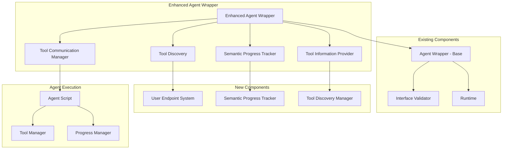

# Enhanced Agent Wrapper Design

**Document Type**: Phase 2.5 Component Design
**Component**: Enhanced Agent Wrapper
**Phase**: 2.5 - Semantic Progress and Tool Integration
**Author**: William
**Date Created**: 2025-06-28
**Last Updated**: 2025-06-28
**Status**: Active
**Purpose**: Design the enhanced agent wrapper with tool discovery and progress tracking

## 🎯 **Overview**

The Enhanced Agent Wrapper extends the existing `AgentWrapper` class to provide tool discovery capabilities and semantic progress tracking while maintaining full backward compatibility. This component serves as the bridge between agents and the new user endpoint tool system.

## 🏗️ **Architecture**



## 🔧 **Core Components**

### **1. Enhanced Agent Wrapper**
Main wrapper class that extends the existing `AgentWrapper` with new capabilities.

```python
class EnhancedAgentWrapper(AgentWrapper):
    """Enhanced wrapper with tool discovery and progress tracking."""
    
    def __init__(self, agent_info: dict, runtime=None, tool_manager=None):
        """
        Initialize enhanced agent wrapper.
        
        Args:
            agent_info: Agent information from AgentLoader
            runtime: Optional runtime for executing methods
            tool_manager: Optional tool manager for tool discovery
        """
        # Initialize base wrapper
        super().__init__(agent_info, runtime)
        
        # Initialize tool discovery and information provider
        self.tool_manager = tool_manager or ToolManager()
        self.tool_discovery = ToolDiscovery(self.tool_manager)
        self.tool_info_provider = ToolInformationProvider(self.tool_discovery)
        
        # Initialize progress tracking
        agent_type = agent_info.get("type", "general")
        self.progress_tracker = SemanticProgressTracker(agent_type)
        
        # Discover available tools
        self._discover_available_tools()
    
    def _discover_available_tools(self):
        """Discover tools available to this agent."""
        try:
            available_tools = self.tool_discovery.discover_tools()
            self.available_tools = available_tools
            logger.info(f"Discovered {len(available_tools)} tools for agent {self.name}")
        except Exception as e:
            logger.warning(f"Failed to discover tools: {e}")
            self.available_tools = []
    
    def discover_tools(self):
        """Get list of available tools."""
        return self.available_tools
    
    def get_tool_info(self, tool_name: str) -> dict:
        """Get detailed information about a specific tool for agent decision-making."""
        return self.tool_info_provider.get_tool_info(tool_name)
    
    def get_tools_by_category(self, category: str) -> list:
        """Get tools filtered by category for agent selection."""
        return self.tool_info_provider.get_tools_by_category(category)
    
    def search_tools(self, query: str) -> list:
        """Search for tools based on query for agent selection."""
        return self.tool_info_provider.search_tools(query)
    
    def execute_with_tools(self, method_name: str, parameters: dict, use_tools: list = None):
        """Execute agent method with optional tool usage.
        
        Note: Agents are responsible for selecting which tools to use.
        This method only provides the tools that agents request.
        """
        
        # Start progress tracking
        self.progress_tracker.start_task(f"Executing {method_name}")
        
        try:
            # Execute the method
            result = self.execute(method_name, parameters)
            
            # If agent specified tools to use, apply them
            if use_tools and self.available_tools:
                result = self._enhance_result_with_tools(result, use_tools)
            
            # Update progress
            self.progress_tracker.complete_task()
            return result
            
        except Exception as e:
            self.progress_tracker.fail_task(str(e))
            raise
    
    def _enhance_result_with_tools(self, base_result, use_tools: list):
        """Enhance base result using available tools."""
        enhanced_result = base_result.copy() if isinstance(base_result, dict) else {"base_result": base_result}
        
        for tool_name in use_tools:
            if tool_name in self.available_tools:
                try:
                    # Use tool to enhance result
                    tool_result = self._execute_tool(tool_name, enhanced_result)
                    enhanced_result[f"tool_{tool_name}"] = tool_result
                    
                    # Update progress
                    self.progress_tracker.update_progress(f"Applied tool: {tool_name}")
                    
                except Exception as e:
                    logger.warning(f"Failed to apply tool {tool_name}: {e}")
                    enhanced_result[f"tool_{tool_name}_error"] = str(e)
        
        return enhanced_result
    
    def _execute_tool(self, tool_name: str, context: dict):
        """Execute a specific tool."""
        if not self.tool_manager:
            raise ToolExecutionError("No tool manager available")
        
        return self.tool_manager.execute_tool(tool_name, context)
```

### **2. Tool Discovery Manager**
Manages tool discovery and availability for agents.

```python
class ToolDiscovery:
    """Manages tool discovery for agents."""
    
    def __init__(self, tool_manager: ToolManager):
        self.tool_manager = tool_manager
        self.discovered_tools = {}
        self.tool_metadata = {}
    
    def discover_tools(self) -> list:
        """Discover all available tools."""
        try:
            # Get tools from all registered endpoints
            all_tools = []
            
            for endpoint_name, endpoint_info in self.tool_manager.user_endpoints.items():
                endpoint_tools = endpoint_info.get("tools", {})
                
                for tool_name, tool_info in endpoint_tools.items():
                    all_tools.append({
                        "name": tool_name,
                        "endpoint": endpoint_name,
                        "description": tool_info.get("description", ""),
                        "parameters": tool_info.get("parameters", {}),
                        "category": self._categorize_tool(tool_info)
                    })
            
            self.discovered_tools = {tool["name"]: tool for tool in all_tools}
            return list(self.discovered_tools.keys())
            
        except Exception as e:
            logger.error(f"Failed to discover tools: {e}")
            return []
    
    def _categorize_tool(self, tool_info: dict) -> str:
        """Categorize tool based on its description and parameters."""
        description = tool_info.get("description", "").lower()
        parameters = tool_info.get("parameters", {})
        
        # Simple categorization logic
        if any(word in description for word in ["file", "read", "write"]):
            return "file_operations"
        elif any(word in description for word in ["data", "analyze", "process"]):
            return "data_processing"
        elif any(word in description for word in ["network", "api", "http"]):
            return "network_operations"
        else:
            return "general"
    
    def get_tool_info(self, tool_name: str) -> dict:
        """Get detailed information about a specific tool."""
        return self.discovered_tools.get(tool_name, {})
    
    def search_tools(self, query: str) -> list:
        """Search for tools based on query."""
        matching_tools = []
        query_lower = query.lower()
        
        for tool_name, tool_info in self.discovered_tools.items():
            if (query_lower in tool_name.lower() or 
                query_lower in tool_info.get("description", "").lower() or
                query_lower in tool_info.get("category", "").lower()):
                matching_tools.append(tool_name)
        
        return matching_tools
```

### **3. Tool Information Provider**
Provides tool information to agents for their own selection logic.

```python
class ToolInformationProvider:
    """Provides tool information to agents for their own selection logic."""
    
    def __init__(self, tool_discovery: ToolDiscovery):
        self.tool_discovery = tool_discovery
        self.tool_categories = {
            "file_operations": ["file", "read", "write", "process"],
            "data_processing": ["data", "analyze", "process", "transform"],
            "network_operations": ["network", "api", "http", "request"],
            "text_processing": ["text", "string", "parse", "extract"]
        }
    
    def get_available_tools(self) -> list:
        """Get list of all available tools."""
        return self.tool_discovery.discover_tools()
    
    def get_tool_info(self, tool_name: str) -> dict:
        """Get detailed information about a specific tool."""
        return self.tool_discovery.get_tool_info(tool_name)
    
    def get_tools_by_category(self, category: str) -> list:
        """Get tools filtered by category."""
        all_tools = self.get_available_tools()
        category_tools = []
        
        for tool_name in all_tools:
            tool_info = self.get_tool_info(tool_name)
            if tool_info.get("category") == category:
                category_tools.append(tool_name)
        
        return category_tools
    
    def search_tools(self, query: str) -> list:
        """Search for tools based on query - agents can use this for their own selection."""
        return self.tool_discovery.search_tools(query)
    
    def get_tool_categories(self) -> dict:
        """Get available tool categories for agent reference."""
        return self.tool_categories.copy()
```

### **4. Tool Communication Manager**
Handles communication between agents and tool endpoints.

```python
class ToolCommunicationManager:
    """Manages communication between agents and tool endpoints."""
    
    def __init__(self, tool_manager: ToolManager):
        self.tool_manager = tool_manager
        self.communication_cache = {}
        self.retry_config = {
            "max_retries": 3,
            "retry_delay": 1.0,
            "backoff_factor": 2.0
        }
    
    def execute_tool_with_retry(self, tool_name: str, parameters: dict) -> Any:
        """Execute tool with retry logic."""
        last_exception = None
        
        for attempt in range(self.retry_config["max_retries"]):
            try:
                result = self.tool_manager.execute_tool(tool_name, parameters)
                
                # Cache successful result
                cache_key = f"{tool_name}:{hash(str(parameters))}"
                self.communication_cache[cache_key] = {
                    "result": result,
                    "timestamp": time.time(),
                    "ttl": 300  # 5 minutes cache
                }
                
                return result
                
            except Exception as e:
                last_exception = e
                logger.warning(f"Tool execution attempt {attempt + 1} failed: {e}")
                
                if attempt < self.retry_config["max_retries"] - 1:
                    # Wait before retry
                    delay = self.retry_config["retry_delay"] * (self.retry_config["backoff_factor"] ** attempt)
                    time.sleep(delay)
        
        # All retries failed
        raise ToolExecutionError(f"Tool {tool_name} execution failed after {self.retry_config['max_retries']} attempts: {last_exception}")
    
    def get_cached_result(self, tool_name: str, parameters: dict) -> Optional[Any]:
        """Get cached result if available and valid."""
        cache_key = f"{tool_name}:{hash(str(parameters))}"
        cached_data = self.communication_cache.get(cache_key)
        
        if cached_data:
            # Check if cache is still valid
            if time.time() - cached_data["timestamp"] < cached_data["ttl"]:
                return cached_data["result"]
            else:
                # Remove expired cache entry
                del self.communication_cache[cache_key]
        
        return None
    
    def clear_cache(self):
        """Clear all cached results."""
        self.communication_cache.clear()
```

## 🚀 **Usage Examples**

### **Basic Tool Discovery**
```python
# Load agent with enhanced capabilities
agent = load_agent("agentplug/analyzer")
enhanced_agent = EnhancedAgentWrapper(agent.agent_info, agent.runtime)

# Discover available tools
available_tools = enhanced_agent.discover_tools()
print(f"Available tools: {available_tools}")
# Output: Available tools: ['data_analyzer', 'file_processor', 'text_extractor']
```

### **Agent-Driven Tool Selection**
```python
# Agent discovers available tools and selects appropriate ones
available_tools = enhanced_agent.discover_tools()
print(f"Available tools: {available_tools}")

# Agent can get detailed tool information for decision-making
data_tools = enhanced_agent.get_tools_by_category("data_processing")
file_tools = enhanced_agent.search_tools("file")

# Agent selects tools based on its own logic
selected_tools = ["data_analyzer", "file_processor"]  # Agent's choice

# Execute with agent-selected tools
result = enhanced_agent.execute_with_tools(
    method_name="analyze_data",
    parameters={"data": "customer_data.csv"},
    use_tools=selected_tools  # Agent specifies which tools to use
)
```

### **Progress Tracking Integration**
```python
# Progress tracking is automatic
with enhanced_agent.progress_tracker.track_method("analyze_data"):
    result = enhanced_agent.execute_with_tools(
        method_name="analyze_data",
        parameters={"data": "customer_data.csv"}
    )

# Progress updates are shown automatically:
# 🔍 Starting data analysis: Analyze customer data
# 📚 Discovering available tools...
# ✅ Found 3 tools: data_analyzer, file_processor, text_extractor
# 🔍 Analyzing data: Using data_analyzer tool...
# 📊 Processing data with custom analysis logic...
# ✅ Data analysis completed
```

## 🔒 **Security and Validation**

### **Tool Access Control**
- **Endpoint Validation**: Verify tool endpoints are accessible
- **Parameter Validation**: Validate all tool parameters before execution
- **Result Validation**: Validate tool results for security concerns

### **Error Handling**
- **Graceful Degradation**: Continue execution even if some tools fail
- **Comprehensive Logging**: Log all tool interactions for audit
- **Retry Logic**: Automatic retry for transient failures

### **Resource Management**
- **Connection Pooling**: Efficient HTTP connection management
- **Timeout Controls**: Prevent tools from hanging indefinitely
- **Memory Management**: Cache results with TTL to prevent memory leaks

## 📊 **Performance and Monitoring**

### **Performance Metrics**
- **Tool Discovery Time**: How long tool discovery takes
- **Tool Execution Time**: Individual tool performance
- **Cache Hit Rate**: Effectiveness of result caching
- **Error Rates**: Tool failure frequency

### **Monitoring and Alerting**
- **Tool Availability**: Monitor tool endpoint health
- **Performance Degradation**: Alert on slow tool execution
- **Error Thresholds**: Alert on high error rates

## 🎯 **Benefits**

### **1. Seamless Integration**
- **Backward Compatible**: Existing agents work without changes
- **Progressive Enhancement**: New features are opt-in
- **Unified Interface**: Consistent tool access across all agents

### **2. Agent-Driven Tool Usage**
- **Tool Discovery**: Agents can discover available tools
- **Agent Selection**: Agents choose appropriate tools based on their own logic
- **Information Access**: Agents get detailed tool information for decision-making

### **3. Enhanced User Experience**
- **Progress Transparency**: Users see exactly what's happening
- **Error Handling**: Graceful handling of tool failures
- **Performance Optimization**: Caching and retry logic

## 🔮 **Future Enhancements**

### **1. Enhanced Tool Information**
- **Tool Performance Metrics**: Provide historical tool performance data to agents
- **Usage Analytics**: Share tool usage patterns with agents for better selection
- **Tool Recommendations**: Suggest tools based on similar tasks (optional)

### **2. Tool Composition**
- **Workflow Creation**: Automatically create tool workflows
- **Dependency Resolution**: Handle tool dependencies
- **Result Aggregation**: Combine results from multiple tools

### **3. Enhanced Monitoring**
- **Real-time Metrics**: Live performance monitoring
- **Predictive Analytics**: Predict tool failures
- **Resource Optimization**: Optimize tool resource usage

## 📝 **Conclusion**

The Enhanced Agent Wrapper provides a powerful bridge between agents and the user endpoint tool system. By combining tool discovery, information provision, and progress tracking, it gives agents access to powerful tools while maintaining agent autonomy in tool selection.

**Key Takeaway**: The Enhanced Agent Wrapper makes tools accessible to agents through discovery and information provision, while agents maintain full control over tool selection based on their own logic and understanding of tasks.
