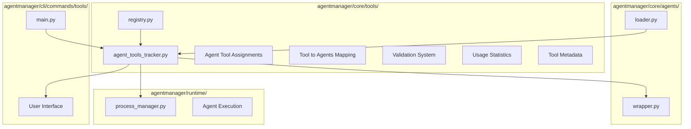

# Agent-Tools Tracker Design

**Document Type**: Component Design
**Phase**: 2.5 - Native MCP Tool Integration
**Author**: William
**Date Created**: 2025-06-28
**Last Updated**: 2025-06-28
**Status**: Active
**Purpose**: Design specification for agent-tools tracker system

## 🎯 **Overview**

The Agent-Tools Tracker is a centralized system that manages which tools are assigned to which agents, providing bidirectional lookup, usage statistics, and runtime integration for the MCP tool system.

## 🏗️ **Architecture**



## 📁 **Module Structure**

The agent-tools tracker is implemented as a **new module within the existing `tools` package**:

```
agentmanager/core/tools/
├── __init__.py
├── decorators.py          # @tool decorator
├── discovery.py           # Tool discovery system
├── registry.py            # Global tool registry
├── agent_tools_tracker.py # NEW: Agent-tools assignment tracking
├── execution/
│   └── __init__.py
├── security.py
└── validation.py
```

## 🔧 **Core Components**

### **1. AgentToolAssignment**
Data structure representing tool assignment for a specific agent.

```python
@dataclass
class AgentToolAssignment:
    agent_name: str  # e.g., "agentplug/coding-agent"
    tool_names: List[str]
    assigned_at: datetime
    is_active: bool = True
```

### **2. AgentToolsTracker**
Main tracker class that manages all tool assignments.

```python
class AgentToolsTracker:
    def __init__(self):
        self._agent_assignments: Dict[str, AgentToolAssignment] = {}
        self._tool_to_agents: Dict[str, Set[str]] = {}
        self._global_tool_registry = None
```

### **3. Key Methods**

#### **Assignment Management**
- `assign_tools_to_agent(agent_name, tool_names)` - Assign tools to agent
- `remove_agent_tools(agent_name)` - Remove all tools from agent
- `get_agent_tools(agent_name)` - Get tools assigned to agent

#### **Query Operations**
- `get_agents_with_tool(tool_name)` - Get agents using specific tool
- `is_agent_assigned_tool(agent_name, tool_name)` - Check specific assignment
- `get_all_assignments()` - Get all assignments

#### **Statistics and Monitoring**
- `get_tool_usage_stats()` - Get usage statistics
- `get_assignment_info(agent_name)` - Get detailed assignment info

## 🔄 **Tool Assignment Flow**

### **1. Tool Assignment Process**
```python
# User loads agent with tools
analysis_agent = amg.load_agent(
    base_agent="agentplug/analysis-agent",
    tools=["data_analyzer", "file_processor"]
)

# Framework automatically:
# 1. Validates tools exist in global registry
# 2. Creates assignment in tracker
# 3. Updates bidirectional mappings
# 4. Logs assignment for monitoring
```

### **2. Runtime Tool Context**
```python
# During agent execution, framework:
# 1. Queries tracker for agent's tools
# 2. Creates tool context with assigned tools
# 3. Injects context via environment variables
# 4. Agent accesses tools through context
```

### **3. Assignment Validation**
```python
# Before assignment:
# 1. Check if tools exist in global registry
# 2. Validate agent exists
# 3. Check for conflicts or duplicates
# 4. Create assignment if valid
```

## 📊 **Data Structures**

### **Agent Assignments**
```python
{
    "agentplug/coding-agent": AgentToolAssignment(
        agent_name="agentplug/coding-agent",
        tool_names=["code_analyzer", "file_writer"],
        assigned_at=datetime(2025, 6, 28, 10, 30, 0),
        is_active=True
    ),
    "agentplug/analysis-agent": AgentToolAssignment(
        agent_name="agentplug/analysis-agent", 
        tool_names=["data_analyzer", "file_processor"],
        assigned_at=datetime(2025, 6, 28, 10, 31, 0),
        is_active=True
    )
}
```

### **Tool to Agents Mapping**
```python
{
    "code_analyzer": {"agentplug/coding-agent"},
    "file_writer": {"agentplug/coding-agent"},
    "data_analyzer": {"agentplug/analysis-agent"},
    "file_processor": {"agentplug/coding-agent", "agentplug/analysis-agent"}
}
```

## 🎯 **CLI Integration**

### **Tool Management Commands**
```bash
# Show all assignments
agenthub tools tracker

# Assign tools to agent
agenthub tools assign agentplug/coding-agent code_analyzer file_writer

# Show agent's tools
agenthub tools agent agentplug/coding-agent

# Show usage statistics
agenthub tools stats

# Remove agent's tools
agenthub tools remove agentplug/coding-agent
```

### **Command Implementation**
```python
# agentmanager/cli/commands/tools/main.py
@tools.command("tracker")
def tools_tracker():
    """Show agent-tools tracker status."""
    from agentmanager.core.tools.agent_tools_tracker import get_agent_tools_tracker
    
    tracker = get_agent_tools_tracker()
    assignments = tracker.get_all_assignments()
    
    # Display in table format
    table = Table(title="🔧 Agent-Tools Tracker")
    table.add_column("Agent", style="cyan")
    table.add_column("Tools", style="green")
    table.add_column("Count", style="magenta")
    table.add_column("Status", style="yellow")
    
    for agent_name, tool_names in assignments.items():
        assignment = tracker.get_assignment_info(agent_name)
        status = "Active" if assignment and assignment.is_active else "Inactive"
        table.add_row(agent_name, ", ".join(tool_names), str(len(tool_names)), status)
    
    console.print(table)
```

## 🔧 **Runtime Integration**

### **Process Manager Integration**
```python
# agentmanager/runtime/process_manager.py
class ProcessManager:
    def execute_agent(self, agent_path, method, parameters, tool_names=None):
        # Get agent name from path
        agent_name = self._extract_agent_name_from_path(agent_path)
        
        # Query tracker for assigned tools
        if tool_names is None:
            from agentmanager.core.tools.agent_tools_tracker import get_agent_tools_tracker
            tracker = get_agent_tools_tracker()
            tool_names = tracker.get_agent_tools(agent_name)
        
        # Create tool context
        tool_context = self._create_tool_context(tool_names)
        
        # Set environment variables
        env = os.environ.copy()
        env.update(self._create_tool_environment(tool_context))
        
        # Execute with tool context
        result = subprocess.run(..., env=env)
```

### **Agent Wrapper Integration**
```python
# agentmanager/core/agents/wrapper.py
class AgentWrapper:
    def __init__(self, agent_info, tool_names=None):
        self.agent_name = f"{agent_info['namespace']}/{agent_info['agent_name']}"
        self.tool_names = tool_names or []
        
        # Register assignment in tracker
        if self.tool_names:
            from agentmanager.core.tools.agent_tools_tracker import get_agent_tools_tracker
            tracker = get_agent_tools_tracker()
            tracker.assign_tools_to_agent(self.agent_name, self.tool_names)
```

## 📈 **Usage Statistics**

### **Tool Usage Tracking**
```python
def get_tool_usage_stats(self) -> Dict[str, int]:
    """Get statistics on tool usage across agents."""
    return {
        tool_name: len(agents) 
        for tool_name, agents in self._tool_to_agents.items()
    }

# Example output:
# {
#     "code_analyzer": 1,
#     "file_writer": 1, 
#     "data_analyzer": 1,
#     "file_processor": 2
# }
```

### **Assignment Monitoring**
```python
def get_assignment_info(self, agent_name: str) -> Optional[AgentToolAssignment]:
    """Get detailed assignment information."""
    return self._agent_assignments.get(agent_name)

# Example usage:
assignment = tracker.get_assignment_info("agentplug/coding-agent")
print(f"Assigned at: {assignment.assigned_at}")
print(f"Tools: {assignment.tool_names}")
print(f"Active: {assignment.is_active}")
```

## 🔒 **Security and Validation**

### **Tool Validation**
- Verify tools exist in global registry before assignment
- Check for circular dependencies or conflicts
- Validate agent names and formats

### **Access Control**
- Agents can only access assigned tools
- No cross-agent tool access
- Tool assignments are isolated per agent

### **Error Handling**
- Graceful handling of invalid tool names
- Clear error messages for assignment failures
- Rollback on assignment errors

## 🚀 **Performance Considerations**

### **Efficient Lookups**
- O(1) agent → tools lookup
- O(1) tool → agents lookup
- Minimal memory overhead

### **Caching**
- Assignment data cached in memory
- Lazy loading of tool metadata
- Efficient batch operations

### **Scalability**
- Supports large numbers of agents and tools
- Efficient data structures for lookups
- Minimal performance impact on agent execution

## 📝 **Implementation Checklist**

- [ ] Create `agentmanager/core/tools/agent_tools_tracker.py` module
- [ ] Implement `AgentToolAssignment` dataclass
- [ ] Implement `AgentToolsTracker` class
- [ ] Add assignment validation logic
- [ ] Implement bidirectional lookup mappings
- [ ] Add usage statistics tracking
- [ ] Update `agentmanager/core/tools/__init__.py` to export tracker
- [ ] Create CLI management commands in `agentmanager/cli/commands/tools/main.py`
- [ ] Integrate with `agentmanager/runtime/process_manager.py`
- [ ] Add runtime tool context injection
- [ ] Implement error handling and validation
- [ ] Add comprehensive tests
- [ ] Create documentation and examples

## 🎯 **Success Criteria**

- [ ] 100% of tool assignments tracked correctly
- [ ] O(1) lookup performance for all operations
- [ ] CLI commands work for all management operations
- [ ] Runtime integration provides correct tool context
- [ ] Usage statistics accurate and up-to-date
- [ ] Error handling prevents invalid assignments
- [ ] Backward compatibility maintained
- [ ] Performance impact < 1% on agent execution

