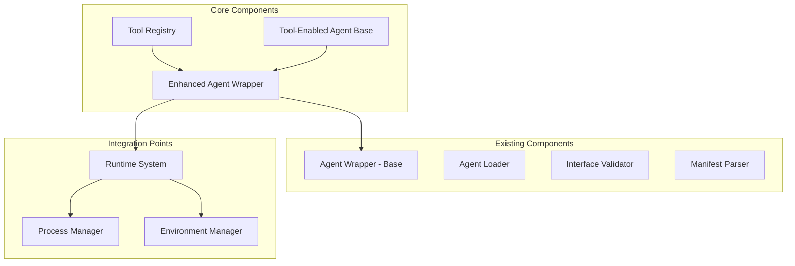

# Phase 2.5 Core Components

**Document Type**: Phase 2.5 Core Components Overview
**Component**: Core Components
**Phase**: 2.5 - Semantic Progress and Tool Integration
**Author**: William
**Date Created**: 2025-06-28
**Last Updated**: 2025-06-28
**Status**: Active
**Purpose**: Overview of core components for tool integration and semantic progress tracking

## 🎯 **Overview**

The Core Components module provides the fundamental building blocks for Phase 2.5: Semantic Progress and Tool Integration. These components extend the existing agent architecture to support external tool integration and human-readable progress tracking.

## 🏗️ **Core Architecture**

## 🔧 **Core Components**

### **1. Tool Registry System**
Centralized tool management for built-in and external tools with automatic discovery and validation.

**Key Features**:
- Tool registration and discovery
- Tool validation and categorization
- Security assessment
- Performance metrics tracking

**Location**: `01_tool_registry_design.md`

### **2. Enhanced Agent Wrapper**
Extends the existing `AgentWrapper` class with tool integration capabilities while maintaining backward compatibility.

**Key Features**:
- Tool context injection
- Progress tracking integration
- Backward compatibility
- Enhanced execution capabilities

**Location**: `02_enhanced_agent_wrapper_design.md`

### **3. Tool-Enabled Agent Base Classes**
Base classes for agents that can intelligently use tools with semantic progress reporting.

**Key Features**:
- Tool integration interfaces
- Progress tracking patterns
- Tool usage templates
- Error handling patterns

**Location**: `03_tool_enabled_agent_design.md`

## 🔄 **Integration with Existing System**

### **Backward Compatibility**
- All existing agents continue to work without changes
- Enhanced wrapper is a drop-in replacement
- New features are opt-in

### **Extension Points**
- Extends existing `AgentWrapper` class
- Integrates with existing runtime system
- Maintains existing agent interfaces
- Adds new capabilities incrementally

## 📋 **Design Documents**

1. **[Tool Registry Design](01_tool_registry_design.md)** - Comprehensive tool management system
2. **[Enhanced Agent Wrapper Design](02_enhanced_agent_wrapper_design.md)** - Tool integration and progress tracking
3. **[Tool-Enabled Agent Design](03_tool_enabled_agent_design.md)** - Base classes for tool-using agents

## 🎯 **Success Criteria**

- [ ] Tool registry manages tools effectively
- [ ] Enhanced wrapper extends existing functionality
- [ ] Tool-enabled base classes provide clear patterns
- [ ] Backward compatibility is maintained
- [ ] Integration with existing system is seamless

## 🔮 **Future Enhancements**

1. **Advanced Tool Orchestration**: Automatic tool workflow creation
2. **Tool Performance Metrics**: Track and optimize tool usage
3. **Dynamic Tool Discovery**: Discover tools at runtime
4. **Tool Composition**: Combine multiple tools into workflows
