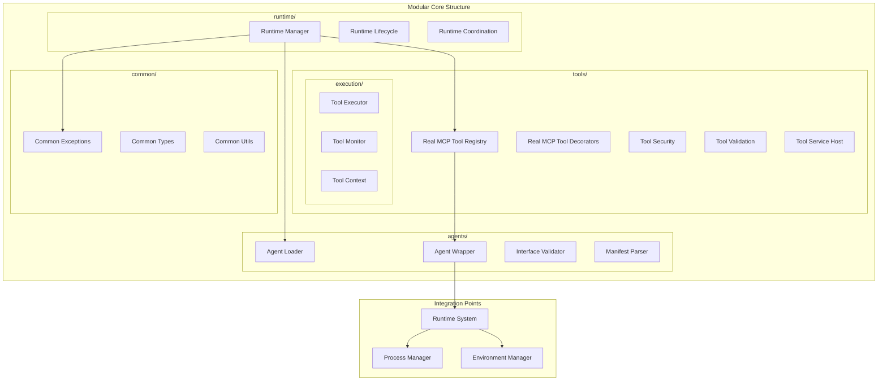

# Phase 2.5 Real MCP Core Components

**Document Type**: Phase 2.5 Real MCP Core Components Overview
**Component**: Real MCP Core Components
**Phase**: 2.5 - Real MCP Tool Integration
**Author**: William
**Date Created**: 2025-06-28
**Last Updated**: 2025-06-28
**Status**: Active
**Purpose**: Overview of core components for real MCP tool integration using official MCP Python SDK

## 🎯 **Overview**

The Real MCP Core Components module provides the fundamental building blocks for Phase 2.5: **Real MCP Tool Integration** using the **official MCP Python SDK** from [https://github.com/modelcontextprotocol/python-sdk](https://github.com/modelcontextprotocol/python-sdk). These components extend the existing agent architecture to support **real MCP tool integration** and human-readable progress tracking via **official MCP protocol**.

## 🏗️ **Modular Core Architecture**

## 🔧 **Modular Core Components**

### **1. Agents Package (`core/agents/`)**
Agent lifecycle management, loading, and execution components.

**Components**:
- **`loader.py`**: Agent discovery and loading logic
- **`wrapper.py`**: Agent execution wrapper and interface
- **`validator.py`**: Agent interface validation
- **`manifest.py`**: Agent manifest parsing and validation

**Key Features**:
- Agent discovery and loading
- Interface validation and compliance checking
- Manifest parsing and validation
- Agent execution wrapper with error handling

### **2. Tools Package (`core/tools/`)**
Tool registration, validation, security, and execution components.

**Components**:
- **`decorators.py`**: Tool decorator system and metadata
- **`registry.py`**: Tool registration and management
- **`security.py`**: Tool security validation and sandboxing
- **`service.py`**: HTTP service hosting for tools
- **`validation.py`**: Tool validation and compliance checking
- **`execution/`**: Tool execution engine and monitoring

**Key Features**:
- Tool registration and discovery
- Security validation and sandboxing
- HTTP service hosting
- Execution monitoring and context management

### **3. Runtime Package (`core/runtime/`)**
Runtime management and component coordination.

**Components**:
- **`manager.py`**: Runtime lifecycle management
- **`lifecycle.py`**: Component lifecycle management
- **`coordination.py`**: Component coordination and communication

**Key Features**:
- Runtime lifecycle management
- Component coordination
- Service orchestration

### **4. Common Package (`core/common/`)**
Shared utilities, types, and exceptions.

**Components**:
- **`exceptions.py`**: Common exception classes
- **`types.py`**: Common type definitions and protocols
- **`utils.py`**: Shared utility functions

**Key Features**:
- Centralized exception handling
- Common type definitions
- Shared utility functions

## 🔄 **Integration with Existing System**

### **Backward Compatibility**
- All existing agents continue to work without changes
- Enhanced wrapper is a drop-in replacement
- New features are opt-in

### **Extension Points**
- Extends existing `AgentWrapper` class
- Integrates with existing runtime system
- Maintains existing agent interfaces
- Adds new capabilities incrementally

## 📋 **Design Documents**

1. **[Tool Registry Design](01_tool_registry_design.md)** - Comprehensive tool management system
2. **[Tool-Enabled Agent Design](02_tool_enabled_agent_design.md)** - Base classes for tool-using agents
3. **[Enhanced Agent Wrapper Design](03_enhanced_agent_wrapper_design.md)** - Tool integration and progress tracking
4. **[Modular Architecture Design](04_modular_architecture_design.md)** - Modular core architecture and migration strategy
5. **[Agent-Tools Tracker Module Design](05_agent_tools_tracker_module_design.md)** - Module structure and placement for agent-tools tracker
6. **[Agent-Tools Tracker Design](06_agent_tools_tracker_design.md)** - Comprehensive agent-tools assignment tracking system

## 🎯 **Success Criteria**

- [ ] Tool registry manages tools effectively
- [ ] Enhanced wrapper extends existing functionality
- [ ] Tool-enabled base classes provide clear patterns
- [ ] Backward compatibility is maintained
- [ ] Integration with existing system is seamless

## 🔮 **Future Enhancements**

1. **Advanced Tool Orchestration**: Automatic tool workflow creation
2. **Tool Performance Metrics**: Track and optimize tool usage
3. **Dynamic Tool Discovery**: Discover tools at runtime
4. **Tool Composition**: Combine multiple tools into workflows
