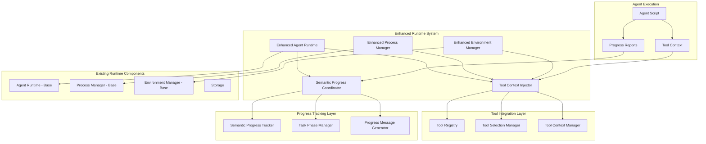

# Real MCP Runtime Integration Design

**Document Type**: Phase 2.5 Component Design
**Component**: Real MCP Runtime Integration with Tool Context
**Phase**: 2.5 - Real MCP Tool Integration
**Author**: William
**Date Created**: 2025-06-28
**Last Updated**: 2025-06-28
**Status**: Active
**Purpose**: Design the runtime integration system for real MCP tool context injection and enhanced execution using official MCP Python SDK

## 🎯 **Overview**

The Real MCP Runtime Integration system extends the existing Agent Runtime to support **real MCP tool context injection** for **both built-in tools AND external tools** (populated through `amg.load_agent(tools=[])`), enhanced process management, and coordination with the semantic progress tracking system. This component ensures that **real MCP tools** are properly available to agents during execution via the **official MCP Python SDK** while maintaining the existing runtime architecture.

## 🏗️ **Architecture**



## 🔧 **Core Components**

### **1. Enhanced Agent Runtime**
Extends the existing `AgentRuntime` class with tool integration capabilities.

```python
class EnhancedAgentRuntime(AgentRuntime):
    """Enhanced runtime with tool integration and progress tracking."""
    
    def __init__(self, storage=None):
        """Initialize enhanced runtime."""
        super().__init__(storage)
        
        # Initialize tool integration components
        self.tool_context_injector = ToolContextInjector()
        self.tool_registry = ToolRegistry()
        self.progress_coordinator = SemanticProgressCoordinator()
        
        # Enhance existing components
        self.process_manager = EnhancedProcessManager()
        self.environment_manager = EnhancedEnvironmentManager()
    
    def execute_agent(self, namespace: str, agent_name: str, method: str, 
                     parameters: dict, tools: List[dict] = None) -> dict:
        """
        Execute agent with enhanced capabilities.
        
        Args:
            namespace: Agent namespace
            agent_name: Agent name
            method: Method to execute
            parameters: Method parameters
            tools: Optional external tools
            
        Returns:
            Execution result
        """
        try:
            # Start progress tracking
            self.progress_coordinator.start_execution(
                f"{namespace}/{agent_name}.{method}"
            )
            
            # Register tools if provided
            if tools:
                self._register_tools(tools)
            
            # Get agent information
            agent_info = self._get_agent_info(namespace, agent_name)
            if not agent_info:
                return self._handle_agent_not_found(namespace, agent_name)
            
            # Validate method
            if not self._validate_method(agent_info, method):
                return self._handle_method_not_found(agent_info, method)
            
            # Prepare tool context
            tool_context = self._prepare_tool_context(agent_info, method, parameters)
            
            # Execute agent with tool context
            result = self._execute_with_tools(agent_info, method, parameters, tool_context)
            
            # Complete progress tracking
            self.progress_coordinator.complete_execution("Agent execution completed")
            
            return result
            
        except Exception as e:
            # Handle execution errors
            self.progress_coordinator.log_error(f"Execution failed: {str(e)}")
            return self._handle_execution_error(e)
    
    def _register_tools(self, tools: List[dict]):
        """Register external tools with the runtime."""
        for tool_info in tools:
            self.tool_registry.register_tool(tool_info)
    
    def _prepare_tool_context(self, agent_info: dict, method: str, 
                             parameters: dict) -> dict:
        """Prepare tool context for agent execution."""
        # Get available tools
        available_tools = self.tool_registry.list_tools()
        
        # Select appropriate tools for this method
        selected_tools = self._select_tools_for_method(agent_info, method, parameters)
        
        # Create tool context
        tool_context = {
            "available_tools": selected_tools,
            "method_name": method,
            "parameters": parameters,
            "agent_info": {
                "name": agent_info.get("name"),
                "type": agent_info.get("type", "general"),
                "namespace": agent_info.get("namespace")
            },
            "execution_id": str(uuid.uuid4()),
            "timestamp": time.time()
        }
        
        return tool_context
    
    def _select_tools_for_method(self, agent_info: dict, method: str, 
                                parameters: dict) -> List[dict]:
        """Select appropriate tools for method execution."""
        # Get method information
        method_info = self._get_method_info(agent_info, method)
        
        # Use tool selection manager to choose tools
        tool_selector = ToolSelectionManager()
        return tool_selector.select_tools(method_info, parameters, self.tool_registry)
    
    def _execute_with_tools(self, agent_info: dict, method: str, 
                           parameters: dict, tool_context: dict) -> dict:
        """Execute agent with tool context."""
        # Get agent path
        agent_path = self._get_agent_path(agent_info)
        
        # Execute using enhanced process manager
        return self.process_manager.execute_agent_with_context(
            agent_path, method, parameters, tool_context
        )
```

### **2. Enhanced Process Manager**
Extends the existing `ProcessManager` to support tool context injection.

```python
class EnhancedProcessManager(ProcessManager):
    """Enhanced process manager with tool context support."""
    
    def __init__(self):
        """Initialize enhanced process manager."""
        super().__init__()
        self.tool_context_manager = ToolContextManager()
    
    def execute_agent_with_context(self, agent_path: str, method: str, 
                                 parameters: dict, tool_context: dict) -> dict:
        """
        Execute agent with tool context injection.
        
        Args:
            agent_path: Path to agent directory
            method: Method to execute
            parameters: Method parameters
            tool_context: Tool context to inject
            
        Returns:
            Execution result
        """
        try:
            # Validate agent structure
            if not self.validate_agent_structure(agent_path):
                return {
                    "error": f"Invalid agent structure: {agent_path}",
                    "agent_path": agent_path
                }
            
            # Prepare execution environment
            env = self._prepare_execution_environment(tool_context)
            
            # Execute agent with enhanced environment
            result = self._execute_subprocess_with_context(
                agent_path, method, parameters, env
            )
            
            return result
            
        except Exception as e:
            logger.error(f"Failed to execute agent with context: {e}")
            return {
                "error": f"Execution failed: {str(e)}",
                "agent_path": agent_path,
                "method": method
            }
    
    def _prepare_execution_environment(self, tool_context: dict) -> dict:
        """Prepare execution environment with tool context."""
        # Start with current environment
        env = os.environ.copy()
        
        # Inject tool context
        self.tool_context_manager.inject_context(env, tool_context)
        
        # Add additional environment variables
        env["AGENT_EXECUTION_MODE"] = "enhanced"
        env["AGENT_TOOL_INTEGRATION"] = "enabled"
        
        return env
    
    def _execute_subprocess_with_context(self, agent_path: str, method: str, 
                                       parameters: dict, env: dict) -> dict:
        """Execute agent subprocess with enhanced environment."""
        try:
            # Prepare command
            command = self._build_execution_command(agent_path, method, parameters)
            
            # Execute with enhanced environment
            result = subprocess.run(
                command,
                env=env,
                capture_output=True,
                text=True,
                timeout=300,  # 5 minute timeout
                cwd=agent_path
            )
            
            # Process result
            return self._process_execution_result(result)
            
        except subprocess.TimeoutExpired:
            return {
                "error": "Execution timeout",
                "agent_path": agent_path,
                "method": method,
                "timeout": 300
            }
        except Exception as e:
            return {
                "error": f"Subprocess execution failed: {str(e)}",
                "agent_path": agent_path,
                "method": method
            }
    
    def _build_execution_command(self, agent_path: str, method: str, 
                                parameters: dict) -> List[str]:
        """Build execution command for agent."""
        agent_script = os.path.join(agent_path, "agent.py")
        
        # Convert parameters to JSON
        params_json = json.dumps(parameters)
        
        return [
            sys.executable,
            agent_script,
            method,
            params_json
        ]
    
    def _process_execution_result(self, result: subprocess.CompletedProcess) -> dict:
        """Process subprocess execution result."""
        if result.returncode == 0:
            try:
                # Try to parse JSON output
                output = json.loads(result.stdout)
                return {
                    "result": output,
                    "stdout": result.stdout,
                    "stderr": result.stderr,
                    "returncode": result.returncode
                }
            except json.JSONDecodeError:
                # Return raw output if not JSON
                return {
                    "result": result.stdout,
                    "stdout": result.stdout,
                    "stderr": result.stderr,
                    "returncode": result.returncode
                }
        else:
            return {
                "error": f"Agent execution failed with return code {result.returncode}",
                "stdout": result.stdout,
                "stderr": result.stderr,
                "returncode": result.returncode
            }
```

### **3. Enhanced Environment Manager**
Extends the existing `EnvironmentManager` to support tool-related environment setup.

```python
class EnhancedEnvironmentManager(EnvironmentManager):
    """Enhanced environment manager with tool support."""
    
    def __init__(self):
        """Initialize enhanced environment manager."""
        super().__init__()
        self.tool_environment_setup = ToolEnvironmentSetup()
    
    def setup_agent_environment(self, agent_path: str, tool_context: dict = None) -> bool:
        """
        Setup agent environment with optional tool context.
        
        Args:
            agent_path: Path to agent directory
            tool_context: Optional tool context
            
        Returns:
            True if setup successful
        """
        try:
            # Setup base environment
            base_success = super().setup_agent_environment(agent_path)
            if not base_success:
                return False
            
            # Setup tool environment if context provided
            if tool_context:
                tool_success = self.tool_environment_setup.setup_tool_environment(
                    agent_path, tool_context
                )
                return tool_success
            
            return True
            
        except Exception as e:
            logger.error(f"Failed to setup enhanced agent environment: {e}")
            return False
    
    def cleanup_agent_environment(self, agent_path: str):
        """Cleanup agent environment including tool context."""
        try:
            # Cleanup tool environment
            self.tool_environment_setup.cleanup_tool_environment(agent_path)
            
            # Cleanup base environment
            super().cleanup_agent_environment(agent_path)
            
        except Exception as e:
            logger.error(f"Failed to cleanup enhanced agent environment: {e}")
```

### **4. Tool Context Manager**
Manages tool context injection and cleanup.

```python
class ToolContextManager:
    """Manages tool context injection and cleanup."""
    
    def __init__(self):
        """Initialize tool context manager."""
        self.context_variables = [
            "AGENT_TOOL_CONTEXT",
            "AGENT_TOOL_COUNT",
            "AGENT_TYPE",
            "AGENT_EXECUTION_MODE",
            "AGENT_TOOL_INTEGRATION"
        ]
    
    def inject_context(self, env: dict, tool_context: dict):
        """Inject tool context into environment."""
        # Inject main tool context
        env["AGENT_TOOL_CONTEXT"] = json.dumps(tool_context)
        
        # Inject derived variables
        env["AGENT_TOOL_COUNT"] = str(len(tool_context.get("available_tools", [])))
        env["AGENT_TYPE"] = tool_context.get("agent_info", {}).get("type", "general")
        env["AGENT_EXECUTION_MODE"] = "enhanced"
        env["AGENT_TOOL_INTEGRATION"] = "enabled"
        
        # Inject execution metadata
        env["AGENT_EXECUTION_ID"] = tool_context.get("execution_id", "")
        env["AGENT_EXECUTION_TIMESTAMP"] = str(tool_context.get("timestamp", ""))
    
    def cleanup_context(self, env: dict):
        """Cleanup tool context from environment."""
        for var in self.context_variables:
            if var in env:
                del env[var]
    
    def get_context_from_environment(self) -> Optional[dict]:
        """Get tool context from current environment."""
        context_str = os.environ.get("AGENT_TOOL_CONTEXT")
        if context_str:
            try:
                return json.loads(context_str)
            except json.JSONDecodeError:
                logger.warning("Failed to parse tool context from environment")
                return None
        return None
```

### **5. Semantic Progress Coordinator**
Coordinates progress tracking across the runtime system.

```python
class SemanticProgressCoordinator:
    """Coordinates semantic progress tracking across runtime components."""
    
    def __init__(self):
        """Initialize progress coordinator."""
        self.progress_tracker = SemanticProgressTracker()
        self.execution_history = []
    
    def start_execution(self, execution_id: str):
        """Start tracking execution progress."""
        self.progress_tracker.start_task(f"Execute {execution_id}")
        
        # Record execution start
        self.execution_history.append({
            "execution_id": execution_id,
            "start_time": time.time(),
            "status": "running"
        })
    
    def update_progress(self, phase: str, progress: float, details: str = ""):
        """Update execution progress."""
        self.progress_tracker.update_phase(phase, progress)
        if details:
            self.progress_tracker.log_activity(details)
    
    def complete_execution(self, result_summary: str):
        """Mark execution as complete."""
        self.progress_tracker.complete_task(result_summary)
        
        # Update execution history
        if self.execution_history:
            self.execution_history[-1].update({
                "end_time": time.time(),
                "status": "completed",
                "result_summary": result_summary
            })
    
    def log_error(self, error_message: str):
        """Log execution error."""
        self.progress_tracker.log_activity(f"Error: {error_message}", "error")
        
        # Update execution history
        if self.execution_history:
            self.execution_history[-1].update({
                "end_time": time.time(),
                "status": "failed",
                "error": error_message
            })
    
    def get_execution_summary(self) -> dict:
        """Get execution summary."""
        if not self.execution_history:
            return {"status": "no_executions"}
        
        latest = self.execution_history[-1]
        return {
            "latest_execution": latest,
            "total_executions": len(self.execution_history),
            "success_rate": self._calculate_success_rate()
        }
    
    def _calculate_success_rate(self) -> float:
        """Calculate execution success rate."""
        if not self.execution_history:
            return 0.0
        
        successful = sum(1 for ex in self.execution_history if ex["status"] == "completed")
        return successful / len(self.execution_history)
```

## 🔄 **Integration with Existing System**

### **1. Backward Compatibility**
The enhanced runtime maintains full backward compatibility:

```python
# Existing usage continues to work
runtime = AgentRuntime(storage)
result = runtime.execute_agent("agentplug", "coding-agent", "generate_code", params)

# Enhanced usage (new capabilities)
enhanced_runtime = EnhancedAgentRuntime(storage)
result = enhanced_runtime.execute_agent(
    "agentplug", "coding-agent", "generate_code", params, external_tools
)
```

### **2. Gradual Enhancement**
- Existing agents work without modification
- New features are opt-in
- Tool integration can be added incrementally

### **3. Environment Variable Injection**
Tools are made available to agents through environment variables:

```bash
# Main tool context
AGENT_TOOL_CONTEXT='{"available_tools":[...]}'

# Derived variables
AGENT_TOOL_COUNT=2
AGENT_TYPE=scientific_analysis
AGENT_EXECUTION_MODE=enhanced
AGENT_TOOL_INTEGRATION=enabled

# Execution metadata
AGENT_EXECUTION_ID=uuid-string
AGENT_EXECUTION_TIMESTAMP=1234567890
```

## 📋 **Tool Context Structure**

### **Complete Tool Context**
```json
{
  "available_tools": [
    {
      "name": "file_reader",
      "description": "Read content from a file path",
      "category": "file_operations",
      "function_signature": "file_reader(file_path: str) -> str"
    },
    {
      "name": "data_analyzer",
      "description": "Analyze text data",
      "category": "data_processing",
      "function_signature": "data_analyzer(text: str, analysis_type: str) -> dict"
    }
  ],
  "method_name": "analyze_paper",
  "parameters": {
    "paper_path": "/path/to/paper.pdf",
    "analysis_type": "comprehensive"
  },
  "agent_info": {
    "name": "scientific-paper-analyzer",
    "type": "scientific_analysis",
    "namespace": "agentplug"
  },
  "execution_id": "uuid-1234-5678-90ab",
  "timestamp": 1234567890.123
}
```

### **Simplified Tool Context**
For agents that only need basic tool information:

```json
{
  "tools": [
    "file_reader",
    "data_analyzer"
  ],
  "tool_count": 2,
  "agent_type": "scientific_analysis"
}
```

## 🎯 **Agent Script Integration**

### **1. Basic Tool Usage**
```python
import os
import json

def analyze_paper(paper_path, analysis_type="comprehensive"):
    """Analyze a research paper using available tools."""
    
    # Check for tool context
    tool_context = os.environ.get("AGENT_TOOL_CONTEXT")
    if tool_context:
        context = json.loads(tool_context)
        tools = context.get("available_tools", [])
        
        print(f"🔧 Available tools: {len(tools)}")
        
        # Use tools as needed
        for tool_info in tools:
            if tool_info["name"] == "file_reader":
                print(f"📖 Using {tool_info['name']} to read paper")
                # Tool would be available through the tool registry
    
    # Continue with analysis
    print("🔍 Analyzing paper content...")
    return "Analysis completed"
```

### **2. Advanced Tool Integration**
```python
def get_tool_by_name(tool_name: str):
    """Get tool function by name from context."""
    tool_context = os.environ.get("AGENT_TOOL_CONTEXT")
    if not tool_context:
        return None
    
    try:
        context = json.loads(tool_context)
        tools = context.get("available_tools", [])
        
        for tool_info in tools:
            if tool_info["name"] == tool_name:
                # In a real implementation, this would return the actual function
                # For now, return tool information
                return tool_info
        
        return None
    except json.JSONDecodeError:
        return None

def analyze_with_tools(paper_path):
    """Analyze paper using available tools."""
    
    # Get file reader tool
    file_reader = get_tool_by_name("file_reader")
    if file_reader:
        print(f"📖 Using {file_reader['name']}: {file_reader['description']}")
        # Use tool functionality
    
    # Get data analyzer tool
    data_analyzer = get_tool_by_name("data_analyzer")
    if data_analyzer:
        print(f"🔬 Using {data_analyzer['name']}: {data_analyzer['description']}")
        # Use tool functionality
    
    return "Analysis completed with tools"
```

## 🧪 **Testing Strategy**

### **1. Unit Tests**
- Enhanced runtime initialization
- Tool context preparation
- Environment setup and cleanup
- Progress coordination

### **2. Integration Tests**
- Runtime coordination
- Process manager integration
- Environment manager integration
- Tool context injection

### **3. End-to-End Tests**
- Complete tool integration workflow
- Agent execution with tools
- Progress tracking coordination
- Error handling and recovery

### **4. Backward Compatibility Tests**
- Existing agent functionality
- No regression in features
- Gradual enhancement validation

## 📈 **Performance Considerations**

### **1. Tool Context Injection**
- Minimal environment variable overhead
- Efficient JSON serialization
- Quick context cleanup

### **2. Process Management**
- Optimized subprocess execution
- Efficient environment preparation
- Minimal startup overhead

### **3. Progress Tracking**
- Asynchronous progress updates
- Efficient progress coordination
- Minimal runtime impact

## 🚀 **Implementation Plan**

### **Week 1: Core Enhancement**
- [ ] Enhanced runtime class implementation
- [ ] Tool context manager
- [ ] Basic environment integration

### **Week 2: Process Management**
- [ ] Enhanced process manager
- [ ] Tool context injection
- [ ] Environment setup enhancement

### **Week 3: Progress Coordination**
- [ ] Progress coordinator implementation
- [ ] Runtime coordination
- [ ] Integration testing

### **Week 4: Optimization and Validation**
- [ ] Performance optimization
- [ ] Comprehensive testing
- [ ] Documentation and examples

## 🎯 **Success Criteria**

- [ ] Enhanced runtime extends existing runtime without breaking changes
- [ ] Tool context injection works reliably
- [ ] Process management supports tool integration
- [ ] Environment management handles tool setup
- [ ] Progress coordination works seamlessly
- [ ] Backward compatibility is maintained 100%
- [ ] Performance impact is minimal (<5% overhead)

## 🔮 **Future Enhancements**

1. **Advanced Tool Orchestration**: Automatic tool workflow creation
2. **Tool Performance Metrics**: Track and optimize tool usage
3. **Dynamic Tool Discovery**: Discover tools at runtime
4. **Tool Composition**: Combine multiple tools into workflows
5. **Tool Versioning**: Support for multiple tool versions
6. **Tool Marketplace Integration**: Discover and install tools from repositories
