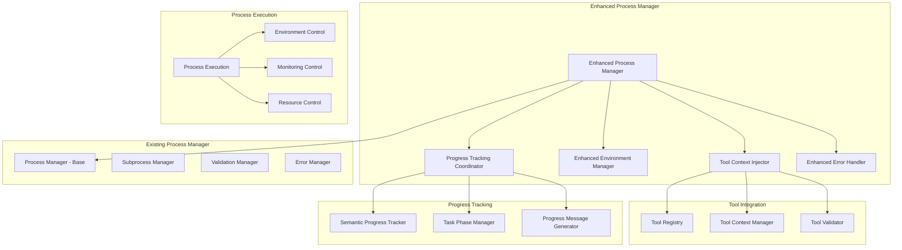

# Enhanced Process Manager Design

**Document Type**: Phase 2.5 Component Design
**Component**: Enhanced Process Manager
**Phase**: 2.5 - Semantic Progress and Tool Integration
**Author**: William
**Date Created**: 2025-06-28
**Last Updated**: 2025-06-28
**Status**: Active
**Purpose**: Design enhanced process manager with tool context injection and progress tracking support

## 🎯 **Overview**

The Enhanced Process Manager extends the existing `ProcessManager` class to support tool context injection, enhanced environment management, and coordination with the semantic progress tracking system. This component ensures that agents can access tools during execution while maintaining security and performance.

## 🏗️ **Architecture**



## 🔧 **Core Components**

### **1. Enhanced Process Manager**
Main enhanced process manager that extends the existing functionality.

```python
import os
import sys
import json
import subprocess
import time
from typing import Dict, List, Optional, Any
from pathlib import Path

from agentmanager.runtime.process_manager import ProcessManager
from agentmanager.utils.tool_context import ToolContextManager, ToolContext
from agentmanager.utils.semantic_progress import SemanticProgressTracker

class EnhancedProcessManager(ProcessManager):
    """Enhanced process manager with tool context and progress tracking support."""
    
    def __init__(self):
        """Initialize enhanced process manager."""
        super().__init__()
        
        # Initialize enhanced components
        self.tool_context_manager = ToolContextManager()
        self.progress_tracker = SemanticProgressTracker()
        self.enhanced_error_handler = EnhancedErrorHandler()
        
        # Process execution history
        self.execution_history = []
        self.active_processes = {}
    
    def execute_agent_with_context(self, agent_path: str, method: str, 
                                 parameters: dict, tool_context: dict) -> dict:
        """
        Execute agent with tool context injection.
        
        Args:
            agent_path: Path to agent directory
            method: Method to execute
            parameters: Method parameters
            tool_context: Tool context to inject
            
        Returns:
            Execution result
        """
        try:
            # Start progress tracking
            self.progress_tracker.start_task(f"Execute agent {method} with tools")
            
            # Validate agent structure
            if not self.validate_agent_structure(agent_path):
                self.progress_tracker.log_activity("Agent structure validation failed", "error")
                return {
                    "error": f"Invalid agent structure: {agent_path}",
                    "agent_path": agent_path
                }
            
            # Prepare execution environment
            self.progress_tracker.log_activity("Preparing execution environment")
            env = self._prepare_execution_environment(tool_context)
            
            # Execute agent with enhanced environment
            self.progress_tracker.log_activity("Executing agent with tool context")
            result = self._execute_subprocess_with_context(
                agent_path, method, parameters, env
            )
            
            # Complete progress tracking
            self.progress_tracker.complete_task("Agent execution completed")
            
            return result
            
        except Exception as e:
            # Handle execution errors
            self.progress_tracker.log_activity(f"Execution failed: {str(e)}", "error")
            return self.enhanced_error_handler.handle_execution_error(e, agent_path, method)
    
    def execute_agent(self, agent_path: str, method: str, parameters: dict) -> dict:
        """
        Execute agent using base process manager (backward compatibility).
        
        Args:
            agent_path: Path to agent directory
            method: Method to execute
            parameters: Method parameters
            
        Returns:
            Execution result
        """
        # Check for tool context in environment
        tool_context = self._get_tool_context_from_environment()
        
        if tool_context:
            # Execute with tool context
            return self.execute_agent_with_context(agent_path, method, parameters, tool_context)
        else:
            # Execute normally using base class
            return super().execute_agent(agent_path, method, parameters)
    
    def _prepare_execution_environment(self, tool_context: dict) -> dict:
        """Prepare execution environment with tool context."""
        # Start with current environment
        env = os.environ.copy()
        
        # Inject tool context
        self.tool_context_manager.inject_context(tool_context)
        
        # Add additional environment variables
        env["AGENT_EXECUTION_MODE"] = "enhanced"
        env["AGENT_TOOL_INTEGRATION"] = "enabled"
        env["AGENT_PROCESS_ID"] = str(os.getpid())
        env["AGENT_EXECUTION_START"] = str(time.time())
        
        return env
    
    def _execute_subprocess_with_context(self, agent_path: str, method: str, 
                                       parameters: dict, env: dict) -> dict:
        """Execute agent subprocess with enhanced environment."""
        try:
            # Prepare command
            command = self._build_execution_command(agent_path, method, parameters)
            
            # Start process monitoring
            process_id = self._start_process_monitoring(agent_path, method)
            
            # Execute with enhanced environment
            result = subprocess.run(
                command,
                env=env,
                capture_output=True,
                text=True,
                timeout=300,  # 5 minute timeout
                cwd=agent_path
            )
            
            # Stop process monitoring
            self._stop_process_monitoring(process_id)
            
            # Process result
            return self._process_execution_result(result, process_id)
            
        except subprocess.TimeoutExpired:
            # Handle timeout
            self.progress_tracker.log_activity("Execution timeout", "error")
            return self._handle_execution_timeout(agent_path, method)
            
        except Exception as e:
            # Handle other execution errors
            self.progress_tracker.log_activity(f"Subprocess execution failed: {str(e)}", "error")
            return self._handle_execution_error(e, agent_path, method)
    
    def _build_execution_command(self, agent_path: str, method: str, 
                                parameters: dict) -> List[str]:
        """Build execution command for agent."""
        agent_script = os.path.join(agent_path, "agent.py")
        
        # Convert parameters to JSON
        params_json = json.dumps(parameters)
        
        return [
            sys.executable,
            agent_script,
            method,
            params_json
        ]
    
    def _process_execution_result(self, result: subprocess.CompletedProcess, 
                                process_id: str) -> dict:
        """Process subprocess execution result."""
        # Record execution in history
        execution_record = {
            "process_id": process_id,
            "return_code": result.returncode,
            "execution_time": time.time(),
            "stdout_size": len(result.stdout),
            "stderr_size": len(result.stderr)
        }
        self.execution_history.append(execution_record)
        
        if result.returncode == 0:
            try:
                # Try to parse JSON output
                output = json.loads(result.stdout)
                return {
                    "result": output,
                    "stdout": result.stdout,
                    "stderr": result.stderr,
                    "returncode": result.returncode,
                    "process_id": process_id
                }
            except json.JSONDecodeError:
                # Return raw output if not JSON
                return {
                    "result": result.stdout,
                    "stdout": result.stdout,
                    "stderr": result.stderr,
                    "returncode": result.returncode,
                    "process_id": process_id
                }
        else:
            return {
                "error": f"Agent execution failed with return code {result.returncode}",
                "stdout": result.stdout,
                "stderr": result.stderr,
                "returncode": result.returncode,
                "process_id": process_id
            }
    
    def _start_process_monitoring(self, agent_path: str, method: str) -> str:
        """Start monitoring process execution."""
        process_id = f"{os.getpid()}_{int(time.time())}"
        
        self.active_processes[process_id] = {
            "agent_path": agent_path,
            "method": method,
            "start_time": time.time(),
            "status": "running"
        }
        
        return process_id
    
    def _stop_process_monitoring(self, process_id: str):
        """Stop monitoring process execution."""
        if process_id in self.active_processes:
            self.active_processes[process_id]["status"] = "completed"
            self.active_processes[process_id]["end_time"] = time.time()
    
    def _get_tool_context_from_environment(self) -> Optional[dict]:
        """Get tool context from current environment."""
        return self.tool_context_manager.get_context_from_environment()
    
    def _handle_execution_timeout(self, agent_path: str, method: str) -> dict:
        """Handle execution timeout."""
        return {
            "error": "Execution timeout",
            "agent_path": agent_path,
            "method": method,
            "timeout": 300
        }
    
    def _handle_execution_error(self, error: Exception, agent_path: str, 
                               method: str) -> dict:
        """Handle execution error."""
        return {
            "error": f"Execution failed: {str(error)}",
            "agent_path": agent_path,
            "method": method
        }
    
    def get_execution_statistics(self) -> Dict[str, Any]:
        """Get process execution statistics."""
        if not self.execution_history:
            return {"total_executions": 0}
        
        total_executions = len(self.execution_history)
        successful_executions = sum(1 for ex in self.execution_history 
                                  if ex["return_code"] == 0)
        
        return {
            "total_executions": total_executions,
            "successful_executions": successful_executions,
            "success_rate": successful_executions / total_executions,
            "active_processes": len(self.active_processes)
        }
    
    def cleanup_resources(self):
        """Clean up process manager resources."""
        # Cleanup tool context
        self.tool_context_manager.cleanup_context()
        
        # Clear execution history
        self.execution_history.clear()
        
        # Clear active processes
        self.active_processes.clear()
```

### **2. Enhanced Error Handler**
Specialized error handling for enhanced process management.

```python
class EnhancedErrorHandler:
    """Enhanced error handling for process management."""
    
    def __init__(self):
        """Initialize enhanced error handler."""
        self.error_history = []
        self.error_patterns = {
            "timeout": "Execution timeout",
            "permission": "Permission denied",
            "not_found": "File or directory not found",
            "memory": "Out of memory",
            "network": "Network error",
            "tool": "Tool execution error"
        }
    
    def handle_execution_error(self, error: Exception, agent_path: str, 
                             method: str) -> dict:
        """Handle execution error comprehensively."""
        # Analyze error
        error_analysis = self._analyze_error(error)
        
        # Log error
        self._log_error(error, error_analysis, agent_path, method)
        
        # Generate error response
        error_response = self._generate_error_response(error, error_analysis)
        
        # Suggest recovery actions
        recovery_suggestions = self._suggest_recovery_actions(error_analysis)
        
        return {
            **error_response,
            "recovery_suggestions": recovery_suggestions,
            "error_analysis": error_analysis
        }
    
    def _analyze_error(self, error: Exception) -> Dict[str, Any]:
        """Analyze error for patterns and causes."""
        error_message = str(error).lower()
        error_type = type(error).__name__
        
        # Identify error patterns
        identified_patterns = []
        for pattern, description in self.error_patterns.items():
            if pattern in error_message:
                identified_patterns.append(description)
        
        # Analyze error severity
        severity = self._assess_error_severity(error_type, error_message)
        
        # Determine if error is recoverable
        recoverable = self._assess_recoverability(error_type, error_message)
        
        return {
            "error_type": error_type,
            "error_message": str(error),
            "identified_patterns": identified_patterns,
            "severity": severity,
            "recoverable": recoverable,
            "timestamp": time.time()
        }
    
    def _assess_error_severity(self, error_type: str, error_message: str) -> str:
        """Assess error severity level."""
        # High severity errors
        high_severity = ["timeout", "memory", "permission", "security"]
        if any(sev in error_message for sev in high_severity):
            return "high"
        
        # Medium severity errors
        medium_severity = ["network", "tool", "validation"]
        if any(sev in error_message for sev in medium_severity):
            return "medium"
        
        # Low severity errors
        return "low"
    
    def _assess_recoverability(self, error_type: str, error_message: str) -> bool:
        """Assess if error is recoverable."""
        # Non-recoverable errors
        non_recoverable = ["timeout", "memory", "permission", "security"]
        if any(nr in error_message for nr in non_recoverable):
            return False
        
        # Recoverable errors
        return True
    
    def _log_error(self, error: Exception, analysis: Dict, agent_path: str, method: str):
        """Log error with comprehensive information."""
        error_record = {
            "timestamp": time.time(),
            "error": str(error),
            "error_type": type(error).__name__,
            "agent_path": agent_path,
            "method": method,
            "analysis": analysis
        }
        
        self.error_history.append(error_record)
    
    def _generate_error_response(self, error: Exception, analysis: Dict) -> Dict:
        """Generate comprehensive error response."""
        return {
            "error": str(error),
            "error_type": analysis["error_type"],
            "severity": analysis["severity"],
            "recoverable": analysis["recoverable"],
            "patterns": analysis["identified_patterns"]
        }
    
    def _suggest_recovery_actions(self, analysis: Dict) -> List[str]:
        """Suggest recovery actions based on error analysis."""
        suggestions = []
        
        if analysis["severity"] == "high":
            suggestions.append("Check system resources and permissions")
            suggestions.append("Verify agent configuration and dependencies")
        
        if "timeout" in analysis["identified_patterns"]:
            suggestions.append("Increase execution timeout limit")
            suggestions.append("Check for long-running operations")
        
        if "permission" in analysis["identified_patterns"]:
            suggestions.append("Verify file and directory permissions")
            suggestions.append("Check user account privileges")
        
        if "tool" in analysis["identified_patterns"]:
            suggestions.append("Verify tool availability and configuration")
            suggestions.append("Check tool dependencies and requirements")
        
        if not suggestions:
            suggestions.append("Review error logs for additional details")
            suggestions.append("Check agent configuration and environment")
        
        return suggestions
    
    def get_error_statistics(self) -> Dict[str, Any]:
        """Get error handling statistics."""
        if not self.error_history:
            return {"total_errors": 0}
        
        total_errors = len(self.error_history)
        error_types = {}
        severity_counts = {"high": 0, "medium": 0, "low": 0}
        
        for error_record in self.error_history:
            # Count error types
            error_type = error_record["analysis"]["error_type"]
            error_types[error_type] = error_types.get(error_type, 0) + 1
            
            # Count severity levels
            severity = error_record["analysis"]["severity"]
            severity_counts[severity] += 1
        
        return {
            "total_errors": total_errors,
            "error_types": error_types,
            "severity_distribution": severity_counts,
            "most_common_error": max(error_types.items(), key=lambda x: x[1])[0] if error_types else None
        }
```

### **3. Process Monitoring and Control**
Component for monitoring and controlling process execution.

```python
class ProcessMonitor:
    """Monitor and control process execution."""
    
    def __init__(self):
        """Initialize process monitor."""
        self.monitored_processes = {}
        self.monitoring_config = {
            "memory_limit": 512 * 1024 * 1024,  # 512MB
            "cpu_limit": 80.0,  # 80% CPU
            "timeout_limit": 300,  # 5 minutes
            "log_interval": 5  # 5 seconds
        }
    
    def start_monitoring(self, process_id: str, process_info: Dict):
        """Start monitoring a process."""
        self.monitored_processes[process_id] = {
            "process_info": process_info,
            "start_time": time.time(),
            "status": "monitoring",
            "metrics": {
                "memory_usage": [],
                "cpu_usage": [],
                "execution_time": 0
            }
        }
    
    def stop_monitoring(self, process_id: str):
        """Stop monitoring a process."""
        if process_id in self.monitored_processes:
            self.monitored_processes[process_id]["status"] = "stopped"
    
    def get_process_status(self, process_id: str) -> Optional[Dict]:
        """Get current status of a monitored process."""
        return self.monitored_processes.get(process_id)
    
    def get_all_process_status(self) -> Dict[str, Dict]:
        """Get status of all monitored processes."""
        return self.monitored_processes.copy()
    
    def cleanup_completed_processes(self):
        """Clean up completed process monitoring data."""
        completed_processes = [
            pid for pid, info in self.monitored_processes.items()
            if info["status"] in ["completed", "stopped"]
        ]
        
        for pid in completed_processes:
            del self.monitored_processes[pid]
```

## 🔄 **Integration with Existing System**

### **Backward Compatibility**
- Existing process management functionality preserved
- Enhanced features are opt-in
- Gradual enhancement approach
- No breaking changes

### **Extension Points**
- Extends existing process manager
- Adds tool context injection
- Integrates progress tracking
- Enhances error handling

## 📋 **Usage Examples**

### **Basic Enhanced Execution**
```python
# Create enhanced process manager
enhanced_pm = EnhancedProcessManager()

# Execute agent with tool context
tool_context = {
    "available_tools": [...],
    "method_name": "analyze_data",
    "parameters": {...}
}

result = enhanced_pm.execute_agent_with_context(
    "/path/to/agent",
    "analyze_data",
    {"data_path": "/path/to/data"},
    tool_context
)
```

### **Backward Compatible Execution**
```python
# Existing usage continues to work
result = enhanced_pm.execute_agent(
    "/path/to/agent",
    "analyze_data",
    {"data_path": "/path/to/data"}
)

# Enhanced features automatically used when available
```

### **Process Monitoring**
```python
# Get execution statistics
stats = enhanced_pm.get_execution_statistics()
print(f"Total executions: {stats['total_executions']}")
print(f"Success rate: {stats['success_rate']:.2%}")

# Get error statistics
error_stats = enhanced_pm.enhanced_error_handler.get_error_statistics()
print(f"Total errors: {error_stats['total_errors']}")
```

## 🎯 **Success Criteria**

- [ ] Enhanced process manager extends existing functionality
- [ ] Tool context injection works reliably
- [ ] Progress tracking integration is seamless
- [ ] Error handling is comprehensive
- [ ] Backward compatibility is maintained 100%
- [ ] Performance impact is minimal (<5% overhead)

## 🔮 **Future Enhancements**

1. **Advanced Process Orchestration**: Automatic process workflow creation
2. **Process Performance Metrics**: Track and optimize process execution
3. **Dynamic Resource Management**: Intelligent resource allocation
4. **Process Composition**: Combine multiple processes into workflows
5. **Real-time Monitoring**: Live process monitoring and control
6. **Process Analytics**: Comprehensive process execution analytics
