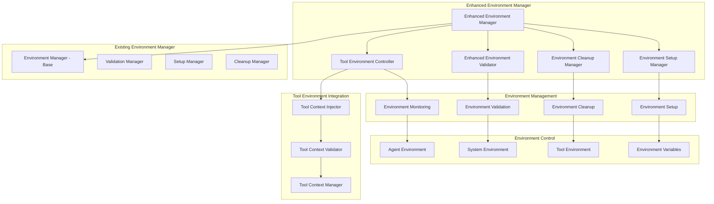

# Enhanced Environment Manager Design

**Document Type**: Phase 2.5 Component Design
**Component**: Enhanced Environment Manager
**Phase**: 2.5 - Semantic Progress and Tool Integration
**Author**: William
**Date Created**: 2025-06-28
**Last Updated**: 2025-06-28
**Status**: Active
**Purpose**: Design enhanced environment manager with tool-related environment setup and cleanup

## 🎯 **Overview**

The Enhanced Environment Manager extends the existing `EnvironmentManager` class to support tool-related environment setup, context cleanup mechanisms, and enhanced environment validation. This component ensures that agents have the proper environment configuration for tool integration while maintaining security and isolation.

## 🏗️ **Architecture**



## 🔧 **Core Components**

### **1. Enhanced Environment Manager**
Main enhanced environment manager that extends the existing functionality.

```python
import os
import json
import time
import shutil
from typing import Dict, List, Optional, Any, Tuple
from pathlib import Path

from agentmanager.runtime.environment_manager import EnvironmentManager
from agentmanager.utils.tool_context import ToolContextManager, ToolContext
from agentmanager.utils.semantic_progress import SemanticProgressTracker

class EnhancedEnvironmentManager(EnvironmentManager):
    """Enhanced environment manager with tool support and progress tracking."""
    
    def __init__(self):
        """Initialize enhanced environment manager."""
        super().__init__()
        
        # Initialize enhanced components
        self.tool_environment_controller = ToolEnvironmentController()
        self.enhanced_validator = EnhancedEnvironmentValidator()
        self.cleanup_manager = EnvironmentCleanupManager()
        self.setup_manager = EnvironmentSetupManager()
        
        # Progress tracking
        self.progress_tracker = SemanticProgressTracker("environment_management")
        
        # Environment state tracking
        self.environment_states = {}
        self.cleanup_history = []
    
    def setup_agent_environment(self, agent_path: str, tool_context: dict = None) -> bool:
        """
        Setup agent environment with optional tool context.
        
        Args:
            agent_path: Path to agent directory
            tool_context: Optional tool context
            
        Returns:
            True if setup successful
        """
        try:
            # Start progress tracking
            self.progress_tracker.start_task(f"Setup environment for {agent_path}")
            
            # Setup base environment
            self.progress_tracker.log_activity("Setting up base environment")
            base_success = super().setup_agent_environment(agent_path)
            if not base_success:
                self.progress_tracker.log_activity("Base environment setup failed", "error")
                return False
            
            # Setup tool environment if context provided
            if tool_context:
                self.progress_tracker.log_activity("Setting up tool environment")
                tool_success = self.tool_environment_controller.setup_tool_environment(
                    agent_path, tool_context
                )
                if not tool_success:
                    self.progress_tracker.log_activity("Tool environment setup failed", "error")
                    return False
            
            # Validate enhanced environment
            self.progress_tracker.log_activity("Validating enhanced environment")
            validation_success = self.enhanced_validator.validate_environment(
                agent_path, tool_context
            )
            if not validation_success:
                self.progress_tracker.log_activity("Environment validation failed", "error")
                return False
            
            # Record environment state
            self._record_environment_state(agent_path, tool_context)
            
            # Complete progress tracking
            self.progress_tracker.complete_task("Environment setup completed successfully")
            
            return True
            
        except Exception as e:
            # Handle setup errors
            self.progress_tracker.log_activity(f"Environment setup failed: {str(e)}", "error")
            return False
    
    def cleanup_agent_environment(self, agent_path: str):
        """Cleanup agent environment including tool context."""
        try:
            # Start cleanup progress tracking
            self.progress_tracker.start_task(f"Cleanup environment for {agent_path}")
            
            # Cleanup tool environment
            self.progress_tracker.log_activity("Cleaning up tool environment")
            self.tool_environment_controller.cleanup_tool_environment(agent_path)
            
            # Cleanup base environment
            self.progress_tracker.log_activity("Cleaning up base environment")
            super().cleanup_agent_environment(agent_path)
            
            # Record cleanup
            self._record_cleanup(agent_path)
            
            # Complete progress tracking
            self.progress_tracker.complete_task("Environment cleanup completed")
            
        except Exception as e:
            # Handle cleanup errors
            self.progress_tracker.log_activity(f"Environment cleanup failed: {str(e)}", "error")
    
    def get_environment_info(self, agent_path: str) -> Dict[str, Any]:
        """Get comprehensive environment information."""
        # Get base environment info
        base_info = super().get_environment_info(agent_path)
        
        # Get tool environment info
        tool_info = self.tool_environment_controller.get_tool_environment_info(agent_path)
        
        # Get validation info
        validation_info = self.enhanced_validator.get_validation_info(agent_path)
        
        return {
            **base_info,
            "tool_environment": tool_info,
            "validation": validation_info,
            "setup_time": self.environment_states.get(agent_path, {}).get("setup_time"),
            "last_validation": self.environment_states.get(agent_path, {}).get("last_validation")
        }
    
    def validate_environment_integrity(self, agent_path: str) -> bool:
        """Validate that environment is still intact and secure."""
        try:
            # Validate base environment
            base_valid = super().validate_agent_environment(agent_path)
            if not base_valid:
                return False
            
            # Validate tool environment
            tool_valid = self.tool_environment_controller.validate_tool_environment(agent_path)
            if not tool_valid:
                return False
            
            # Validate overall environment
            overall_valid = self.enhanced_validator.validate_environment_integrity(agent_path)
            
            # Update validation timestamp
            if agent_path in self.environment_states:
                self.environment_states[agent_path]["last_validation"] = time.time()
            
            return overall_valid
            
        except Exception:
            return False
    
    def _record_environment_state(self, agent_path: str, tool_context: dict = None):
        """Record environment setup state."""
        self.environment_states[agent_path] = {
            "setup_time": time.time(),
            "tool_context": tool_context is not None,
            "last_validation": time.time()
        }
    
    def _record_cleanup(self, agent_path: str):
        """Record environment cleanup."""
        cleanup_record = {
            "agent_path": agent_path,
            "cleanup_time": time.time(),
            "setup_duration": 0
        }
        
        if agent_path in self.environment_states:
            setup_time = self.environment_states[agent_path]["setup_time"]
            cleanup_record["setup_duration"] = time.time() - setup_time
            del self.environment_states[agent_path]
        
        self.cleanup_history.append(cleanup_record)
    
    def get_environment_statistics(self) -> Dict[str, Any]:
        """Get environment management statistics."""
        total_environments = len(self.environment_states)
        total_cleanups = len(self.cleanup_history)
        
        # Calculate average setup duration
        if self.cleanup_history:
            avg_setup_duration = sum(
                record["setup_duration"] for record in self.cleanup_history
            ) / len(self.cleanup_history)
        else:
            avg_setup_duration = 0
        
        return {
            "active_environments": total_environments,
            "total_cleanups": total_cleanups,
            "average_setup_duration": avg_setup_duration,
            "environment_states": self.environment_states.copy()
        }
```

### **2. Tool Environment Controller**
Component for managing tool-specific environment setup and cleanup.

```python
class ToolEnvironmentController:
    """Controls tool-specific environment setup and cleanup."""
    
    def __init__(self):
        """Initialize tool environment controller."""
        self.tool_context_manager = ToolContextManager()
        self.tool_environments = {}
        self.setup_history = []
    
    def setup_tool_environment(self, agent_path: str, tool_context: dict) -> bool:
        """
        Setup tool environment for agent.
        
        Args:
            agent_path: Path to agent directory
            tool_context: Tool context to setup
            
        Returns:
            True if setup successful
        """
        try:
            # Create tool environment directory
            tool_env_dir = self._create_tool_environment_directory(agent_path)
            
            # Setup tool context
            context_success = self._setup_tool_context(agent_path, tool_context)
            if not context_success:
                return False
            
            # Setup tool dependencies
            dependencies_success = self._setup_tool_dependencies(agent_path, tool_context)
            if not dependencies_success:
                return False
            
            # Setup tool permissions
            permissions_success = self._setup_tool_permissions(agent_path, tool_context)
            if not permissions_success:
                return False
            
            # Record setup
            self._record_tool_setup(agent_path, tool_context, tool_env_dir)
            
            return True
            
        except Exception as e:
            # Log setup error
            print(f"Tool environment setup failed: {e}")
            return False
    
    def cleanup_tool_environment(self, agent_path: str):
        """Cleanup tool environment for agent."""
        try:
            if agent_path in self.tool_environments:
                tool_env_info = self.tool_environments[agent_path]
                
                # Cleanup tool context
                self._cleanup_tool_context(agent_path)
                
                # Cleanup tool dependencies
                self._cleanup_tool_dependencies(agent_path)
                
                # Remove tool environment directory
                self._remove_tool_environment_directory(agent_path)
                
                # Record cleanup
                self._record_tool_cleanup(agent_path)
                
        except Exception as e:
            # Log cleanup error
            print(f"Tool environment cleanup failed: {e}")
    
    def get_tool_environment_info(self, agent_path: str) -> Dict[str, Any]:
        """Get tool environment information."""
        if agent_path not in self.tool_environments:
            return {"status": "not_setup"}
        
        return self.tool_environments[agent_path].copy()
    
    def validate_tool_environment(self, agent_path: str) -> bool:
        """Validate tool environment integrity."""
        if agent_path not in self.tool_environments:
            return True  # No tool environment to validate
        
        try:
            tool_env_info = self.tool_environments[agent_path]
            
            # Check if tool environment directory exists
            if not os.path.exists(tool_env_info["tool_env_dir"]):
                return False
            
            # Check if tool context is still valid
            if not self.tool_context_manager.validate_context_integrity():
                return False
            
            return True
            
        except Exception:
            return False
    
    def _create_tool_environment_directory(self, agent_path: str) -> str:
        """Create tool environment directory."""
        tool_env_dir = os.path.join(agent_path, ".tool_env")
        os.makedirs(tool_env_dir, exist_ok=True)
        return tool_env_dir
    
    def _setup_tool_context(self, agent_path: str, tool_context: dict) -> bool:
        """Setup tool context in environment."""
        try:
            # Inject tool context
            return self.tool_context_manager.inject_context(tool_context)
        except Exception:
            return False
    
    def _setup_tool_dependencies(self, agent_path: str, tool_context: dict) -> bool:
        """Setup tool dependencies."""
        try:
            # Check for tool requirements
            tools = tool_context.get("available_tools", [])
            
            for tool in tools:
                # Check if tool has dependencies
                if "dependencies" in tool:
                    # Install dependencies (simplified for design)
                    print(f"Setting up dependencies for tool: {tool.get('name', 'unknown')}")
            
            return True
            
        except Exception:
            return False
    
    def _setup_tool_permissions(self, agent_path: str, tool_context: dict) -> bool:
        """Setup tool permissions and security."""
        try:
            # Check tool security levels
            tools = tool_context.get("available_tools", [])
            
            for tool in tools:
                tool_name = tool.get("name", "").lower()
                
                # Check for potentially dangerous tools
                dangerous_patterns = ["system", "exec", "eval", "import"]
                if any(pattern in tool_name for pattern in dangerous_patterns):
                    # Apply additional security restrictions
                    print(f"Applying security restrictions for tool: {tool.get('name')}")
            
            return True
            
        except Exception:
            return False
    
    def _cleanup_tool_context(self, agent_path: str):
        """Cleanup tool context."""
        try:
            self.tool_context_manager.cleanup_context()
        except Exception:
            pass
    
    def _cleanup_tool_dependencies(self, agent_path: str):
        """Cleanup tool dependencies."""
        try:
            # Cleanup any installed dependencies
            pass
        except Exception:
            pass
    
    def _remove_tool_environment_directory(self, agent_path: str):
        """Remove tool environment directory."""
        try:
            if agent_path in self.tool_environments:
                tool_env_dir = self.tool_environments[agent_path]["tool_env_dir"]
                if os.path.exists(tool_env_dir):
                    shutil.rmtree(tool_env_dir)
        except Exception:
            pass
    
    def _record_tool_setup(self, agent_path: str, tool_context: dict, tool_env_dir: str):
        """Record tool environment setup."""
        self.tool_environments[agent_path] = {
            "tool_env_dir": tool_env_dir,
            "tool_count": len(tool_context.get("available_tools", [])),
            "setup_time": time.time(),
            "tool_context": tool_context
        }
        
        # Record in setup history
        setup_record = {
            "agent_path": agent_path,
            "setup_time": time.time(),
            "tool_count": len(tool_context.get("available_tools", [])),
            "status": "success"
        }
        self.setup_history.append(setup_record)
    
    def _record_tool_cleanup(self, agent_path: str):
        """Record tool environment cleanup."""
        if agent_path in self.tool_environments:
            del self.tool_environments[agent_path]
```

### **3. Enhanced Environment Validator**
Component for enhanced environment validation and security checking.

```python
class EnhancedEnvironmentValidator:
    """Enhanced environment validation and security checking."""
    
    def __init__(self):
        """Initialize enhanced environment validator."""
        self.validation_rules = {
            "max_environment_size": 100 * 1024 * 1024,  # 100MB
            "max_environment_variables": 1000,
            "forbidden_variables": ["PATH", "PYTHONPATH", "LD_LIBRARY_PATH"],
            "required_variables": ["AGENT_EXECUTION_MODE"],
            "security_levels": ["safe", "limited", "restricted", "unsafe"]
        }
        self.validation_history = []
    
    def validate_environment(self, agent_path: str, tool_context: dict = None) -> bool:
        """
        Validate enhanced environment.
        
        Args:
            agent_path: Path to agent directory
            tool_context: Optional tool context
            
        Returns:
            True if validation successful
        """
        try:
            # Validate base environment
            base_valid = self._validate_base_environment(agent_path)
            if not base_valid:
                return False
            
            # Validate tool environment if present
            if tool_context:
                tool_valid = self._validate_tool_environment(tool_context)
                if not tool_valid:
                    return False
            
            # Validate overall environment
            overall_valid = self._validate_overall_environment(agent_path, tool_context)
            
            # Record validation
            self._record_validation(agent_path, tool_context, overall_valid)
            
            return overall_valid
            
        except Exception as e:
            # Log validation error
            print(f"Environment validation failed: {e}")
            return False
    
    def validate_environment_integrity(self, agent_path: str) -> bool:
        """Validate that environment is still intact and secure."""
        try:
            # Check environment variables
            env_valid = self._validate_environment_variables()
            if not env_valid:
                return False
            
            # Check file permissions
            file_valid = self._validate_file_permissions(agent_path)
            if not file_valid:
                return False
            
            # Check security status
            security_valid = self._validate_security_status(agent_path)
            
            return security_valid
            
        except Exception:
            return False
    
    def get_validation_info(self, agent_path: str) -> Dict[str, Any]:
        """Get environment validation information."""
        # Find validation record for this agent
        validation_record = None
        for record in self.validation_history:
            if record["agent_path"] == agent_path:
                validation_record = record
                break
        
        if not validation_record:
            return {"status": "not_validated"}
        
        return {
            "status": "validated",
            "validation_time": validation_record["validation_time"],
            "validation_result": validation_record["validation_result"],
            "validation_details": validation_record["validation_details"]
        }
    
    def _validate_base_environment(self, agent_path: str) -> bool:
        """Validate base agent environment."""
        try:
            # Check if agent directory exists
            if not os.path.exists(agent_path):
                return False
            
            # Check if agent.py exists
            agent_script = os.path.join(agent_path, "agent.py")
            if not os.path.exists(agent_script):
                return False
            
            # Check if agent.yaml exists
            agent_manifest = os.path.join(agent_path, "agent.yaml")
            if not os.path.exists(agent_manifest):
                return False
            
            return True
            
        except Exception:
            return False
    
    def _validate_tool_environment(self, tool_context: dict) -> bool:
        """Validate tool environment configuration."""
        try:
            # Check tool context structure
            if not isinstance(tool_context, dict):
                return False
            
            # Check required fields
            required_fields = ["available_tools", "method_name", "parameters"]
            for field in required_fields:
                if field not in tool_context:
                    return False
            
            # Check tool count
            tools = tool_context.get("available_tools", [])
            if len(tools) > 100:  # Max 100 tools
                return False
            
            # Validate individual tools
            for tool in tools:
                if not self._validate_tool_info(tool):
                    return False
            
            return True
            
        except Exception:
            return False
    
    def _validate_tool_info(self, tool: dict) -> bool:
        """Validate individual tool information."""
        try:
            # Check required tool fields
            required_fields = ["name", "description"]
            for field in required_fields:
                if field not in tool:
                    return False
            
            # Check tool name format
            tool_name = tool.get("name", "")
            if not tool_name or len(tool_name) > 100:
                return False
            
            # Check for forbidden tool names
            forbidden_names = ["system", "exec", "eval", "import"]
            if any(name in tool_name.lower() for name in forbidden_names):
                return False
            
            return True
            
        except Exception:
            return False
    
    def _validate_overall_environment(self, agent_path: str, tool_context: dict = None) -> bool:
        """Validate overall environment configuration."""
        try:
            # Check environment size
            env_size = self._calculate_environment_size()
            if env_size > self.validation_rules["max_environment_size"]:
                return False
            
            # Check environment variable count
            env_var_count = len(os.environ)
            if env_var_count > self.validation_rules["max_environment_variables"]:
                return False
            
            # Check for forbidden variables
            for forbidden_var in self.validation_rules["forbidden_variables"]:
                if forbidden_var in os.environ:
                    return False
            
            # Check required variables
            for required_var in self.validation_rules["required_variables"]:
                if required_var not in os.environ:
                    return False
            
            return True
            
        except Exception:
            return False
    
    def _validate_environment_variables(self) -> bool:
        """Validate current environment variables."""
        try:
            # Check for critical environment variables
            critical_vars = ["AGENT_EXECUTION_MODE", "AGENT_TOOL_INTEGRATION"]
            for var in critical_vars:
                if var not in os.environ:
                    return False
            
            return True
            
        except Exception:
            return False
    
    def _validate_file_permissions(self, agent_path: str) -> bool:
        """Validate file permissions for agent directory."""
        try:
            # Check if agent directory is readable
            if not os.access(agent_path, os.R_OK):
                return False
            
            # Check if agent.py is executable
            agent_script = os.path.join(agent_path, "agent.py")
            if not os.access(agent_script, os.R_OK):
                return False
            
            return True
            
        except Exception:
            return False
    
    def _validate_security_status(self, agent_path: str) -> bool:
        """Validate security status of environment."""
        try:
            # Check for security-related environment variables
            security_vars = ["AGENT_SECURITY_LEVEL", "AGENT_PERMISSIONS"]
            
            # If security variables are set, validate them
            for var in security_vars:
                if var in os.environ:
                    security_level = os.environ[var]
                    if security_level not in self.validation_rules["security_levels"]:
                        return False
            
            return True
            
        except Exception:
            return False
    
    def _calculate_environment_size(self) -> int:
        """Calculate total environment size."""
        try:
            total_size = 0
            for key, value in os.environ.items():
                total_size += len(key.encode()) + len(value.encode())
            return total_size
        except Exception:
            return 0
    
    def _record_validation(self, agent_path: str, tool_context: dict, result: bool):
        """Record environment validation."""
        validation_record = {
            "agent_path": agent_path,
            "validation_time": time.time(),
            "validation_result": result,
            "tool_context_present": tool_context is not None,
            "validation_details": {
                "base_environment": self._validate_base_environment(agent_path),
                "tool_environment": self._validate_tool_environment(tool_context) if tool_context else True,
                "overall_environment": self._validate_overall_environment(agent_path, tool_context)
            }
        }
        
        self.validation_history.append(validation_record)
```

## 🔄 **Integration with Existing System**

### **Backward Compatibility**
- Existing environment management functionality preserved
- Enhanced features are opt-in
- Gradual enhancement approach
- No breaking changes

### **Extension Points**
- Extends existing environment manager
- Adds tool environment setup
- Integrates progress tracking
- Enhances validation

## 📋 **Usage Examples**

### **Basic Enhanced Environment Setup**
```python
# Create enhanced environment manager
enhanced_em = EnhancedEnvironmentManager()

# Setup environment with tool context
tool_context = {
    "available_tools": [...],
    "method_name": "analyze_data",
    "parameters": {...}
}

success = enhanced_em.setup_agent_environment(
    "/path/to/agent",
    tool_context
)

if success:
    print("Environment setup completed")
else:
    print("Environment setup failed")
```

### **Environment Validation**
```python
# Validate environment integrity
is_valid = enhanced_em.validate_environment_integrity("/path/to/agent")

if is_valid:
    print("Environment is valid and secure")
else:
    print("Environment validation failed")

# Get environment information
env_info = enhanced_em.get_environment_info("/path/to/agent")
print(f"Environment status: {env_info}")
```

### **Environment Statistics**
```python
# Get environment management statistics
stats = enhanced_em.get_environment_statistics()
print(f"Active environments: {stats['active_environments']}")
print(f"Total cleanups: {stats['total_cleanups']}")
print(f"Average setup duration: {stats['average_setup_duration']:.2f}s")
```

## 🎯 **Success Criteria**

- [ ] Enhanced environment manager extends existing functionality
- [ ] Tool environment setup works reliably
- [ ] Environment validation is comprehensive
- [ ] Progress tracking integration is seamless
- [ ] Backward compatibility is maintained 100%
- [ ] Performance impact is minimal (<5% overhead)

## 🔮 **Future Enhancements**

1. **Advanced Environment Orchestration**: Automatic environment workflow creation
2. **Environment Performance Metrics**: Track and optimize environment setup
3. **Dynamic Environment Management**: Discover and configure environments at runtime
4. **Environment Composition**: Combine multiple environments into workflows
5. **Real-time Environment Monitoring**: Live environment status monitoring
6. **Environment Analytics**: Comprehensive environment usage analytics
