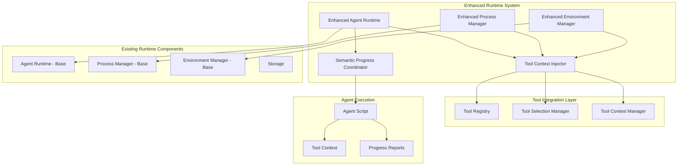

# Phase 2.5 Runtime Integration

**Document Type**: Phase 2.5 Runtime Integration Overview
**Component**: Runtime Integration
**Phase**: 2.5 - Semantic Progress and Tool Integration
**Author**: William
**Date Created**: 2025-06-28
**Last Updated**: 2025-06-28
**Status**: Active
**Purpose**: Overview of runtime integration components for tool context injection and enhanced execution

## 🎯 **Overview**

The Runtime Integration module extends the existing Agent Runtime system to support tool context injection, enhanced process management, and coordination with the semantic progress tracking system. This ensures tools are properly available to agents during execution while maintaining the existing runtime architecture.

## 🏗️ **Runtime Architecture**

## 🔧 **Runtime Components**

### **1. Enhanced Agent Runtime**
Extends the existing `AgentRuntime` class with tool integration capabilities and progress coordination.

**Key Features**:
- Tool context preparation and injection
- Progress tracking coordination
- Enhanced execution management
- Backward compatibility maintenance

**Location**: `01_runtime_integration_design.md`

### **2. Enhanced Process Manager**
Extends the existing `ProcessManager` to support tool context injection and enhanced environment management.

**Key Features**:
- Tool context injection
- Enhanced environment preparation
- Improved subprocess execution
- Better error handling and recovery

**Location**: `02_process_manager_design.md`

### **3. Enhanced Environment Manager**
Extends the existing `EnvironmentManager` to support tool-related environment setup and cleanup.

**Key Features**:
- Tool environment setup
- Context cleanup mechanisms
- Enhanced environment validation
- Resource management

**Location**: `03_environment_manager_design.md`

## 🔄 **Integration with Existing Runtime**

### **Backward Compatibility**
- Existing runtime functionality preserved
- Enhanced components extend base classes
- Gradual enhancement approach
- No breaking changes

### **Extension Points**
- Extends existing runtime classes
- Adds tool context injection
- Integrates progress tracking
- Enhances process management

## 📋 **Design Documents**

1. **[Runtime Integration Design](01_runtime_integration_design.md)** - Overall runtime integration architecture
2. **[Process Manager Design](02_process_manager_design.md)** - Enhanced process management with tool context
3. **[Environment Manager Design](03_environment_manager_design.md)** - Enhanced environment management for tools

## 🎯 **Success Criteria**

- [ ] Enhanced runtime extends existing runtime without breaking changes
- [ ] Tool context injection works reliably
- [ ] Process management supports tool integration
- [ ] Environment management handles tool setup
- [ ] Progress coordination works seamlessly
- [ ] Backward compatibility is maintained 100%

## 🔮 **Future Enhancements**

1. **Advanced Process Orchestration**: Automatic process workflow creation
2. **Process Performance Metrics**: Track and optimize process execution
3. **Dynamic Environment Management**: Discover and configure environments at runtime
4. **Process Composition**: Combine multiple processes into workflows
