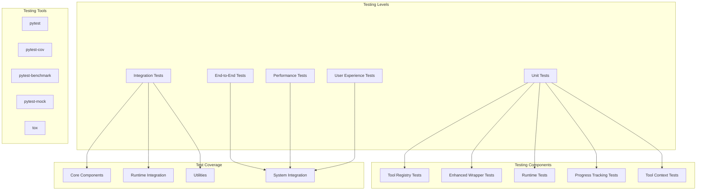

# Testing Strategy

**Document Type**: Phase 2.5 Component Design
**Component**: Testing Strategy
**Phase**: 2.5 - Semantic Progress and Tool Integration
**Author**: William
**Date Created**: 2025-06-28
**Last Updated**: 2025-06-28
**Status**: Active
**Purpose**: Comprehensive testing approach covering all aspects of the Phase 2.5 implementation

## 🎯 **Overview**

The Testing Strategy module provides comprehensive testing approaches for Phase 2.5: Semantic Progress and Tool Integration. This ensures high quality, reliability, and backward compatibility while validating new tool integration and progress tracking capabilities.

## 🏗️ **Testing Architecture**



## 🔧 **Testing Strategy**

### **1. Testing Philosophy**
Our testing approach follows these core principles:

- **Test-First Development**: Write tests before or alongside implementation
- **Comprehensive Coverage**: Aim for 90%+ code coverage across all components
- **Backward Compatibility**: Ensure no regression in existing functionality
- **Performance Validation**: Verify that performance impact is minimal
- **User Experience Focus**: Validate that new features improve user experience

### **2. Testing Pyramid**
We follow the testing pyramid approach:

```
        /\
       /  \     End-to-End Tests (10%)
      /____\    Integration Tests (20%)
     /      \   Unit Tests (70%)
    /________\
```

- **Unit Tests (70%)**: Fast, focused tests for individual components
- **Integration Tests (20%)**: Tests for component interactions
- **End-to-End Tests (10%)**: Complete workflow validation

### **3. Testing Tools and Frameworks**

#### **Primary Testing Framework**
- **pytest**: Unit and integration testing
- **pytest-cov**: Code coverage analysis
- **pytest-benchmark**: Performance benchmarking
- **pytest-mock**: Mocking and stubbing

#### **Additional Tools**
- **tox**: Multi-environment testing
- **black**: Code formatting validation
- **ruff**: Code quality and linting
- **mypy**: Type checking validation

#### **Testing Infrastructure**
- **GitHub Actions**: Continuous integration
- **Coverage Reports**: Automated coverage tracking
- **Performance Monitoring**: Automated performance tracking
- **Quality Gates**: Automated quality validation

## 📊 **Test Coverage Requirements**

### **Overall Coverage Goals**
- **Unit Tests**: 90%+ coverage
- **Integration Tests**: 85%+ coverage
- **End-to-End Tests**: 100% of critical workflows
- **Performance Tests**: All performance requirements met

### **Component-Specific Coverage**
- **Core Components**: 95%+ coverage
- **Runtime Integration**: 90%+ coverage
- **Utilities**: 95%+ coverage
- **Tool Integration**: 90%+ coverage

## 🧪 **Testing Levels**

### **1. Unit Tests**
Individual component testing with high coverage requirements.

#### **Coverage Goals**
- **Tool Registry**: 95%+ coverage
- **Enhanced Wrapper**: 90%+ coverage
- **Runtime Integration**: 90%+ coverage
- **Progress Tracking**: 95%+ coverage

#### **Testing Focus**
- Component initialization
- Method functionality
- Error handling
- Edge cases
- Input validation
- Output formatting

#### **Example Unit Tests**
```python
def test_tool_registry_registration():
    """Test tool registration functionality."""
    registry = ToolRegistry()
    
    # Test valid tool registration
    tool_info = {
        "tool": lambda x: x,
        "description": "Test tool",
        "category": "test"
    }
    
    result = registry.register_tool(tool_info)
    assert result is True
    assert len(registry.list_tools()) == 1

def test_tool_registry_validation():
    """Test tool validation rules."""
    registry = ToolRegistry()
    
    # Test invalid tool registration
    invalid_tool = {"description": "Missing tool function"}
    
    with pytest.raises(ValueError):
        registry.register_tool(invalid_tool)

def test_progress_tracker_phase_transitions():
    """Test progress tracker phase transitions."""
    tracker = SemanticProgressTracker()
    
    # Test phase progression
    tracker.start_task("Test task")
    assert tracker.current_phase == TaskPhase.UNDERSTANDING
    
    tracker.update_phase("gathering", 0.3)
    assert tracker.current_phase == "gathering"
    assert tracker.phase_progress == 0.3
```

### **2. Integration Tests**
Component interaction and system integration testing.

#### **Coverage Goals**
- **Component Integration**: 85%+ coverage
- **System Workflows**: 90%+ coverage
- **Error Scenarios**: 95%+ coverage

#### **Testing Focus**
- Component communication
- Data flow validation
- Error propagation
- Recovery mechanisms
- Tool context injection
- Progress tracking coordination

#### **Example Integration Tests**
```python
def test_enhanced_wrapper_tool_integration():
    """Test enhanced wrapper with tool integration."""
    # Create enhanced wrapper
    wrapper = EnhancedAgentWrapper(agent_info, runtime, tools)
    
    # Test tool registration
    assert len(wrapper.get_available_tools()) == len(tools)
    
    # Test tool selection
    selected_tool = wrapper.select_tool("file reading")
    assert selected_tool is not None
    
    # Test tool execution
    result = wrapper.execute_tool("file_reader", file_path="test.txt")
    assert result is not None

def test_runtime_tool_context_injection():
    """Test runtime tool context injection."""
    runtime = EnhancedAgentRuntime()
    
    # Test execution with tool context
    result = runtime.execute_agent_with_context(
        "agentplug/test-agent",
        "analyze_data",
        {"data_path": "test.csv"},
        tool_context
    )
    
    assert "result" in result
    assert result["error"] is None

def test_progress_tracking_integration():
    """Test progress tracking integration across components."""
    # Test that progress tracking works across the entire system
    wrapper = EnhancedAgentWrapper(agent_info, runtime, tools)
    
    # Execute method and verify progress updates
    with patch('sys.stdout', new=StringIO()) as fake_output:
        result = wrapper.execute("analyze_data", {"data": "test"})
        
        # Verify progress output
        output = fake_output.getvalue()
        assert "🧠 Understanding" in output
        assert "📚 Gathering" in output
        assert "🔍 Analyzing" in output
```

### **3. End-to-End Tests**
Complete workflow testing from user input to final output.

#### **Coverage Goals**
- **Critical Workflows**: 100% coverage
- **User Scenarios**: 95%+ coverage
- **Error Recovery**: 90%+ coverage

#### **Testing Focus**
- Complete user workflows
- Tool integration scenarios
- Progress tracking validation
- Error recovery workflows
- Backward compatibility validation

#### **Example End-to-End Tests**
```python
def test_complete_tool_integration_workflow():
    """Test complete tool integration workflow."""
    # Setup
    agent_manager = AgentManager()
    
    # Define external tools
    tools = [
        {
            "tool": file_reader,
            "description": "Read file content"
        },
        {
            "tool": data_analyzer,
            "description": "Analyze data"
        }
    ]
    
    # Load agent with tools
    agent = agent_manager.load_agent(
        "agentplug/analysis-agent",
        external_tools=tools
    )
    
    # Execute analysis
    result = agent.analyze_data("Please analyze this data file")
    
    # Verify result
    assert result is not None
    assert "analysis" in result.lower()
    
    # Verify tools were used
    assert "file_reader" in result or "data_analyzer" in result

def test_backward_compatibility_workflow():
    """Test that existing agents continue to work."""
    # Setup
    agent_manager = AgentManager()
    
    # Load existing agent without tools
    agent = agent_manager.load_agent("agentplug/coding-agent")
    
    # Execute existing method
    result = agent.generate_code("Create a hello world function")
    
    # Verify result
    assert result is not None
    assert "def" in result or "function" in result
    
    # Verify no tool-related errors
    assert "tool" not in str(result).lower()
    assert "context" not in str(result).lower()
```

### **4. Performance Tests**
Performance validation and optimization testing.

#### **Performance Targets**
- **Tool Integration Overhead**: <5% increase
- **Progress Tracking Overhead**: <2% increase
- **Memory Usage**: <10% increase
- **Startup Time**: <10% increase

#### **Testing Focus**
- Performance benchmarking
- Load testing scenarios
- Memory usage analysis
- Optimization validation
- Scalability testing

#### **Example Performance Tests**
```python
def test_tool_integration_performance():
    """Test tool integration performance impact."""
    import time
    
    # Test without tools
    start_time = time.time()
    result = agent.execute("analyze_data", {"data": "test"})
    baseline_time = time.time() - start_time
    
    # Test with tools
    start_time = time.time()
    result = agent.execute("analyze_data", {"data": "test"})
    tool_time = time.time() - start_time
    
    # Calculate overhead
    overhead = (tool_time - baseline_time) / baseline_time
    
    # Verify overhead is within limits
    assert overhead < 0.05  # 5% limit

def test_progress_tracking_performance():
    """Test progress tracking performance impact."""
    import time
    
    # Test without progress tracking
    start_time = time.time()
    result = agent.execute("analyze_data", {"data": "test"})
    baseline_time = time.time() - start_time
    
    # Test with progress tracking
    start_time = time.time()
    result = agent.execute("analyze_data", {"data": "test"})
    progress_time = time.time() - start_time
    
    # Calculate overhead
    overhead = (progress_time - baseline_time) / baseline_time
    
    # Verify overhead is within limits
    assert overhead < 0.02  # 2% limit

def test_memory_usage():
    """Test memory usage impact."""
    import psutil
    import gc
    
    # Get baseline memory
    gc.collect()
    baseline_memory = psutil.Process().memory_info().rss
    
    # Execute with tools
    agent.execute("analyze_data", {"data": "test"})
    
    # Get memory after execution
    gc.collect()
    final_memory = psutil.Process().memory_info().rss
    
    # Calculate memory increase
    memory_increase = (final_memory - baseline_memory) / baseline_memory
    
    # Verify memory increase is within limits
    assert memory_increase < 0.10  # 10% limit
```

### **5. User Experience Tests**
Usability and accessibility testing.

#### **Testing Focus**
- Progress message clarity
- Tool integration usability
- Error message quality
- Overall user satisfaction
- Accessibility compliance

#### **Example User Experience Tests**
```python
def test_progress_message_clarity():
    """Test that progress messages are clear and understandable."""
    # Execute agent with progress tracking
    with patch('sys.stdout', new=StringIO()) as fake_output:
        agent.execute("analyze_data", {"data": "test"})
        
        output = fake_output.getvalue()
        
        # Verify messages are human-readable
        assert "🧠 Understanding" in output
        assert "📚 Gathering" in output
        assert "🔍 Analyzing" in output
        
        # Verify no technical jargon
        assert "subprocess" not in output.lower()
        assert "runtime" not in output.lower()
        assert "registry" not in output.lower()

def test_error_message_quality():
    """Test that error messages are helpful and actionable."""
    # Test with invalid input
    try:
        agent.execute("invalid_method", {})
    except Exception as e:
        error_message = str(e)
        
        # Verify error message is helpful
        assert "invalid_method" in error_message
        assert "available methods" in error_message.lower()
        
        # Verify no technical stack traces
        assert "Traceback" not in error_message
        assert "File" not in error_message
```

## 🔄 **Testing Workflow**

### **1. Development Testing**
1. **Unit Tests**: Run on every code change
2. **Integration Tests**: Run on component completion
3. **Code Quality**: Automated quality checks
4. **Coverage Validation**: Coverage requirement validation

### **2. Integration Testing**
1. **Component Integration**: Test component interactions
2. **System Integration**: Test complete system workflows
3. **Error Scenarios**: Test error handling and recovery
4. **Performance Validation**: Validate performance requirements

### **3. Release Testing**
1. **End-to-End Testing**: Complete workflow validation
2. **Performance Testing**: Performance requirement validation
3. **User Experience Testing**: Usability and accessibility validation
4. **Backward Compatibility**: Ensure no regression in existing features

## 🎯 **Success Criteria**

- [ ] All tests pass with required coverage levels
- [ ] Performance requirements are met
- [ ] Integration points work seamlessly
- [ ] Error handling is robust and reliable
- [ ] User experience meets quality standards
- [ ] Backward compatibility is maintained
- [ ] System is stable and reliable

## 🔮 **Future Testing Enhancements**

1. **Automated Testing**: AI-driven test case generation
2. **Performance Monitoring**: Real-time performance tracking
3. **User Experience Analytics**: Automated UX quality assessment
4. **Security Testing**: Automated security vulnerability testing
5. **Load Testing**: Automated scalability testing
6. **Regression Testing**: Intelligent regression detection

## 📋 **Testing Checklist**

### **Pre-Implementation**
- [ ] Test requirements defined
- [ ] Testing strategy documented
- [ ] Testing tools configured
- [ ] Coverage targets set

### **During Implementation**
- [ ] Unit tests written for each component
- [ ] Integration tests for component interactions
- [ ] Performance tests for critical paths
- [ ] Code coverage maintained above targets

### **Pre-Release**
- [ ] All tests passing
- [ ] Coverage requirements met
- [ ] Performance requirements validated
- [ ] User experience validated
- [ ] Backward compatibility confirmed

### **Post-Release**
- [ ] Monitor system performance
- [ ] Collect user feedback
- [ ] Track error rates
- [ ] Plan testing improvements
