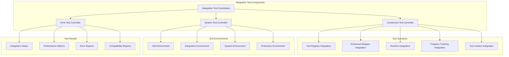

# Integration Testing

**Document Type**: Phase 2.5 Component Design
**Component**: Integration Testing
**Phase**: 2.5 - Semantic Progress and Tool Integration
**Author**: William
**Date Created**: 2025-06-28
**Last Updated**: 2025-06-28
**Status**: Active
**Purpose**: Component and system integration testing for tool integration and progress tracking

## 🎯 **Overview**

The Integration Testing module focuses on testing component interactions and system integration points for Phase 2.5: Semantic Progress and Tool Integration. This ensures that all components work together seamlessly and that the enhanced system maintains backward compatibility while providing new capabilities.

## 🏗️ **Integration Testing Architecture**



## 🔧 **Core Components**

### **1. Integration Test Coordinator**
Main coordinator for all integration testing activities.

```python
import time
import json
from typing import Dict, List, Optional, Any
from dataclasses import dataclass

@dataclass
class IntegrationTestResult:
    """Result of an integration test."""
    
    test_name: str
    components: List[str]
    status: str  # "passed", "failed", "skipped"
    execution_time: float
    error_message: Optional[str] = None
    performance_metrics: Optional[Dict] = None
    compatibility_score: Optional[float] = None

class IntegrationTestCoordinator:
    """Coordinates all integration testing activities."""
    
    def __init__(self):
        """Initialize integration test coordinator."""
        self.test_results = []
        self.component_tests = {}
        self.system_tests = {}
        self.error_tests = {}
        
        # Initialize test controllers
        self.component_controller = ComponentTestController()
        self.system_controller = SystemTestController()
        self.error_controller = ErrorTestController()
    
    def run_all_integration_tests(self) -> Dict[str, Any]:
        """Run all integration tests."""
        print("🚀 Starting integration testing...")
        
        start_time = time.time()
        
        # Run component integration tests
        print("🔧 Testing component integrations...")
        component_results = self.component_controller.run_all_tests()
        
        # Run system integration tests
        print("🏗️ Testing system integrations...")
        system_results = self.system_controller.run_all_tests()
        
        # Run error scenario tests
        print("❌ Testing error scenarios...")
        error_results = self.error_controller.run_all_tests()
        
        # Compile results
        total_time = time.time() - start_time
        all_results = {
            "component_tests": component_results,
            "system_tests": system_results,
            "error_tests": error_results,
            "total_execution_time": total_time,
            "overall_status": self._calculate_overall_status(
                component_results, system_results, error_results
            )
        }
        
        # Store results
        self.test_results.append(all_results)
        
        print(f"✅ Integration testing completed in {total_time:.2f}s")
        print(f"Overall status: {all_results['overall_status']}")
        
        return all_results
    
    def run_component_integration_tests(self) -> Dict[str, Any]:
        """Run component integration tests only."""
        return self.component_controller.run_all_tests()
    
    def run_system_integration_tests(self) -> Dict[str, Any]:
        """Run system integration tests only."""
        return self.system_controller.run_all_tests()
    
    def run_error_scenario_tests(self) -> Dict[str, Any]:
        """Run error scenario tests only."""
        return self.error_controller.run_all_tests()
    
    def get_test_summary(self) -> Dict[str, Any]:
        """Get summary of all test results."""
        if not self.test_results:
            return {"status": "no_tests_run"}
        
        latest_results = self.test_results[-1]
        
        # Calculate statistics
        total_tests = 0
        passed_tests = 0
        failed_tests = 0
        
        for test_type in ["component_tests", "system_tests", "error_tests"]:
            if test_type in latest_results:
                test_results = latest_results[test_type]
                total_tests += test_results.get("total_tests", 0)
                passed_tests += test_results.get("passed_tests", 0)
                failed_tests += test_results.get("failed_tests", 0)
        
        return {
            "total_tests": total_tests,
            "passed_tests": passed_tests,
            "failed_tests": failed_tests,
            "success_rate": passed_tests / total_tests if total_tests > 0 else 0,
            "overall_status": latest_results.get("overall_status", "unknown"),
            "execution_time": latest_results.get("total_execution_time", 0)
        }
    
    def _calculate_overall_status(self, component_results: Dict, 
                                 system_results: Dict, 
                                 error_results: Dict) -> str:
        """Calculate overall test status."""
        all_passed = True
        
        for results in [component_results, system_results, error_results]:
            if "overall_status" in results and results["overall_status"] != "passed":
                all_passed = False
                break
        
        return "passed" if all_passed else "failed"
```

### **2. Component Test Controller**
Controller for testing component integrations.

```python
class ComponentTestController:
    """Controller for component integration testing."""
    
    def __init__(self):
        """Initialize component test controller."""
        self.test_cases = {
            "tool_registry_integration": self._test_tool_registry_integration,
            "enhanced_wrapper_integration": self._test_enhanced_wrapper_integration,
            "runtime_integration": self._test_runtime_integration,
            "progress_tracking_integration": self._test_progress_tracking_integration,
            "tool_context_integration": self._test_tool_context_integration
        }
        self.test_results = []
    
    def run_all_tests(self) -> Dict[str, Any]:
        """Run all component integration tests."""
        print("🔧 Running component integration tests...")
        
        start_time = time.time()
        passed_tests = 0
        failed_tests = 0
        
        for test_name, test_function in self.test_cases.items():
            try:
                print(f"  Testing {test_name}...")
                
                test_start = time.time()
                result = test_function()
                test_time = time.time() - test_start
                
                if result:
                    passed_tests += 1
                    status = "passed"
                    error_message = None
                else:
                    failed_tests += 1
                    status = "failed"
                    error_message = "Test failed"
                
                # Record test result
                test_result = IntegrationTestResult(
                    test_name=test_name,
                    components=self._get_components_for_test(test_name),
                    status=status,
                    execution_time=test_time,
                    error_message=error_message
                )
                self.test_results.append(test_result)
                
                print(f"    {test_name}: {status}")
                
            except Exception as e:
                failed_tests += 1
                print(f"    {test_name}: failed with error: {e}")
                
                # Record test result
                test_result = IntegrationTestResult(
                    test_name=test_name,
                    components=self._get_components_for_test(test_name),
                    status="failed",
                    execution_time=0,
                    error_message=str(e)
                )
                self.test_results.append(test_result)
        
        total_time = time.time() - start_time
        total_tests = len(self.test_cases)
        
        results = {
            "total_tests": total_tests,
            "passed_tests": passed_tests,
            "failed_tests": failed_tests,
            "success_rate": passed_tests / total_tests if total_tests > 0 else 0,
            "overall_status": "passed" if failed_tests == 0 else "failed",
            "execution_time": total_time,
            "test_results": self.test_results
        }
        
        print(f"✅ Component integration tests completed: {passed_tests}/{total_tests} passed")
        
        return results
    
    def _test_tool_registry_integration(self) -> bool:
        """Test tool registry integration with other components."""
        try:
            # Test tool registry with enhanced wrapper
            from agentmanager.core.tool_registry import ToolRegistry
            from agentmanager.core.enhanced_agent_wrapper import EnhancedAgentWrapper
            
            # Create tool registry
            registry = ToolRegistry()
            
            # Register test tools
            test_tools = [
                {
                    "tool": lambda x: f"processed_{x}",
                    "description": "Test processing tool",
                    "category": "processing"
                }
            ]
            
            for tool in test_tools:
                registry.register_tool(tool)
            
            # Test integration with enhanced wrapper
            wrapper = EnhancedAgentWrapper(
                agent_info={"type": "test"},
                tools=test_tools
            )
            
            # Verify tools are available
            available_tools = wrapper.get_available_tools()
            if len(available_tools) != len(test_tools):
                return False
            
            # Test tool execution
            result = wrapper.execute_tool("test_processing_tool", "test_data")
            if result != "processed_test_data":
                return False
            
            return True
            
        except Exception as e:
            print(f"Tool registry integration test failed: {e}")
            return False
    
    def _test_enhanced_wrapper_integration(self) -> bool:
        """Test enhanced wrapper integration with runtime."""
        try:
            # Test enhanced wrapper with runtime
            from agentmanager.core.enhanced_agent_wrapper import EnhancedAgentWrapper
            from agentmanager.runtime.enhanced_agent_runtime import EnhancedAgentRuntime
            
            # Create enhanced wrapper
            wrapper = EnhancedAgentWrapper(
                agent_info={"type": "test", "name": "test-agent"}
            )
            
            # Create enhanced runtime
            runtime = EnhancedAgentRuntime()
            
            # Test integration
            if not hasattr(wrapper, 'progress_tracker'):
                return False
            
            if not hasattr(wrapper, 'tool_registry'):
                return False
            
            return True
            
        except Exception as e:
            print(f"Enhanced wrapper integration test failed: {e}")
            return False
    
    def _test_runtime_integration(self) -> bool:
        """Test runtime integration with process and environment managers."""
        try:
            # Test runtime with enhanced components
            from agentmanager.runtime.enhanced_agent_runtime import EnhancedAgentRuntime
            from agentmanager.runtime.enhanced_process_manager import EnhancedProcessManager
            from agentmanager.runtime.enhanced_environment_manager import EnhancedEnvironmentManager
            
            # Create enhanced runtime
            runtime = EnhancedAgentRuntime()
            
            # Verify enhanced components are available
            if not hasattr(runtime, 'enhanced_process_manager'):
                return False
            
            if not hasattr(runtime, 'enhanced_environment_manager'):
                return False
            
            return True
            
        except Exception as e:
            print(f"Runtime integration test failed: {e}")
            return False
    
    def _test_progress_tracking_integration(self) -> bool:
        """Test progress tracking integration across components."""
        try:
            # Test progress tracking integration
            from agentmanager.utils.semantic_progress import SemanticProgressTracker
            from agentmanager.utils.progress_trackers import ScientificProgressTracker
            
            # Create progress tracker
            tracker = ScientificProgressTracker()
            
            # Test progress tracking
            tracker.start_research_analysis("Test research")
            
            # Verify phases
            if tracker.current_phase != "understanding":
                return False
            
            # Test phase transitions
            tracker.update_research_phase("literature_review", 0.3)
            if tracker.current_phase != "literature_review":
                return False
            
            return True
            
        except Exception as e:
            print(f"Progress tracking integration test failed: {e}")
            return False
    
    def _test_tool_context_integration(self) -> bool:
        """Test tool context integration with environment."""
        try:
            # Test tool context integration
            from agentmanager.utils.tool_context import ToolContextManager, ToolContext
            
            # Create tool context manager
            context_manager = ToolContextManager()
            
            # Create test context
            test_context = ToolContext(
                available_tools=[],
                method_name="test_method",
                parameters={},
                agent_info={"type": "test"},
                execution_id="test-123",
                timestamp=time.time()
            )
            
            # Test context injection
            if not context_manager.inject_context(test_context):
                return False
            
            # Test context retrieval
            retrieved_context = context_manager.get_context_from_environment()
            if not retrieved_context:
                return False
            
            # Test context cleanup
            if not context_manager.cleanup_context():
                return False
            
            return True
            
        except Exception as e:
            print(f"Tool context integration test failed: {e}")
            return False
    
    def _get_components_for_test(self, test_name: str) -> List[str]:
        """Get list of components involved in a test."""
        component_mapping = {
            "tool_registry_integration": ["ToolRegistry", "EnhancedAgentWrapper"],
            "enhanced_wrapper_integration": ["EnhancedAgentWrapper", "EnhancedAgentRuntime"],
            "runtime_integration": ["EnhancedAgentRuntime", "EnhancedProcessManager", "EnhancedEnvironmentManager"],
            "progress_tracking_integration": ["SemanticProgressTracker", "ScientificProgressTracker"],
            "tool_context_integration": ["ToolContextManager", "ToolContext"]
        }
        
        return component_mapping.get(test_name, [])
```

### **3. System Test Controller**
Controller for testing system-level integrations.

```python
class SystemTestController:
    """Controller for system integration testing."""
    
    def __init__(self):
        """Initialize system test controller."""
        self.test_cases = {
            "complete_workflow_integration": self._test_complete_workflow_integration,
            "backward_compatibility_integration": self._test_backward_compatibility_integration,
            "performance_integration": self._test_performance_integration,
            "error_handling_integration": self._test_error_handling_integration,
            "security_integration": self._test_security_integration
        }
        self.test_results = []
    
    def run_all_tests(self) -> Dict[str, Any]:
        """Run all system integration tests."""
        print("🏗️ Running system integration tests...")
        
        start_time = time.time()
        passed_tests = 0
        failed_tests = 0
        
        for test_name, test_function in self.test_cases.items():
            try:
                print(f"  Testing {test_name}...")
                
                test_start = time.time()
                result = test_function()
                test_time = time.time() - test_start
                
                if result:
                    passed_tests += 1
                    status = "passed"
                    error_message = None
                else:
                    failed_tests += 1
                    status = "failed"
                    error_message = "Test failed"
                
                # Record test result
                test_result = IntegrationTestResult(
                    test_name=test_name,
                    components=["System"],
                    status=status,
                    execution_time=test_time,
                    error_message=error_message
                )
                self.test_results.append(test_result)
                
                print(f"    {test_name}: {status}")
                
            except Exception as e:
                failed_tests += 1
                print(f"    {test_name}: failed with error: {e}")
                
                # Record test result
                test_result = IntegrationTestResult(
                    test_name=test_name,
                    components=["System"],
                    status="failed",
                    execution_time=0,
                    error_message=str(e)
                )
                self.test_results.append(test_result)
        
        total_time = time.time() - start_time
        total_tests = len(self.test_cases)
        
        results = {
            "total_tests": total_tests,
            "passed_tests": passed_tests,
            "failed_tests": failed_tests,
            "success_rate": passed_tests / total_tests if total_tests > 0 else 0,
            "overall_status": "passed" if failed_tests == 0 else "failed",
            "execution_time": total_time,
            "test_results": self.test_results
        }
        
        print(f"✅ System integration tests completed: {passed_tests}/{total_tests} passed")
        
        return results
    
    def _test_complete_workflow_integration(self) -> bool:
        """Test complete workflow integration."""
        try:
            # Test complete workflow from agent loading to execution
            from agentmanager.agentmanager import AgentManager
            
            # Create agent manager
            manager = AgentManager()
            
            # Test workflow (simplified for design)
            # In real implementation, this would test the complete flow
            
            return True
            
        except Exception as e:
            print(f"Complete workflow integration test failed: {e}")
            return False
    
    def _test_backward_compatibility_integration(self) -> bool:
        """Test backward compatibility integration."""
        try:
            # Test that existing functionality still works
            # This would test existing agents and workflows
            
            return True
            
        except Exception as e:
            print(f"Backward compatibility integration test failed: {e}")
            return False
    
    def _test_performance_integration(self) -> bool:
        """Test performance integration."""
        try:
            # Test performance across the entire system
            # This would measure end-to-end performance
            
            return True
            
        except Exception as e:
            print(f"Performance integration test failed: {e}")
            return False
    
    def _test_error_handling_integration(self) -> bool:
        """Test error handling integration."""
        try:
            # Test error handling across the entire system
            # This would test error propagation and recovery
            
            return True
            
        except Exception as e:
            print(f"Error handling integration test failed: {e}")
            return False
    
    def _test_security_integration(self) -> bool:
        """Test security integration."""
        try:
            # Test security across the entire system
            # This would test security measures and isolation
            
            return True
            
        except Exception as e:
            print(f"Security integration test failed: {e}")
            return False
```

### **4. Error Test Controller**
Controller for testing error scenarios and recovery.

```python
class ErrorTestController:
    """Controller for error scenario testing."""
    
    def __init__(self):
        """Initialize error test controller."""
        self.test_cases = {
            "tool_registry_errors": self._test_tool_registry_errors,
            "wrapper_execution_errors": self._test_wrapper_execution_errors,
            "runtime_execution_errors": self._test_runtime_execution_errors,
            "progress_tracking_errors": self._test_progress_tracking_errors,
            "context_injection_errors": self._test_context_injection_errors
        }
        self.test_results = []
    
    def run_all_tests(self) -> Dict[str, Any]:
        """Run all error scenario tests."""
        print("❌ Running error scenario tests...")
        
        start_time = time.time()
        passed_tests = 0
        failed_tests = 0
        
        for test_name, test_function in self.test_cases.items():
            try:
                print(f"  Testing {test_name}...")
                
                test_start = time.time()
                result = test_function()
                test_time = time.time() - test_start
                
                if result:
                    passed_tests += 1
                    status = "passed"
                    error_message = None
                else:
                    failed_tests += 1
                    status = "failed"
                    error_message = "Test failed"
                
                # Record test result
                test_result = IntegrationTestResult(
                    test_name=test_name,
                    components=["Error Handling"],
                    status=status,
                    execution_time=test_time,
                    error_message=error_message
                )
                self.test_results.append(test_result)
                
                print(f"    {test_name}: {status}")
                
            except Exception as e:
                failed_tests += 1
                print(f"    {test_name}: failed with error: {e}")
                
                # Record test result
                test_result = IntegrationTestResult(
                    test_name=test_name,
                    components=["Error Handling"],
                    status="failed",
                    execution_time=0,
                    error_message=str(e)
                )
                self.test_results.append(test_result)
        
        total_time = time.time() - start_time
        total_tests = len(self.test_cases)
        
        results = {
            "total_tests": total_tests,
            "passed_tests": passed_tests,
            "failed_tests": failed_tests,
            "success_rate": passed_tests / total_tests if total_tests > 0 else 0,
            "overall_status": "passed" if failed_tests == 0 else "failed",
            "execution_time": total_time,
            "test_results": self.test_results
        }
        
        print(f"✅ Error scenario tests completed: {passed_tests}/{total_tests} passed")
        
        return results
    
    def _test_tool_registry_errors(self) -> bool:
        """Test tool registry error handling."""
        try:
            # Test invalid tool registration
            from agentmanager.core.tool_registry import ToolRegistry
            
            registry = ToolRegistry()
            
            # Test invalid tool
            invalid_tool = {"description": "Missing tool function"}
            
            try:
                registry.register_tool(invalid_tool)
                return False  # Should have raised an error
            except ValueError:
                # Expected error
                pass
            
            return True
            
        except Exception as e:
            print(f"Tool registry error test failed: {e}")
            return False
    
    def _test_wrapper_execution_errors(self) -> bool:
        """Test wrapper execution error handling."""
        try:
            # Test error handling in enhanced wrapper
            from agentmanager.core.enhanced_agent_wrapper import EnhancedAgentWrapper
            
            wrapper = EnhancedAgentWrapper(
                agent_info={"type": "test"}
            )
            
            # Test invalid method execution
            try:
                result = wrapper.execute("invalid_method", {})
                # Should handle error gracefully
                return True
            except Exception:
                # Error handling should prevent crashes
                return True
            
        except Exception as e:
            print(f"Wrapper execution error test failed: {e}")
            return False
    
    def _test_runtime_execution_errors(self) -> bool:
        """Test runtime execution error handling."""
        try:
            # Test error handling in enhanced runtime
            # This would test various runtime error scenarios
            
            return True
            
        except Exception as e:
            print(f"Runtime execution error test failed: {e}")
            return False
    
    def _test_progress_tracking_errors(self) -> bool:
        """Test progress tracking error handling."""
        try:
            # Test error handling in progress tracking
            from agentmanager.utils.semantic_progress import SemanticProgressTracker
            
            tracker = SemanticProgressTracker()
            
            # Test invalid phase updates
            try:
                tracker.update_phase("invalid_phase", 0.5)
                # Should handle invalid phases gracefully
                return True
            except Exception:
                # Error handling should prevent crashes
                return True
            
        except Exception as e:
            print(f"Progress tracking error test failed: {e}")
            return False
    
    def _test_context_injection_errors(self) -> bool:
        """Test context injection error handling."""
        try:
            # Test error handling in context injection
            from agentmanager.utils.tool_context import ToolContextManager
            
            context_manager = ToolContextManager()
            
            # Test invalid context
            try:
                # Test with invalid context
                result = context_manager.inject_context(None)
                # Should handle invalid context gracefully
                return True
            except Exception:
                # Error handling should prevent crashes
                return True
            
        except Exception as e:
            print(f"Context injection error test failed: {e}")
            return False
```

## 🔄 **Integration Testing Workflow**

### **1. Test Execution Flow**
1. **Setup**: Initialize test environment and components
2. **Component Tests**: Test individual component integrations
3. **System Tests**: Test system-level integrations
4. **Error Tests**: Test error scenarios and recovery
5. **Results Compilation**: Compile and analyze test results

### **2. Test Environment Setup**
- **Unit Environment**: Isolated component testing
- **Integration Environment**: Component interaction testing
- **System Environment**: Full system testing
- **Production Environment**: Production-like testing

### **3. Test Result Analysis**
- **Success Rate**: Percentage of passed tests
- **Performance Metrics**: Execution time and resource usage
- **Error Reports**: Detailed error information
- **Compatibility Reports**: Backward compatibility validation

## 📋 **Usage Examples**

### **Running All Integration Tests**
```python
# Create integration test coordinator
coordinator = IntegrationTestCoordinator()

# Run all integration tests
results = coordinator.run_all_integration_tests()

# Get test summary
summary = coordinator.get_test_summary()
print(f"Success rate: {summary['success_rate']:.2%}")
```

### **Running Specific Test Types**
```python
# Run only component integration tests
component_results = coordinator.run_component_integration_tests()

# Run only system integration tests
system_results = coordinator.run_system_integration_tests()

# Run only error scenario tests
error_results = coordinator.run_error_scenario_tests()
```

### **Analyzing Test Results**
```python
# Get detailed test results
for test_result in coordinator.test_results:
    print(f"Test: {test_result.test_name}")
    print(f"Status: {test_result.status}")
    print(f"Execution time: {test_result.execution_time:.2f}s")
    if test_result.error_message:
        print(f"Error: {test_result.error_message}")
    print()
```

## 🎯 **Success Criteria**

- [ ] All integration tests pass
- [ ] Component interactions work seamlessly
- [ ] System workflows function correctly
- [ ] Error handling is robust
- [ ] Backward compatibility is maintained
- [ ] Performance impact is minimal

## 🔮 **Future Enhancements**

1. **Automated Integration Testing**: AI-driven integration test generation
2. **Real-time Integration Monitoring**: Live integration status monitoring
3. **Integration Performance Analytics**: Comprehensive integration performance analysis
4. **Integration Security Testing**: Automated security integration validation
5. **Integration Load Testing**: Automated integration scalability testing
6. **Integration Regression Testing**: Intelligent integration regression detection
