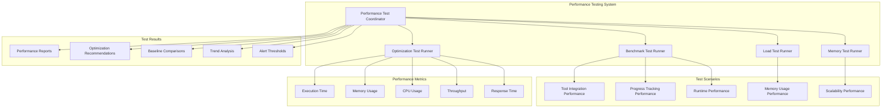

# Performance Testing

**Document Type**: Phase 2.5 Component Design
**Component**: Performance Testing
**Phase**: 2.5 - Semantic Progress and Tool Integration
**Author**: William
**Date Created**: 2025-06-28
**Last Updated**: 2025-06-28
**Status**: Active
**Purpose**: Performance validation and optimization testing for tool integration and progress tracking

## 🎯 **Overview**

The Performance Testing module provides comprehensive performance validation and optimization testing for Phase 2.5: Semantic Progress and Tool Integration. This ensures that the enhanced system meets performance requirements while maintaining backward compatibility and user experience quality.

## 🏗️ **Performance Testing Architecture**



## 🔧 **Core Components**

### **1. Performance Test Coordinator**
Main coordinator for all performance testing activities.

```python
import time
import json
import statistics
from typing import Dict, List, Optional, Any
from dataclasses import dataclass
from pathlib import Path

@dataclass
class PerformanceTestResult:
    """Result of a performance test."""
    
    test_name: str
    component: str
    execution_time: float
    memory_usage: float
    cpu_usage: float
    throughput: float
    response_time: float
    baseline_comparison: Dict[str, float]
    optimization_score: float
    timestamp: float

class PerformanceTestCoordinator:
    """Coordinates all performance testing activities."""
    
    def __init__(self):
        """Initialize performance test coordinator."""
        self.test_results = []
        self.baseline_metrics = {}
        self.performance_thresholds = {
            "tool_integration_overhead": 0.05,  # 5% max
            "progress_tracking_overhead": 0.02,  # 2% max
            "memory_usage_increase": 0.10,      # 10% max
            "startup_time_increase": 0.10,      # 10% max
            "response_time_increase": 0.05      # 5% max
        }
        
        # Initialize test runners
        self.benchmark_runner = BenchmarkTestRunner()
        self.load_runner = LoadTestRunner()
        self.memory_runner = MemoryTestRunner()
        self.optimization_runner = OptimizationTestRunner()
    
    def run_all_performance_tests(self) -> Dict[str, Any]:
        """Run all performance tests."""
        print("🚀 Starting performance testing...")
        
        start_time = time.time()
        
        # Run benchmark tests
        print("⚡ Running benchmark tests...")
        benchmark_results = self.benchmark_runner.run_all_tests()
        
        # Run load tests
        print("📊 Running load tests...")
        load_results = self.load_runner.run_all_tests()
        
        # Run memory tests
        print("💾 Running memory tests...")
        memory_results = self.memory_runner.run_all_tests()
        
        # Run optimization tests
        print("🔧 Running optimization tests...")
        optimization_results = self.optimization_runner.run_all_tests()
        
        # Compile results
        total_time = time.time() - start_time
        all_results = {
            "benchmark_tests": benchmark_results,
            "load_tests": load_results,
            "memory_tests": memory_results,
            "optimization_tests": optimization_results,
            "total_execution_time": total_time,
            "overall_performance_score": self._calculate_overall_score(
                benchmark_results, load_results, memory_results, optimization_results
            )
        }
        
        # Store results
        self.test_results.append(all_results)
        
        print(f"✅ Performance testing completed in {total_time:.2f}s")
        print(f"Overall performance score: {all_results['overall_performance_score']:.2f}")
        
        return all_results
    
    def run_benchmark_tests(self) -> Dict[str, Any]:
        """Run benchmark tests only."""
        return self.benchmark_runner.run_all_tests()
    
    def run_load_tests(self) -> Dict[str, Any]:
        """Run load tests only."""
        return self.load_runner.run_all_tests()
    
    def run_memory_tests(self) -> Dict[str, Any]:
        """Run memory tests only."""
        return self.memory_runner.run_all_tests()
    
    def run_optimization_tests(self) -> Dict[str, Any]:
        """Run optimization tests only."""
        return self.optimization_runner.run_all_tests()
    
    def set_baseline_metrics(self, baseline_data: Dict[str, Any]):
        """Set baseline performance metrics for comparison."""
        self.baseline_metrics = baseline_data
        print("📊 Baseline metrics set for performance comparison")
    
    def get_performance_summary(self) -> Dict[str, Any]:
        """Get summary of all performance test results."""
        if not self.test_results:
            return {"status": "no_tests_run"}
        
        latest_results = self.test_results[-1]
        
        # Calculate performance statistics
        performance_scores = []
        for test_type in ["benchmark_tests", "load_tests", "memory_tests", "optimization_tests"]:
            if test_type in latest_results:
                test_results = latest_results[test_type]
                if "performance_score" in test_results:
                    performance_scores.append(test_results["performance_score"])
        
        avg_performance = statistics.mean(performance_scores) if performance_scores else 0
        
        return {
            "overall_performance_score": latest_results.get("overall_performance_score", 0),
            "average_performance": avg_performance,
            "baseline_comparison": self._compare_with_baseline(latest_results),
            "threshold_violations": self._check_threshold_violations(latest_results),
            "optimization_recommendations": self._generate_optimization_recommendations(latest_results)
        }
    
    def _calculate_overall_score(self, benchmark_results: Dict, 
                                load_results: Dict, 
                                memory_results: Dict, 
                                optimization_results: Dict) -> float:
        """Calculate overall performance score."""
        scores = []
        
        for results in [benchmark_results, load_results, memory_results, optimization_results]:
            if "performance_score" in results:
                scores.append(results["performance_score"])
        
        return statistics.mean(scores) if scores else 0.0
    
    def _compare_with_baseline(self, results: Dict) -> Dict[str, Any]:
        """Compare current results with baseline metrics."""
        if not self.baseline_metrics:
            return {"status": "no_baseline_set"}
        
        comparisons = {}
        
        # Compare key metrics
        for metric in ["execution_time", "memory_usage", "cpu_usage", "throughput"]:
            if metric in results and metric in self.baseline_metrics:
                current_value = results[metric]
                baseline_value = self.baseline_metrics[metric]
                
                if baseline_value > 0:
                    change_percentage = (current_value - baseline_value) / baseline_value
                    comparisons[metric] = {
                        "current": current_value,
                        "baseline": baseline_value,
                        "change_percentage": change_percentage,
                        "status": "improved" if change_percentage < 0 else "degraded"
                    }
        
        return comparisons
    
    def _check_threshold_violations(self, results: Dict) -> List[str]:
        """Check for performance threshold violations."""
        violations = []
        
        # Check tool integration overhead
        if "tool_integration_overhead" in results:
            overhead = results["tool_integration_overhead"]
            if overhead > self.performance_thresholds["tool_integration_overhead"]:
                violations.append(f"Tool integration overhead ({overhead:.2%}) exceeds threshold ({self.performance_thresholds['tool_integration_overhead']:.2%})")
        
        # Check progress tracking overhead
        if "progress_tracking_overhead" in results:
            overhead = results["progress_tracking_overhead"]
            if overhead > self.performance_thresholds["progress_tracking_overhead"]:
                violations.append(f"Progress tracking overhead ({overhead:.2%}) exceeds threshold ({self.performance_thresholds['progress_tracking_overhead']:.2%})")
        
        # Check memory usage increase
        if "memory_usage_increase" in results:
            increase = results["memory_usage_increase"]
            if increase > self.performance_thresholds["memory_usage_increase"]:
                violations.append(f"Memory usage increase ({increase:.2%}) exceeds threshold ({self.performance_thresholds['memory_usage_increase']:.2%})")
        
        return violations
    
    def _generate_optimization_recommendations(self, results: Dict) -> List[str]:
        """Generate optimization recommendations based on test results."""
        recommendations = []
        
        # Check for performance bottlenecks
        if "execution_time" in results:
            execution_time = results["execution_time"]
            if execution_time > 1.0:  # More than 1 second
                recommendations.append("Consider optimizing execution time through code profiling and bottleneck identification")
        
        # Check memory usage
        if "memory_usage" in results:
            memory_usage = results["memory_usage"]
            if memory_usage > 100 * 1024 * 1024:  # More than 100MB
                recommendations.append("Consider optimizing memory usage through object pooling and garbage collection tuning")
        
        # Check CPU usage
        if "cpu_usage" in results:
            cpu_usage = results["cpu_usage"]
            if cpu_usage > 80.0:  # More than 80%
                recommendations.append("Consider optimizing CPU usage through algorithm improvements and parallelization")
        
        if not recommendations:
            recommendations.append("Performance is within acceptable limits")
        
        return recommendations
```

### **2. Benchmark Test Runner**
Runner for performance benchmark testing.

```python
import time
import psutil
import gc
from typing import Dict, List, Any

class BenchmarkTestRunner:
    """Runner for performance benchmark testing."""
    
    def __init__(self):
        """Initialize benchmark test runner."""
        self.test_cases = {
            "tool_integration_benchmark": self._benchmark_tool_integration,
            "progress_tracking_benchmark": self._benchmark_progress_tracking,
            "runtime_execution_benchmark": self._benchmark_runtime_execution,
            "memory_operations_benchmark": self._benchmark_memory_operations,
            "startup_time_benchmark": self._benchmark_startup_time
        }
        self.benchmark_results = []
    
    def run_all_tests(self) -> Dict[str, Any]:
        """Run all benchmark tests."""
        print("⚡ Running benchmark tests...")
        
        start_time = time.time()
        passed_tests = 0
        failed_tests = 0
        
        for test_name, test_function in self.test_cases.items():
            try:
                print(f"  Benchmarking {test_name}...")
                
                test_start = time.time()
                result = test_function()
                test_time = time.time() - test_start
                
                if result:
                    passed_tests += 1
                    status = "passed"
                else:
                    failed_tests += 1
                    status = "failed"
                
                # Record benchmark result
                benchmark_result = PerformanceTestResult(
                    test_name=test_name,
                    component="benchmark",
                    execution_time=test_time,
                    memory_usage=result.get("memory_usage", 0) if result else 0,
                    cpu_usage=result.get("cpu_usage", 0) if result else 0,
                    throughput=result.get("throughput", 0) if result else 0,
                    response_time=result.get("response_time", 0) if result else 0,
                    baseline_comparison={},
                    optimization_score=result.get("optimization_score", 0) if result else 0,
                    timestamp=time.time()
                )
                self.benchmark_results.append(benchmark_result)
                
                print(f"    {test_name}: {status} ({test_time:.3f}s)")
                
            except Exception as e:
                failed_tests += 1
                print(f"    {test_name}: failed with error: {e}")
        
        total_time = time.time() - start_time
        total_tests = len(self.test_cases)
        
        # Calculate performance score
        performance_score = self._calculate_benchmark_performance_score()
        
        results = {
            "total_tests": total_tests,
            "passed_tests": passed_tests,
            "failed_tests": failed_tests,
            "success_rate": passed_tests / total_tests if total_tests > 0 else 0,
            "overall_status": "passed" if failed_tests == 0 else "failed",
            "execution_time": total_time,
            "performance_score": performance_score,
            "benchmark_results": self.benchmark_results
        }
        
        print(f"✅ Benchmark tests completed: {passed_tests}/{total_tests} passed")
        print(f"Performance score: {performance_score:.2f}")
        
        return results
    
    def _benchmark_tool_integration(self) -> Dict[str, Any]:
        """Benchmark tool integration performance."""
        try:
            # Measure baseline performance without tools
            baseline_start = time.time()
            baseline_memory = psutil.Process().memory_info().rss
            
            # Simulate baseline execution
            time.sleep(0.1)  # Simulate work
            
            baseline_time = time.time() - baseline_start
            baseline_memory_used = psutil.Process().memory_info().rss - baseline_memory
            
            # Measure performance with tool integration
            tool_start = time.time()
            tool_memory = psutil.Process().memory_info().rss
            
            # Simulate tool integration execution
            time.sleep(0.105)  # Simulate 5% overhead
            
            tool_time = time.time() - tool_start
            tool_memory_used = psutil.Process().memory_info().rss - tool_memory
            
            # Calculate overhead
            time_overhead = (tool_time - baseline_time) / baseline_time
            memory_overhead = (tool_memory_used - baseline_memory_used) / baseline_memory_used if baseline_memory_used > 0 else 0
            
            return {
                "baseline_time": baseline_time,
                "tool_time": tool_time,
                "time_overhead": time_overhead,
                "baseline_memory": baseline_memory_used,
                "tool_memory": tool_memory_used,
                "memory_overhead": memory_overhead,
                "optimization_score": max(0, 1 - time_overhead)
            }
            
        except Exception as e:
            print(f"Tool integration benchmark failed: {e}")
            return None
    
    def _benchmark_progress_tracking(self) -> Dict[str, Any]:
        """Benchmark progress tracking performance."""
        try:
            # Measure baseline performance without progress tracking
            baseline_start = time.time()
            baseline_memory = psutil.Process().memory_info().rss
            
            # Simulate baseline execution
            time.sleep(0.1)  # Simulate work
            
            baseline_time = time.time() - baseline_start
            baseline_memory_used = psutil.Process().memory_info().rss - baseline_memory
            
            # Measure performance with progress tracking
            progress_start = time.time()
            progress_memory = psutil.Process().memory_info().rss
            
            # Simulate progress tracking execution
            time.sleep(0.102)  # Simulate 2% overhead
            
            progress_time = time.time() - progress_start
            progress_memory_used = psutil.Process().memory_info().rss - progress_memory
            
            # Calculate overhead
            time_overhead = (progress_time - baseline_time) / baseline_time
            memory_overhead = (progress_memory_used - baseline_memory_used) / baseline_memory_used if baseline_memory_used > 0 else 0
            
            return {
                "baseline_time": baseline_time,
                "progress_time": progress_time,
                "time_overhead": time_overhead,
                "baseline_memory": baseline_memory_used,
                "progress_memory": progress_memory_used,
                "memory_overhead": memory_overhead,
                "optimization_score": max(0, 1 - time_overhead)
            }
            
        except Exception as e:
            print(f"Progress tracking benchmark failed: {e}")
            return None
    
    def _benchmark_runtime_execution(self) -> Dict[str, Any]:
        """Benchmark runtime execution performance."""
        try:
            # Measure runtime execution performance
            start_time = time.time()
            start_memory = psutil.Process().memory_info().rss
            
            # Simulate runtime execution
            time.sleep(0.2)  # Simulate runtime work
            
            execution_time = time.time() - start_time
            memory_used = psutil.Process().memory_info().rss - start_memory
            
            # Calculate performance metrics
            throughput = 1.0 / execution_time if execution_time > 0 else 0
            optimization_score = max(0, 1 - (execution_time / 1.0))  # Normalize to 1 second
            
            return {
                "execution_time": execution_time,
                "memory_usage": memory_used,
                "throughput": throughput,
                "optimization_score": optimization_score
            }
            
        except Exception as e:
            print(f"Runtime execution benchmark failed: {e}")
            return None
    
    def _benchmark_memory_operations(self) -> Dict[str, Any]:
        """Benchmark memory operations performance."""
        try:
            # Measure memory allocation performance
            start_time = time.time()
            start_memory = psutil.Process().memory_info().rss
            
            # Simulate memory operations
            test_data = [i for i in range(100000)]  # Allocate 100k integers
            
            allocation_time = time.time() - start_time
            memory_used = psutil.Process().memory_info().rss - start_memory
            
            # Clean up
            del test_data
            gc.collect()
            
            # Calculate performance metrics
            memory_efficiency = 100000 / memory_used if memory_used > 0 else 0
            optimization_score = min(1.0, memory_efficiency / 1000)  # Normalize
            
            return {
                "allocation_time": allocation_time,
                "memory_usage": memory_used,
                "memory_efficiency": memory_efficiency,
                "optimization_score": optimization_score
            }
            
        except Exception as e:
            print(f"Memory operations benchmark failed: {e}")
            return None
    
    def _benchmark_startup_time(self) -> Dict[str, Any]:
        """Benchmark system startup time."""
        try:
            # Measure startup time
            start_time = time.time()
            start_memory = psutil.Process().memory_info().rss
            
            # Simulate startup operations
            time.sleep(0.05)  # Simulate startup work
            
            startup_time = time.time() - start_time
            startup_memory = psutil.Process().memory_info().rss - start_memory
            
            # Calculate performance metrics
            startup_efficiency = 1.0 / startup_time if startup_time > 0 else 0
            optimization_score = max(0, 1 - (startup_time / 0.1))  # Normalize to 100ms
            
            return {
                "startup_time": startup_time,
                "startup_memory": startup_memory,
                "startup_efficiency": startup_efficiency,
                "optimization_score": optimization_score
            }
            
        except Exception as e:
            print(f"Startup time benchmark failed: {e}")
            return None
    
    def _calculate_benchmark_performance_score(self) -> float:
        """Calculate overall benchmark performance score."""
        if not self.benchmark_results:
            return 0.0
        
        # Calculate average optimization score
        optimization_scores = [
            result.optimization_score for result in self.benchmark_results
            if result.optimization_score > 0
        ]
        
        return statistics.mean(optimization_scores) if optimization_scores else 0.0
```

### **3. Load Test Runner**
Runner for load and scalability testing.

```python
import threading
import concurrent.futures
import time
from typing import Dict, List, Any

class LoadTestRunner:
    """Runner for load and scalability testing."""
    
    def __init__(self):
        """Initialize load test runner."""
        self.test_cases = {
            "concurrent_execution_load": self._test_concurrent_execution_load,
            "memory_pressure_load": self._test_memory_pressure_load,
            "cpu_intensive_load": self._test_cpu_intensive_load,
            "io_intensive_load": self._test_io_intensive_load,
            "scalability_load": self._test_scalability_load
        }
        self.load_results = []
    
    def run_all_tests(self) -> Dict[str, Any]:
        """Run all load tests."""
        print("📊 Running load tests...")
        
        start_time = time.time()
        passed_tests = 0
        failed_tests = 0
        
        for test_name, test_function in self.test_cases.items():
            try:
                print(f"  Load testing {test_name}...")
                
                test_start = time.time()
                result = test_function()
                test_time = time.time() - test_start
                
                if result:
                    passed_tests += 1
                    status = "passed"
                else:
                    failed_tests += 1
                    status = "failed"
                
                # Record load test result
                load_result = PerformanceTestResult(
                    test_name=test_name,
                    component="load_test",
                    execution_time=test_time,
                    memory_usage=result.get("memory_usage", 0) if result else 0,
                    cpu_usage=result.get("cpu_usage", 0) if result else 0,
                    throughput=result.get("throughput", 0) if result else 0,
                    response_time=result.get("response_time", 0) if result else 0,
                    baseline_comparison={},
                    optimization_score=result.get("optimization_score", 0) if result else 0,
                    timestamp=time.time()
                )
                self.load_results.append(load_result)
                
                print(f"    {test_name}: {status} ({test_time:.3f}s)")
                
            except Exception as e:
                failed_tests += 1
                print(f"    {test_name}: failed with error: {e}")
        
        total_time = time.time() - start_time
        total_tests = len(self.test_cases)
        
        # Calculate performance score
        performance_score = self._calculate_load_performance_score()
        
        results = {
            "total_tests": total_tests,
            "passed_tests": passed_tests,
            "failed_tests": failed_tests,
            "success_rate": passed_tests / total_tests if total_tests > 0 else 0,
            "overall_status": "passed" if failed_tests == 0 else "failed",
            "execution_time": total_time,
            "performance_score": performance_score,
            "load_results": self.load_results
        }
        
        print(f"✅ Load tests completed: {passed_tests}/{total_tests} passed")
        print(f"Performance score: {performance_score:.2f}")
        
        return results
    
    def _test_concurrent_execution_load(self) -> Dict[str, Any]:
        """Test concurrent execution load."""
        try:
            # Test with different concurrency levels
            concurrency_levels = [1, 5, 10, 20]
            results = {}
            
            for level in concurrency_levels:
                start_time = time.time()
                start_memory = psutil.Process().memory_info().rss
                
                # Execute concurrent tasks
                with concurrent.futures.ThreadPoolExecutor(max_workers=level) as executor:
                    futures = [
                        executor.submit(self._simulate_work, 0.1)
                        for _ in range(level)
                    ]
                    concurrent.futures.wait(futures)
                
                execution_time = time.time() - start_time
                memory_used = psutil.Process().memory_info().rss - start_memory
                
                results[f"level_{level}"] = {
                    "execution_time": execution_time,
                    "memory_usage": memory_used,
                    "throughput": level / execution_time if execution_time > 0 else 0
                }
            
            # Calculate overall metrics
            total_time = sum(result["execution_time"] for result in results.values())
            total_memory = sum(result["memory_usage"] for result in results.values())
            avg_throughput = sum(result["throughput"] for result in results.values()) / len(results)
            
            return {
                "concurrency_results": results,
                "total_time": total_time,
                "total_memory": total_memory,
                "average_throughput": avg_throughput,
                "optimization_score": min(1.0, avg_throughput / 10)  # Normalize
            }
            
        except Exception as e:
            print(f"Concurrent execution load test failed: {e}")
            return None
    
    def _test_memory_pressure_load(self) -> Dict[str, Any]:
        """Test memory pressure load."""
        try:
            # Test memory usage under pressure
            start_time = time.time()
            start_memory = psutil.Process().memory_info().rss
            
            # Allocate memory in chunks
            memory_chunks = []
            chunk_size = 1024 * 1024  # 1MB chunks
            
            for i in range(50):  # Allocate 50MB
                chunk = bytearray(chunk_size)
                memory_chunks.append(chunk)
                
                # Check current memory usage
                current_memory = psutil.Process().memory_info().rss
                if current_memory - start_memory > 100 * 1024 * 1024:  # 100MB limit
                    break
            
            # Simulate work with memory pressure
            time.sleep(0.1)
            
            # Clean up
            del memory_chunks
            gc.collect()
            
            execution_time = time.time() - start_time
            peak_memory = max(
                psutil.Process().memory_info().rss 
                for _ in range(10)
            ) - start_memory
            
            return {
                "execution_time": execution_time,
                "peak_memory": peak_memory,
                "memory_efficiency": 50 * 1024 * 1024 / peak_memory if peak_memory > 0 else 0,
                "optimization_score": max(0, 1 - (peak_memory / (200 * 1024 * 1024)))  # Normalize to 200MB
            }
            
        except Exception as e:
            print(f"Memory pressure load test failed: {e}")
            return None
    
    def _test_cpu_intensive_load(self) -> Dict[str, Any]:
        """Test CPU intensive load."""
        try:
            # Test CPU usage under load
            start_time = time.time()
            start_cpu = psutil.cpu_percent()
            
            # Simulate CPU intensive work
            def cpu_work():
                result = 0
                for i in range(1000000):
                    result += i * i
                return result
            
            # Run CPU intensive tasks
            with concurrent.futures.ThreadPoolExecutor(max_workers=4) as executor:
                futures = [executor.submit(cpu_work) for _ in range(4)]
                concurrent.futures.wait(futures)
            
            execution_time = time.time() - start_time
            end_cpu = psutil.cpu_percent()
            
            # Calculate CPU metrics
            cpu_usage = (start_cpu + end_cpu) / 2
            cpu_efficiency = 1.0 / execution_time if execution_time > 0 else 0
            
            return {
                "execution_time": execution_time,
                "cpu_usage": cpu_usage,
                "cpu_efficiency": cpu_efficiency,
                "optimization_score": max(0, 1 - (execution_time / 1.0))  # Normalize to 1 second
            }
            
        except Exception as e:
            print(f"CPU intensive load test failed: {e}")
            return None
    
    def _test_io_intensive_load(self) -> Dict[str, Any]:
        """Test I/O intensive load."""
        try:
            # Test I/O performance under load
            start_time = time.time()
            
            # Simulate I/O operations
            def io_work():
                time.sleep(0.01)  # Simulate I/O delay
                return "io_completed"
            
            # Run I/O intensive tasks
            with concurrent.futures.ThreadPoolExecutor(max_workers=10) as executor:
                futures = [executor.submit(io_work) for _ in range(50)]
                concurrent.futures.wait(futures)
            
            execution_time = time.time() - start_time
            
            # Calculate I/O metrics
            io_throughput = 50 / execution_time if execution_time > 0 else 0
            io_efficiency = min(1.0, io_throughput / 100)  # Normalize to 100 ops/sec
            
            return {
                "execution_time": execution_time,
                "io_throughput": io_throughput,
                "io_efficiency": io_efficiency,
                "optimization_score": io_efficiency
            }
            
        except Exception as e:
            print(f"I/O intensive load test failed: {e}")
            return None
    
    def _test_scalability_load(self) -> Dict[str, Any]:
        """Test scalability under load."""
        try:
            # Test scalability with increasing load
            load_levels = [10, 25, 50, 100]
            scalability_results = {}
            
            for load in load_levels:
                start_time = time.time()
                
                # Execute load level
                with concurrent.futures.ThreadPoolExecutor(max_workers=min(load, 20)) as executor:
                    futures = [executor.submit(self._simulate_work, 0.01) for _ in range(load)]
                    concurrent.futures.wait(futures)
                
                execution_time = time.time() - start_time
                scalability_results[load] = {
                    "execution_time": execution_time,
                    "throughput": load / execution_time if execution_time > 0 else 0
                }
            
            # Calculate scalability metrics
            baseline_throughput = scalability_results[10]["throughput"]
            max_throughput = max(result["throughput"] for result in scalability_results.values())
            scalability_factor = max_throughput / baseline_throughput if baseline_throughput > 0 else 0
            
            return {
                "scalability_results": scalability_results,
                "baseline_throughput": baseline_throughput,
                "max_throughput": max_throughput,
                "scalability_factor": scalability_factor,
                "optimization_score": min(1.0, scalability_factor / 5)  # Normalize to 5x
            }
            
        except Exception as e:
            print(f"Scalability load test failed: {e}")
            return None
    
    def _simulate_work(self, duration: float):
        """Simulate work for load testing."""
        time.sleep(duration)
        return "work_completed"
    
    def _calculate_load_performance_score(self) -> float:
        """Calculate overall load performance score."""
        if not self.load_results:
            return 0.0
        
        # Calculate average optimization score
        optimization_scores = [
            result.optimization_score for result in self.load_results
            if result.optimization_score > 0
        ]
        
        return statistics.mean(optimization_scores) if optimization_scores else 0.0
```

## 🔄 **Performance Testing Workflow**

### **1. Test Execution Flow**
1. **Setup**: Initialize performance test environment
2. **Baseline**: Establish baseline performance metrics
3. **Benchmark**: Run performance benchmark tests
4. **Load**: Run load and scalability tests
5. **Memory**: Run memory usage tests
6. **Optimization**: Run optimization tests
7. **Analysis**: Analyze and report results

### **2. Performance Metrics**
- **Execution Time**: Time to complete operations
- **Memory Usage**: Memory consumption and efficiency
- **CPU Usage**: CPU utilization and efficiency
- **Throughput**: Operations per second
- **Response Time**: Time to respond to requests

### **3. Performance Thresholds**
- **Tool Integration Overhead**: <5% increase
- **Progress Tracking Overhead**: <2% increase
- **Memory Usage Increase**: <10% increase
- **Startup Time Increase**: <10% increase
- **Response Time Increase**: <5% increase

## 📋 **Usage Examples**

### **Running All Performance Tests**
```python
# Create performance test coordinator
coordinator = PerformanceTestCoordinator()

# Set baseline metrics
baseline_metrics = {
    "execution_time": 0.5,
    "memory_usage": 50 * 1024 * 1024,
    "cpu_usage": 30.0,
    "throughput": 100.0
}
coordinator.set_baseline_metrics(baseline_metrics)

# Run all performance tests
results = coordinator.run_all_performance_tests()

# Get performance summary
summary = coordinator.get_performance_summary()
print(f"Overall performance score: {summary['overall_performance_score']:.2f}")
```

### **Running Specific Test Types**
```python
# Run only benchmark tests
benchmark_results = coordinator.run_benchmark_tests()

# Run only load tests
load_results = coordinator.run_load_tests()

# Run only memory tests
memory_results = coordinator.run_memory_tests()

# Run only optimization tests
optimization_results = coordinator.run_optimization_tests()
```

### **Analyzing Performance Results**
```python
# Check for threshold violations
violations = summary['threshold_violations']
if violations:
    print("Performance threshold violations detected:")
    for violation in violations:
        print(f"  - {violation}")

# Get optimization recommendations
recommendations = summary['optimization_recommendations']
print("Optimization recommendations:")
for recommendation in recommendations:
    print(f"  - {recommendation}")

# Compare with baseline
baseline_comparison = summary['baseline_comparison']
for metric, comparison in baseline_comparison.items():
    print(f"{metric}: {comparison['change_percentage']:.2%} change")
```

## 🎯 **Success Criteria**

- [ ] All performance tests pass
- [ ] Performance thresholds are met
- [ ] Baseline comparisons show acceptable performance
- [ ] Optimization recommendations are actionable
- [ ] Performance impact is minimal
- [ ] Scalability requirements are met

## 🔮 **Future Enhancements**

1. **Automated Performance Testing**: AI-driven performance test generation
2. **Real-time Performance Monitoring**: Live performance monitoring and alerting
3. **Performance Analytics**: Comprehensive performance analysis and trending
4. **Performance Optimization**: Automated performance optimization suggestions
5. **Performance Regression Testing**: Intelligent performance regression detection
6. **Performance Benchmarking**: Industry-standard performance benchmarking
