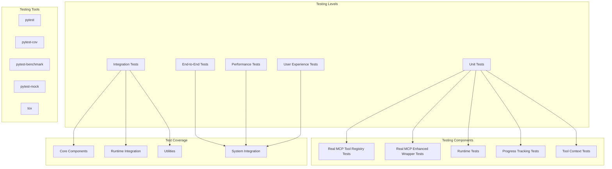

# Phase 2.5 Real MCP Testing Strategy

**Document Type**: Phase 2.5 Real MCP Testing Overview
**Component**: Real MCP Testing Strategy
**Phase**: 2.5 - Real MCP Tool Integration
**Author**: William
**Date Created**: 2025-06-28
**Last Updated**: 2025-06-28
**Status**: Active
**Purpose**: Overview of testing strategy for real MCP tool integration using official MCP Python SDK

## 🎯 **Overview**

The Real MCP Testing Strategy module provides comprehensive testing approaches for Phase 2.5: **Real MCP Tool Integration** using the **official MCP Python SDK** from [https://github.com/modelcontextprotocol/python-sdk](https://github.com/modelcontextprotocol/python-sdk). This ensures high quality, reliability, and backward compatibility while validating new **real MCP tool integration** and progress tracking capabilities via **official MCP protocol**.

## 🏗️ **Testing Architecture**

## 🔧 **Testing Strategy**

### **1. Testing Strategy Overview**
Comprehensive testing approach covering all aspects of the Phase 2.5 implementation.

**Key Areas**:
- Testing philosophy and approach
- Test coverage requirements
- Testing tools and frameworks
- Quality assurance processes

**Location**: `01_testing_strategy.md`

### **2. Integration Testing**
Testing component interactions and system integration points.

**Key Areas**:
- Component integration validation
- System workflow testing
- Error handling validation
- Performance integration testing

**Location**: `02_integration_testing.md`

### **3. Performance Testing**
Performance validation and optimization testing.

**Key Areas**:
- Performance benchmarking
- Load testing
- Memory usage analysis
- Optimization validation

**Location**: `03_performance_testing.md`

## 📋 **Design Documents**

1. **[Testing Strategy](01_testing_strategy.md)** - Overall testing approach and philosophy
2. **[Integration Testing](02_integration_testing.md)** - Component and system integration testing
3. **[Performance Testing](03_performance_testing.md)** - Performance validation and optimization

## 🧪 **Testing Levels**

### **Unit Tests**
Individual component testing with high coverage requirements.

**Coverage Goals**:
- **Tool Registry**: 95%+ coverage
- **Enhanced Wrapper**: 90%+ coverage
- **Runtime Integration**: 90%+ coverage
- **Progress Tracking**: 95%+ coverage

**Testing Focus**:
- Component initialization
- Method functionality
- Error handling
- Edge cases

### **Integration Tests**
Component interaction and system integration testing.

**Coverage Goals**:
- **Component Integration**: 85%+ coverage
- **System Workflows**: 90%+ coverage
- **Error Scenarios**: 95%+ coverage

**Testing Focus**:
- Component communication
- Data flow validation
- Error propagation
- Recovery mechanisms

### **End-to-End Tests**
Complete workflow testing from user input to final output.

**Coverage Goals**:
- **Critical Workflows**: 100% coverage
- **User Scenarios**: 95%+ coverage
- **Error Recovery**: 90%+ coverage

**Testing Focus**:
- Complete user workflows
- Tool integration scenarios
- Progress tracking validation
- Error recovery workflows

### **Performance Tests**
Performance validation and optimization testing.

**Performance Targets**:
- **Tool Integration Overhead**: <5% increase
- **Progress Tracking Overhead**: <2% increase
- **Memory Usage**: <10% increase
- **Startup Time**: <10% increase

**Testing Focus**:
- Performance benchmarking
- Load testing scenarios
- Memory usage analysis
- Optimization validation

### **User Experience Tests**
Usability and accessibility testing.

**Testing Focus**:
- Progress message clarity
- Tool integration usability
- Error message quality
- Overall user satisfaction

## 🛠️ **Testing Tools and Frameworks**

### **Primary Testing Framework**
- **pytest**: Unit and integration testing
- **pytest-cov**: Code coverage analysis
- **pytest-benchmark**: Performance benchmarking
- **pytest-mock**: Mocking and stubbing

### **Additional Tools**
- **tox**: Multi-environment testing
- **black**: Code formatting validation
- **ruff**: Code quality and linting
- **mypy**: Type checking validation

### **Testing Infrastructure**
- **GitHub Actions**: Continuous integration
- **Coverage Reports**: Automated coverage tracking
- **Performance Monitoring**: Automated performance tracking
- **Quality Gates**: Automated quality validation

## 📊 **Test Coverage Requirements**

### **Overall Coverage Goals**
- **Unit Tests**: 90%+ coverage
- **Integration Tests**: 85%+ coverage
- **End-to-End Tests**: 100% of critical workflows
- **Performance Tests**: All performance requirements met

### **Component-Specific Coverage**
- **Core Components**: 95%+ coverage
- **Runtime Integration**: 90%+ coverage
- **Utilities**: 95%+ coverage
- **Tool Integration**: 90%+ coverage

## 🔄 **Testing Workflow**

### **Development Testing**
1. **Unit Tests**: Run on every code change
2. **Integration Tests**: Run on component completion
3. **Code Quality**: Automated quality checks
4. **Coverage Validation**: Coverage requirement validation

### **Integration Testing**
1. **Component Integration**: Test component interactions
2. **System Integration**: Test complete system workflows
3. **Error Scenarios**: Test error handling and recovery
4. **Performance Validation**: Validate performance requirements

### **Release Testing**
1. **End-to-End Testing**: Complete workflow validation
2. **Performance Testing**: Performance requirement validation
3. **User Experience Testing**: Usability and accessibility validation
4. **Backward Compatibility**: Ensure no regression in existing features

## 🎯 **Success Criteria**

- [ ] All tests pass with required coverage levels
- [ ] Performance requirements are met
- [ ] Integration points work seamlessly
- [ ] Error handling is robust and reliable
- [ ] User experience meets quality standards
- [ ] Backward compatibility is maintained
- [ ] System is stable and reliable

## 🔮 **Future Testing Enhancements**

1. **Automated Testing**: AI-driven test case generation
2. **Performance Monitoring**: Real-time performance tracking
3. **User Experience Analytics**: Automated UX quality assessment
4. **Security Testing**: Automated security vulnerability testing
5. **Load Testing**: Automated scalability testing
6. **Regression Testing**: Intelligent regression detection
