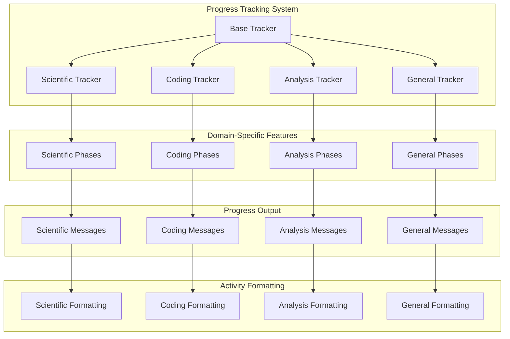

# Domain-Specific Progress Trackers Design

**Document Type**: Phase 2.5 Component Design
**Component**: Domain-Specific Progress Trackers
**Phase**: 2.5 - Semantic Progress and Tool Integration
**Author**: William
**Date Created**: 2025-06-28
**Last Updated**: 2025-06-28
**Status**: Active
**Purpose**: Design domain-specific progress trackers for different types of agents and tasks

## 🎯 **Overview**

The Domain-Specific Progress Trackers provide specialized progress tracking for different types of agents and tasks. These trackers ensure that progress updates are meaningful and relevant to the specific domain, providing users with clear understanding of what agents are accomplishing in their specialized contexts.

## 🏗️ **Architecture**



## 🔧 **Core Components**

### **1. Base Progress Tracker**
Abstract base class that defines the interface for all domain-specific trackers.

```python
from abc import ABC, abstractmethod
from typing import Dict, List, Optional
from enum import Enum

class ProgressPhase(Enum):
    """Base progress phases that all trackers can use."""
    
    STARTING = ("🚀 Starting", "Task is beginning")
    PROCESSING = ("⚙️ Processing", "Task is in progress")
    COMPLETING = ("🎯 Completing", "Task is finishing")
    COMPLETED = ("✅ Completed", "Task is finished")
    ERROR = ("❌ Error", "Task encountered an error")

class BaseProgressTracker(ABC):
    """Base class for all domain-specific progress trackers."""
    
    def __init__(self, domain_name: str):
        """
        Initialize base progress tracker.
        
        Args:
            domain_name: Name of the domain this tracker handles
        """
        self.domain_name = domain_name
        self.current_phase = ProgressPhase.STARTING
        self.phase_progress = 0.0
        self.activity_history = []
        self.start_time = None
    
    @abstractmethod
    def get_phase_description(self, phase: str) -> str:
        """Get domain-specific description for a phase."""
        pass
    
    @abstractmethod
    def format_activity(self, activity: str, status: str = "in_progress") -> str:
        """Format activity message in domain-specific style."""
        pass
    
    @abstractmethod
    def get_phase_emoji(self, phase: str) -> str:
        """Get domain-specific emoji for a phase."""
        pass
    
    def start_task(self, task_description: str):
        """Start tracking progress for a new task."""
        self.start_time = time.time()
        self.current_phase = ProgressPhase.STARTING
        self.phase_progress = 0.0
        self.activity_history = []
        
        # Log task start
        start_message = f"🚀 Starting {self.domain_name} task: {task_description}"
        self._log_activity(start_message)
    
    def update_phase(self, phase: str, progress: float = 0.0):
        """Update current task phase and progress."""
        if phase != self.current_phase:
            # Complete previous phase
            self._complete_phase()
            
            # Start new phase
            self.current_phase = phase
            self.phase_progress = progress
            
            # Announce phase change
            phase_description = self.get_phase_description(phase)
            phase_emoji = self.get_phase_emoji(phase)
            phase_message = f"{phase_emoji} {phase_description}"
            self._log_activity(phase_message)
        else:
            # Update progress within current phase
            self.phase_progress = progress
            self._update_progress()
    
    def log_activity(self, activity: str, status: str = "in_progress"):
        """Log specific activity with domain-specific formatting."""
        formatted_activity = self.format_activity(activity, status)
        self._log_activity(formatted_activity)
    
    def complete_task(self, result_summary: str):
        """Mark task as complete with result summary."""
        completion_message = f"✅ {self.domain_name} task completed: {result_summary}"
        self._log_activity(completion_message)
        
        # Update phase
        self.current_phase = ProgressPhase.COMPLETED
        self.phase_progress = 1.0
        
        # Log summary
        self._log_summary()
    
    def log_error(self, error_message: str):
        """Log error with domain-specific formatting."""
        error_emoji = self.get_phase_emoji("error")
        error_message = f"{error_emoji} Error in {self.domain_name} task: {error_message}"
        self._log_activity(error_message)
        
        # Update phase
        self.current_phase = ProgressPhase.ERROR
    
    def _log_activity(self, message: str):
        """Log activity message to history."""
        timestamp = time.time()
        self.activity_history.append({
            "timestamp": timestamp,
            "message": message,
            "phase": self.current_phase.value,
            "progress": self.phase_progress
        })
        
        # Print to console (in real implementation, this could be configurable)
        print(message)
    
    def _complete_phase(self):
        """Mark current phase as complete."""
        if self.current_phase != ProgressPhase.STARTING:
            self.phase_progress = 1.0
    
    def _update_progress(self):
        """Update progress within current phase."""
        # This could trigger progress bar updates or other progress indicators
        pass
    
    def _log_summary(self):
        """Log task completion summary."""
        if self.start_time:
            duration = time.time() - self.start_time
            summary_message = f"📊 Task completed in {duration:.2f} seconds"
            self._log_activity(summary_message)
    
    def get_progress_summary(self) -> Dict:
        """Get comprehensive progress summary."""
        return {
            "domain": self.domain_name,
            "current_phase": self.current_phase.value,
            "phase_progress": self.phase_progress,
            "activity_count": len(self.activity_history),
            "start_time": self.start_time,
            "duration": time.time() - self.start_time if self.start_time else 0
        }
```

### **2. Scientific Analysis Tracker**
Specialized progress tracking for scientific analysis and research tasks.

```python
class ScientificProgressTracker(BaseProgressTracker):
    """Progress tracker specialized for scientific analysis tasks."""
    
    def __init__(self):
        """Initialize scientific progress tracker."""
        super().__init__("scientific_analysis")
        
        # Define scientific-specific phases
        self.scientific_phases = {
            "understanding": "Understanding research requirements and objectives",
            "literature_review": "Reviewing existing literature and research",
            "methodology_analysis": "Analyzing research methodology and approach",
            "data_collection": "Collecting and gathering research data",
            "data_analysis": "Analyzing collected data and identifying patterns",
            "results_evaluation": "Evaluating research results and findings",
            "conclusion_synthesis": "Synthesizing conclusions and insights",
            "report_generation": "Generating comprehensive research report",
            "quality_assurance": "Ensuring research quality and validity"
        }
    
    def get_phase_description(self, phase: str) -> str:
        """Get scientific-specific phase description."""
        return self.scientific_phases.get(phase, f"Working on {phase}")
    
    def format_activity(self, activity: str, status: str = "in_progress") -> str:
        """Format scientific analysis activities."""
        if status == "completed":
            return f"✅ {activity}"
        elif status == "error":
            return f"❌ {activity}"
        else:
            # Format based on activity type
            if "reading" in activity.lower():
                return f"📖 {activity}..."
            elif "analyzing" in activity.lower():
                return f"🔬 {activity}..."
            elif "collecting" in activity.lower():
                return f"📊 {activity}..."
            elif "evaluating" in activity.lower():
                return f"🔍 {activity}..."
            elif "synthesizing" in activity.lower():
                return f"🧠 {activity}..."
            elif "generating" in activity.lower():
                return f"✍️ {activity}..."
            elif "validating" in activity.lower():
                return f"✅ {activity}..."
            else:
                return f"📝 {activity}..."
    
    def get_phase_emoji(self, phase: str) -> str:
        """Get scientific-specific emoji for a phase."""
        emoji_map = {
            "understanding": "🧠",
            "literature_review": "📚",
            "methodology_analysis": "🧪",
            "data_collection": "📊",
            "data_analysis": "🔬",
            "results_evaluation": "🔍",
            "conclusion_synthesis": "💡",
            "report_generation": "📄",
            "quality_assurance": "✅",
            "error": "❌"
        }
        return emoji_map.get(phase, "📝")
    
    def start_research_analysis(self, research_topic: str):
        """Start tracking progress for research analysis."""
        self.start_task(f"Research analysis: {research_topic}")
        
        # Initialize scientific phases
        self.update_phase("understanding", 0.0)
    
    def update_research_phase(self, phase: str, progress: float = 0.0):
        """Update research analysis phase."""
        self.update_phase(phase, progress)
        
        # Log phase-specific activities
        if phase == "literature_review":
            self.log_activity("Scanning academic databases and journals")
        elif phase == "methodology_analysis":
            self.log_activity("Evaluating research methods and approaches")
        elif phase == "data_analysis":
            self.log_activity("Processing and analyzing research data")
    
    def log_research_activity(self, activity: str, status: str = "in_progress"):
        """Log research-specific activity."""
        self.log_activity(activity, status)
    
    def complete_research_analysis(self, findings_summary: str):
        """Mark research analysis as complete."""
        self.complete_task(f"Research analysis completed with findings: {findings_summary}")
```

### **3. Coding Task Tracker**
Specialized progress tracking for code generation and software development tasks.

```python
class CodingProgressTracker(BaseProgressTracker):
    """Progress tracker specialized for coding and software development tasks."""
    
    def __init__(self):
        """Initialize coding progress tracker."""
        super().__init__("coding")
        
        # Define coding-specific phases
        self.coding_phases = {
            "requirements_analysis": "Analyzing coding requirements and specifications",
            "design_planning": "Planning code architecture and design",
            "implementation": "Implementing code and functionality",
            "testing": "Testing code functionality and quality",
            "optimization": "Optimizing code performance and efficiency",
            "documentation": "Creating code documentation and comments",
            "code_review": "Reviewing code for quality and standards",
            "deployment_prep": "Preparing code for deployment"
        }
    
    def get_phase_description(self, phase: str) -> str:
        """Get coding-specific phase description."""
        return self.coding_phases.get(phase, f"Working on {phase}")
    
    def format_activity(self, activity: str, status: str = "in_progress") -> str:
        """Format coding activities."""
        if status == "completed":
            return f"✅ {activity}"
        elif status == "error":
            return f"❌ {activity}"
        else:
            # Format based on activity type
            if "generating" in activity.lower():
                return f"💻 {activity}..."
            elif "testing" in activity.lower():
                return f"🧪 {activity}..."
            elif "debugging" in activity.lower():
                return f"🐛 {activity}..."
            elif "optimizing" in activity.lower():
                return f"⚡ {activity}..."
            elif "documenting" in activity.lower():
                return f"📝 {activity}..."
            elif "reviewing" in activity.lower():
                return f"🔍 {activity}..."
            elif "deploying" in activity.lower():
                return f"🚀 {activity}..."
            else:
                return f"🔧 {activity}..."
    
    def get_phase_emoji(self, phase: str) -> str:
        """Get coding-specific emoji for a phase."""
        emoji_map = {
            "requirements_analysis": "📋",
            "design_planning": "🏗️",
            "implementation": "💻",
            "testing": "🧪",
            "optimization": "⚡",
            "documentation": "📝",
            "code_review": "🔍",
            "deployment_prep": "🚀",
            "error": "❌"
        }
        return emoji_map.get(phase, "🔧")
    
    def start_code_generation(self, task_description: str):
        """Start tracking progress for code generation."""
        self.start_task(f"Code generation: {task_description}")
        
        # Initialize coding phases
        self.update_phase("requirements_analysis", 0.0)
    
    def update_coding_phase(self, phase: str, progress: float = 0.0):
        """Update code generation phase."""
        self.update_phase(phase, progress)
        
        # Log phase-specific activities
        if phase == "requirements_analysis":
            self.log_activity("Analyzing coding requirements and constraints")
        elif phase == "design_planning":
            self.log_activity("Planning code architecture and structure")
        elif phase == "implementation":
            self.log_activity("Writing code implementation")
        elif phase == "testing":
            self.log_activity("Testing code functionality")
    
    def log_coding_activity(self, activity: str, status: str = "in_progress"):
        """Log coding-specific activity."""
        self.log_activity(activity, status)
    
    def complete_code_generation(self, code_summary: str):
        """Mark code generation as complete."""
        self.complete_task(f"Code generation completed: {code_summary}")
```

### **4. Data Analysis Tracker**
Specialized progress tracking for data processing and analysis tasks.

```python
class DataAnalysisProgressTracker(BaseProgressTracker):
    """Progress tracker specialized for data analysis tasks."""
    
    def __init__(self):
        """Initialize data analysis progress tracker."""
        super().__init__("data_analysis")
        
        # Define data analysis-specific phases
        self.data_phases = {
            "data_collection": "Collecting data from various sources",
            "data_cleaning": "Cleaning and preprocessing data",
            "data_exploration": "Exploring data structure and patterns",
            "feature_engineering": "Creating and selecting features",
            "model_selection": "Selecting appropriate analysis models",
            "model_training": "Training analysis models",
            "model_evaluation": "Evaluating model performance",
            "results_interpretation": "Interpreting analysis results",
            "visualization": "Creating data visualizations",
            "report_generation": "Generating analysis report"
        }
    
    def get_phase_description(self, phase: str) -> str:
        """Get data analysis-specific phase description."""
        return self.data_phases.get(phase, f"Working on {phase}")
    
    def format_activity(self, activity: str, status: str = "in_progress") -> str:
        """Format data analysis activities."""
        if status == "completed":
            return f"✅ {activity}"
        elif status == "error":
            return f"❌ {activity}"
        else:
            # Format based on activity type
            if "collecting" in activity.lower():
                return f"📊 {activity}..."
            elif "cleaning" in activity.lower():
                return f"🧹 {activity}..."
            elif "exploring" in activity.lower():
                return f"🔍 {activity}..."
            elif "engineering" in activity.lower():
                return f"⚙️ {activity}..."
            elif "training" in activity.lower():
                return f"🎯 {activity}..."
            elif "evaluating" in activity.lower():
                return f"📈 {activity}..."
            elif "visualizing" in activity.lower():
                return f"📊 {activity}..."
            else:
                return f"📝 {activity}..."
    
    def get_phase_emoji(self, phase: str) -> str:
        """Get data analysis-specific emoji for a phase."""
        emoji_map = {
            "data_collection": "📊",
            "data_cleaning": "🧹",
            "data_exploration": "🔍",
            "feature_engineering": "⚙️",
            "model_selection": "🎯",
            "model_training": "🎯",
            "model_evaluation": "📈",
            "results_interpretation": "🧠",
            "visualization": "📊",
            "report_generation": "📄",
            "error": "❌"
        }
        return emoji_map.get(phase, "📝")
    
    def start_data_analysis(self, analysis_description: str):
        """Start tracking progress for data analysis."""
        self.start_task(f"Data analysis: {analysis_description}")
        
        # Initialize data analysis phases
        self.update_phase("data_collection", 0.0)
    
    def update_data_phase(self, phase: str, progress: float = 0.0):
        """Update data analysis phase."""
        self.update_phase(phase, progress)
        
        # Log phase-specific activities
        if phase == "data_collection":
            self.log_activity("Gathering data from multiple sources")
        elif phase == "data_cleaning":
            self.log_activity("Cleaning and preprocessing data")
        elif phase == "model_training":
            self.log_activity("Training analysis models")
    
    def log_data_activity(self, activity: str, status: str = "in_progress"):
        """Log data analysis-specific activity."""
        self.log_activity(activity, status)
    
    def complete_data_analysis(self, analysis_summary: str):
        """Mark data analysis as complete."""
        self.complete_task(f"Data analysis completed: {analysis_summary}")
```

### **5. General Purpose Tracker**
Flexible progress tracking for general tasks and workflows.

```python
class GeneralProgressTracker(BaseProgressTracker):
    """Progress tracker for general tasks and workflows."""
    
    def __init__(self):
        """Initialize general progress tracker."""
        super().__init__("general")
        
        # Define general phases
        self.general_phases = {
            "planning": "Planning and organizing the task",
            "execution": "Executing the main task",
            "review": "Reviewing and validating results",
            "completion": "Finalizing and completing the task"
        }
    
    def get_phase_description(self, phase: str) -> str:
        """Get general phase description."""
        return self.general_phases.get(phase, f"Working on {phase}")
    
    def format_activity(self, activity: str, status: str = "in_progress") -> str:
        """Format general activities."""
        if status == "completed":
            return f"✅ {activity}"
        elif status == "error":
            return f"❌ {activity}"
        else:
            # Format based on activity type
            if "planning" in activity.lower():
                return f"📋 {activity}..."
            elif "executing" in activity.lower():
                return f"⚙️ {activity}..."
            elif "reviewing" in activity.lower():
                return f"🔍 {activity}..."
            elif "finalizing" in activity.lower():
                return f"🎯 {activity}..."
            else:
                return f"📝 {activity}..."
    
    def get_phase_emoji(self, phase: str) -> str:
        """Get general emoji for a phase."""
        emoji_map = {
            "planning": "📋",
            "execution": "⚙️",
            "review": "🔍",
            "completion": "🎯",
            "error": "❌"
        }
        return emoji_map.get(phase, "📝")
    
    def start_general_task(self, task_description: str):
        """Start tracking progress for general task."""
        self.start_task(f"General task: {task_description}")
        
        # Initialize general phases
        self.update_phase("planning", 0.0)
    
    def update_general_phase(self, phase: str, progress: float = 0.0):
        """Update general task phase."""
        self.update_phase(phase, progress)
    
    def log_general_activity(self, activity: str, status: str = "in_progress"):
        """Log general task activity."""
        self.log_activity(activity, status)
    
    def complete_general_task(self, task_summary: str):
        """Mark general task as complete."""
        self.complete_task(f"General task completed: {task_summary}")
```

## 🔄 **Integration with Agent System**

### **Progress Tracking Integration**
- Seamless integration with agent execution
- Real-time progress updates
- Configurable progress detail levels
- Progress history preservation

### **Domain-Specific Customization**
- Automatic domain detection
- Customizable progress messages
- Domain-specific emojis and formatting
- Flexible phase definitions

## 📋 **Usage Examples**

### **Using Scientific Tracker**
```python
# Create scientific tracker
scientific_tracker = ScientificProgressTracker()

# Start research analysis
scientific_tracker.start_research_analysis("Machine Learning Applications in Healthcare")

# Update phases
scientific_tracker.update_research_phase("literature_review", 0.3)
scientific_tracker.log_research_activity("Reading recent ML healthcare papers")

scientific_tracker.update_research_phase("methodology_analysis", 0.6)
scientific_tracker.log_research_activity("Analyzing ML methodologies used")

# Complete analysis
scientific_tracker.complete_research_analysis("Comprehensive review completed with key insights")
```

### **Using Coding Tracker**
```python
# Create coding tracker
coding_tracker = CodingProgressTracker()

# Start code generation
coding_tracker.start_code_generation("Create REST API for user management")

# Update phases
coding_tracker.update_coding_phase("requirements_analysis", 0.2)
coding_tracker.log_coding_activity("Analyzing API requirements")

coding_tracker.update_coding_phase("implementation", 0.7)
coding_tracker.log_coding_activity("Implementing API endpoints")

# Complete generation
coding_tracker.complete_code_generation("REST API implementation completed")
```

## 🎯 **Success Criteria**

- [ ] Progress updates are domain-specific and meaningful
- [ ] Phase transitions are clear and logical
- [ ] Activity logging provides useful information
- [ ] Performance impact is minimal
- [ ] User satisfaction with progress transparency is high
- [ ] Integration with existing system is seamless

## 🔮 **Future Enhancements**

1. **AI-Powered Progress**: Intelligent progress prediction and estimation
2. **Custom Progress Themes**: User-configurable progress display styles
3. **Progress Analytics**: Historical progress analysis and optimization
4. **Multi-Agent Progress**: Coordinated progress tracking for multiple agents
5. **Progress Notifications**: Real-time notifications for important milestones
6. **Progress Export**: Export progress data for external analysis
