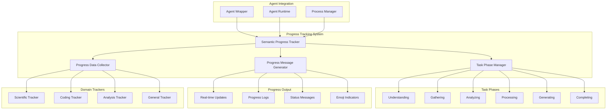

# Semantic Progress Tracking System Design

**Document Type**: Phase 2.5 Component Design
**Component**: Semantic Progress Tracking System
**Phase**: 2.5 - Semantic Progress and Tool Integration
**Author**: William
**Date Created**: 2025-06-28
**Last Updated**: 2025-06-28
**Status**: Active
**Purpose**: Design the semantic progress tracking system for human-readable progress updates

## 🎯 **Overview**

The Semantic Progress Tracking System provides human-readable, meaningful progress updates that show what agents are accomplishing rather than technical system details. This system transforms cryptic progress indicators into clear, actionable information that users can understand and act upon.

## 🏗️ **Architecture**



## 🔧 **Core Components**

### **1. Semantic Progress Tracker**
Main coordinator for progress tracking and message generation.

```python
class SemanticProgressTracker:
    """Manages semantic progress tracking for agents."""
    
    def __init__(self, agent_type: str = "general"):
        self.agent_type = agent_type
        self.current_phase = TaskPhase.UNDERSTANDING
        self.phase_progress = 0.0
        self.messages = []
        self.start_time = time.time()
        
        # Initialize domain-specific tracker
        self.domain_tracker = self._create_domain_tracker(agent_type)
    
    def start_task(self, task_description: str):
        """Start tracking progress for a new task."""
        self.current_phase = TaskPhase.UNDERSTANDING
        self.phase_progress = 0.0
        self.messages = []
        self.start_time = time.time()
        
        self._log_message(f"🔬 Starting {self.agent_type} task: {task_description}")
    
    def update_phase(self, new_phase: TaskPhase, progress: float = 0.0):
        """Update current task phase and progress."""
        if new_phase != self.current_phase:
            self._complete_phase()
            self.current_phase = new_phase
            self.phase_progress = progress
            self._announce_phase()
        else:
            self.phase_progress = progress
            self._update_progress()
    
    def log_activity(self, activity: str, status: str = "in_progress"):
        """Log specific activity with status."""
        message = self.domain_tracker.format_activity(activity, status)
        self._log_message(message)
    
    def complete_task(self, result_summary: str):
        """Mark task as complete with result summary."""
        self._log_message(f"🎯 Task completed: {result_summary}")
        self._log_summary()
```

### **2. Task Phase Manager**
Manages the progression through different task phases with appropriate transitions.

```python
class TaskPhase(Enum):
    """Task execution phases with human-readable descriptions."""
    
    UNDERSTANDING = ("🧠 Understanding", "Agent is understanding the task requirements")
    GATHERING = ("📚 Gathering", "Agent is collecting information and data")
    ANALYZING = ("🔍 Analyzing", "Agent is examining and processing data")
    PROCESSING = ("⚙️ Processing", "Agent is organizing and structuring findings")
    GENERATING = ("✍️ Generating", "Agent is creating output and results")
    COMPLETING = ("🎯 Completing", "Agent is finalizing and reviewing results")

class TaskPhaseManager:
    """Manages task phase transitions and progress tracking."""
    
    def __init__(self):
        self.phases = list(TaskPhase)
        self.current_phase_index = 0
        self.phase_progress = {}
        
        for phase in self.phases:
            self.phase_progress[phase] = 0.0
    
    def get_current_phase(self) -> TaskPhase:
        """Get current task phase."""
        return self.phases[self.current_phase_index]
    
    def advance_phase(self, progress: float = 1.0):
        """Advance to next phase with completion progress."""
        if self.current_phase_index < len(self.phases) - 1:
            self.phase_progress[self.phases[self.current_phase_index]] = progress
            self.current_phase_index += 1
            return True
        return False
    
    def get_phase_progress(self) -> float:
        """Get overall progress across all phases."""
        total_progress = sum(self.phase_progress.values())
        return total_progress / len(self.phases)
```

### **3. Progress Message Generator**
Creates human-readable progress messages with appropriate formatting and emojis.

```python
class ProgressMessageGenerator:
    """Generates human-readable progress messages."""
    
    def __init__(self, domain_tracker):
        self.domain_tracker = domain_tracker
        self.message_templates = self._load_templates()
    
    def generate_phase_message(self, phase: TaskPhase, progress: float) -> str:
        """Generate message for phase update."""
        template = self.message_templates.get(phase, "{}")
        return template.format(phase.value[0], progress)
    
    def generate_activity_message(self, activity: str, status: str) -> str:
        """Generate message for specific activity."""
        return self.domain_tracker.format_activity(activity, status)
    
    def generate_progress_bar(self, progress: float, width: int = 20) -> str:
        """Generate visual progress bar."""
        filled = int(width * progress)
        bar = "█" * filled + "░" * (width - filled)
        percentage = int(progress * 100)
        return f"[{bar}] {percentage}%"
```

## 📋 **Task Phases and Descriptions**

### **Phase 1: Understanding 🧠**
**Purpose**: Agent comprehends the task requirements and creates an execution plan.

**Activities**:
- Reading and parsing user input
- Identifying key requirements
- Creating execution strategy
- Planning tool usage

**Example Messages**:
```
🧠 Understanding the task: Reading and understanding your request
📋 Analysis plan: I will examine research methods and approach, analyze key results and discoveries
🎯 Strategy: Using available tools to gather and process information systematically
```

### **Phase 2: Gathering 📚**
**Purpose**: Agent collects information and data from various sources.

**Activities**:
- Reading files and documents
- Fetching data from APIs
- Collecting user input
- Gathering contextual information

**Example Messages**:
```
📚 Gathering information: Collecting relevant data sources
   📖 Reading paper content to understand methodology...
      ✅ Reading paper content...
      ✅ Reading paper content completed
   🔍 Scanning for key data points...
      ✅ Data point identification completed
```

### **Phase 3: Analyzing 🔍**
**Purpose**: Agent examines and processes collected data to extract insights.

**Activities**:
- Data pattern analysis
- Content examination
- Statistical processing
- Insight extraction

**Example Messages**:
```
🔍 Analyzing data: Examining research methodology...
   📊 Analyzing data patterns and trends...
      ✅ Pattern analysis completed
      ✅ Trend identification completed
   🎯 Identifying key insights and conclusions...
      ✅ Key insights identified
```

### **Phase 4: Processing ⚙️**
**Purpose**: Agent organizes and structures findings for output generation.

**Activities**:
- Data organization
- Structure creation
- Format preparation
- Quality validation

**Example Messages**:
```
⚙️ Processing findings: Organizing and structuring data...
   📋 Organizing information into logical structure...
      ✅ Structure creation completed
   🔧 Preparing output format...
      ✅ Format preparation completed
```

### **Phase 5: Generating ✍️**
**Purpose**: Agent creates final output and results based on processed data.

**Activities**:
- Content generation
- Report writing
- Code creation
- Result compilation

**Example Messages**:
```
✍️ Generating output: Writing comprehensive analysis report...
   📝 Creating detailed analysis...
      ✅ Analysis content generated
   📊 Compiling results and conclusions...
      ✅ Results compilation completed
```

### **Phase 6: Completing 🎯**
**Purpose**: Agent finalizes and reviews results before completion.

**Activities**:
- Final review
- Quality check
- Result validation
- Completion confirmation

**Example Messages**:
```
🎯 Finalizing results: Finalizing the analysis...
   ✅ Quality review completed
   ✅ Result validation completed
   🎉 Task completed successfully
```

## 🎨 **Domain-Specific Trackers**

### **Scientific Paper Analysis Tracker**
Specialized progress tracking for research paper analysis tasks.

```python
class ScientificTracker(DomainTracker):
    """Progress tracking for scientific paper analysis."""
    
    def format_activity(self, activity: str, status: str) -> str:
        """Format scientific analysis activities."""
        if "reading" in activity.lower():
            return f"📖 {activity}..."
        elif "analyzing" in activity.lower():
            return f"🔬 {activity}..."
        elif "methodology" in activity.lower():
            return f"🧪 {activity}..."
        elif "results" in activity.lower():
            return f"📊 {activity}..."
        else:
            return f"📝 {activity}..."
    
    def get_phase_description(self, phase: TaskPhase) -> str:
        """Get scientific-specific phase descriptions."""
        descriptions = {
            TaskPhase.UNDERSTANDING: "Understanding research paper requirements",
            TaskPhase.GATHERING: "Reading and extracting paper content",
            TaskPhase.ANALYZING: "Analyzing research methodology and results",
            TaskPhase.PROCESSING: "Organizing findings and insights",
            TaskPhase.GENERATING: "Creating comprehensive analysis report",
            TaskPhase.COMPLETING: "Finalizing research analysis"
        }
        return descriptions.get(phase, phase.value[1])
```

### **Coding Agent Tracker**
Specialized progress tracking for code generation and analysis tasks.

```python
class CodingTracker(DomainTracker):
    """Progress tracking for coding tasks."""
    
    def format_activity(self, activity: str, status: str) -> str:
        """Format coding activities."""
        if "generating" in activity.lower():
            return f"💻 {activity}..."
        elif "testing" in activity.lower():
            return f"🧪 {activity}..."
        elif "debugging" in activity.lower():
            return f"🐛 {activity}..."
        elif "optimizing" in activity.lower():
            return f"⚡ {activity}..."
        else:
            return f"🔧 {activity}..."
    
    def get_phase_description(self, phase: TaskPhase) -> str:
        """Get coding-specific phase descriptions."""
        descriptions = {
            TaskPhase.UNDERSTANDING: "Understanding coding requirements",
            TaskPhase.GATHERING: "Collecting code context and requirements",
            TaskPhase.ANALYZING: "Analyzing code structure and patterns",
            TaskPhase.PROCESSING: "Planning code architecture and design",
            TaskPhase.GENERATING: "Generating code and implementation",
            TaskPhase.COMPLETING: "Testing and validating code"
        }
        return descriptions.get(phase, phase.value[1])
```

## 🔄 **Integration with Agent System**

### **Agent Wrapper Integration**
```python
class EnhancedAgentWrapper(AgentWrapper):
    """Enhanced wrapper with progress tracking."""
    
    def __init__(self, agent_info: dict, runtime=None, tools=None):
        super().__init__(agent_info, runtime)
        self.progress_tracker = SemanticProgressTracker(
            agent_type=agent_info.get("type", "general")
        )
    
    def execute(self, method_name: str, parameters: dict) -> dict:
        """Execute agent method with progress tracking."""
        try:
            # Start progress tracking
            self.progress_tracker.start_task(f"Execute {method_name}")
            
            # Execute method
            result = super().execute(method_name, parameters)
            
            # Complete progress tracking
            self.progress_tracker.complete_task("Method execution completed")
            
            return result
        except Exception as e:
            self.progress_tracker.log_activity(f"Error: {str(e)}", "error")
            raise
```

### **Runtime Integration**
```python
class EnhancedAgentRuntime(AgentRuntime):
    """Enhanced runtime with progress tracking."""
    
    def execute_agent(self, namespace: str, agent_name: str, 
                      method: str, parameters: dict, tools: List[dict] = None) -> dict:
        """Execute agent with progress tracking."""
        
        # Create progress tracker
        progress_tracker = SemanticProgressTracker()
        
        # Start execution tracking
        progress_tracker.start_task(f"Execute {method} on {namespace}/{agent_name}")
        
        try:
            # Execute agent
            result = super().execute_agent(namespace, agent_name, method, parameters)
            
            # Complete tracking
            progress_tracker.complete_task("Agent execution completed successfully")
            
            return result
        except Exception as e:
            progress_tracker.log_activity(f"Execution failed: {str(e)}", "error")
            raise
```

## 📊 **Progress Output Formats**

### **Real-time Console Output**
```
🔬 Starting scientific analysis: Analyze this research paper
🧠 Understanding the task: Reading and understanding your request
📋 Analysis plan: I will examine research methods and approach, analyze key results and discoveries

📚 Gathering information: Collecting relevant data sources
   📖 Reading paper content to understand methodology...
      ✅ Reading paper content...
      ✅ Reading paper content completed

🔍 Analyzing data: Examining research methodology...
   📊 Analyzing data patterns and trends...
   🎯 Identifying key insights and conclusions...

✍️ Generating output: Writing comprehensive analysis report...
🎯 Finalizing results: Finalizing the analysis...
```

### **Progress Logs**
```json
{
  "timestamp": "2025-06-28T10:30:00Z",
  "task_id": "sci_analysis_001",
  "phase": "gathering",
  "phase_progress": 0.75,
  "activity": "Reading paper content",
  "status": "completed",
  "message": "📖 Reading paper content completed"
}
```

### **Status Messages**
```
Current Phase: 📚 Gathering Information (75% complete)
Activity: Reading paper content
Status: ✅ Completed
Next: Analyzing methodology
```

## 🧪 **Testing Strategy**

### **Unit Tests**
- Progress tracker initialization
- Phase transitions
- Message generation
- Activity logging

### **Integration Tests**
- Agent wrapper integration
- Runtime coordination
- Progress output validation
- Error handling

### **User Experience Tests**
- Message clarity and readability
- Progress indication accuracy
- Real-time update performance
- Overall user satisfaction

## 📈 **Performance Considerations**

### **Update Frequency**
- Configurable update intervals
- Throttling for high-frequency updates
- Batch processing for multiple activities

### **Memory Management**
- Message history limits
- Progress data cleanup
- Efficient data structures

### **Output Performance**
- Asynchronous message generation
- Buffered output for better performance
- Configurable output detail levels

## 🚀 **Implementation Plan**

### **Week 1: Core System**
- [ ] Task phase management
- [ ] Basic progress tracking
- [ ] Message generation framework

### **Week 2: Domain Trackers**
- [ ] Scientific analysis tracker
- [ ] Coding task tracker
- [ ] General purpose tracker

### **Week 3: Integration**
- [ ] Agent wrapper integration
- [ ] Runtime coordination
- [ ] Output formatting

### **Week 4: Testing and Optimization**
- [ ] Comprehensive testing
- [ ] Performance optimization
- [ ] User experience validation

## 🎯 **Success Criteria**

- [ ] Progress updates are human-readable and meaningful
- [ ] Phase transitions are clear and logical
- [ ] Activity logging provides useful information
- [ ] Performance impact is minimal
- [ ] User satisfaction with progress transparency is high
- [ ] Integration with existing system is seamless

## 🔮 **Future Enhancements**

1. **AI-Powered Progress**: Intelligent progress prediction and estimation
2. **Custom Progress Themes**: User-configurable progress display styles
3. **Progress Analytics**: Historical progress analysis and optimization
4. **Multi-Agent Progress**: Coordinated progress tracking for multiple agents
5. **Progress Notifications**: Real-time notifications for important milestones
6. **Progress Export**: Export progress data for external analysis
