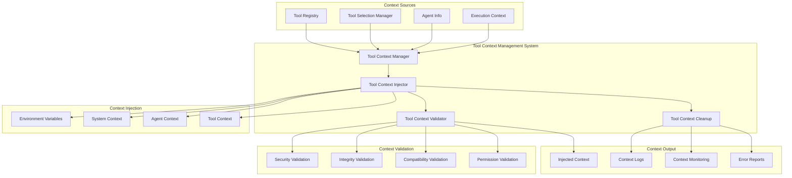

# Tool Context Management Design

**Document Type**: Phase 2.5 Component Design
**Component**: Tool Context Management
**Phase**: 2.5 - Semantic Progress and Tool Integration
**Author**: William
**Date Created**: 2025-06-28
**Last Updated**: 2025-06-28
**Status**: Active
**Purpose**: Design utilities for managing tool context injection, validation, and cleanup

## 🎯 **Overview**

The Tool Context Management system provides utilities for injecting tool context into agent execution environments, validating context integrity, and ensuring proper cleanup. This system ensures that tools are properly available to agents during execution while maintaining security and isolation.

## 🏗️ **Architecture**



## 🔧 **Core Components**

### **1. Tool Context Manager**
Main coordinator for tool context management operations.

```python
import os
import json
import time
import uuid
from typing import Dict, List, Optional, Any
from dataclasses import dataclass

@dataclass
class ToolContext:
    """Tool context information for agent execution."""
    
    available_tools: List[Dict[str, Any]]
    method_name: str
    parameters: Dict[str, Any]
    agent_info: Dict[str, Any]
    execution_id: str
    timestamp: float
    security_level: str = "safe"
    context_size: int = 0
    
    def __post_init__(self):
        """Calculate context size after initialization."""
        self.context_size = len(json.dumps(self.__dict__))

class ToolContextManager:
    """Manages tool context injection, validation, and cleanup."""
    
    def __init__(self):
        """Initialize tool context manager."""
        self.context_variables = [
            "AGENT_TOOL_CONTEXT",
            "AGENT_TOOL_COUNT",
            "AGENT_TYPE",
            "AGENT_EXECUTION_MODE",
            "AGENT_TOOL_INTEGRATION",
            "AGENT_EXECUTION_ID",
            "AGENT_EXECUTION_TIMESTAMP"
        ]
        self.original_environment = {}
        self.current_context = None
        self.injection_history = []
    
    def create_context(self, tools: List[Dict], method_name: str, 
                      parameters: Dict, agent_info: Dict) -> ToolContext:
        """
        Create tool context for agent execution.
        
        Args:
            tools: List of available tools
            method_name: Name of method being executed
            parameters: Method parameters
            agent_info: Agent information
            
        Returns:
            ToolContext object
        """
        # Create execution ID
        execution_id = str(uuid.uuid4())
        
        # Create context
        context = ToolContext(
            available_tools=tools,
            method_name=method_name,
            parameters=parameters,
            agent_info=agent_info,
            execution_id=execution_id,
            timestamp=time.time()
        )
        
        # Validate context
        self._validate_context(context)
        
        return context
    
    def inject_context(self, context: ToolContext) -> bool:
        """
        Inject tool context into execution environment.
        
        Args:
            context: Tool context to inject
            
        Returns:
            True if injection successful
        """
        try:
            # Store original environment
            self._store_original_environment()
            
            # Inject main context
            self._inject_main_context(context)
            
            # Inject derived variables
            self._inject_derived_variables(context)
            
            # Inject execution metadata
            self._inject_execution_metadata(context)
            
            # Store current context
            self.current_context = context
            
            # Log injection
            self._log_injection(context, "success")
            
            return True
            
        except Exception as e:
            # Log injection error
            self._log_injection(context, "error", str(e))
            
            # Cleanup on error
            self.cleanup_context()
            
            return False
    
    def cleanup_context(self) -> bool:
        """
        Clean up injected tool context.
        
        Returns:
            True if cleanup successful
        """
        try:
            # Restore original environment
            self._restore_original_environment()
            
            # Clear current context
            if self.current_context:
                self._log_cleanup(self.current_context, "success")
                self.current_context = None
            
            return True
            
        except Exception as e:
            # Log cleanup error
            if self.current_context:
                self._log_cleanup(self.current_context, "error", str(e))
            
            return False
    
    def get_context_from_environment(self) -> Optional[ToolContext]:
        """Get tool context from current environment."""
        try:
            context_str = os.environ.get("AGENT_TOOL_CONTEXT")
            if not context_str:
                return None
            
            # Parse context
            context_data = json.loads(context_str)
            
            # Create context object
            context = ToolContext(**context_data)
            
            return context
            
        except (json.JSONDecodeError, KeyError, TypeError) as e:
            # Log parsing error
            self._log_error(f"Failed to parse tool context: {e}")
            return None
    
    def validate_context_integrity(self) -> bool:
        """Validate that injected context is still intact."""
        if not self.current_context:
            return False
        
        try:
            # Check if context variables are present
            for var in self.context_variables:
                if var not in os.environ:
                    return False
            
            # Validate context content
            current_context = self.get_context_from_environment()
            if not current_context:
                return False
            
            # Compare with stored context
            if (current_context.execution_id != self.current_context.execution_id or
                current_context.timestamp != self.current_context.timestamp):
                return False
            
            return True
            
        except Exception:
            return False
    
    def _validate_context(self, context: ToolContext):
        """Validate tool context before injection."""
        # Check context size
        if context.context_size > 1024 * 1024:  # 1MB limit
            raise ValueError("Tool context too large (max 1MB)")
        
        # Check tool count
        if len(context.available_tools) > 100:  # 100 tools limit
            raise ValueError("Too many tools (max 100)")
        
        # Validate tool information
        for tool in context.available_tools:
            if not self._validate_tool_info(tool):
                raise ValueError(f"Invalid tool information: {tool.get('name', 'unknown')}")
    
    def _validate_tool_info(self, tool: Dict) -> bool:
        """Validate individual tool information."""
        required_fields = ["name", "description"]
        return all(field in tool for field in required_fields)
    
    def _store_original_environment(self):
        """Store original environment variables."""
        self.original_environment = os.environ.copy()
    
    def _inject_main_context(self, context: ToolContext):
        """Inject main tool context into environment."""
        # Serialize context to JSON
        context_str = json.dumps(context.__dict__)
        
        # Inject into environment
        os.environ["AGENT_TOOL_CONTEXT"] = context_str
    
    def _inject_derived_variables(self, context: ToolContext):
        """Inject derived environment variables."""
        # Tool count
        os.environ["AGENT_TOOL_COUNT"] = str(len(context.available_tools))
        
        # Agent type
        agent_type = context.agent_info.get("type", "general")
        os.environ["AGENT_TYPE"] = agent_type
        
        # Execution mode
        os.environ["AGENT_EXECUTION_MODE"] = "enhanced"
        
        # Tool integration status
        os.environ["AGENT_TOOL_INTEGRATION"] = "enabled"
    
    def _inject_execution_metadata(self, context: ToolContext):
        """Inject execution metadata into environment."""
        # Execution ID
        os.environ["AGENT_EXECUTION_ID"] = context.execution_id
        
        # Execution timestamp
        os.environ["AGENT_EXECUTION_TIMESTAMP"] = str(context.timestamp)
    
    def _restore_original_environment(self):
        """Restore original environment variables."""
        # Remove injected variables
        for var in self.context_variables:
            if var in os.environ:
                del os.environ[var]
        
        # Restore original values
        for var, value in self.original_environment.items():
            os.environ[var] = value
    
    def _log_injection(self, context: ToolContext, status: str, error: str = None):
        """Log context injection operation."""
        log_entry = {
            "timestamp": time.time(),
            "operation": "injection",
            "status": status,
            "execution_id": context.execution_id,
            "tool_count": len(context.available_tools),
            "context_size": context.context_size,
            "error": error
        }
        
        self.injection_history.append(log_entry)
    
    def _log_cleanup(self, context: ToolContext, status: str, error: str = None):
        """Log context cleanup operation."""
        log_entry = {
            "timestamp": time.time(),
            "operation": "cleanup",
            "status": status,
            "execution_id": context.execution_id,
            "error": error
        }
        
        self.injection_history.append(log_entry)
    
    def _log_error(self, error_message: str):
        """Log error message."""
        log_entry = {
            "timestamp": time.time(),
            "operation": "error",
            "error": error_message
        }
        
        self.injection_history.append(log_entry)
    
    def get_injection_history(self) -> List[Dict]:
        """Get context injection history."""
        return self.injection_history.copy()
    
    def get_context_statistics(self) -> Dict:
        """Get context management statistics."""
        if not self.injection_history:
            return {"total_operations": 0}
        
        total_operations = len(self.injection_history)
        successful_injections = sum(1 for op in self.injection_history 
                                  if op["operation"] == "injection" and op["status"] == "success")
        successful_cleanups = sum(1 for op in self.injection_history 
                                if op["operation"] == "cleanup" and op["status"] == "success")
        
        return {
            "total_operations": total_operations,
            "successful_injections": successful_injections,
            "successful_cleanups": successful_cleanups,
            "success_rate": (successful_injections + successful_cleanups) / total_operations
        }
```

### **2. Tool Context Injector**
Specialized component for injecting tool context into different execution environments.

```python
class ToolContextInjector:
    """Specialized injector for tool context injection."""
    
    def __init__(self):
        """Initialize tool context injector."""
        self.context_manager = ToolContextManager()
        self.injection_strategies = {
            "environment": self._inject_environment,
            "subprocess": self._inject_subprocess,
            "thread": self._inject_thread,
            "process": self._inject_process
        }
    
    def inject_context(self, context: ToolContext, strategy: str = "environment") -> bool:
        """
        Inject tool context using specified strategy.
        
        Args:
            context: Tool context to inject
            strategy: Injection strategy to use
            
        Returns:
            True if injection successful
        """
        if strategy not in self.injection_strategies:
            raise ValueError(f"Unknown injection strategy: {strategy}")
        
        # Use specified strategy
        return self.injection_strategies[strategy](context)
    
    def inject_for_subprocess(self, context: ToolContext, env: Dict[str, str]) -> Dict[str, str]:
        """
        Prepare environment for subprocess execution.
        
        Args:
            context: Tool context to inject
            env: Base environment dictionary
            
        Returns:
            Enhanced environment dictionary
        """
        # Create copy of environment
        enhanced_env = env.copy()
        
        # Inject context variables
        enhanced_env["AGENT_TOOL_CONTEXT"] = json.dumps(context.__dict__)
        enhanced_env["AGENT_TOOL_COUNT"] = str(len(context.available_tools))
        enhanced_env["AGENT_TYPE"] = context.agent_info.get("type", "general")
        enhanced_env["AGENT_EXECUTION_MODE"] = "enhanced"
        enhanced_env["AGENT_TOOL_INTEGRATION"] = "enabled"
        enhanced_env["AGENT_EXECUTION_ID"] = context.execution_id
        enhanced_env["AGENT_EXECUTION_TIMESTAMP"] = str(context.timestamp)
        
        return enhanced_env
    
    def inject_for_thread(self, context: ToolContext) -> bool:
        """
        Inject context for thread execution.
        
        Args:
            context: Tool context to inject
            
        Returns:
            True if injection successful
        """
        try:
            # Store context in thread-local storage
            import threading
            if not hasattr(threading.current_thread(), '_tool_context'):
                threading.current_thread()._tool_context = {}
            
            threading.current_thread()._tool_context = context.__dict__
            
            return True
            
        except Exception as e:
            self.context_manager._log_error(f"Thread injection failed: {e}")
            return False
    
    def inject_for_process(self, context: ToolContext) -> bool:
        """
        Inject context for process execution.
        
        Args:
            context: Tool context to inject
            
        Returns:
            True if injection successful
        """
        try:
            # Use standard environment injection for process
            return self.context_manager.inject_context(context)
            
        except Exception as e:
            self.context_manager._log_error(f"Process injection failed: {e}")
            return False
    
    def _inject_environment(self, context: ToolContext) -> bool:
        """Inject context into current environment."""
        return self.context_manager.inject_context(context)
    
    def _inject_subprocess(self, context: ToolContext) -> bool:
        """Inject context for subprocess execution."""
        # Subprocess injection is handled by preparing environment
        # This method validates context for subprocess use
        return self.context_manager._validate_context(context)
    
    def _inject_thread(self, context: ToolContext) -> bool:
        """Inject context for thread execution."""
        return self.inject_for_thread(context)
    
    def _inject_process(self, context: ToolContext) -> bool:
        """Inject context for process execution."""
        return self.inject_for_process(context)
    
    def get_context_from_thread(self) -> Optional[ToolContext]:
        """Get tool context from current thread."""
        try:
            import threading
            thread = threading.current_thread()
            
            if hasattr(thread, '_tool_context') and thread._tool_context:
                return ToolContext(**thread._tool_context)
            
            return None
            
        except Exception:
            return None
    
    def cleanup_thread_context(self):
        """Clean up thread-local tool context."""
        try:
            import threading
            thread = threading.current_thread()
            
            if hasattr(thread, '_tool_context'):
                del thread._tool_context
                
        except Exception:
            pass
```

### **3. Tool Context Validator**
Component for validating tool context integrity and security.

```python
class ToolContextValidator:
    """Validates tool context integrity and security."""
    
    def __init__(self):
        """Initialize tool context validator."""
        self.validation_rules = {
            "size_limit": 1024 * 1024,  # 1MB
            "tool_limit": 100,  # 100 tools max
            "allowed_agent_types": ["general", "scientific", "coding", "analysis"],
            "required_tool_fields": ["name", "description"],
            "forbidden_tool_names": ["system", "exec", "eval", "import"]
        }
    
    def validate_context(self, context: ToolContext) -> Dict[str, Any]:
        """
        Validate tool context comprehensively.
        
        Args:
            context: Tool context to validate
            
        Returns:
            Validation results
        """
        validation_results = {
            "valid": True,
            "errors": [],
            "warnings": [],
            "security_score": 1.0
        }
        
        # Size validation
        if not self._validate_context_size(context, validation_results):
            validation_results["valid"] = False
        
        # Tool count validation
        if not self._validate_tool_count(context, validation_results):
            validation_results["valid"] = False
        
        # Agent type validation
        if not self._validate_agent_type(context, validation_results):
            validation_results["warnings"].append("Unknown agent type")
        
        # Tool information validation
        if not self._validate_tool_information(context, validation_results):
            validation_results["valid"] = False
        
        # Security validation
        if not self._validate_security(context, validation_results):
            validation_results["valid"] = False
            validation_results["security_score"] = 0.0
        
        # Integrity validation
        if not self._validate_integrity(context, validation_results):
            validation_results["valid"] = False
        
        return validation_results
    
    def _validate_context_size(self, context: ToolContext, results: Dict) -> bool:
        """Validate context size."""
        if context.context_size > self.validation_rules["size_limit"]:
            results["errors"].append(
                f"Context size {context.context_size} exceeds limit {self.validation_rules['size_limit']}"
            )
            return False
        return True
    
    def _validate_tool_count(self, context: ToolContext, results: Dict) -> bool:
        """Validate tool count."""
        tool_count = len(context.available_tools)
        if tool_count > self.validation_rules["tool_limit"]:
            results["errors"].append(
                f"Tool count {tool_count} exceeds limit {self.validation_rules['tool_limit']}"
            )
            return False
        return True
    
    def _validate_agent_type(self, context: ToolContext, results: Dict) -> bool:
        """Validate agent type."""
        agent_type = context.agent_info.get("type", "general")
        return agent_type in self.validation_rules["allowed_agent_types"]
    
    def _validate_tool_information(self, context: ToolContext, results: Dict) -> bool:
        """Validate tool information."""
        for i, tool in enumerate(context.available_tools):
            # Check required fields
            for field in self.validation_rules["required_tool_fields"]:
                if field not in tool:
                    results["errors"].append(
                        f"Tool {i} missing required field: {field}"
                    )
                    return False
            
            # Check tool name
            tool_name = tool.get("name", "")
            if not self._validate_tool_name(tool_name, results):
                return False
        
        return True
    
    def _validate_tool_name(self, tool_name: str, results: Dict) -> bool:
        """Validate individual tool name."""
        # Check for forbidden names
        for forbidden in self.validation_rules["forbidden_tool_names"]:
            if forbidden.lower() in tool_name.lower():
                results["errors"].append(
                    f"Forbidden tool name: {tool_name}"
                )
                return False
        
        # Check name format
        if not tool_name or len(tool_name) > 100:
            results["errors"].append(
                f"Invalid tool name: {tool_name}"
            )
            return False
        
        return True
    
    def _validate_security(self, context: ToolContext, results: Dict) -> bool:
        """Validate context security."""
        # Check for potentially dangerous tools
        dangerous_tools = []
        for tool in context.available_tools:
            tool_name = tool.get("name", "").lower()
            tool_description = tool.get("description", "").lower()
            
            # Check for dangerous patterns
            dangerous_patterns = [
                "system", "exec", "eval", "import", "subprocess",
                "file", "network", "http", "url", "shell"
            ]
            
            for pattern in dangerous_patterns:
                if pattern in tool_name or pattern in tool_description:
                    dangerous_tools.append(tool.get("name", "unknown"))
        
        if dangerous_tools:
            results["warnings"].append(
                f"Potentially dangerous tools detected: {', '.join(dangerous_tools)}"
            )
            # Don't fail validation for warnings, but reduce security score
            results["security_score"] = max(0.0, results["security_score"] - 0.3)
        
        return True
    
    def _validate_integrity(self, context: ToolContext, results: Dict) -> bool:
        """Validate context integrity."""
        # Check execution ID format
        if not self._is_valid_uuid(context.execution_id):
            results["errors"].append("Invalid execution ID format")
            return False
        
        # Check timestamp validity
        current_time = time.time()
        if context.timestamp > current_time + 60:  # Future timestamp
            results["errors"].append("Invalid future timestamp")
            return False
        
        if context.timestamp < current_time - 3600:  # Too old timestamp
            results["warnings"].append("Context timestamp is very old")
        
        return True
    
    def _is_valid_uuid(self, uuid_string: str) -> bool:
        """Check if string is valid UUID."""
        try:
            uuid.UUID(uuid_string)
            return True
        except ValueError:
            return False
    
    def get_security_recommendations(self, context: ToolContext) -> List[str]:
        """Get security recommendations for context."""
        recommendations = []
        
        # Check tool permissions
        for tool in context.available_tools:
            tool_name = tool.get("name", "").lower()
            
            if any(pattern in tool_name for pattern in ["file", "network", "system"]):
                recommendations.append(
                    f"Consider restricting permissions for tool: {tool.get('name')}"
                )
        
        # Check context size
        if context.context_size > self.validation_rules["size_limit"] * 0.8:
            recommendations.append("Context size is approaching limit, consider optimization")
        
        # Check tool count
        if len(context.available_tools) > self.validation_rules["tool_limit"] * 0.8:
            recommendations.append("Tool count is approaching limit, consider consolidation")
        
        return recommendations
```

## 🔄 **Integration with Agent System**

### **Context Injection Integration**
- Seamless integration with agent execution
- Support for multiple execution strategies
- Automatic context cleanup
- Context integrity monitoring

### **Security and Validation**
- Comprehensive security validation
- Context size and tool count limits
- Dangerous tool detection
- Security recommendations

## 📋 **Usage Examples**

### **Basic Context Injection**
```python
# Create context manager
context_manager = ToolContextManager()

# Create tool context
tools = [
    {
        "name": "file_reader",
        "description": "Read content from a file",
        "category": "file_operations"
    }
]

context = context_manager.create_context(
    tools=tools,
    method_name="analyze_file",
    parameters={"file_path": "/path/to/file.txt"},
    agent_info={"type": "analysis", "name": "file-analyzer"}
)

# Inject context
if context_manager.inject_context(context):
    try:
        # Execute agent with context
        result = execute_agent_method("analyze_file", {"file_path": "/path/to/file.txt"})
    finally:
        # Cleanup context
        context_manager.cleanup_context()
```

### **Subprocess Context Injection**
```python
# Create injector
injector = ToolContextInjector()

# Create context
context = ToolContext(...)

# Prepare environment for subprocess
env = os.environ.copy()
enhanced_env = injector.inject_for_subprocess(context, env)

# Execute subprocess with enhanced environment
result = subprocess.run(
    ["python", "agent.py", "method_name", "parameters"],
    env=enhanced_env,
    capture_output=True,
    text=True
)
```

### **Context Validation**
```python
# Create validator
validator = ToolContextValidator()

# Validate context
validation_results = validator.validate_context(context)

if validation_results["valid"]:
    print("Context is valid")
    print(f"Security score: {validation_results['security_score']}")
    
    # Check for warnings
    if validation_results["warnings"]:
        print("Warnings:", validation_results["warnings"])
    
    # Get security recommendations
    recommendations = validator.get_security_recommendations(context)
    if recommendations:
        print("Security recommendations:", recommendations)
else:
    print("Context validation failed:")
    for error in validation_results["errors"]:
        print(f"  - {error}")
```

## 🎯 **Success Criteria**

- [ ] Context injection works reliably for all execution strategies
- [ ] Context validation prevents security issues
- [ ] Context cleanup is automatic and reliable
- [ ] Performance impact is minimal
- [ ] Security validation is comprehensive
- [ ] Integration with existing system is seamless

## 🔮 **Future Enhancements**

1. **Advanced Security**: AI-powered security threat detection
2. **Context Encryption**: Encrypted context injection for sensitive operations
3. **Context Compression**: Efficient context compression and optimization
4. **Context Caching**: Intelligent context caching and reuse
5. **Context Analytics**: Comprehensive context usage analytics
6. **Context Versioning**: Support for context versioning and migration
