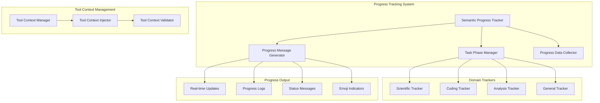

# Phase 2.5 Utilities and Progress Tracking

**Document Type**: Phase 2.5 Utilities Overview
**Component**: Utilities and Progress Tracking
**Phase**: 2.5 - Semantic Progress and Tool Integration
**Author**: William
**Date Created**: 2025-06-28
**Last Updated**: 2025-06-28
**Status**: Active
**Purpose**: Overview of utility components for semantic progress tracking and tool context management

## 🎯 **Overview**

The Utilities module provides essential components for semantic progress tracking, domain-specific progress management, and tool context handling. These utilities ensure that agents can provide human-readable progress updates and effectively manage tool integration.

## 🏗️ **Utilities Architecture**

## 🔧 **Utility Components**

### **1. Semantic Progress Tracking System**
Core system for providing human-readable, meaningful progress updates that show what agents are accomplishing.

**Key Features**:
- Task phase management
- Human-readable progress messages
- Real-time progress updates
- Progress history tracking

**Location**: `01_semantic_progress_design.md`

### **2. Domain-Specific Progress Trackers**
Specialized progress tracking for different types of agents and tasks.

**Key Features**:
- Scientific analysis tracking
- Coding task tracking
- Data analysis tracking
- General purpose tracking

**Location**: `02_progress_trackers_design.md`

### **3. Tool Context Management**
Utilities for managing tool context injection, validation, and cleanup.

**Key Features**:
- Tool context injection
- Context validation
- Environment variable management
- Context cleanup mechanisms

**Location**: `03_tool_context_design.md`

## 📋 **Design Documents**

1. **[Semantic Progress Design](01_semantic_progress_design.md)** - Core progress tracking system
2. **[Progress Trackers Design](02_progress_trackers_design.md)** - Domain-specific progress tracking
3. **[Tool Context Design](03_tool_context_design.md)** - Tool context management utilities

## 🎨 **Domain-Specific Trackers**

### **Scientific Analysis Tracker**
Specialized progress tracking for research paper analysis and scientific tasks.

**Features**:
- Research methodology tracking
- Data analysis progress
- Results compilation tracking
- Quality validation progress

### **Coding Task Tracker**
Specialized progress tracking for code generation and software development tasks.

**Features**:
- Requirements analysis tracking
- Code generation progress
- Testing and validation tracking
- Documentation progress

### **Data Analysis Tracker**
Specialized progress tracking for data processing and analysis tasks.

**Features**:
- Data collection progress
- Processing pipeline tracking
- Analysis execution progress
- Results generation tracking

### **General Purpose Tracker**
Flexible progress tracking for general tasks and workflows.

**Features**:
- Generic phase tracking
- Customizable progress messages
- Flexible activity logging
- Adaptable progress indicators

## 🔄 **Integration with Agent System**

### **Progress Tracking Integration**
- Seamless integration with agent execution
- Real-time progress updates
- Configurable progress detail levels
- Progress history preservation

### **Tool Context Integration**
- Automatic tool context injection
- Context validation and cleanup
- Environment variable management
- Tool availability tracking

## 🎯 **Success Criteria**

- [ ] Progress updates are human-readable and meaningful
- [ ] Phase transitions are clear and logical
- [ ] Activity logging provides useful information
- [ ] Performance impact is minimal
- [ ] User satisfaction with progress transparency is high
- [ ] Tool context management is reliable and efficient

## 🔮 **Future Enhancements**

1. **AI-Powered Progress**: Intelligent progress prediction and estimation
2. **Custom Progress Themes**: User-configurable progress display styles
3. **Progress Analytics**: Historical progress analysis and optimization
4. **Multi-Agent Progress**: Coordinated progress tracking for multiple agents
5. **Progress Notifications**: Real-time notifications for important milestones
6. **Progress Export**: Export progress data for external analysis
