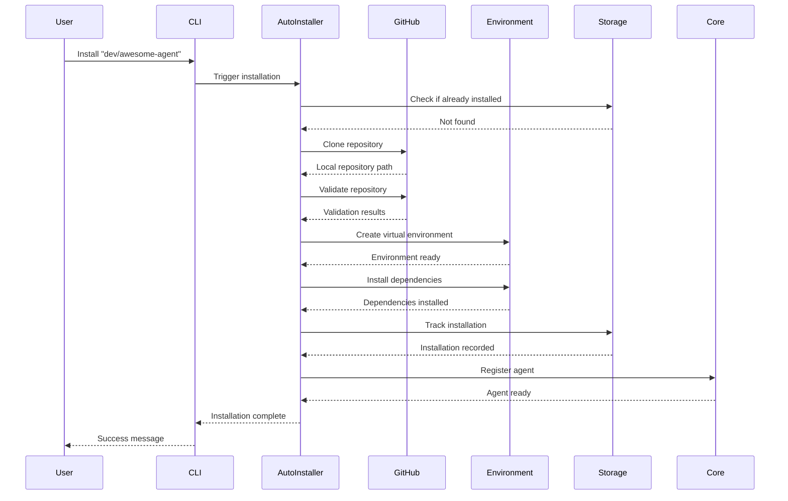

# Agent Hub Phase 2: Auto-Install Implementation Design

**Document Type**: Phase 2 Implementation Overview
**Phase**: 2 - Auto-Install
**Author**: William
**Date Created**: 2025-06-28
**Last Updated**: 2025-06-28
**Status**: Active
**Purpose**: Comprehensive overview of Phase 2 auto-installation system architecture and implementation

## 🎯 **Phase 2 Overview**

**Phase 2: Auto-Install** transforms Agent Hub from a system that can only execute pre-created agents into a system that can automatically discover and install new agents from GitHub repositories. This phase eliminates the need for manual agent setup and enables seamless agent discovery and installation.

### **Key Transformation**
- **Before Phase 2**: Agents must be manually created and placed in specific directories
- **After Phase 2**: Agents can be auto-installed using `developer/agent-name` format from GitHub
- **Result**: Seamless agent discovery and installation with minimal user intervention

### **Success Criteria**
- ✅ Can auto-install agents from GitHub using `developer/agent-name` format
- ✅ Environment setup is automatic and reliable
- ✅ Installation tracking provides clear status information
- ✅ Foundation ready for Phase 3 SDK integration

## 🏗️ **System Architecture**

```mermaid
graph TB
    subgraph "User Interface Layer"
        CLI[Enhanced CLI Commands]
        API[Programmatic API - load_agent()]
    end

    subgraph "Core Coordination Layer"
        AI[Auto-Installer - NEW]
        AL[Enhanced Agent Loader - Existing + Auto-Install]
        AW[Agent Wrapper - Existing]
        IV[Interface Validator - Existing]
        MP[Manifest Parser - Existing]
    end

    subgraph "Service Modules - NEW"
        GH[GitHub Integration]
        ENV[Environment Management]
        STOR[Storage Enhancement - Extends LocalStorage]
    end

    subgraph "Existing Phase 1 Components"
        LS[LocalStorage - Existing]
        AR[Agent Runtime - Existing]
        RT[Runtime Manager - Existing]
    end

    subgraph "External Systems"
        GITHUB[GitHub Repositories]
        PYPI[Python Package Index]
        LOCAL[Local File System - ~/.agenthub/agents/]
    end

    CLI --> AI
    API --> AI
    AI --> GH
    AI --> ENV
    AI --> STOR
    STOR --> LS
    GH --> GITHUB
    ENV --> PYPI
    AL --> AI
    AL --> LS
    AW --> AR
```

## 📋 **Module Architecture & Responsibilities**

### **1. GitHub Integration Module** (`github/`)
- **Primary Responsibility**: Repository discovery, cloning, and validation
- **Key Components**: Repository Cloner, Repository Validator, GitHub Client
- **Input**: `developer/agent-name` format
- **Output**: Local repository path with validated structure

### **2. Environment Management Module** (`environment/`)
- **Primary Responsibility**: Virtual environment creation and dependency management
- **Key Components**: Environment Setup, Virtual Environment Creator, Dependency Manager
- **Input**: Agent path and requirements.txt
- **Output**: Working virtual environment with all dependencies

### **3. Storage Enhancement Module** (`storage/`)
- **Primary Responsibility**: Installation tracking and metadata management
- **Key Components**: Installation Tracker (NEW), Metadata Manager (NEW), Directory Organizer (NEW)
- **Input**: Installation events and agent metadata
- **Output**: Organized storage structure with installation history
- **Integration**: Extends existing `LocalStorage` class with installation tracking capabilities

### **4. Core Enhancement Module** (`core/`)
- **Primary Responsibility**: Auto-installation coordination and enhanced agent loading
- **Key Components**: Auto-Installer (NEW), Enhanced Agent Loader (extends existing), Agent Wrapper (existing)
- **Input**: Agent requests and installation triggers
- **Output**: Ready-to-use agents with seamless loading experience
- **Integration**: Extends existing `AgentLoader`, `AgentWrapper`, `InterfaceValidator`, and `ManifestParser`

### **5. CLI Enhancement Module** (`cli/`)
- **Primary Responsibility**: Enhanced user interface and installation commands
- **Key Components**: Install Command (NEW), Update Command (NEW), Enhanced List Command (extends existing)
- **Input**: User commands and preferences
- **Output**: User-friendly feedback and agent management
- **Integration**: Extends existing CLI structure with new installation commands

### **6. Testing Module** (`testing/`)
- **Primary Responsibility**: Comprehensive testing strategy and validation
- **Key Components**: Test Suites, Test Data, Integration Tests
- **Input**: Module implementations and integration points
- **Output**: Validated functionality and performance metrics

## 🔄 **Auto-Installation Flow**



## 🚀 **Implementation Roadmap with End-to-End Testing**

### **Phase 2A: Foundation & GitHub Integration (Week 1)**

#### **Step 1: Project Structure & Basic Setup (Days 1-2)**
**Goal**: Establish foundation with basic project structure

**Implementation**:
```bash
# Create new module directories (existing: core, cli, runtime, storage)
mkdir -p agentmanager/github
mkdir -p agentmanager/environment

# Create basic __init__.py files
touch agentmanager/github/__init__.py
touch agentmanager/environment/__init__.py

# Verify existing modules still work
python -c "from agentmanager.core.agent_loader import AgentLoader; print('✅ Existing core module works')"
```

**End-to-End Test**:
```bash
# Test basic import of new modules
python -c "import agentmanager.github; import agentmanager.environment; print('✅ New modules import successfully')"

# Test existing functionality still works
python -c "from agentmanager import load_agent; print('✅ Existing API still works')"
```

**Success Criteria**: ✅ Can import new modules without breaking existing functionality

---

#### **Step 2: Basic GitHub Module - URL Parser (Days 2-3)**
**Goal**: Implement basic agent name parsing and GitHub URL construction

**Implementation**:
```python
# agentmanager/github/url_parser.py
class URLParser:
    def is_valid_agent_name(self, agent_name: str) -> bool:
        # Basic validation: developer/agent-name format
        pass

    def build_github_url(self, agent_name: str) -> str:
        # Convert to https://github.com/developer/agent-name.git
        pass
```

**End-to-End Test**:
```python
# test_url_parser.py
parser = URLParser()
assert parser.is_valid_agent_name("user/agent") == True
assert parser.is_valid_agent_name("invalid") == False
assert parser.build_github_url("user/agent") == "https://github.com/user/agent.git"
print("✅ URL Parser works correctly")
```

**Success Criteria**: ✅ Can parse valid agent names and build GitHub URLs

---

#### **Step 3: Basic Repository Cloner (Days 3-4)**
**Goal**: Implement basic repository cloning functionality

**Implementation**:
```python
# agentmanager/github/repository_cloner.py
class RepositoryCloner:
    def clone_agent(self, agent_name: str) -> str:
        # Basic git clone implementation
        pass
```

**End-to-End Test**:
```bash
# Test with a real, simple repository
python -c "
from agentmanager.github.repository_cloner import RepositoryCloner
cloner = RepositoryCloner()
path = cloner.clone_agent('test-user/simple-test-agent')
print(f'✅ Cloned to: {path}')
"
```

**Success Criteria**: ✅ Can clone a simple test repository from GitHub

---

#### **Step 4: Basic Repository Validation (Days 4-5)**
**Goal**: Implement basic file existence validation

**Implementation**:
```python
# agentmanager/github/repository_validator.py
class RepositoryValidator:
    def validate_repository(self, local_path: str) -> bool:
        # Check for required files: agent.yaml, agent.py, requirements.txt, README.md
        pass
```

**End-to-End Test**:
```python
# Test validation with cloned repository
validator = RepositoryValidator()
is_valid = validator.validate_repository(cloned_path)
print(f"✅ Repository validation: {'PASS' if is_valid else 'FAIL'}")
```

**Success Criteria**: ✅ Can validate repository structure and identify missing files

---

#### **Step 5: Basic Auto-Installation Flow (Days 5-7)**
**Goal**: Connect GitHub module components for basic auto-installation

**Implementation**:
```python
# agentmanager/core/auto_installer.py (NEW FILE)
class AutoInstaller:
    def __init__(self, storage=None):
        self.storage = storage or LocalStorage()
        self.github_cloner = RepositoryCloner()
        self.validator = RepositoryValidator()

    def install_agent(self, agent_name: str) -> bool:
        # Basic flow: clone → validate → return success
        try:
            # Parse agent name (existing logic from load_agent)
            if "/" not in agent_name:
                raise ValueError(f"Agent name must be in format 'developer/agent', got: {agent_name}")
            developer, agent = agent_name.split("/", 1)

            # Clone repository
            local_path = self.github_cloner.clone_agent(agent_name)

            # Validate repository
            is_valid = self.validator.validate_repository(local_path)

            return is_valid
        except Exception as e:
            logger.error(f"Auto-installation failed: {e}")
            return False
```

**End-to-End Test**:
```bash
# Test complete basic flow
python -c "
from agentmanager.core.auto_installer import AutoInstaller
installer = AutoInstaller()
success = installer.install_agent('test-user/simple-test-agent')
print(f'✅ Auto-installation: {\"SUCCESS\" if success else \"FAILED\"}')
"

# Test existing functionality still works
python -c "
from agentmanager import load_agent
try:
    # This should still work for existing agents
    agent = load_agent('agentplug/coding-agent')
    print('✅ Existing load_agent still works')
except Exception as e:
    print(f'⚠️ Existing functionality affected: {e}')
"
```

**Success Criteria**: ✅ Can complete basic auto-installation flow end-to-end without breaking existing functionality

---

### **Phase 2B: Environment Management & Storage (Week 2)**

#### **Step 6: Basic Virtual Environment Creation (Days 8-9)**
**Goal**: Implement basic virtual environment creation

**Implementation**:
```python
# agentmanager/environment/virtual_environment.py
class VirtualEnvironmentCreator:
    def create_environment(self, target_path: str) -> str:
        # Basic venv creation
        pass
```

**End-to-End Test**:
```python
# Test environment creation
creator = VirtualEnvironmentCreator()
env_path = creator.create_environment("/tmp/test_env")
print(f"✅ Environment created: {env_path}")
```

**Success Criteria**: ✅ Can create virtual environment and verify it exists

---

#### **Step 7: Basic Dependency Installation (Days 9-10)**
**Goal**: Implement basic requirements.txt parsing and package installation

**Implementation**:
```python
# agentmanager/environment/dependency_manager.py
class DependencyManager:
    def install_dependencies(self, env_path: str, requirements_path: str) -> bool:
        # Basic pip install from requirements.txt
        pass
```

**End-to-End Test**:
```python
# Test with simple requirements.txt
dep_manager = DependencyManager()
success = dep_manager.install_dependencies(env_path, "requirements.txt")
print(f"✅ Dependencies installed: {'SUCCESS' if success else 'FAILED'}")
```

**Success Criteria**: ✅ Can install packages from requirements.txt in virtual environment

---

#### **Step 8: Environment Setup Integration (Days 10-12)**
**Goal**: Connect environment components for complete environment setup

**Implementation**:
```python
# agentmanager/environment/environment_setup.py
class EnvironmentSetup:
    def setup_environment(self, agent_path: str, requirements_path: str) -> bool:
        # Coordinate: create env → install deps → validate
        pass
```

**End-to-End Test**:
```python
# Test complete environment setup
env_setup = EnvironmentSetup()
success = env_setup.setup_environment(agent_path, "requirements.txt")
print(f"✅ Environment setup: {'SUCCESS' if success else 'FAILED'}")
```

**Success Criteria**: ✅ Can complete environment setup end-to-end

---

#### **Step 9: Basic Storage & Metadata (Days 12-14)**
**Goal**: Implement basic installation tracking

**Implementation**:
```python
# agentmanager/storage/installation_tracker.py (NEW FILE)
class InstallationTracker:
    def __init__(self, storage=None):
        self.storage = storage or LocalStorage()

    def track_installation(self, agent_name: str, details: dict):
        # Basic installation metadata storage
        try:
            # Parse agent name (existing logic)
            if "/" not in agent_name:
                raise ValueError(f"Invalid agent name format: {agent_name}")
            developer, agent = agent_name.split("/", 1)

            # Store installation metadata in existing storage structure
            metadata = {
                "installed_at": datetime.now().isoformat(),
                "status": "installed",
                "source": "github",
                **details
            }

            # Use existing storage methods
            self.storage._store_installation_metadata(developer, agent, metadata)
            return True
        except Exception as e:
            logger.error(f"Failed to track installation: {e}")
            return False

# Extend existing LocalStorage class
class LocalStorage(LocalStorage):  # Inherit from existing
    def _store_installation_metadata(self, developer: str, agent: str, metadata: dict):
        # Store in existing ~/.agenthub/agents/ structure
        metadata_file = self._agents_dir / developer / agent / ".installation_metadata.json"
        metadata_file.parent.mkdir(parents=True, exist_ok=True)

        with open(metadata_file, 'w') as f:
            json.dump(metadata, f, indent=2)
```

**End-to-End Test**:
```python
# Test installation tracking
from agentmanager.storage.installation_tracker import InstallationTracker
from agentmanager.storage.local_storage import LocalStorage

storage = LocalStorage()
tracker = InstallationTracker(storage)
success = tracker.track_installation("test-user/agent", {"status": "installed"})
print(f"✅ Installation tracking: {'SUCCESS' if success else 'FAILED'}")

# Verify existing storage still works
agents = storage.discover_agents()
print(f"✅ Existing storage discovery: {len(agents)} agents found")
```

**Success Criteria**: ✅ Can track and retrieve installation metadata without breaking existing storage functionality

---

### **Phase 2C: Core Integration & CLI (Week 3)**

#### **Step 10: Enhanced Auto-Installation (Days 15-16)**
**Goal**: Integrate all modules for complete auto-installation

**Implementation**:
```python
# agentmanager/core/auto_installer.py (enhanced)
class AutoInstaller:
    def install_agent(self, agent_name: str) -> InstallationResult:
        # Complete flow: clone → validate → setup env → track
        pass
```

**End-to-End Test**:
```python
# Test complete enhanced flow
installer = AutoInstaller()
result = installer.install_agent("test-user/complete-test-agent")
print(f"✅ Enhanced auto-installation: {result.success}")
```

**Success Criteria**: ✅ Can complete full auto-installation with environment setup

---

#### **Step 11: Basic CLI Commands (Days 16-18)**
**Goal**: Implement basic CLI installation command

**Implementation**:
```python
# agentmanager/cli/commands/install.py (NEW FILE)
import click
from agentmanager.core.auto_installer import AutoInstaller

@click.command()
@click.argument('agent_name')
def install(agent_name):
    """Install an agent from GitHub repository."""
    try:
        installer = AutoInstaller()
        success = installer.install_agent(agent_name)

        if success:
            click.echo(f"✅ Successfully installed agent: {agent_name}")
        else:
            click.echo(f"❌ Failed to install agent: {agent_name}")
            sys.exit(1)
    except Exception as e:
        click.echo(f"❌ Installation error: {e}")
        sys.exit(1)

# Update existing main.py to include new command
# In agentmanager/cli/main.py, add:
# from agentmanager.cli.commands.install import install
# cli.add_command(install)
```

**End-to-End Test**:
```bash
# Test CLI command
python -m agentmanager.cli.main install test-user/test-agent
# Should show installation progress and result

# Test existing CLI commands still work
python -m agentmanager.cli.main list
python -m agentmanager.cli.main --help
```

**Success Criteria**: ✅ Can install agents via CLI command without breaking existing CLI functionality

---

#### **Step 12: End-to-End Integration Testing (Days 18-21)**
**Goal**: Comprehensive testing of complete system

**Implementation**: Create comprehensive test suite

**End-to-End Test**:
```bash
# Run full test suite
pytest tests/phase2_foundation/ -v

# Test with real repositories
python -m agentmanager.cli.main install test-user/real-test-agent
python -m agentmanager.cli.main list
python -m agentmanager.cli.main info test-user/real-test-agent
```

**Success Criteria**: ✅ All tests pass, can install and manage real agents

---

## 🧪 **Testing Strategy for Each Step**

### **Integration with Existing Test Structure**
```
tests/
├── phase1_foundation/             # EXISTING: Phase 1 tests
│   ├── core/                      # Core module tests
│   ├── cli/                       # CLI tests
│   ├── runtime/                   # Runtime tests
│   ├── storage/                   # Storage tests
│   ├── integration/               # Integration tests
│   └── e2e/                      # End-to-end tests
└── phase2_foundation/             # NEW: Phase 2 tests
    ├── github/                    # GitHub module tests
    ├── environment/               # Environment module tests
    ├── core/                      # Enhanced core tests
    ├── cli/                       # Enhanced CLI tests
    ├── storage/                   # Enhanced storage tests
    ├── integration/               # Phase 2 integration tests
    └── e2e/                      # Phase 2 end-to-end tests
```

### **Unit Tests (Immediate)**
- Write tests for each component as you implement it
- Ensure 90%+ coverage for each step
- Run tests immediately after implementation
- **Regression Testing**: Ensure existing Phase 1 tests still pass

### **Integration Tests (After Each Phase)**
- Test module interactions
- Verify data flow between components
- Test error propagation
- **Backward Compatibility**: Test new features with existing components

### **End-to-End Tests (After Each Major Step)**
- Test complete workflows
- Use real GitHub repositories
- Validate user experience
- **Existing Functionality**: Verify Phase 1 functionality still works

### **Test Configuration Integration**
- **pytest.ini**: Extends existing test configuration
- **conftest.py**: Shared fixtures for both phases
- **Coverage**: Combined coverage for Phase 1 + Phase 2
- **CI/CD**: Integrates with existing test pipeline

## 📊 **Success Metrics for Each Step**

### **Functional Metrics**
- ✅ Component works as designed
- ✅ Integrates with other components
- ✅ Handles error cases gracefully

### **Performance Metrics**
- ✅ Meets response time targets
- ✅ Resource usage within limits
- ✅ Scalability requirements met

### **Quality Metrics**
- ✅ Tests pass with 90%+ coverage
- ✅ Error handling works correctly
- ✅ User experience is smooth

## 🎯 **Key Benefits of This Approach**

1. **Incremental Progress**: Each step builds on the previous one
2. **Immediate Testing**: End-to-end testing after each step
3. **Early Validation**: Catch issues early in development
4. **User Feedback**: Get working functionality quickly
5. **Confidence Building**: Each step validates the overall approach

## 🚨 **Risk Mitigation**

- **Start Simple**: Begin with basic functionality, enhance later
- **Mock External Dependencies**: Use mocks for GitHub API during development
- **Test Data**: Create test repositories for consistent testing
- **Fallback Mechanisms**: Implement graceful degradation for failures

## 🔄 **Backward Compatibility & Integration**

### **Existing Phase 1 Components to Preserve**
- **`agentmanager.load_agent()`**: Main API function must continue working
- **`AgentLoader`**: Core agent loading functionality
- **`AgentWrapper`**: Agent execution wrapper
- **`LocalStorage`**: Storage management and agent discovery
- **`CLI Commands`**: Existing list, info, and other commands
- **`Agent Runtime`**: Agent execution environment

### **Integration Strategy**
- **Extend, Don't Replace**: Add new functionality without removing existing
- **Inheritance Pattern**: Extend existing classes with new capabilities
- **Dependency Injection**: Use existing components in new implementations
- **Graceful Fallback**: Fall back to existing behavior when new features fail

### **Testing Backward Compatibility**
- **Regression Testing**: Ensure existing functionality still works
- **Integration Testing**: Test new and old components together
- **API Compatibility**: Verify existing API contracts are maintained
- **Performance Testing**: Ensure new features don't degrade performance

## 📁 **Project Structure & Integration**

### **Current Phase 1 Structure**
```
agentmanager/
├── __init__.py                    # Main API: load_agent()
├── core/                          # Core functionality
│   ├── __init__.py
│   ├── agent_loader.py            # Agent loading (EXISTING)
│   ├── agent_wrapper.py           # Agent wrapper (EXISTING)
│   ├── interface_validator.py     # Interface validation (EXISTING)
│   └── manifest_parser.py         # Manifest parsing (EXISTING)
├── cli/                           # Command line interface
│   ├── __init__.py
│   ├── main.py                    # CLI entry point (EXISTING)
│   ├── commands/                  # CLI commands (EXISTING)
│   ├── formatters/                # Output formatting (EXISTING)
│   └── utils/                     # CLI utilities (EXISTING)
├── runtime/                        # Runtime management
│   ├── __init__.py
│   ├── agent_runtime.py           # Agent runtime (EXISTING)
│   └── environment_manager.py     # Environment management (EXISTING)
└── storage/                        # Storage management
    ├── __init__.py
    └── local_storage.py           # Local storage (EXISTING)
```

### **Phase 2 Extensions**
```
agentmanager/
├── core/
│   └── auto_installer.py          # NEW: Auto-installation coordination
├── github/                         # NEW: GitHub integration
│   ├── __init__.py
│   ├── repository_cloner.py
│   ├── repository_validator.py
│   └── github_client.py
├── environment/                    # NEW: Environment management
│   ├── __init__.py
│   ├── environment_setup.py
│   ├── virtual_environment.py
│   └── dependency_manager.py
├── storage/
│   └── installation_tracker.py    # NEW: Installation tracking
└── cli/
    └── commands/
        └── install.py             # NEW: Install command
```

### **Integration Points**
- **`core/auto_installer.py`**: Extends existing `AgentLoader` functionality
- **`storage/installation_tracker.py`**: Extends existing `LocalStorage` class
- **`cli/commands/install.py`**: Integrates with existing CLI structure
- **`environment/`**: New module for virtual environment management
- **`github/`**: New module for repository integration

## 🔗 **Module Dependencies & Integration**

### **Current Phase 1 Dependencies**
```toml
# From pyproject.toml
dependencies = [
    "pyyaml>=6.0.1",      # For manifest parsing
    "click>=8.1.7",       # For CLI interface
    "rich>=13.7.1",       # For rich CLI output
]
```

### **Phase 2 Additional Dependencies**
```toml
# New dependencies to add
dependencies = [
    # Existing dependencies...
    "requests>=2.31.0",   # For GitHub API calls
    "gitpython>=3.1.0",   # For Git operations (alternative to git CLI)
    "packaging>=23.0",    # For requirements.txt parsing
]
```

### **Dependency Matrix**
| Module | Depends On | Provides To |
|--------|------------|-------------|
| **GitHub** | requests, gitpython | Core, CLI |
| **Environment** | packaging, venv | Core, CLI |
| **Storage** | None | All modules |
| **Core** | GitHub, Environment, Storage | CLI |
| **CLI** | Core | User interface |
| **Testing** | All modules | Quality assurance |

### **Integration with Existing Dependencies**
- **`pyyaml`**: Used by existing `ManifestParser`, extended for new validation
- **`click`**: Used by existing CLI, extended with new commands
- **`rich`**: Used by existing CLI output, extended for installation progress
- **`requests`**: New dependency for GitHub API integration
- **`gitpython`**: New dependency for repository operations
- **`packaging`**: New dependency for dependency management

### **Integration Points**
- **GitHub ↔ Core**: Repository cloning and validation
- **Environment ↔ Core**: Environment setup and dependency management
- **Storage ↔ All**: Installation tracking and metadata
- **Core ↔ CLI**: Auto-installation coordination
- **Testing ↔ All**: Validation and quality assurance

## 🧪 **Testing Strategy**

### **Testing Pyramid**
```
        E2E Tests (10%)
    ┌─────────────────┐
    │ Integration     │
    │ Tests (20%)     │
    └─────────────────┘
    ┌─────────────────┐
    │ Unit Tests      │
    │ (70%)           │
    └─────────────────┘
```

### **Test Coverage Requirements**
- **Unit Tests**: 90%+ coverage for all modules
- **Integration Tests**: All module interaction points
- **End-to-End Tests**: Complete auto-installation flows
- **Performance Tests**: Response time and resource usage

### **Test Data Strategy**
- **Valid Repositories**: Use existing seed agents and new test repositories
- **Invalid Repositories**: Create repositories with missing files or invalid formats
- **Edge Cases**: Test with various repository names, structures, and dependencies

## 📊 **Performance Requirements**

### **Response Time Targets**
- **Repository Cloning**: < 30 seconds for typical agents
- **Environment Setup**: < 2 minutes for typical agents
- **Installation Tracking**: < 1 second
- **Agent Loading**: < 5 seconds for installed agents

### **Resource Usage Targets**
- **Memory**: < 512MB during installation
- **Disk Space**: < 100MB overhead per agent
- **Network**: Efficient use of bandwidth with retry logic

### **Scalability Targets**
- **Concurrent Installations**: Support 5+ simultaneous installations
- **Agent Count**: Support 100+ installed agents
- **Repository Size**: Handle repositories up to 100MB

## 🚨 **Risk Assessment & Mitigation**

### **High Risk Items**
1. **Git CLI Dependencies**
   - **Risk**: Git CLI not available or incompatible version
   - **Mitigation**: Check git availability, provide clear installation instructions
   - **Fallback**: Use GitHub API for basic repository access

2. **Environment Setup Complexity**
   - **Risk**: Virtual environment setup becomes unreliable
   - **Mitigation**: Use UV package manager for reliability
   - **Fallback**: Fall back to standard venv if UV fails

### **Medium Risk Items**
1. **Repository Validation**
   - **Risk**: Validation becomes too strict, blocking valid agents
   - **Mitigation**: Start with basic validation, enhance based on feedback
   - **Fallback**: Allow manual override for edge cases

2. **Dependency Conflicts**
   - **Risk**: Complex dependency conflicts block installation
   - **Mitigation**: Implement conflict resolution strategies
   - **Fallback**: Install minimal dependencies, provide user guidance

### **Low Risk Items**
1. **GitHub API Rate Limiting**
   - **Risk**: Hit GitHub API rate limits during development/testing
   - **Mitigation**: Implement rate limit handling, use authentication when possible
   - **Fallback**: Rely on git clone for basic operations

## 🎯 **Success Validation**

### **Functional Validation**
- [ ] Can auto-install agents from GitHub using `developer/agent-name` format
- [ ] Environment setup is automatic and reliable
- [ ] Installation tracking provides clear status information
- [ ] Foundation ready for Phase 3 SDK integration

### **Performance Validation**
- [ ] Repository cloning completes in under 30 seconds
- [ ] Environment setup completes in under 2 minutes
- [ ] Installation tracking completes in under 1 second
- [ ] Minimal disk space overhead

### **Quality Validation**
- [ ] 95%+ success rate for valid repositories
- [ ] Clear error messages for common failures
- [ ] Comprehensive logging for debugging
- [ ] Graceful degradation when external services fail

## 🔄 **Phase 2 to Phase 3 Transition**

### **What Phase 2 Delivers**
- Complete auto-installation system
- Reliable environment management
- Enhanced user experience
- Foundation for SDK integration

### **What Phase 3 Will Build On**
- Agent SDK for easier agent development
- Enhanced agent discovery mechanisms
- Advanced agent management features
- Integration with external agent marketplaces

## 📚 **Module Documentation**

Each module has comprehensive design documentation:

- **[GitHub Module](github/README.md)** - Repository cloning and validation
- **[Environment Module](environment/README.md)** - Virtual environment and dependency management
- **[Storage Module](storage/README.md)** - Installation tracking and metadata
- **[Core Module](core/README.md)** - Auto-installation coordination
- **[CLI Module](cli/README.md)** - Enhanced user interface
- **[Testing Module](testing/README.md)** - Testing strategy and validation

## 🎉 **Current Status**

**Phase 2 Implementation Design**: ✅ **COMPLETE**
**Module Designs**: ✅ **COMPLETE** (all 6 modules)
**Implementation Ready**: ✅ **YES**
**Next Action**: Begin implementation with GitHub Integration Module

---

**Note**: This document provides the comprehensive overview of Phase 2. All module designs are complete and ready for development team implementation. The system architecture is designed for reliability, performance, and seamless user experience.
