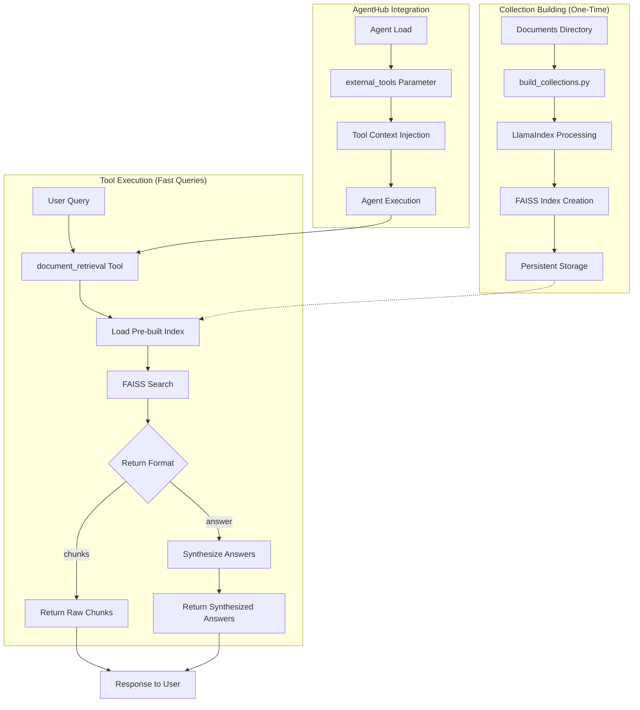

# Document Retrieval Tool Design and Implementation

**Document Type**: Implementation Design  
**Author**: AI Assistant  
**Date Created**: 2025-06-28  
**Last Updated**: 2025-06-28  
**Status**: Design Specification  
**Level**: L3 - Implementation Level  
**Audience**: Developers, Implementation Team  

## 📋 **Summary**

This document outlines the design and implementation of a document retrieval tool for AgentHub that leverages LlamaIndex, FAISS, and modern LLMs to provide efficient document search and question-answering capabilities. The tool supports two return formats: **`chunks`** (raw chunks with metadata) and **`answer`** (synthesized answers), with persistent indexing for optimal performance.

### **Key Features**
- **Persistent Indexing**: Collections are built once and reused for all queries
- **Flexible Return Formats**: Users can choose between raw chunks or synthesized answers
- **AgentHub Integration**: Seamless integration with AgentHub's tool system
- **Scalable Architecture**: Supports large document collections efficiently
- **Flexible Document Support**: Handles PDF, TXT, MD, DOCX, and HTML files

### **Architecture Overview**



## 🏗️ **Tool Architecture**

### **1. Tool Interface Design**

```python
@tool(
    name="document_retrieval",
    description="Retrieve relevant documents from a collection using RAG",
    namespace="rag"
)
def document_retrieval(
    query: str,
    collection_id: str,
    top_k: int = 5,
    return_format: str = "chunks",  # "chunks" or "answer"
    similarity_threshold: float = 0.7,
    **kwargs
) -> dict:
    """
    Retrieve relevant documents from a pre-indexed collection.
    
    Args:
        query: The search query
        collection_id: ID of the pre-indexed collection
        top_k: Number of top relevant chunks to retrieve
        return_format: "chunks" (raw chunks) or "answer" (synthesized answers)
        similarity_threshold: Minimum similarity score for chunks
        **kwargs: Additional parameters
    
    Returns:
        dict: Response format depends on return_format chosen
    """
```

### **2. Collection Management System**

#### **A. Collection Manager**

```python
class CollectionManager:
    """Manages persistent document collections and their FAISS indices"""
    
    def __init__(self, storage_path: str = "~/.agenthub/collections"):
        self.storage_path = Path(storage_path).expanduser()
        self.storage_path.mkdir(parents=True, exist_ok=True)
        self.collections = {}  # collection_id -> CollectionInfo
        self.indices = {}      # collection_id -> FAISSIndex
    
    def create_collection(
        self, 
        collection_id: str, 
        documents: list[Document],
        chunk_size: int = 512,
        chunk_overlap: int = 50
    ) -> str:
        """Create and persist a new collection (ONE-TIME OPERATION)"""
        
        print(f"🔨 Building index for collection '{collection_id}'...")
        print(f"   📄 Processing {len(documents)} documents...")
        
        # 1. Process documents with LlamaIndex (ONE-TIME)
        chunks = self._process_documents_with_llamaindex(
            documents, chunk_size, chunk_overlap
        )
        print(f"   ✂️  Created {len(chunks)} chunks")
        
        # 2. Create FAISS index (ONE-TIME)
        index = self._create_faiss_index(chunks)
        print(f"   🗂️  Built FAISS index with {index.ntotal} vectors")
        
        # 3. Persist everything to disk (ONE-TIME)
        collection_info = CollectionInfo(
            id=collection_id,
            chunk_count=len(chunks),
            created_at=datetime.now(),
            chunk_size=chunk_size,
            chunk_overlap=chunk_overlap,
            embedding_dim=index.d
        )
        
        # Save to disk
        self._persist_collection(collection_id, collection_info, index, chunks)
        print(f"   💾 Saved collection to {self.storage_path / collection_id}")
        
        # Load into memory for immediate use
        self.collections[collection_id] = collection_info
        self.indices[collection_id] = index
        
        print(f"✅ Collection '{collection_id}' ready for queries!")
        return collection_id
```

#### **B. Persistent Storage Structure**

```
~/.agenthub/collections/
├── company_docs/
│   ├── collection_info.json      # Metadata
│   ├── faiss_index.bin          # FAISS index (binary)
│   ├── chunks.json              # Chunk data
│   └── embeddings.npy           # Embeddings cache
├── research_papers/
│   ├── collection_info.json
│   ├── faiss_index.bin
│   ├── chunks.json
│   └── embeddings.npy
└── legal_docs/
    ├── collection_info.json
    ├── faiss_index.bin
    ├── chunks.json
    └── embeddings.npy
```

### **3. Flexible Return Format System**

#### **A. Document Retrieval Engine**

```python
class DocumentRetrievalEngine:
    """Main retrieval engine with flexible return formats"""
    
    def __init__(self, collection_manager: CollectionManager):
        self.collection_manager = collection_manager
        self.embedding_model = self._setup_embeddings()
        self.synthesis_llm = self._setup_synthesis_llm()  # Small, fast LLM
    
    def retrieve(
        self, 
        query: str, 
        collection_id: str, 
        top_k: int = 5,
        return_format: str = "chunks",
        similarity_threshold: float = 0.7
    ) -> dict:
        """Main retrieval method"""
        
        # 1. Load collection (if not already loaded)
        collection = self.collection_manager.load_collection(collection_id)
        
        # 2. Embed query
        query_embedding = self.embedding_model.embed_query(query)
        
        # 3. FAISS similarity search
        chunks = self._search_faiss(collection_id, query_embedding, top_k, similarity_threshold)
        
        if return_format == "chunks":
            return self._format_chunks_response(query, collection_id, chunks)
        elif return_format == "answer":
            synthesized_answers = self._synthesize_answers(query, chunks)
            return self._format_answer_response(query, collection_id, chunks, synthesized_answers)
        else:
            raise ValueError(f"Invalid return_format: {return_format}. Must be 'chunks' or 'answer'")
    
    def _synthesize_answers(self, query: str, chunks: list[Chunk]) -> list[dict]:
        """Generate synthesized answers for each chunk using small LLM"""
        synthesized_answers = []
        
        for i, chunk in enumerate(chunks):
            # Use small, fast LLM for synthesis
            synthesis_prompt = f"""
            Given this query: "{query}"
            And this document chunk: "{chunk.text}"
            
            Provide a brief, focused answer (1-2 sentences) that addresses the query using information from this chunk.
            If the chunk doesn't contain relevant information, respond with "Not relevant".
            """
            
            answer = self.synthesis_llm.generate(synthesis_prompt)
            
            synthesized_answers.append({
                "chunk_index": i,
                "answer": answer,
                "relevance_score": chunk.score,
                "source_metadata": chunk.metadata
            })
        
        return synthesized_answers
```

#### **B. Chunks Return Format**

```python
def _format_chunks_response(self, query: str, collection_id: str, chunks: list[Chunk]) -> dict:
    """Format response for chunks return format"""
    return {
        "chunks": [
            {
                "text": chunk.text,
                "metadata": chunk.metadata,
                "similarity_score": chunk.score
            }
            for chunk in chunks
        ],
        "query": query,
        "collection_id": collection_id,
        "retrieval_metadata": {
            "total_chunks_searched": len(chunks),
            "return_format": "chunks",
            "retrieval_time_ms": self._get_retrieval_time()
        }
    }
```

#### **C. Answer Return Format**

```python
def _format_answer_response(self, query: str, collection_id: str, chunks: list[Chunk], synthesized_answers: list[dict]) -> dict:
    """Format response for answer return format"""
    return {
        "answers": synthesized_answers,
        "chunks": [
            {
                "text": chunk.text,
                "metadata": chunk.metadata,
                "similarity_score": chunk.score
            }
            for chunk in chunks
        ],
        "query": query,
        "collection_id": collection_id,
        "retrieval_metadata": {
            "total_chunks_searched": len(chunks),
            "return_format": "answer",
            "retrieval_time_ms": self._get_retrieval_time()
        }
    }
```

## 📁 **Repository Structure**

### **Proposed Directory Layout**

```
agenthub/
├── core/
│   └── tools/           # Core tool infrastructure (existing)
│       ├── __init__.py
│       ├── registry.py
│       ├── decorator.py
│       └── metadata.py
├── tools/               # NEW: Specific tool implementations
│   ├── __init__.py
│   ├── document_retrieval/
│   │   ├── __init__.py
│   │   ├── tool.py              # @tool decorated functions
│   │   ├── collection_manager.py
│   │   ├── retrieval_engine.py
│   │   ├── document_loader.py
│   │   └── build_collections.py # Standalone index builder
│   ├── web_search/      # Future tool implementations
│   │   ├── __init__.py
│   │   ├── tool.py
│   │   └── search_engine.py
│   ├── data_analysis/
│   │   ├── __init__.py
│   │   ├── tool.py
│   │   └── analyzer.py
│   └── file_operations/
│       ├── __init__.py
│       ├── tool.py
│       └── file_manager.py
└── examples/
    └── tools/           # Tool usage examples (existing)
        ├── mcp_tool_server.py
        └── agent_loading_with_tools.py
```

### **Benefits of This Structure**

1. **Separation of Concerns**: Core tool infrastructure separate from specific implementations
2. **Scalability**: Easy to add new tool categories
3. **Maintainability**: Each tool is self-contained
4. **Reusability**: Common functionality can be shared across tools
5. **Testing**: Each tool can be tested independently

## 🔨 **Collection Building Process**

### **1. Standalone Index Builder Script**

```python
#!/usr/bin/env python3
"""
build_collections.py - Standalone script to build document collections and indices.
Run this once to create collections, then use the tool.
"""

import argparse
from pathlib import Path
from agenthub.core.tools import CollectionManager

def load_documents_from_directory(directory_path: str, file_extensions: list[str] = None):
    """Load documents from a directory"""
    if file_extensions is None:
        file_extensions = [".pdf", ".txt", ".md", ".docx", ".html"]
    
    documents = []
    directory = Path(directory_path)
    
    print(f"📁 Scanning directory: {directory}")
    
    for file_path in directory.rglob("*"):
        if file_path.suffix.lower() in file_extensions:
            print(f"   📄 Found: {file_path.name}")
            # Load document (implement based on file type)
            doc = load_document(file_path)
            documents.append(doc)
    
    print(f"✅ Loaded {len(documents)} documents")
    return documents

def load_document(file_path: Path):
    """Load a single document based on its type"""
    if file_path.suffix.lower() == ".pdf":
        return load_pdf_document(file_path)
    elif file_path.suffix.lower() == ".txt":
        return load_text_document(file_path)
    elif file_path.suffix.lower() == ".md":
        return load_markdown_document(file_path)
    # Add more file type handlers as needed
    else:
        return load_text_document(file_path)  # Default to text

def load_pdf_document(file_path: Path):
    """Load PDF document"""
    try:
        import PyPDF2
        with open(file_path, 'rb') as file:
            reader = PyPDF2.PdfReader(file)
            text = ""
            for page in reader.pages:
                text += page.extract_text() + "\n"
            return {
                "text": text,
                "metadata": {
                    "source": str(file_path),
                    "type": "pdf",
                    "pages": len(reader.pages)
                }
            }
    except ImportError:
        print(f"⚠️  PyPDF2 not installed, treating {file_path} as text")
        return load_text_document(file_path)

def load_text_document(file_path: Path):
    """Load text document"""
    with open(file_path, 'r', encoding='utf-8') as file:
        return {
            "text": file.read(),
            "metadata": {
                "source": str(file_path),
                "type": "text"
            }
        }

def load_markdown_document(file_path: Path):
    """Load markdown document"""
    with open(file_path, 'r', encoding='utf-8') as file:
        return {
            "text": file.read(),
            "metadata": {
                "source": str(file_path),
                "type": "markdown"
            }
        }

def main():
    parser = argparse.ArgumentParser(description="Build document collections for retrieval")
    parser.add_argument("--dir", required=True, help="Directory containing documents")
    parser.add_argument("--collection-id", required=True, help="Collection ID")
    parser.add_argument("--chunk-size", type=int, default=512, help="Chunk size")
    parser.add_argument("--chunk-overlap", type=int, default=50, help="Chunk overlap")
    parser.add_argument("--extensions", nargs="+", default=[".pdf", ".txt", ".md"], 
                       help="File extensions to include")
    
    args = parser.parse_args()
    
    print("🔨 Building Document Collection")
    print("=" * 50)
    print(f"📁 Directory: {args.dir}")
    print(f"🆔 Collection ID: {args.collection_id}")
    print(f"📏 Chunk size: {args.chunk_size}")
    print(f"🔄 Chunk overlap: {args.chunk_overlap}")
    print(f"📄 Extensions: {args.extensions}")
    print()
    
    # Load documents
    documents = load_documents_from_directory(args.dir, args.extensions)
    
    if not documents:
        print("❌ No documents found!")
        return
    
    # Create collection manager
    collection_manager = CollectionManager()
    
    # Build collection (this creates and persists the index)
    try:
        collection_id = collection_manager.create_collection(
            collection_id=args.collection_id,
            documents=documents,
            chunk_size=args.chunk_size,
            chunk_overlap=args.chunk_overlap
        )
        
        print()
        print("✅ Collection built successfully!")
        print(f"🆔 Collection ID: {collection_id}")
        print(f"📊 Total chunks: {len(documents)}")
        print()
        print("Now you can use the document_retrieval tool with this collection!")
        
    except Exception as e:
        print(f"❌ Error building collection: {e}")

if __name__ == "__main__":
    main()
```

### **2. Usage Examples**

```bash
# Build collection from company documents
python build_collections.py --dir /path/to/company_docs --collection-id company_docs

# Build collection from research papers
python build_collections.py --dir /path/to/research_papers --collection-id research_papers --chunk-size 1024

# Build collection with specific file types
python build_collections.py --dir /path/to/legal_docs --collection-id legal_docs --extensions .pdf .docx
```

## 🔧 **Tool Server Implementation**

### **1. Document Retrieval Server**

```python
# document_retrieval_server.py
from agenthub.core.tools import tool, run_resources, CollectionManager

# Initialize collection manager
collection_manager = CollectionManager()

# Pre-built collections (you can add more)
COLLECTIONS = {
    "company_docs": "/path/to/company_documents",
    "research_papers": "/path/to/research_papers",
    "legal_docs": "/path/to/legal_documents"
}

def ensure_collections_exist():
    """Ensure all collections are built"""
    for collection_id, doc_path in COLLECTIONS.items():
        if not collection_manager.collection_exists(collection_id):
            print(f"🔨 Building collection '{collection_id}'...")
            documents = load_documents_from_directory(doc_path)
            collection_manager.create_collection(collection_id, documents)
            print(f"✅ Collection '{collection_id}' ready!")
        else:
            print(f"📖 Collection '{collection_id}' already exists")

# Build collections on startup
ensure_collections_exist()

@tool(name="document_retrieval", description="Retrieve documents from collections")
def document_retrieval(query: str, collection_id: str, return_format: str = "chunks", **kwargs):
    """Tool implementation"""
    engine = DocumentRetrievalEngine(collection_manager)
    return engine.retrieve(query, collection_id, return_format, **kwargs)

if __name__ == "__main__":
    run_resources()
```

## 🤖 **AgentHub Integration**

### **1. Agent Usage**

```python
# Load agent with the tool
from agenthub import load_agent

agent = load_agent(
    "analysis-agent",
    external_tools=["document_retrieval"]  # Tool passed as parameter
)

# Agent can now use the tool
result = agent.analyze_text(
    "What are the company's policies on remote work?",
    analysis_type="general"
)

# The agent will automatically call document_retrieval when needed
```

### **2. Tool Context Injection**

The tool context is automatically injected into the agent:

```python
tool_context = {
    "available_tools": ["document_retrieval"],
    "tool_descriptions": {
        "document_retrieval": "Retrieve relevant documents from a collection using RAG"
    },
    "tool_usage_examples": {
        "document_retrieval": [
            '{"tool_call": {"tool_name": "document_retrieval", "arguments": {"query": "remote work policies", "collection_id": "company_docs", "return_format": "chunks"}}}'
        ]
    },
    "tool_parameters": {
        "document_retrieval": {
            "query": {"type": "string", "required": True},
            "collection_id": {"type": "string", "required": True},
            "return_format": {"type": "string", "default": "chunks", "options": ["chunks", "answer"]},
            "top_k": {"type": "integer", "default": 5},
            "similarity_threshold": {"type": "float", "default": 0.7}
        }
    }
}
```

## 📊 **Response Formats**

### **1. Chunks Return Format**

```json
{
    "chunks": [
        {
            "text": "The company allows remote work for all employees with manager approval...",
            "metadata": {
                "source": "employee_handbook.pdf",
                "page": 15,
                "section": "Work Policies"
            },
            "similarity_score": 0.89
        }
    ],
    "query": "What are the company's policies on remote work?",
    "collection_id": "company_docs",
    "retrieval_metadata": {
        "total_chunks_searched": 1000,
        "similarity_threshold": 0.7,
        "retrieval_time_ms": 45,
        "return_format": "chunks"
    }
}
```

### **2. Answer Return Format**

```json
{
    "answers": [
        {
            "chunk_index": 0,
            "answer": "The company allows full remote work for all employees with manager approval.",
            "relevance_score": 0.89,
            "source_metadata": {
                "source": "employee_handbook.pdf",
                "page": 15
            }
        }
    ],
    "chunks": [
        {
            "text": "The company allows remote work for all employees...",
            "metadata": {
                "source": "employee_handbook.pdf",
                "page": 15,
                "section": "Work Policies"
            },
            "similarity_score": 0.89
        }
    ],
    "query": "What are the company's policies on remote work?",
    "collection_id": "company_docs",
    "retrieval_metadata": {
        "total_chunks_searched": 1000,
        "return_format": "answer",
        "retrieval_time_ms": 120
    }
}
```

## 🚀 **Complete Workflow**

### **Step 1: Build Collections (One-time)**

```bash
# Build collection from company documents
python agenthub/tools/document_retrieval/build_collections.py --dir /path/to/company_docs --collection-id company_docs

# Build collection from research papers
python agenthub/tools/document_retrieval/build_collections.py --dir /path/to/research_papers --collection-id research_papers --chunk-size 1024
```

### **Step 2: Start Tool Server**

```bash
# Start the MCP server with your tool
python agenthub/tools/document_retrieval/tool.py
```

### **Step 3: Use with Agent**

```python
# Load agent with the tool
from agenthub import load_agent

agent = load_agent(
    "analysis-agent",
    external_tools=["document_retrieval"]
)

# Use the agent (it will call your tool)
result = agent.analyze_text(
    "What are the company's remote work policies?",
    analysis_type="general"
)
```

## 💡 **Usage Examples**

### **1. Direct Tool Usage**

```python
# Chunks return format (default)
result = document_retrieval(
    query="What are the company's remote work policies?",
    collection_id="company_docs",
    return_format="chunks",  # Returns raw chunks with metadata
    top_k=3
)

# Answer return format
result = document_retrieval(
    query="What are the company's remote work policies?",
    collection_id="company_docs",
    return_format="answer",  # Returns synthesized answers
    top_k=3
)
```

### **2. Agent Integration Examples**

```python
# Agent choosing chunks format for detailed analysis
agent = load_agent("analysis-agent", external_tools=["document_retrieval"])
result = agent.analyze_text(
    "Analyze the company's remote work policies in detail",
    analysis_type="detailed_analysis"  # Agent internally uses return_format="chunks"
)

# Agent choosing answer format for quick summaries
result = agent.analyze_text(
    "What are the key points about remote work?",
    analysis_type="summary"  # Agent internally uses return_format="answer"
)
```

## 🔒 **Security and Performance Considerations**

### **1. Security Features**
- **Tool Assignment Limits**: Agents can only use explicitly assigned tools
- **Input Validation**: All tool arguments validated before execution
- **Authorization Checks**: Double-verification of tool access permissions
- **Error Isolation**: Tool failures don't crash the entire agent

### **2. Performance Optimizations**
- **Persistent Indexing**: Collections built once and reused
- **Memory Management**: Efficient memory usage for large collections
- **Caching**: Cache FAISS indices and embeddings
- **Async Processing**: Use async/await for LLM calls
- **Batch Processing**: Batch multiple queries when possible

### **3. Error Handling**

```python
class DocumentRetrievalError(Exception):
    """Base exception for document retrieval errors"""
    pass

class CollectionNotFoundError(DocumentRetrievalError):
    """Collection not found error"""
    pass

class RetrievalError(DocumentRetrievalError):
    """Error during retrieval process"""
    pass

class LLMGenerationError(DocumentRetrievalError):
    """Error during LLM generation"""
    pass
```

## 📝 **Dependencies**

### **Required Packages**
```python
# Core dependencies
agenthub>=0.1.0
llamaindex>=0.9.0
faiss-cpu>=1.7.4  # or faiss-gpu for GPU support
sentence-transformers>=2.2.0

# Document processing
PyPDF2>=3.0.0
python-docx>=0.8.11
beautifulsoup4>=4.12.0

# LLM integration
openai>=1.0.0
anthropic>=0.7.0

# Optional: For specific file types
pypdf>=3.0.0
python-pptx>=0.6.0
```

## 🎯 **Key Benefits**

1. **Efficient Querying**: Pre-built indices enable fast document retrieval
2. **Flexible Return Formats**: Users can choose between raw chunks or synthesized answers
3. **Scalable Architecture**: Supports large document collections
4. **AgentHub Integration**: Seamless integration with AgentHub's tool system
5. **Persistent Storage**: Collections survive restarts and can be shared
6. **User Choice**: `chunks` or `answer` return format per query based on user needs
7. **Production Ready**: Robust error handling and performance optimizations
8. **Modular Design**: Clean separation between core infrastructure and tool implementations

This design provides a comprehensive, production-ready document retrieval tool that leverages LlamaIndex, FAISS, and modern LLMs while integrating seamlessly with AgentHub's tool architecture.
