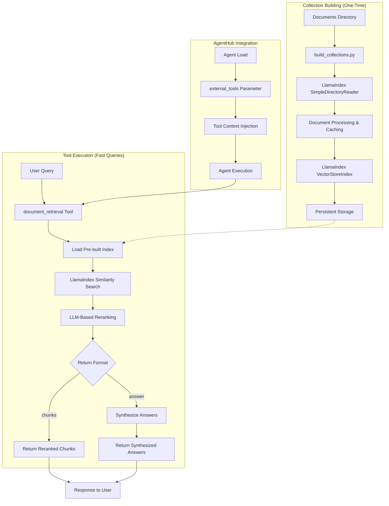

# Document Retrieval Tool Design and Implementation

**Document Type**: Implementation Design  
**Author**: AI Assistant  
**Date Created**: 2025-09-28  
**Last Updated**: 2025-09-28  
**Status**: Design Specification  
**Level**: L3 - Implementation Level  
**Audience**: Developers, Implementation Team  

## 📋 **Summary**

This document outlines the design and implementation of a document retrieval tool for AgentHub that leverages LlamaIndex's optimized vector store and modern LLMs to provide efficient document search and question-answering capabilities. The tool supports two return formats: **`chunks`** (raw chunks with metadata) and **`answer`** (synthesized answers), with persistent indexing and intelligent LLM-based reranking for optimal performance.

### **Key Features**
- **Persistent Indexing**: Collections are built once and reused for all queries
- **Flexible Return Formats**: Users can choose between raw chunks or synthesized answers
- **AgentHub Integration**: Seamless integration with AgentHub's tool system
- **Scalable Architecture**: Supports large document collections efficiently
- **Flexible Document Support**: Handles PDF, TXT, MD, DOCX, and HTML files
- **LLM-Based Reranking**: Intelligent reranking using modern LLMs for improved relevance
- **Optimized Performance**: LlamaIndex-only approach for maximum efficiency
- **Smart Caching**: Document processing cache to avoid reprocessing

### **Architecture Overview**



## 🏗️ **Tool Architecture**

### **1. Tool Interface Design**

**Purpose**: Defines the main tool interface that agents will call for document retrieval. This is the entry point that integrates with AgentHub's tool system.

**Code Flow**: 
1. Agent calls this function with a query and collection ID
2. Function delegates to DocumentRetrievalEngine for actual processing
3. Returns structured response based on chosen format (chunks or answers)

```python
@tool(
    name="document_retrieval",
    description="Retrieve relevant documents from a collection using RAG with LLM-based reranking",
    namespace="rag"
)
def document_retrieval(
    query: str,
    collection_id: str,
    top_k: int = 5,
    return_format: str = "chunks",  # "chunks" or "answer"
    similarity_threshold: float = 0.7,
    enable_reranking: bool = True,
    rerank_model: str = None,
    **kwargs
) -> dict:
    """
    Retrieve relevant documents from a pre-indexed collection with intelligent reranking.
    
    Args:
        query: The search query
        collection_id: ID of the pre-indexed collection
        top_k: Number of top relevant chunks to retrieve
        return_format: "chunks" (raw chunks) or "answer" (synthesized answers)
        similarity_threshold: Minimum similarity score for chunks
        enable_reranking: Whether to use LLM-based reranking (default: True)
        rerank_model: Model to use for reranking (default: from environment)
        **kwargs: Additional parameters
    
    Returns:
        dict: Response format depends on return_format chosen
    """
```

### **2. Collection Management System**

#### **A. Collection Manager**

**Purpose**: Manages document collections and their persistent LlamaIndex storage. Handles the one-time collection building process and provides fast access to pre-built indices.

**Code Flow**:
1. **Initialization**: Sets up storage paths and in-memory caches
2. **Collection Creation**: Processes documents → creates LlamaIndex → persists to disk
3. **Collection Loading**: Loads pre-built collections from disk into memory
4. **Caching**: Maintains both disk persistence and memory caching for performance

```python
# NOTE: This is a design template showing the key patterns and structure.
# Some methods contain placeholder implementations that need to be completed
# based on your specific LLM provider and requirements.

import os
import json
import asyncio
import time
import re
from pathlib import Path
from datetime import datetime
from typing import List, Optional, Dict, Any
from dataclasses import dataclass

from llama_index.core import (
    SimpleDirectoryReader,
    StorageContext,
    VectorStoreIndex,
    load_index_from_storage,
    Document,
)

@dataclass
class CollectionInfo:
    """Information about a document collection"""
    id: str
    document_count: int
    created_at: datetime
    chunk_size: int
    chunk_overlap: int
    documents_path: str

class CollectionManager:
    """Manages persistent document collections and their LlamaIndex indices"""
    
    def __init__(self, storage_path: str = "~/.agenthub/collections"):
        self.storage_path = Path(storage_path).expanduser()
        self.storage_path.mkdir(parents=True, exist_ok=True)
        self.collections = {}  # collection_id -> CollectionInfo
        self.indices = {}      # collection_id -> VectorStoreIndex
        self.cache_file = self.storage_path / "processed_documents.json"
    
    # Collection Creation Method
    # Purpose: One-time operation to build and persist document collections
    # Flow: Load docs → Create LlamaIndex → Save metadata → Cache in memory
    def create_collection(
        self, 
        collection_id: str, 
        documents_path: str,
        chunk_size: int = 512,
        chunk_overlap: int = 50,
        file_extensions: list = None
    ) -> str:
        """Create and persist a new collection (ONE-TIME OPERATION)"""
        
        print(f"🔨 Building index for collection '{collection_id}'...")
        print(f"   📄 Processing documents from: {documents_path}")
        
        # 1. Load documents with caching (ONE-TIME)
        documents = self._load_documents_with_cache(
            documents_path, file_extensions
        )
        print(f"   📄 Loaded {len(documents)} documents")
        
        # 2. Create LlamaIndex VectorStoreIndex (ONE-TIME)
        index = VectorStoreIndex.from_documents(documents)
        print(f"   🗂️  Built LlamaIndex with {len(documents)} documents")
        
        # 3. Persist everything to disk (ONE-TIME)
        collection_info = CollectionInfo(
            id=collection_id,
            document_count=len(documents),
            created_at=datetime.now(),
            chunk_size=chunk_size,
            chunk_overlap=chunk_overlap,
            documents_path=documents_path
        )
        
        # Save to disk using LlamaIndex's built-in persistence
        self._persist_collection(collection_id, collection_info, index)
        print(f"   💾 Saved collection to {self.storage_path / collection_id}")
        
        # Load into memory for immediate use
        self.collections[collection_id] = collection_info
        self.indices[collection_id] = index
        
        print(f"✅ Collection '{collection_id}' ready for queries!")
        return collection_id
    
    # Document Loading with Smart Caching
    # Purpose: Load documents efficiently with caching to avoid reprocessing
    # Flow: Check cache → Load from cache OR process with LlamaIndex → Save cache
    def _load_documents_with_cache(self, documents_path: str, file_extensions: list = None):
        """Load documents with smart caching to avoid reprocessing"""
        if file_extensions is None:
            file_extensions = [".pdf", ".txt", ".md", ".docx", ".html", ".csv", ".json", ".xml", ".pptx", ".xlsx", ".xls", ".doc"]
        
        # Check if we have cached processed documents
        cache_file = self.storage_path / f"{Path(documents_path).name}_processed_documents.json"
        if cache_file.exists():
            print(f"   📋 Loading documents from cache: {cache_file}")
            with open(cache_file, "r", encoding="utf-8") as file:
                cached_docs = json.load(file)
            return [Document(text=doc["text"], metadata=doc["metadata"]) for doc in cached_docs]
        
        # Process documents with LlamaIndex SimpleDirectoryReader
        print(f"   🔄 Processing documents from directory: {documents_path}")
        documents = SimpleDirectoryReader(
            documents_path,
            recursive=True,
            required_exts=file_extensions,
            encoding="utf-8"
        ).load_data(show_progress=True, num_workers=1)
        
        # Cache processed documents
        processed_docs = [{"text": doc.text, "metadata": doc.metadata} for doc in documents]
        print(f"   💾 Saving processed documents to cache: {cache_file}")
        with open(cache_file, "w", encoding="utf-8") as file:
            json.dump(processed_docs, file, indent=4)
        
        return documents
    
    # Collection Loading from Storage
    # Purpose: Load pre-built collections from disk into memory for fast access
    # Flow: Check memory cache → Load from disk → Parse metadata → Load LlamaIndex → Cache
    def load_collection(self, collection_id: str) -> CollectionInfo:
        """Load a collection from storage"""
        if collection_id in self.collections:
            return self.collections[collection_id]
        
        collection_path = self.storage_path / collection_id
        if not collection_path.exists():
            raise CollectionNotFoundError(f"Collection '{collection_id}' not found")
        
        # Load collection info
        info_file = collection_path / "collection_info.json"
        with open(info_file, 'r') as f:
            info_data = json.load(f)
        
        collection_info = CollectionInfo(**info_data)
        
        # Load LlamaIndex from storage
        try:
            storage_context = StorageContext.from_defaults(
                persist_dir=str(collection_path / "storage")
            )
            index = load_index_from_storage(storage_context)
            
            # Cache in memory
            self.collections[collection_id] = collection_info
            self.indices[collection_id] = index
            
            return collection_info
        except Exception as e:
            raise RetrievalError(f"Failed to load collection '{collection_id}': {e}")
    
    # Collection Persistence to Disk
    # Purpose: Save collection metadata and LlamaIndex to disk for persistence
    # Flow: Create directory → Save metadata JSON → Persist LlamaIndex storage
    def _persist_collection(self, collection_id: str, collection_info: CollectionInfo, index: VectorStoreIndex):
        """Persist collection to disk"""
        collection_path = self.storage_path / collection_id
        collection_path.mkdir(exist_ok=True)
        
        # Save collection info
        info_file = collection_path / "collection_info.json"
        with open(info_file, 'w') as f:
            json.dump({
                "id": collection_info.id,
                "document_count": collection_info.document_count,
                "created_at": collection_info.created_at.isoformat(),
                "chunk_size": collection_info.chunk_size,
                "chunk_overlap": collection_info.chunk_overlap,
                "documents_path": collection_info.documents_path
            }, f, indent=2)
        
        # Persist LlamaIndex
        storage_path = collection_path / "storage"
        index.storage_context.persist(persist_dir=str(storage_path))

class CollectionNotFoundError(Exception):
    """Collection not found error"""
    pass

class RetrievalError(Exception):
    """Error during retrieval process"""
    pass
```

#### **B. Persistent Storage Structure**

```
~/.agenthub/collections/
├── company_docs/
│   ├── collection_info.json      # Metadata
│   ├── storage/                  # LlamaIndex storage directory
│   │   ├── docstore.json
│   │   ├── index_store.json
│   │   ├── vector_store.json
│   │   └── metadata.json
│   └── company_docs_processed_documents.json  # Document cache
├── research_papers/
│   ├── collection_info.json
│   ├── storage/
│   │   └── ...
│   └── research_papers_processed_documents.json
└── legal_docs/
    ├── collection_info.json
    ├── storage/
    │   └── ...
    └── legal_docs_processed_documents.json
```

### **3. Flexible Return Format System**

#### **A. Document Retrieval Engine**

**Purpose**: Main retrieval engine that handles document search, LLM-based reranking, and response formatting. This is the core component that processes queries and returns results.

**Code Flow**:
1. **Query Processing**: Load collection → Perform LlamaIndex similarity search
2. **Optional Reranking**: Use LLM to rerank results by relevance
3. **Response Formatting**: Return either raw chunks or synthesized answers
4. **Error Handling**: Graceful fallbacks if LLM operations fail

```python
class DocumentRetrievalEngine:
    """Main retrieval engine with flexible return formats and LLM-based reranking"""
    
    def __init__(self, collection_manager: CollectionManager):
        self.collection_manager = collection_manager
        self.synthesis_llm = self._setup_synthesis_llm()  # Small, fast LLM
        self.rerank_llm = self._setup_rerank_llm()  # LLM for reranking
        self.request_timeout_sec = 20
    
    # Main Retrieval Method
    # Purpose: Core method that processes queries and returns formatted results
    # Flow: Load collection → LlamaIndex search → Apply threshold → Optional reranking → Format response
    async def retrieve(
        self, 
        query: str, 
        collection_id: str, 
        top_k: int = 5,
        return_format: str = "chunks",
        similarity_threshold: float = 0.7,
        enable_reranking: bool = True
    ) -> dict:
        """Main retrieval method with optional LLM-based reranking"""
        
        # 1. Load collection (if not already loaded)
        collection = self.collection_manager.load_collection(collection_id)
        index = self.collection_manager.indices[collection_id]
        
        # 2. LlamaIndex similarity search
        retriever = index.as_retriever(similarity_top_k=top_k)
        nodes = retriever.retrieve(query)
        chunks = [{"text": node.text, "metadata": node.metadata, "score": getattr(node, 'score', 0.0)} for node in nodes]
        
        # 3. Apply similarity threshold filter
        chunks = [chunk for chunk in chunks if chunk["score"] >= similarity_threshold]
        
        # 4. Optional LLM-based reranking
        if enable_reranking and chunks:
            chunk_texts = [chunk["text"] for chunk in chunks]
            reranked_texts = await self._rerank_results(query, chunk_texts)
            
            # Reorder chunks based on reranking
            reranked_chunks = []
            for text in reranked_texts:
                for chunk in chunks:
                    if chunk["text"] == text:
                        reranked_chunks.append(chunk)
                        break
            chunks = reranked_chunks
        
        if return_format == "chunks":
            return self._format_chunks_response(query, collection_id, chunks)
        elif return_format == "answer":
            synthesized_answers = await self._synthesize_answers(query, chunks)
            return self._format_answer_response(query, collection_id, chunks, synthesized_answers)
        else:
            raise ValueError(f"Invalid return_format: {return_format}. Must be 'chunks' or 'answer'")
    
    # LLM-Based Reranking with Progressive Timeout Handling
    # Purpose: Intelligently rerank search results using LLM with robust error handling
    # Flow: Create ranking prompt → Call LLM with timeout → Parse response → Handle failures gracefully
    async def _rerank_results(self, query: str, results: list[str]) -> list[str]:
        """Rerank retrieved passages by relevance using an LLM"""
        if not results:
            return results

        # Key pattern from refactored_storage.py: Progressive timeout handling
        # If LLM calls timeout, progressively reduce the number of passages
        # This prevents infinite loops and improves reliability
        
        start_time = time.time()
        current_results = results.copy()
        max_retries = 5
        
        for attempt in range(max_retries):
            try:
                # Create ranking prompt with passage indices
                passages = "\n\n".join([
                    f"{i}: {text}" for i, text in enumerate(current_results)
                ])
                
                ranking_prompt = self._build_ranking_prompt(query, passages)
                
                # Call LLM with timeout
                response = await asyncio.wait_for(
                    self._call_rerank_llm(ranking_prompt),
                    timeout=self.request_timeout_sec
                )
                
                # Parse response and return ranked results
                ranked_indices = self._parse_ranking_response(response, len(current_results))
                if ranked_indices:
                    return [current_results[i] for i in ranked_indices if i < len(current_results)]
                
            except asyncio.TimeoutError:
                # Progressive fallback: reduce passages on timeout
                if len(current_results) > 5:
                    current_results = current_results[:-5]
                    print(f"Timeout on attempt {attempt + 1}, reducing to {len(current_results)} passages")
                else:
                    break
            except Exception as e:
                print(f"LLM call failed on attempt {attempt + 1}: {e}")
                if attempt == max_retries - 1:
                    break

        # Fallback: return original results if all attempts fail
        print(f"Reranking failed after {max_retries} attempts, returning original order")
        return results

    # Ranking Prompt Builder
    # Purpose: Create structured prompts for LLM-based ranking
    # Flow: Format query and passages → Create clear instructions → Return prompt string
    def _build_ranking_prompt(self, query: str, passages: str) -> str:
        """Build the ranking prompt for the LLM"""
        return f"""
        You are a strict ranking engine. Given a user query and a list of 
        passages labeled with numeric IDs, return ONLY a JSON array of the 
        IDs sorted from most relevant to least relevant.
        
        Query: {query}
        
        Passages:
        {passages}
        
        Return format: [2, 0, 1]
        """

    def _parse_ranking_response(self, response: str, max_index: int) -> list[int]:
        """Parse LLM response to extract ranked indices"""
        try:
            # Extract JSON array from response
            import re
            json_match = re.search(r'\[[\d\s,]+\]', response)
            if not json_match:
                return []
            
            indices = json.loads(json_match.group())
            return [idx for idx in indices if 0 <= idx < max_index]
        except (json.JSONDecodeError, ValueError, AttributeError):
            return []

    # LLM Response Parser
    # Purpose: Extract ranked indices from LLM response with robust parsing
    # Flow: Search for JSON pattern → Parse indices → Validate bounds → Return list
    def _parse_ranking_response(self, response: str, max_index: int) -> list[int]:
        """Parse LLM response to extract ranked indices"""
        try:
            # Extract JSON array from response
            import re
            json_match = re.search(r'\[[\d\s,]+\]', response)
            if not json_match:
                return []
            
            indices = json.loads(json_match.group())
            return [idx for idx in indices if 0 <= idx < max_index]
        except (json.JSONDecodeError, ValueError, AttributeError):
            return []

    # Async LLM Call Wrapper
    # Purpose: Call reranking LLM asynchronously using asyncio.to_thread pattern
    # Flow: Wrap sync LLM call → Execute in thread pool → Return response
    async def _call_rerank_llm(self, prompt: str) -> str:
        """Call the reranking LLM asynchronously"""
        # Key pattern from refactored_storage.py: Use asyncio.to_thread for sync clients
        def _sync_call():
            # This would be implemented based on your chosen LLM provider
            # Example for aisuite (as used in refactored_storage.py):
            # return self.rerank_llm.generate(prompt)
            # Example for OpenAI:
            # return self.rerank_llm.chat.completions.create(...)
            pass
        
        return await asyncio.to_thread(_sync_call)

    # Answer Synthesis for Answer Format
    # Purpose: Generate synthesized answers for each chunk using a small, fast LLM
    # Flow: For each chunk → Create synthesis prompt → Call LLM → Format response
    async def _synthesize_answers(self, query: str, chunks: list[dict]) -> list[dict]:
        """Generate synthesized answers for each chunk using small LLM"""
        synthesized_answers = []
        
        for i, chunk in enumerate(chunks):
            # Key pattern from refactored_storage.py: Simple, focused prompts
            synthesis_prompt = f"""
            Query: "{query}"
            Document chunk: "{chunk['text']}"
            
            Provide a brief answer (1-2 sentences) that addresses the query using this chunk.
            If not relevant, respond with "Not relevant".
            """
            
            answer = await self._call_synthesis_llm(synthesis_prompt)
            
            synthesized_answers.append({
                "chunk_index": i,
                "answer": answer,
                "relevance_score": chunk.get("score", 0.0),
                "source_metadata": chunk.get("metadata", {})
            })
        
        return synthesized_answers

    # Synthesis LLM Call Wrapper
    # Purpose: Call synthesis LLM asynchronously for answer generation
    # Flow: Wrap sync LLM call → Execute in thread pool → Return answer text
    async def _call_synthesis_llm(self, prompt: str) -> str:
        """Call the synthesis LLM asynchronously"""
        # Key pattern from refactored_storage.py: Async wrapper for sync clients
        def _sync_call():
            # Implementation depends on chosen LLM provider
            # This would call your actual LLM client
            pass
        
        return await asyncio.to_thread(_sync_call)
    
    # LLM Client Setup Methods
    # Purpose: Configure LLM clients based on environment variables with fallbacks
    # Flow: Check env vars → Select model → Initialize client → Return configured client
    def _setup_synthesis_llm(self):
        """Setup synthesis LLM client"""
        # Key pattern from refactored_storage.py: Environment-based model selection
        model = (
            os.getenv("SYNTHESIS_MODEL") 
            or os.getenv("AISUITE_MODEL") 
            or "openai:gpt-3.5-turbo"
        )
        # Return configured LLM client
        pass
    
    def _setup_rerank_llm(self):
        """Setup reranking LLM client"""
        # Key pattern from refactored_storage.py: Environment-based model selection
        model = (
            os.getenv("RERANK_MODEL") 
            or os.getenv("AISUITE_MODEL") 
            or "openai:gpt-4o"
        )
        # Return configured LLM client
        pass
```

#### **B. Chunks Return Format**

**Purpose**: Format response when user requests raw chunks. Returns the actual document chunks with metadata and similarity scores.

**Code Flow**: Take chunks → Format with metadata → Add query info → Return structured response

```python
def _format_chunks_response(self, query: str, collection_id: str, chunks: list[dict]) -> dict:
    """Format response for chunks return format"""
    return {
        "chunks": [
            {
                "text": chunk.text,
                "metadata": chunk.metadata,
                "similarity_score": chunk.score
            }
            for chunk in chunks
        ],
        "query": query,
        "collection_id": collection_id,
        "retrieval_metadata": {
            "total_chunks_searched": len(chunks),
            "return_format": "chunks",
            "retrieval_time_ms": self._get_retrieval_time()
        }
    }
```

#### **C. Answer Return Format**

**Purpose**: Format response when user requests synthesized answers. Returns both the original chunks and LLM-generated answers.

**Code Flow**: Take chunks + synthesized answers → Format both → Add metadata → Return comprehensive response

```python
def _format_answer_response(self, query: str, collection_id: str, chunks: list[dict], synthesized_answers: list[dict]) -> dict:
    """Format response for answer return format"""
    return {
        "answers": synthesized_answers,
        "chunks": [
            {
                "text": chunk.text,
                "metadata": chunk.metadata,
                "similarity_score": chunk.score
            }
            for chunk in chunks
        ],
        "query": query,
        "collection_id": collection_id,
        "retrieval_metadata": {
            "total_chunks_searched": len(chunks),
            "return_format": "answer",
            "retrieval_time_ms": self._get_retrieval_time()
        }
    }
```

## 📁 **Repository Structure**

### **Proposed Directory Layout**

```
agenthub/
├── core/
│   └── tools/           # Core tool infrastructure (existing)
│       ├── __init__.py
│       ├── registry.py
│       ├── decorator.py
│       └── metadata.py
├── tools/               # NEW: Specific tool implementations
│   ├── __init__.py
│   ├── document_retrieval/
│   │   ├── __init__.py
│   │   ├── tool.py              # @tool decorated functions
│   │   ├── collection_manager.py
│   │   ├── retrieval_engine.py
│   │   ├── document_loader.py
│   │   └── build_collections.py # Standalone index builder
│   ├── web_search/      # Future tool implementations
│   │   ├── __init__.py
│   │   ├── tool.py
│   │   └── search_engine.py
│   ├── data_analysis/
│   │   ├── __init__.py
│   │   ├── tool.py
│   │   └── analyzer.py
│   └── file_operations/
│       ├── __init__.py
│       ├── tool.py
│       └── file_manager.py
└── examples/
    └── tools/           # Tool usage examples (existing)
        ├── mcp_tool_server.py
        └── agent_loading_with_tools.py
```

### **Benefits of This Structure**

1. **Separation of Concerns**: Core tool infrastructure separate from specific implementations
2. **Scalability**: Easy to add new tool categories
3. **Maintainability**: Each tool is self-contained
4. **Reusability**: Common functionality can be shared across tools
5. **Testing**: Each tool can be tested independently

## 🔨 **Collection Building Process**

### **1. Standalone Index Builder Script**

**Purpose**: Command-line tool for building document collections. This is a one-time operation that processes documents and creates persistent indices.

**Code Flow**: Parse arguments → Load documents → Create collection → Save to disk → Report success

```python
#!/usr/bin/env python3
"""
build_collections.py - Standalone script to build document collections and indices.
Run this once to create collections, then use the tool.
"""

import argparse
from pathlib import Path
from agenthub.core.tools import CollectionManager

# Document Directory Scanner
# Purpose: Recursively scan directory for supported document types
# Flow: Scan directory → Filter by extensions → Load each document → Return list
def load_documents_from_directory(directory_path: str, file_extensions: list[str] = None):
    """Load documents from a directory"""
    if file_extensions is None:
        file_extensions = [".pdf", ".txt", ".md", ".docx", ".html"]
    
    documents = []
    directory = Path(directory_path)
    
    print(f"📁 Scanning directory: {directory}")
    
    for file_path in directory.rglob("*"):
        if file_path.suffix.lower() in file_extensions:
            print(f"   📄 Found: {file_path.name}")
            # Load document (implement based on file type)
            doc = load_document(file_path)
            documents.append(doc)
    
    print(f"✅ Loaded {len(documents)} documents")
    return documents

# Document Type Router
# Purpose: Route documents to appropriate loader based on file extension
# Flow: Check file extension → Call specific loader → Return document object
def load_document(file_path: Path):
    """Load a single document based on its type"""
    if file_path.suffix.lower() == ".pdf":
        return load_pdf_document(file_path)
    elif file_path.suffix.lower() == ".txt":
        return load_text_document(file_path)
    elif file_path.suffix.lower() == ".md":
        return load_markdown_document(file_path)
    # Add more file type handlers as needed
    else:
        return load_text_document(file_path)  # Default to text

# PDF Document Loader
# Purpose: Extract text content from PDF files using PyPDF2
# Flow: Open PDF → Extract text from all pages → Return document object
def load_pdf_document(file_path: Path):
    """Load PDF document"""
    try:
        import PyPDF2
        with open(file_path, 'rb') as file:
            reader = PyPDF2.PdfReader(file)
            text = ""
            for page in reader.pages:
                text += page.extract_text() + "\n"
            return {
                "text": text,
                "metadata": {
                    "source": str(file_path),
                    "type": "pdf",
                    "pages": len(reader.pages)
                }
            }
    except ImportError:
        print(f"⚠️  PyPDF2 not installed, treating {file_path} as text")
        return load_text_document(file_path)

# Text Document Loader
# Purpose: Load plain text files with UTF-8 encoding
# Flow: Open file → Read content → Return document object with metadata
def load_text_document(file_path: Path):
    """Load text document"""
    with open(file_path, 'r', encoding='utf-8') as file:
        return {
            "text": file.read(),
            "metadata": {
                "source": str(file_path),
                "type": "text"
            }
        }

# Markdown Document Loader
# Purpose: Load markdown files preserving formatting
# Flow: Open file → Read content → Return document object with markdown metadata
def load_markdown_document(file_path: Path):
    """Load markdown document"""
    with open(file_path, 'r', encoding='utf-8') as file:
        return {
            "text": file.read(),
            "metadata": {
                "source": str(file_path),
                "type": "markdown"
            }
        }

# Main Collection Builder Function
# Purpose: Parse command line arguments and orchestrate collection building
# Flow: Parse args → Load documents → Create collection → Report results
def main():
    parser = argparse.ArgumentParser(description="Build document collections for retrieval")
    parser.add_argument("--dir", required=True, help="Directory containing documents")
    parser.add_argument("--collection-id", required=True, help="Collection ID")
    parser.add_argument("--chunk-size", type=int, default=512, help="Chunk size")
    parser.add_argument("--chunk-overlap", type=int, default=50, help="Chunk overlap")
    parser.add_argument("--extensions", nargs="+", default=[".pdf", ".txt", ".md"], 
                       help="File extensions to include")
    
    args = parser.parse_args()
    
    print("🔨 Building Document Collection")
    print("=" * 50)
    print(f"📁 Directory: {args.dir}")
    print(f"🆔 Collection ID: {args.collection_id}")
    print(f"📏 Chunk size: {args.chunk_size}")
    print(f"🔄 Chunk overlap: {args.chunk_overlap}")
    print(f"📄 Extensions: {args.extensions}")
    print()
    
    # Load documents
    documents = load_documents_from_directory(args.dir, args.extensions)
    
    if not documents:
        print("❌ No documents found!")
        return
    
    # Create collection manager
    collection_manager = CollectionManager()
    
    # Build collection (this creates and persists the index)
    try:
        collection_id = collection_manager.create_collection(
            collection_id=args.collection_id,
            documents=documents,
            chunk_size=args.chunk_size,
            chunk_overlap=args.chunk_overlap
        )
        
        print()
        print("✅ Collection built successfully!")
        print(f"🆔 Collection ID: {collection_id}")
        print(f"📊 Total chunks: {len(documents)}")
        print()
        print("Now you can use the document_retrieval tool with this collection!")
        
    except Exception as e:
        print(f"❌ Error building collection: {e}")

if __name__ == "__main__":
    main()
```

### **2. Usage Examples**

```bash
# Build collection from company documents
python build_collections.py --dir /path/to/company_docs --collection-id company_docs

# Build collection from research papers
python build_collections.py --dir /path/to/research_papers --collection-id research_papers --chunk-size 1024

# Build collection with specific file types
python build_collections.py --dir /path/to/legal_docs --collection-id legal_docs --extensions .pdf .docx
```

## 🔧 **Tool Server Implementation**

### **1. Document Retrieval Server**

**Purpose**: MCP server that exposes the document retrieval tool to AgentHub agents. Handles tool registration and collection management.

**Code Flow**: Initialize collections → Register tool → Start MCP server → Handle tool calls

```python
# document_retrieval_server.py
from agenthub.core.tools import tool, run_resources, CollectionManager

# Initialize collection manager
collection_manager = CollectionManager()

# Pre-built collections (you can add more)
COLLECTIONS = {
    "company_docs": "/path/to/company_documents",
    "research_papers": "/path/to/research_papers",
    "legal_docs": "/path/to/legal_documents"
}

# Collection Initialization Function
# Purpose: Ensure all required collections are built before starting the server
# Flow: Check each collection → Build if missing → Report status
def ensure_collections_exist():
    """Ensure all collections are built"""
    for collection_id, doc_path in COLLECTIONS.items():
        if not collection_manager.collection_exists(collection_id):
            print(f"🔨 Building collection '{collection_id}'...")
            documents = load_documents_from_directory(doc_path)
            collection_manager.create_collection(collection_id, documents)
            print(f"✅ Collection '{collection_id}' ready!")
        else:
            print(f"📖 Collection '{collection_id}' already exists")

# Build collections on startup
ensure_collections_exist()

# Tool Registration
# Purpose: Register the document retrieval tool with AgentHub's MCP system
# Flow: Define tool function → Register with @tool decorator → Handle agent calls
@tool(name="document_retrieval", description="Retrieve documents from collections")
def document_retrieval(query: str, collection_id: str, return_format: str = "chunks", **kwargs):
    """Tool implementation"""
    engine = DocumentRetrievalEngine(collection_manager)
    return engine.retrieve(query, collection_id, return_format, **kwargs)

if __name__ == "__main__":
    run_resources()
```

## 🤖 **AgentHub Integration**

### **1. Agent Usage**

**Purpose**: Shows how agents can use the document retrieval tool. Demonstrates the integration between AgentHub agents and external tools.

**Code Flow**: Load agent with tools → Agent automatically receives tool context → Agent can call tools during execution

```python
# Load agent with the tool
from agenthub import load_agent

agent = load_agent(
    "analysis-agent",
    external_tools=["document_retrieval"]  # Tool passed as parameter
)

# Agent can now use the tool
result = agent.analyze_text(
    "What are the company's policies on remote work?",
    analysis_type="general"
)

# The agent will automatically call document_retrieval when needed
```

### **2. Tool Context Injection**

**Purpose**: Shows the structure of tool context that gets automatically injected into agents. This enables agents to understand available tools and how to use them.

**Code Flow**: AgentHub creates tool context → Injects into agent → Agent receives tool descriptions and examples

The tool context is automatically injected into the agent:

```python
tool_context = {
    "available_tools": ["document_retrieval"],
    "tool_descriptions": {
        "document_retrieval": "Retrieve relevant documents from a collection using RAG"
    },
    "tool_usage_examples": {
        "document_retrieval": [
            '{"tool_call": {"tool_name": "document_retrieval", "arguments": {"query": "remote work policies", "collection_id": "company_docs", "return_format": "chunks"}}}'
        ]
    },
    "tool_parameters": {
        "document_retrieval": {
            "query": {"type": "string", "required": True},
            "collection_id": {"type": "string", "required": True},
            "return_format": {"type": "string", "default": "chunks", "options": ["chunks", "answer"]},
            "top_k": {"type": "integer", "default": 5},
            "similarity_threshold": {"type": "float", "default": 0.7}
        }
    }
}
```

## 📊 **Response Formats**

### **1. Chunks Return Format**

```json
{
    "chunks": [
        {
            "text": "The company allows remote work for all employees with manager approval...",
            "metadata": {
                "source": "employee_handbook.pdf",
                "page": 15,
                "section": "Work Policies"
            },
            "similarity_score": 0.89
        }
    ],
    "query": "What are the company's policies on remote work?",
    "collection_id": "company_docs",
    "retrieval_metadata": {
        "total_chunks_searched": 1000,
        "similarity_threshold": 0.7,
        "retrieval_time_ms": 45,
        "return_format": "chunks"
    }
}
```

### **2. Answer Return Format**

```json
{
    "answers": [
        {
            "chunk_index": 0,
            "answer": "The company allows full remote work for all employees with manager approval.",
            "relevance_score": 0.89,
            "source_metadata": {
                "source": "employee_handbook.pdf",
                "page": 15
            }
        }
    ],
    "chunks": [
        {
            "text": "The company allows remote work for all employees...",
            "metadata": {
                "source": "employee_handbook.pdf",
                "page": 15,
                "section": "Work Policies"
            },
            "similarity_score": 0.89
        }
    ],
    "query": "What are the company's policies on remote work?",
    "collection_id": "company_docs",
    "retrieval_metadata": {
        "total_chunks_searched": 1000,
        "return_format": "answer",
        "retrieval_time_ms": 120
    }
}
```

## 🚀 **Complete Workflow**

### **Step 1: Build Collections (One-time)**

```bash
# Build collection from company documents
python agenthub/tools/document_retrieval/build_collections.py --dir /path/to/company_docs --collection-id company_docs

# Build collection from research papers
python agenthub/tools/document_retrieval/build_collections.py --dir /path/to/research_papers --collection-id research_papers --chunk-size 1024
```

### **Step 2: Start Tool Server**

```bash
# Start the MCP server with your tool
python agenthub/tools/document_retrieval/tool.py
```

### **Step 3: Use with Agent**

```python
# Load agent with the tool
from agenthub import load_agent

agent = load_agent(
    "analysis-agent",
    external_tools=["document_retrieval"]
)

# Use the agent (it will call your tool)
result = agent.analyze_text(
    "What are the company's remote work policies?",
    analysis_type="general"
)
```

## 💡 **Usage Examples**

### **1. Direct Tool Usage**

```python
# Chunks return format (default)
result = document_retrieval(
    query="What are the company's remote work policies?",
    collection_id="company_docs",
    return_format="chunks",  # Returns raw chunks with metadata
    top_k=3
)

# Answer return format
result = document_retrieval(
    query="What are the company's remote work policies?",
    collection_id="company_docs",
    return_format="answer",  # Returns synthesized answers
    top_k=3
)
```

### **2. Agent Integration Examples**

```python
# Agent choosing chunks format for detailed analysis
agent = load_agent("analysis-agent", external_tools=["document_retrieval"])
result = agent.analyze_text(
    "Analyze the company's remote work policies in detail",
    analysis_type="detailed_analysis"  # Agent internally uses return_format="chunks"
)

# Agent choosing answer format for quick summaries
result = agent.analyze_text(
    "What are the key points about remote work?",
    analysis_type="summary"  # Agent internally uses return_format="answer"
)
```

## 🔒 **Security and Performance Considerations**

### **1. Security Features**
- **Tool Assignment Limits**: Agents can only use explicitly assigned tools
- **Input Validation**: All tool arguments validated before execution
- **Authorization Checks**: Double-verification of tool access permissions
- **Error Isolation**: Tool failures don't crash the entire agent

### **2. Performance Optimizations**
- **Persistent Indexing**: Collections built once and reused
- **Memory Management**: Efficient memory usage for large collections
- **Caching**: Cache FAISS indices and embeddings
- **Async Processing**: Use async/await for LLM calls
- **Batch Processing**: Batch multiple queries when possible

### **3. Error Handling**

**Purpose**: Defines custom exception classes for different types of errors in the document retrieval system. Provides clear error categorization and handling.

**Code Flow**: Define base exception → Create specific exception types → Handle errors gracefully → Provide meaningful error messages

```python
class DocumentRetrievalError(Exception):
    """Base exception for document retrieval errors"""
    pass

class CollectionNotFoundError(DocumentRetrievalError):
    """Collection not found error"""
    pass

class RetrievalError(DocumentRetrievalError):
    """Error during retrieval process"""
    pass

class LLMGenerationError(DocumentRetrievalError):
    """Error during LLM generation"""
    pass
```

## 📝 **Dependencies**

### **Required Packages**

**Purpose**: Lists all required dependencies for the document retrieval tool. Shows the simplified dependency structure using LlamaIndex-only approach.

**Code Flow**: Core dependencies → LLM providers → Optional document processors

```python
# Core dependencies
agenthub>=0.1.0
llamaindex>=0.9.0

# Document processing (handled by LlamaIndex)
# LlamaIndex includes support for most file types out of the box

# LLM integration (choose one or more)
aisuite>=0.1.0  # Recommended for unified LLM access
openai>=1.0.0
anthropic>=0.7.0

# Optional: For specific file types not supported by LlamaIndex
PyPDF2>=3.0.0
python-docx>=0.8.11
beautifulsoup4>=4.12.0
pypdf>=3.0.0
python-pptx>=0.6.0
```

## 🎯 **Key Benefits**

1. **Efficient Querying**: Pre-built LlamaIndex indices enable fast document retrieval
2. **Flexible Return Formats**: Users can choose between raw chunks or synthesized answers
3. **Scalable Architecture**: Supports large document collections with LlamaIndex optimization
4. **AgentHub Integration**: Seamless integration with AgentHub's tool system
5. **Persistent Storage**: Collections survive restarts and can be shared
6. **User Choice**: `chunks` or `answer` return format per query based on user needs
7. **Production Ready**: Robust error handling and performance optimizations
8. **Modular Design**: Clean separation between core infrastructure and tool implementations
9. **LLM-Based Reranking**: Intelligent reranking improves relevance of results
10. **Smart Caching**: Document processing cache prevents unnecessary reprocessing
11. **Optimized Performance**: LlamaIndex-only approach for maximum efficiency
12. **Async Support**: Non-blocking LLM operations for better performance

This design provides a comprehensive, production-ready document retrieval tool that leverages LlamaIndex's optimized vector store and modern LLMs with intelligent reranking while integrating seamlessly with AgentHub's tool architecture.
