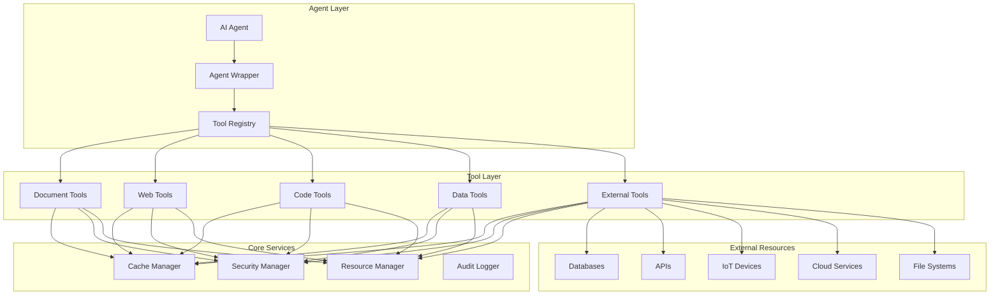

# Built-in Tools Architecture & Integration Guide

## 🏗️ Architecture Overview

The built-in tools system is designed as a modular, extensible architecture that leverages the existing `@tool` decorator system while providing powerful, high-performance tools for AI agents.

## 📐 Core Architecture Principles

### 1. **Leverage Existing `@tool` Decorator System**
- **No New Registry**: Use existing `ToolRegistry` for tool management
- **Consistent API**: All tools follow the same `@tool` decorator pattern
- **Seamless Integration**: Tools work with existing agent loading system
- **Backward Compatibility**: No breaking changes to existing functionality

### 2. **Modular Design**
- **Category-based Organization**: Tools organized by functionality (document, web, code, data, external)
- **Independent Modules**: Each tool category can be developed and tested independently
- **Shared Utilities**: Common functionality shared across tool categories
- **Plugin Architecture**: Easy to add new tool categories

### 3. **Performance-First Design**
- **Intelligent Caching**: Multi-level caching for frequently used operations
- **Lazy Loading**: Load resources only when needed
- **Connection Pooling**: Efficient resource management
- **Async Support**: Non-blocking operations where possible

### 4. **Security by Default**
- **Input Validation**: Comprehensive validation for all inputs
- **Sandboxed Execution**: Safe code execution environments
- **Access Control**: Fine-grained permissions and authentication
- **Audit Logging**: Complete audit trail for all operations

## 🏛️ System Architecture



## 📁 Directory Structure

```
agenthub/core/tools/builtin/
├── __init__.py                 # Main exports and initialization
├── base.py                     # Base classes and utilities
├── cache.py                    # Caching system
├── security.py                 # Security utilities
├── exceptions.py               # Custom exceptions
├── document/                   # Document processing tools
│   ├── __init__.py
│   ├── parser.py              # Document parsers
│   ├── search.py              # Search functionality
│   ├── extractor.py           # Content extraction
│   └── metadata.py            # Metadata handling
├── web/                       # Web search and scraping tools
│   ├── __init__.py
│   ├── search.py              # Web search engines
│   ├── scrape.py              # Web scraping
│   ├── summarize.py           # Content summarization
│   └── analyze.py             # Content analysis
├── code/                      # Code generation and execution
│   ├── __init__.py
│   ├── executor.py            # Code execution
│   ├── generator.py           # Code generation
│   ├── analyzer.py            # Code analysis
│   └── sandbox.py             # Execution sandbox
├── data/                      # Tabular data analysis
│   ├── __init__.py
│   ├── loader.py              # Data loading
│   ├── analyzer.py            # Data analysis
│   ├── visualizer.py          # Data visualization
│   └── transformer.py         # Data transformation
└── external/                  # External resource access
    ├── __init__.py
    ├── database.py            # Database connections
    ├── api.py                 # API clients
    ├── iot.py                 # IoT device access
    ├── cloud.py               # Cloud services
    └── filesystem.py          # File system access
```

## 🔧 Core Components

### 1. Base Tool Classes

```python
# agenthub/core/tools/builtin/base.py
from abc import ABC, abstractmethod
from typing import Any, Dict, List, Optional
from agenthub.core.tools import tool

class BaseTool(ABC):
    """Base class for all built-in tools."""
    
    def __init__(self, name: str, description: str):
        self.name = name
        self.description = description
        self.cache = None
        self.security_validator = None
    
    @abstractmethod
    def execute(self, **kwargs) -> Dict[str, Any]:
        """Execute the tool with given parameters."""
        pass
    
    def validate_input(self, **kwargs) -> bool:
        """Validate input parameters."""
        return True
    
    def get_cache_key(self, **kwargs) -> str:
        """Generate cache key for the operation."""
        return f"{self.name}:{hash(str(sorted(kwargs.items())))}"

class CachedTool(BaseTool):
    """Base class for tools with caching support."""
    
    def __init__(self, name: str, description: str, cache_ttl: int = 300):
        super().__init__(name, description)
        self.cache_ttl = cache_ttl
        self.cache = ToolCache()
    
    def execute(self, **kwargs) -> Dict[str, Any]:
        """Execute with caching support."""
        cache_key = self.get_cache_key(**kwargs)
        
        # Check cache
        cached_result = self.cache.get(cache_key)
        if cached_result:
            return cached_result
        
        # Execute tool
        result = self._execute_impl(**kwargs)
        
        # Cache result
        self.cache.set(cache_key, result, self.cache_ttl)
        
        return result
    
    @abstractmethod
    def _execute_impl(self, **kwargs) -> Dict[str, Any]:
        """Implementation of tool execution."""
        pass

class SecureTool(BaseTool):
    """Base class for tools with security validation."""
    
    def __init__(self, name: str, description: str):
        super().__init__(name, description)
        self.security_validator = SecurityValidator()
    
    def execute(self, **kwargs) -> Dict[str, Any]:
        """Execute with security validation."""
        # Validate inputs
        if not self.validate_input(**kwargs):
            raise ValidationError("Input validation failed")
        
        # Security check
        if not self.security_validator.validate(self.name, **kwargs):
            raise SecurityError("Security validation failed")
        
        return self._execute_impl(**kwargs)
    
    @abstractmethod
    def _execute_impl(self, **kwargs) -> Dict[str, Any]:
        """Implementation of tool execution."""
        pass
```

### 2. Caching System

```python
# agenthub/core/tools/builtin/cache.py
import time
import hashlib
from typing import Any, Dict, Optional
from threading import Lock

class ToolCache:
    """Intelligent caching system for tool operations."""
    
    def __init__(self, max_size: int = 1000, default_ttl: int = 300):
        self.cache: Dict[str, CacheEntry] = {}
        self.max_size = max_size
        self.default_ttl = default_ttl
        self.lock = Lock()
        self.access_times: Dict[str, float] = {}
    
    def get(self, key: str) -> Optional[Any]:
        """Get cached value."""
        with self.lock:
            if key not in self.cache:
                return None
            
            entry = self.cache[key]
            if time.time() > entry.expires_at:
                del self.cache[key]
                if key in self.access_times:
                    del self.access_times[key]
                return None
            
            self.access_times[key] = time.time()
            return entry.value
    
    def set(self, key: str, value: Any, ttl: Optional[int] = None) -> None:
        """Set cached value."""
        with self.lock:
            if len(self.cache) >= self.max_size:
                self._evict_lru()
            
            ttl = ttl or self.default_ttl
            expires_at = time.time() + ttl
            
            self.cache[key] = CacheEntry(value, expires_at)
            self.access_times[key] = time.time()
    
    def _evict_lru(self) -> None:
        """Evict least recently used entry."""
        if not self.access_times:
            return
        
        lru_key = min(self.access_times.keys(), key=lambda k: self.access_times[k])
        if lru_key in self.cache:
            del self.cache[lru_key]
        del self.access_times[lru_key]
    
    def clear(self) -> None:
        """Clear all cached entries."""
        with self.lock:
            self.cache.clear()
            self.access_times.clear()

class CacheEntry:
    """Cache entry with expiration."""
    
    def __init__(self, value: Any, expires_at: float):
        self.value = value
        self.expires_at = expires_at
```

### 3. Security System

```python
# agenthub/core/tools/builtin/security.py
import re
import os
from typing import Any, Dict, List
from urllib.parse import urlparse

class SecurityValidator:
    """Comprehensive security validation system."""
    
    def __init__(self):
        self.blocked_patterns = [
            r'\.\./',  # Path traversal
            r'file://',  # File protocol
            r'javascript:',  # JavaScript protocol
            r'data:',  # Data protocol
            r'eval\(',
            r'exec\(',
            r'__import__\(',
            r'os\.system\(',
            r'subprocess\.'
        ]
        self.allowed_domains = set()
        self.max_file_size = 100 * 1024 * 1024  # 100MB
    
    def validate(self, tool_name: str, **kwargs) -> bool:
        """Validate tool execution parameters."""
        try:
            # Validate based on tool type
            if 'url' in kwargs:
                self._validate_url(kwargs['url'])
            
            if 'file_path' in kwargs:
                self._validate_file_path(kwargs['file_path'])
            
            if 'code' in kwargs:
                self._validate_code(kwargs['code'])
            
            if 'query' in kwargs:
                self._validate_query(kwargs['query'])
            
            return True
        
        except SecurityError:
            return False
    
    def _validate_url(self, url: str) -> None:
        """Validate URL for security."""
        parsed = urlparse(url)
        
        # Check for blocked patterns
        for pattern in self.blocked_patterns:
            if re.search(pattern, url, re.IGNORECASE):
                raise SecurityError(f"Blocked URL pattern: {pattern}")
        
        # Check domain whitelist
        if self.allowed_domains and parsed.netloc not in self.allowed_domains:
            raise SecurityError(f"Domain not in whitelist: {parsed.netloc}")
    
    def _validate_file_path(self, file_path: str) -> None:
        """Validate file path for security."""
        # Check for path traversal
        if '..' in file_path or file_path.startswith('/'):
            raise SecurityError("Path traversal not allowed")
        
        # Check file size
        if os.path.exists(file_path):
            file_size = os.path.getsize(file_path)
            if file_size > self.max_file_size:
                raise SecurityError("File too large")
    
    def _validate_code(self, code: str) -> None:
        """Validate code for security."""
        # Check for dangerous patterns
        dangerous_patterns = [
            r'import\s+os',
            r'import\s+subprocess',
            r'import\s+sys',
            r'__import__',
            r'eval\(',
            r'exec\('
        ]
        
        for pattern in dangerous_patterns:
            if re.search(pattern, code, re.IGNORECASE):
                raise SecurityError(f"Dangerous code pattern: {pattern}")

class SecurityError(Exception):
    """Security validation error."""
    pass
```

## 🔌 Integration with Existing System

### 1. Tool Registration

```python
# agenthub/core/tools/builtin/__init__.py
from agenthub.core.tools import tool
from .document import *
from .web import *
from .code import *
from .data import *
from .external import *

# All tools are automatically registered via @tool decorator
# No additional registration needed
```

### 2. Agent Integration

```python
# Example: Using built-in tools in an agent
import agenthub as ah

# Load agent with built-in tools
agent = ah.load_agent(
    "my-agent",
    external_tools=[
        "document_search",
        "web_search", 
        "code_execute",
        "data_analyze",
        "database_query"
    ]
)

# Tools are automatically available to the agent
# No additional configuration needed
```

### 3. Tool Discovery

```python
# Get available built-in tools
from agenthub.core.tools import get_available_tools

tools = get_available_tools()
builtin_tools = [tool for tool in tools if tool.startswith('builtin_')]
```

## 📊 Performance Optimization

### 1. Lazy Loading

```python
class LazyToolLoader:
    """Lazy load tool modules only when needed."""
    
    def __init__(self):
        self._loaded_modules = {}
    
    def get_tool(self, tool_name: str):
        """Get tool, loading module if necessary."""
        if tool_name not in self._loaded_modules:
            module_name = self._get_module_name(tool_name)
            module = __import__(f'agenthub.core.tools.builtin.{module_name}', fromlist=[tool_name])
            self._loaded_modules[tool_name] = getattr(module, tool_name)
        
        return self._loaded_modules[tool_name]
```

### 2. Connection Pooling

```python
class ConnectionPoolManager:
    """Manage connection pools for external resources."""
    
    def __init__(self):
        self.pools = {}
    
    def get_pool(self, resource_type: str, config: dict):
        """Get or create connection pool."""
        pool_key = self._generate_pool_key(resource_type, config)
        
        if pool_key not in self.pools:
            self.pools[pool_key] = self._create_pool(resource_type, config)
        
        return self.pools[pool_key]
```

### 3. Batch Processing

```python
@tool(name="batch_process", description="Process multiple operations in batch")
def batch_process(
    operations: list,
    max_concurrent: int = 5
) -> dict:
    """Process multiple operations efficiently."""
    with ThreadPoolExecutor(max_workers=max_concurrent) as executor:
        futures = [executor.submit(execute_operation, op) for op in operations]
        results = [future.result() for future in as_completed(futures)]
    
    return {"results": results, "total": len(operations)}
```

## 🧪 Testing Architecture

### 1. Unit Testing

```python
# agenthub/core/tools/builtin/tests/
class TestDocumentTools:
    def test_document_search(self):
        """Test document search functionality."""
        result = document_search("test query", max_results=5)
        assert result["success"] == True
        assert len(result["results"]) <= 5

class TestWebTools:
    def test_web_scrape(self):
        """Test web scraping functionality."""
        result = web_scrape("https://httpbin.org/html", extract_text=True)
        assert result["success"] == True
        assert "text" in result["data"]
```

### 2. Integration Testing

```python
class TestToolIntegration:
    def test_end_to_end_workflow(self):
        """Test complete tool workflow."""
        # 1. Search web
        search_result = web_search("python programming", max_results=3)
        
        # 2. Scrape content
        scraped_content = []
        for result in search_result["results"]:
            content = web_scrape(result["url"], extract_text=True)
            if content["success"]:
                scraped_content.append(content)
        
        # 3. Analyze content
        analysis = data_analyze(scraped_content, "text_analysis")
        
        # Verify workflow completed successfully
        assert len(scraped_content) > 0
        assert analysis["success"] == True
```

### 3. Performance Testing

```python
class TestPerformance:
    def test_tool_performance(self):
        """Test tool performance benchmarks."""
        start_time = time.time()
        
        # Execute tool
        result = document_search("test query", max_results=100)
        
        execution_time = time.time() - start_time
        
        # Verify performance requirements
        assert execution_time < 2.0  # Should complete within 2 seconds
        assert result["success"] == True
```

## 📈 Monitoring & Metrics

### 1. Tool Usage Metrics

```python
class ToolMetrics:
    """Collect and report tool usage metrics."""
    
    def __init__(self):
        self.usage_count = {}
        self.execution_times = {}
        self.error_count = {}
    
    def record_usage(self, tool_name: str, execution_time: float, success: bool):
        """Record tool usage metrics."""
        self.usage_count[tool_name] = self.usage_count.get(tool_name, 0) + 1
        self.execution_times[tool_name] = self.execution_times.get(tool_name, [])
        self.execution_times[tool_name].append(execution_time)
        
        if not success:
            self.error_count[tool_name] = self.error_count.get(tool_name, 0) + 1
    
    def get_metrics(self) -> dict:
        """Get aggregated metrics."""
        return {
            "usage_count": self.usage_count,
            "avg_execution_time": {
                tool: sum(times) / len(times) 
                for tool, times in self.execution_times.items()
            },
            "error_count": self.error_count
        }
```

### 2. Health Monitoring

```python
class ToolHealthMonitor:
    """Monitor tool health and availability."""
    
    def __init__(self):
        self.health_checks = {}
    
    def check_tool_health(self, tool_name: str) -> dict:
        """Check health of a specific tool."""
        try:
            # Perform health check
            result = self._perform_health_check(tool_name)
            return {
                "tool": tool_name,
                "healthy": True,
                "response_time": result["response_time"],
                "timestamp": time.time()
            }
        except Exception as e:
            return {
                "tool": tool_name,
                "healthy": False,
                "error": str(e),
                "timestamp": time.time()
            }
```

## 🔄 Future Extensibility

### 1. Plugin Architecture

```python
class ToolPlugin:
    """Base class for tool plugins."""
    
    def __init__(self, name: str):
        self.name = name
    
    def register_tools(self) -> list:
        """Register tools provided by this plugin."""
        return []
    
    def get_dependencies(self) -> list:
        """Get plugin dependencies."""
        return []

class PluginManager:
    """Manage tool plugins."""
    
    def __init__(self):
        self.plugins = {}
    
    def load_plugin(self, plugin_class):
        """Load a tool plugin."""
        plugin = plugin_class()
        tools = plugin.register_tools()
        
        for tool in tools:
            self.register_tool(tool)
        
        self.plugins[plugin.name] = plugin
```

### 2. Custom Tool Creation

```python
# Example: Creating a custom built-in tool
@tool(name="custom_analysis", description="Custom data analysis tool")
def custom_analysis(
    data: str,
    analysis_type: str = "basic",
    parameters: dict = None
) -> dict:
    """Custom analysis tool implementation."""
    # Tool implementation
    pass
```

This architecture provides a solid foundation for building powerful, performant, and secure built-in tools while maintaining compatibility with the existing AgentHub system.
